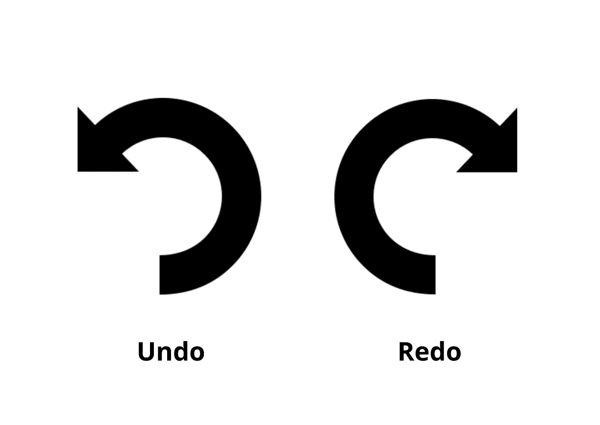

# 允许撤销/重做的反应挂钩

> 原文：<https://medium.com/geekculture/react-hook-to-allow-undo-redo-d9d791c5cd94?source=collection_archive---------2----------------------->



如果你想构建像 [FormBlob](https://formblob.com/) 这样的无代码工具，一个*必须具备的*特性是撤销和重做动作的能力。为什么？假设您正在使用一个图像编辑软件，并且对画布进行了多次修改。过了一段时间，你意识到你以前拥有的比你现在拥有的要好得多。你会撤销你的原路返回，直到你到达你满意的阶段。

现在，如果软件没有撤销/重做功能，你很可能会使用一些华丽的语言，永远放弃这个软件。

那么，我们如何实现撤销/重做功能，防止用户放弃我们的应用程序呢？

# 先决条件

如果你不熟悉 React 钩子，我建议你在这里阅读一下它们。最基本的挂钩之一是 React 内置的 useState 挂钩。这允许您将组件状态存储在一个变量中，并根据需要管理它。在本教程中，我们将编写一个钩子来扩展 useState 钩子，以允许撤销/重做功能。

# 代码

让我们从代码开始，然后我会在下面解释。

```
import { useMemo, useState } from "react";
// If you're only working with primitives, this is not required
import isEqual from "lodash/isEqual";export default function useUndoableState(init) {
  const [states, setStates] = useState([init]); // Used to store history of all states
  const [index, setIndex] = useState(0); // Index of current state within `states` const state = useMemo(() => states[index], [states, index]); // Current stateconst setState = (value) => {
    // Use lodash isEqual to check for deep equality
    // If state has not changed, return to avoid triggering a re-render
    if (isEqual(state, value)) {
      return;
    }
    const copy = states.slice(0, index + 1); // This removes all future (redo) states after current index
    copy.push(value);
    setStates(copy);
    setIndex(copy.length - 1);
  }; // Clear all state history
  const resetState = (init) => {
    setIndex(0);
    setStates([init]);
  }; // Allows you to go back (undo) N steps
  const goBack = (steps = 1) => {
    setIndex(Math.max(0, Number(index) - (Number(steps) || 1)));
  }; // Allows you to go forward (redo) N steps
  const goForward = (steps = 1) => {
    setIndex(Math.min(states.length - 1, Number(index) + (Number(steps) || 1)));
  }; return {
    state,
    setState,
    resetState,
    index,
    lastIndex: states.length - 1,
    goBack,
    goForward,
  };
}
```

# 概念

与 useState 一样，useUndoableState 只接受 1 个参数，即初始值。在幕后，钩子使用两个主要变量来确定状态— `index`(数字)和`states`(数组)。`states`存储状态的历史值，而`index`通过指示数组中的当前位置来确定当前状态。

你可以通过使用钩子发出的`goBack`和`goForward`函数来浏览历史状态。但是，如果您调用了`setState`并且`index`不在`states`数组的末尾，那么`index`之后的所有状态都将被擦除，而`index`将返回到`states`数组的末尾。也就是说，一旦调用了`setState`，就不能再重做了。

下面试图对钩子返回的对象提供更详细的解释:

*   属性|类型|用途|描述
*   state | `any` | |当前状态，用传递的参数初始化
*   setState | `func` | `setState(value)` |将状态设置为`value`。电流`index`被擦除后的所有值
*   resetState | `func` | `resetState(value)` |删除历史状态并重置为值
*   index |`number`|`states`数组中的当前索引
*   lastIndex | `number` | |数组`states`中的最后一个索引。可用于确定是否可以`goForward`。`canGoForward = index < lastIndex`
*   goBack | `func` | `goBack(2)` |返回经过的步数
*   goForward | `func` | `goForward(3)` |前进经过的步数

# 使用

```
import React from "react";
import useUndoableState from "path/to/hook";const init = { text: "The quick brown fox jumps over the lazy dog" };export default function Document() {
  const {
    state: doc,
    setState: setDoc,
    resetState: resetDoc,
    index: docStateIndex,
    lastIndex: docStateLastIndex,
    goBack: undoDoc,
    goForward: redoDoc
  } = useUndoableState(init); const canUndo = docStateIndex > 0;
  const canRedo = docStateIndex < docStateLastIndex; return (
    <div style={{ display: "block" }}>
      <textarea
        style={{ margin: "16px" }}
        onChange={(event) => setDoc({ text: event.target.value })}
        rows="5"
        value={doc.text}
      />
      <div>
        <button
          onClick={() => undoDoc()}
          disabled={!canUndo}
          style={{ marginRight: "8px" }}
        >
          Undo
        </button>
        <button
          onClick={() => redoDoc()}
          disabled={!canRedo}
          style={{ marginRight: "8px" }}
        >
          Redo
        </button>
        <button onClick={() => resetDoc(init)}>Reset</button>
      </div>
    </div>
  );
}
```

# 结束语

凭借撤销/重做功能， [FormBlob](https://formblob.com/) 是为数不多的无代码表单构建器之一，它可以让您灵活地编辑表单，而不必担心丢失之前的状态。作为一个无代码工具，FormBlob 允许任何人在 2 分钟内构建和发布令人惊叹的表单和调查。[立即免费试用！](https://build.formblob.com/builder)