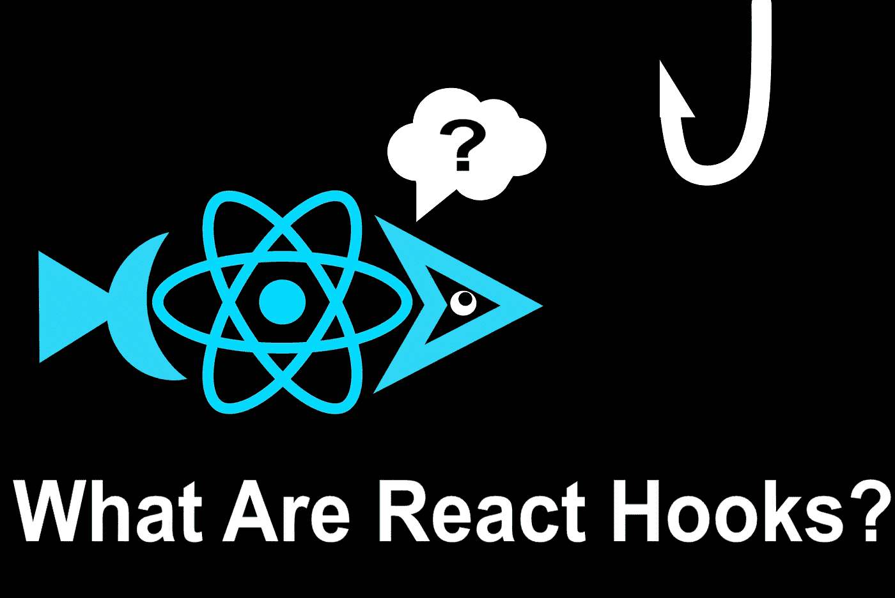
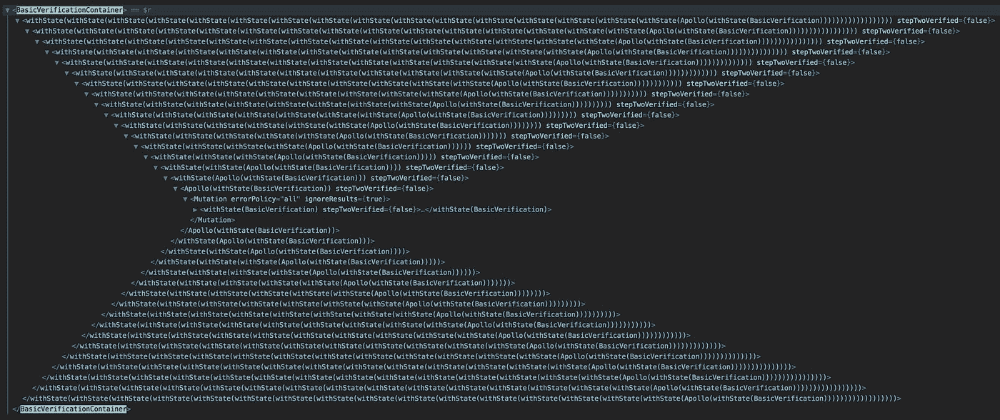
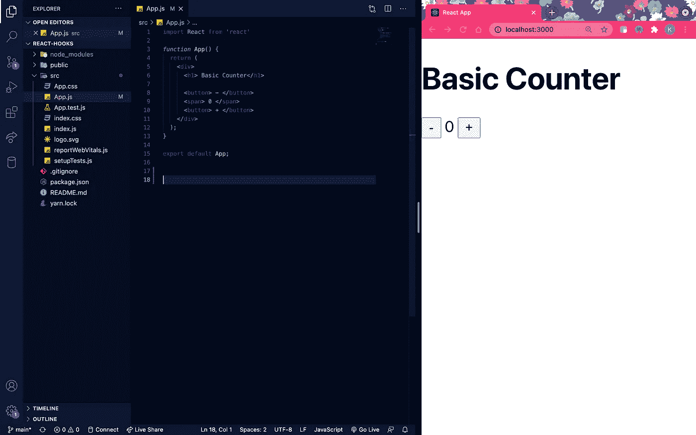
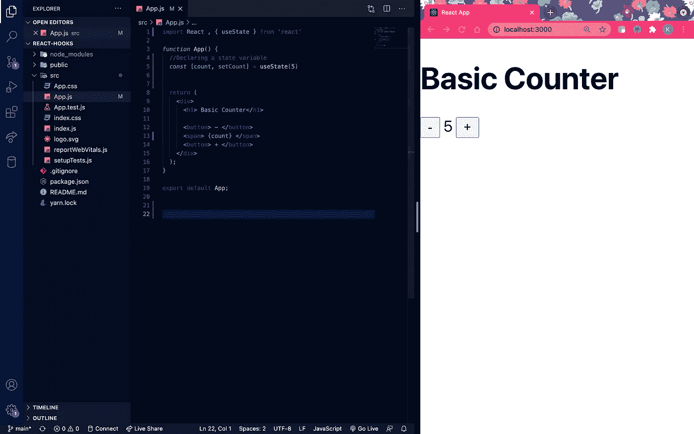
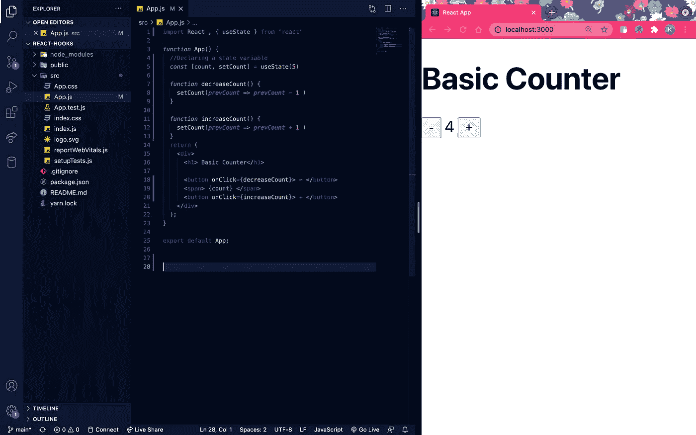
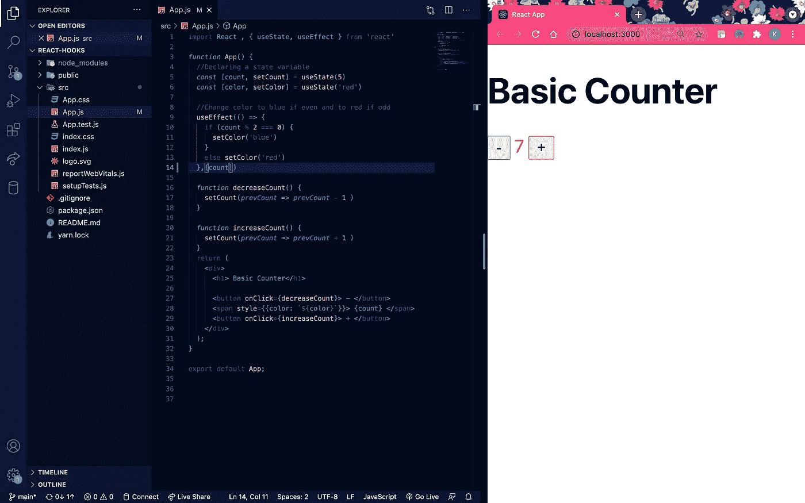

# React Hooks:一个功能组件的超能力

> 原文：<https://medium.com/geekculture/react-hooks-a-functional-components-super-power-4de719c1f686?source=collection_archive---------7----------------------->

## React 挂钩简介

React Hooks: A Class Component Worse Nightmare?

今天我们要谈论 React 钩子。大约两年前，React v16.8 向我们介绍了 React Hooks 改变游戏规则的概念。基本上， **React 钩子**允许你*使用状态*和其他 React 特性*而不用编写一个单独的类组件*。那可是件大事！

当我第一次学习 React 的时候，我立刻被告知函数组件和类组件之间的区别。如果我们的组件需要处理状态，我被告知要创建一个类组件，因为功能组件不能访问状态或生命周期方法。React Hooks 改变了这一点。

# 为什么要用钩子？

没有钩子，React 面临三个主要问题:

**1。包装地狱**

包装地狱指的是复杂的 React 项目中可能出现的组件的混乱层次。在 React 中，我们学习了诸如“渲染道具”和“高阶组件”之类的模式。Render props 指的是通过使用具有作为值的功能的道具，在两个组件之间共享数据。高阶组件是将另一个组件包装在其自身中的定制组件。

由于像这样的复杂模式，有状态逻辑的组织和流程可能会变得混乱，因此我们得到了“包装器地狱”:

Wrapper Hell

**2。巨大的部件**

当我们处理状态时，我们最终会得到一个包含如此多逻辑和生命周期方法的巨大类组件。我们可以在`componentDidMount`和`componentDidUpdate`进行提取。但是在同一个`componentDidMount`中，我们可以看到处理事件监听器的不相关逻辑。不幸的是，React 不允许您分离这些状态管理。将有状态逻辑和不相关的代码都放在一个地方可能很难测试 bug 和错误。

**3。班级只是简单的混淆**

我承认，在 React 中学习课程可能很难。起初，`this`可能会令人费解。还有 bind 这个概念。功能组件和类组件有什么区别？可以很多。

React Hook 解决了所有这些问题！React 挂钩包含了功能组件，让它们可以访问重要的 React 特性，而不用担心编写复杂的类组件。

挂钩允许您:

*   重用有状态逻辑，而不会陷入包装器地狱
*   将组件拆分成更小的功能

# **挂钩规则**

在我们开始研究 2 个基本钩子之前，让我们先讨论一下 React 钩子的规则。

1.  **钩子只能在顶层调用。** React 钩子*不能嵌套* 在其他函数、条件或循环中。
2.  **钩子只能从 React 函数组件调用。**不要从常规 JS 函数中调用钩子。

这确保了有状态逻辑可以被容易地遵循，这就是钩子的目的。

在我讲解 useState 和 useEffect 时，我将构建一个非常基本的计数器应用程序，并向您展示这两个 React 挂钩是如何发挥作用的！

所以它看起来会像这样:

Basic Counter

# 使用状态挂钩

`useState()` 钩子允许我们声明函数组件内部的状态。我们可以在 useState()中传递任何东西，状态不一定是对象。

所以在我们的例子中，我将声明一个状态变量来表示计数器中的数字。我会把它设为 5。

首先记得在顶部导入{useState}！接下来我们看到这行代码:
`const [count, setCount] = useState(5)`

`useState()`返回当前状态和更新状态的函数。在我们的例子中，这就是计数和函数`setCount`。这非常类似于我们使用`this.state.count`和`this.setState`的类组件。所以当我刷新页面时，计数器会从 5 开始计数。

现在让我们为这些按钮添加功能！

Our counter buttons are working!

如你所见，`setCount`函数以类似于`this.setState`的方式更新我们的状态变量。

# 使用效果挂钩

作为 React 开发人员，我们习惯于使用生命周期方法组件，如`componentDidMount`、`componentDidUpdate`和`componentWillUnmount`。这些方法允许我们在渲染后的任何时候当事情发生或改变时创建副作用。

对于我们的例子，如果数字是奇数或偶数，我们想改变计数器的颜色。如果是偶数，那就是蓝色。如果它是奇数，它将是红色的。我们是这样做的:

useEffect in Action

首先，记得在顶部通过`useEffect`！正如你所看到的，我添加了一个新的状态变量来跟踪计数器的颜色。为此，我刚刚添加了一行新的`useState()`。我们将一个函数传递给我们的`useEffect()`,并将状态作为第二个参数传递，这样它就可以更改到该状态的任何更新。值得注意的是`useEffect()`会在每次渲染和更新后运行。

# 结论

就是这样！我希望这篇文章能帮助你更好地理解 React 钩子的用法。这无疑是 React 的一个强大且必需的附加功能(不过不用担心，类不会消失)。编码快乐！

# 资源

 [## 介绍钩子-反应

### 钩子是 React 16.8 中的新增功能。它们允许您使用状态和其他 React 特性，而无需编写类。这个…

reactjs.org](https://reactjs.org/docs/hooks-intro.html)  [## 钩子 API 参考-反应

### 钩子是 React 16.8 中的新增功能。它们允许您使用状态和其他 React 特性，而无需编写类。这个…

reactjs.org](https://reactjs.org/docs/hooks-reference.html)