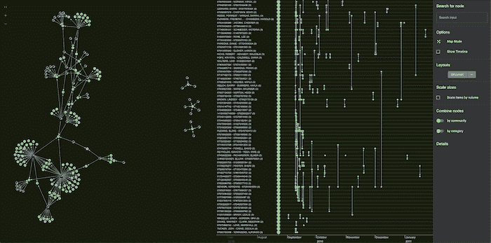
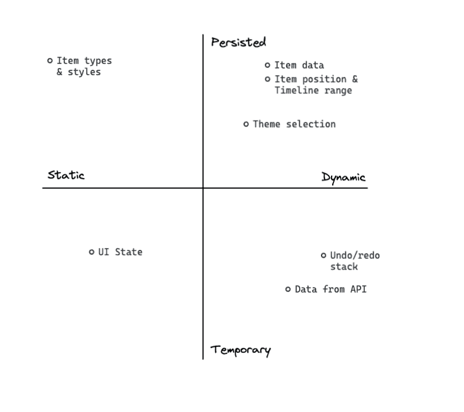
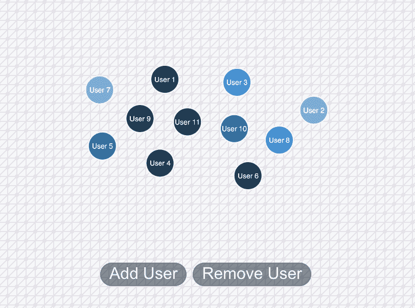

# React Hooks 或 Redux —选择正确的状态管理策略

> 原文：<https://medium.com/geekculture/react-hooks-or-redux-choosing-the-right-state-management-strategy-f70cc0840735?source=collection_archive---------15----------------------->

> Christian Miles 给了 React 开发人员一些管理应用程序状态的建议。他们应该使用哪个——Hooks 还是 Redux？

在我的日常工作中，在[剑桥智能](https://cambridge-intelligence.com/)，我与许多 React 开发人员一起工作。

当我问他们首选的状态管理策略时，我得到了一个复杂的回答。一些依赖于 [Redux](https://redux.js.org/) ，这是 JavaScript 应用程序流行的状态容器，而另一些则更喜欢 [React 钩子](https://reactjs.org/docs/hooks-intro.html)。

在本文中，我将探索这两种方法，并介绍第三种混合方法。自始至终，我将根据我与开发人员的经验和讨论提出有用的建议，这些开发人员使用我们的[React SDK](https://cambridge-intelligence.com/products/)构建生产级数据可视化工具。

# 应用程序状态基础

当您构建 React web 应用程序时，所有信息都保存在我们称之为状态的地方。因此，要更新应用程序，我们只需更新该状态。简单吧？

不完全是。国家管理是一个众所周知的难题。

管理状态就是控制在应用程序的不同组件之间传递的数据。考虑共享这些数据的最佳策略很重要——我们如何让开发人员更容易理解和控制组件之间的数据流动？

使用像 React 这样的易于理解的框架意味着大多数核心应用程序生命周期事件都可以为您处理。但是对于实现和状态管理有很多选择。随着偏好的改变和最佳实践的转变，这些选项可能会让人不知所措。

# React Hooks 作为 Redux 的替代品？

在过去的几年里，React 状态管理环境发生了巨大的变化。有影响力的 Redux 库强调[的不变性](https://redux.js.org/faq/immutable-data)激发了核心变化——最显著的是 16.8 版本中增加的钩子。

参见[在你的 ReGraph 代码](https://cambridge-intelligence.com/hooks-in-regraph/)中使用钩子，了解更多关于钩子的细节。

许多其他新的状态管理方法已经出现，还有无数的 JavaScript 库需要考虑。由于我们从事数据可视化业务，我将重点介绍构建[图形分析应用](https://cambridge-intelligence.com/graph-analytics-101/)的建议。

# 国家管理战略规划

让我们考虑两个状态管理难题:我需要存储什么状态，为什么？

并非数据可视化应用程序中的所有状态都相同。你将有不同类型的数据来传递。下面是一个图形分析项目的简化但有代表性的组件架构:

```
<App>
    <VisualizationContainer>
        <Chart/>
        <Timeline/>
    </VisualizationContainer>
    <Sidebar/>
</App>
```

我们的 ReGraph 图表组件与 VisualizationContainer 中的 [KronoGraph](https://cambridge-intelligence.com/kronograph/) 时间轴成对出现。

我们希望在图表中显示节点和链接(项目)以查看连接，并与时间轴组件共享数据，以便我们可以深入研究数据集中的时间戳。我们的侧边栏包括 UI 元素来运行搜索和更新我们的图表和时间线。我们的目标是一个图形和时间线可视化，如下所示:



当您计划您的状态管理策略时，有必要将您的状态绘制在一个轴上，以了解您在处理什么:



这些是我遵循的指导原则:

项目类型:除非您正在构建一个通用的应用程序，否则图表和时间线中的节点类型(人、地点、车辆)很可能是静态的。我可以提前定义它们，因为它们不需要处于状态，所以它们在我们存储库中的配置文件中。

项目样式:逻辑上包括每个节点和链接类型的核心样式，以及预期的节点和链接的定义。

主题选择:给用户在黑暗和光明模式之间切换的选项，导致一个相对易变的状态项来跟踪用户的偏好。

UI 状态:UI 状态的其他部分既是静态的也是临时的。但是没有必要在我们的状态中存储所有的表单交互(这是一个常见的错误，会导致应用程序没有响应)。

项目位置和时间线范围:您的节点位置(以及找到节点的网络)非常不稳定:

*   在他们的 ReGraph 图表中，用户可以运行一个布局，并按照他们喜欢的方式手动定位节点。
*   在 KronoGraph 时间轴中，用户可以放大感兴趣的时间范围。
*   在不同的会话中保持这些位置是一个常见的要求，这样用户可以从他们停止的地方继续。

撤销/重做堆栈:这是一个允许用户撤销操作的流行请求。在高级应用程序中，您可能需要在多个会话中持久保存这些撤销/重做数据，但通常的设计决策是仅在当前会话中使用这些数据。

来自 API 的数据:您可能需要从外部位置或 API 接收数据。这个数据是动态的和临时的。强大的应用程序缓存来自端点的结果，并在应用程序状态中持久保存相关的位。

# react Hooks vs Redux——还有别的办法吗？

既然我们已经描述了我们的状态，我们可以考虑应用程序中的数据层次。有两种主要的状态管理方法可供选择:

*   在我们的组件中处理状态，并在必要时使用钩子在它们之间传递。这种方法通常被称为“适当的训练”或“提升状态”，推荐用于基本应用程序。
*   使用某种所有组件都可以访问的全局存储。像 Redux 这样的库为此提供了能力。

但是还有第三种甚至更好的方法:一种混合方法，将钩子与什么状态是重要的仔细考虑在一起。

让我们使用数据可视化应用程序来进一步探索这些方法，从 Redux 开始。

# 冗余状态管理

自 2015 年发布以来，Redux 已经成为 React 生态系统的关键组成部分。

Redux 使用不变性来简化应用程序开发和逻辑。通过对状态中的所有项目强制不变性，我们可以跟踪数据的变化，并避免可能导致错误的意外数据突变。

随着时间的推移，Redux 变得有些臃肿，但对于具有复杂状态的大型应用程序来说，它仍然是一个极好的选择。为了帮助降低库的复杂性，2019 年推出了 [Redux 工具包](https://redux-toolkit.js.org/)。现在推荐使用 Redux 的方式。

# 一致的状态更新

Redux 中的一个核心概念是减速器。对于那些有函数式编程经验的人来说，这是一个接受多个输入并将其“简化”为单个输出的函数。在状态管理中，这可以扩展到这样一种思想，即您可以接受一个或多个状态更新指令，并为您的图表产生一致的状态更新。

让我们考虑一个标准的图形可视化用例:在图表中添加和删除节点。我希望它在我的全局存储中，所以我在我的存储中创建了一个状态“切片”。以下是我在 store.js 中创建商店的代码:

为了让我的应用程序中的其他组件访问商店，我将应用程序包装如下:

提供者部分意味着下游的任何东西都可以访问那个存储。在 itemsSlice.js 中，我为这些项目定义了我的状态切片:

这里发生了很多事情:

*   我们的 ReGraph items prop 是一个由节点和链接组成的对象，通过 ID 进行索引。核心数据结构非常常见，Redux Toolkit 有一些助手函数来处理这种格式的数据。这里我使用 [createEntityAdapter](https://redux-toolkit.js.org/api/createEntityAdapter) 来利用适配器提供的 addMany、addOne、removeMany、removeOne 函数。
*   在 Redux 中，选择器允许我们从存储中获取一部分状态。我利用适配器上的 [getSelectors](https://redux-toolkit.js.org/api/createEntityAdapter#selector-functions) 来避免自己编写状态查询代码。滑头！
*   最后，我导出所有内容，以便可以在应用程序的其他地方使用它

在我的应用程序代码中，我可以利用存储、缩减器和选择器:

使用 [Redux Hooks useSelector](https://react-redux.js.org/api/hooks#useselector) ，我可以很容易地利用我的切片代码提供的选择器。与此同时， [useDispatch](https://react-redux.js.org/api/hooks#usedispatch) 允许我们针对我们的状态“调度”一个动作 Redux 的另一个有用之处是允许我们改变状态。



Adding and removing nodes with Redux managing state

Redux Toolkit 使用流行的不变性库 [Immer](https://immerjs.github.io/immer/) ，对状态进行干净的更新，而不需要编写复杂的克隆和更新逻辑。这被我的 itemsAdapter 进一步抽象了。

这里，我已经直接在组件中设计了图表项的样式。一个聪明的选择是按照这个[样式的组件教程来进行图形可视化](https://cambridge-intelligence.com/styled-components-tutorial-for-graph-visualizations/)。

当您从外部数据源获取数据时，应用程序状态和数据库存储之间的界限有点模糊。 [RTK Query](https://redux-toolkit.js.org/tutorials/rtk-query) (来自 Redux Toolkit 的创造者)和其他流行的库，如 [react-query](https://daveceddia.com/react-state-management/) 与 Redux 配合得很好，避免了从头开始编写缓存等功能。我们将在以后的博客文章中介绍 RTK 查询的使用。

如果我只依赖 Redux，我会把我的整个应用程序状态放在全局存储中，并从我的每个组件中访问它。实际上，只有一些可视化组件状态需要存储在存储中 Hooks 和 Redux 的混合方法提供了两个世界的最佳之处。

让我们把注意力转向钩子。

# 现代 React 作为 Redux 的替代品？

您可能不愿意在应用程序中引入另一个依赖项。当 Hooks 在 2019 年加入 React 时，它在复制 Redux 的深度功能方面走了很长的路。

让我们看看如何在应用程序中利用钩子，以及上下文 API 和 prop drilling。

# 支柱钻井

在肯特·c·多兹的这篇精彩文章中，他提出了重要的观点:

**让状态尽可能靠近需要它的地方。**

对于我们的例子，这意味着如果我希望在图表和时间线组件之间共享数据(我知道在其他任何地方都不需要它)，我可以通过 prop drilling 使事情尽可能简单。

如果谨慎使用，这是跨组件共享状态的一种有效、干净的方式。如果我在应用程序中将我的状态呈现给 VisualizationContainer，我可以将数据作为道具传递给每个组件。

当然，如果我需要在一个复杂的层次结构中上下传递，我也可以使用 Redux 或类似的方法。但是对于我们的基本应用程序，保持简单是有意义的。

由于其强大的 API 和一些精心设计的道具，ReGraph 在控制其内部状态方面做得很好。没有必要在支撑图表的组件之外增加很多这样的道具。

# 反应钩

正如我们之前在博客中讨论过的，今天我将集中讨论与 Redux 相似的特性。

对于我们的图表组件，我想使用简单的 [useState](https://reactjs.org/docs/hooks-reference.html#usestate) 和 [useRef](https://reactjs.org/docs/hooks-reference.html#useref) 钩子来处理状态中的基本配置。ReGraph 将优雅地处理状态的多次更新，因此使用单独的 useState 调用是合理的人机工程学，除非您确信您将经常一起更新道具组。

使用过 Redux 的人对 [useReducer](https://reactjs.org/docs/hooks-reference.html#usereducer) 钩子非常熟悉。

注意，在这个例子中，我正在手写我的 reducer。没有 Redux Toolkit 的帮助，我需要改变我的组合对象。这意味着编写更多的代码，但是对于像 ReGraph 这样的小应用程序和干净的 API，这是合理的。

React 的 useReducer 和 Redux 中的 Reducer 有概念上的区别。在 React 中，我们想写多少 reducers 就写多少:它们只是钩子，使更新状态更容易。在 Redux 中，这些使用片作为概念上的分离来对抗中央存储。

我们可以为 ReGraph 编写一个定制的钩子来封装我们需要利用的所有属性。这可能是这样的:

请注意，ReGraph 使用的每个属性都有许多 useState 调用。我可以把这些放入一个简单的对象中，用一个函数处理更新，但是我喜欢把它们分开——这是个人喜好。

对于一个简单的实现，我使用 [lodash merge](https://lodash.com/docs/4.17.15) 来合并我的项目更新。在生产中，我会使用 Immer 或类似产品来提高性能。

# 上下文 API

如果我只需要从一个组件控制图表，我的自定义 useChart 钩子就很好。但是如果我想用我的工具条来驱动它呢？

这是 Redux 在全球范围内解决的问题。没有 Redux 我们还能做什么？

多年来，上下文一直是 React API 的一部分。我们可以使用它使数据在用户定义的范围内可访问，因此它可以帮助我们实现一些接近我们在 Redux 中创建的全局存储的东西。

利用上下文的现代方法是什么？有一个钩子！

关于“语境”和“T2 使用语境”是否是 Redux 的可行和合理的替代，还有一些争论。有一点是肯定的:这是一个干净的 API，可以在组件间一致地共享上下文。

从[的另一篇来自肯特·c·多兹的博客文章](https://kentcdodds.com/blog/how-to-use-react-context-effectively/)中获得灵感，我可以把这个挂钩“语境化”成它自己的东西:

现在，我用我的自定义 ChartProvider 上下文包装任何需要访问图表细节和设置器的组件:

```
<App> <ChartProvider> <VisualizationContainer> <Chart/> <Timeline/> </VisualizationContainer> <Sidebar/> </ChartProvider></App>
```

然后我导入 useChart 并获得当前的图表状态和应用程序层次结构中任意位置的一些调度函数。只需简单地调用 useChart:

```
*const* [state, { setLayout }] = useChart();
```

# Context vs Redux？

使用上下文和 Redux store 的关键区别在于，上下文不会自动对应用程序的其余部分可用:由您自己来定义范围。

这是功能，不是 bug。

它让我们更有意识地使用逻辑，但这也是为什么上下文不能直接替代 Redux 的原因。就像使用 useReducer 一样，创建许多不同的上下文供应用程序使用是一种常见的做法。

# 什么对你有用？

我们在这篇文章中已经介绍了很多！我们从一个全面的状态管理策略开始，使用 Redux 工具包来利用全局存储。然后我们探索了一个简单的应用程序如何使用 core React 钩子来获得同样的好处。

你如何解决你的国家管理难题？你对 React Hooks vs Redux 的争论持什么态度？