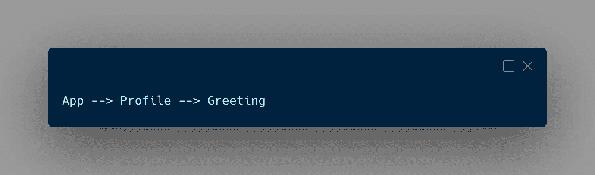
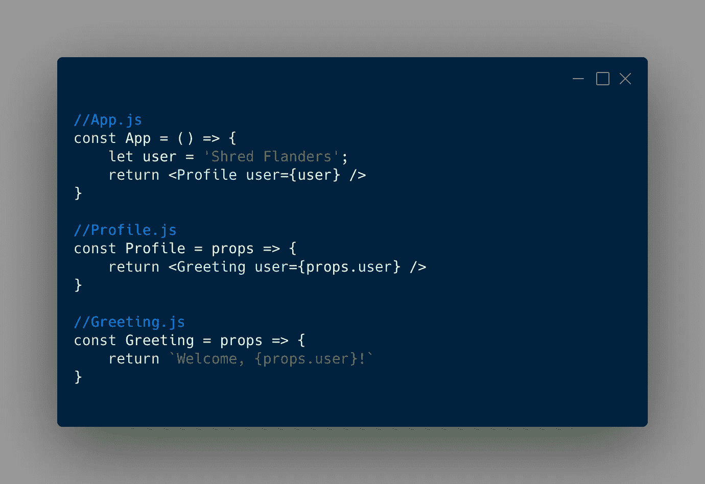
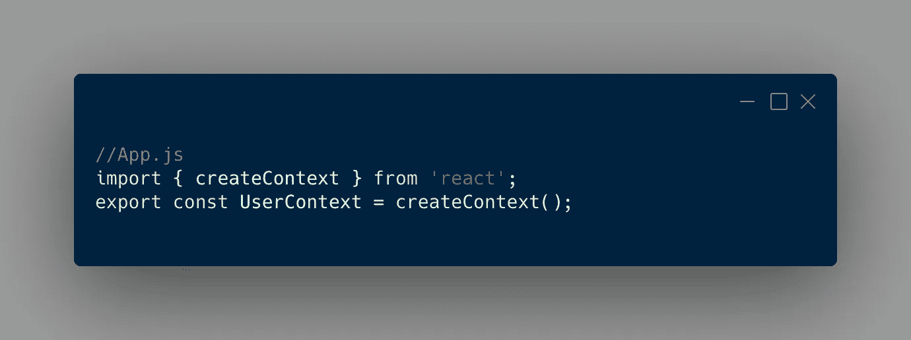
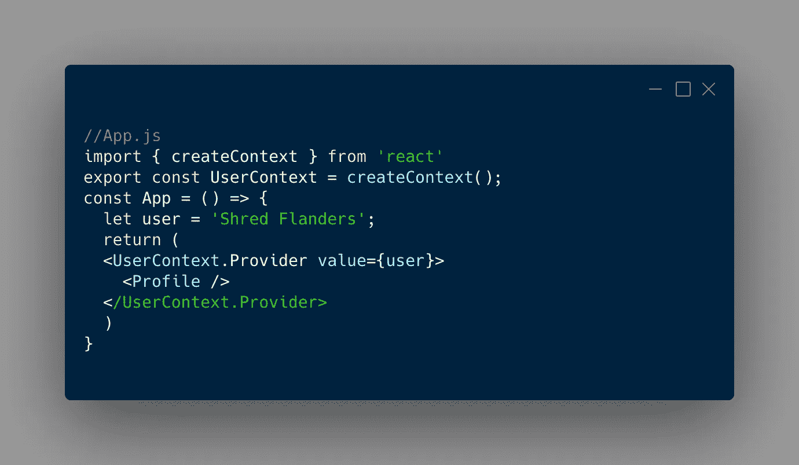
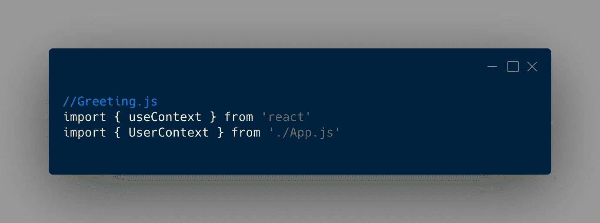
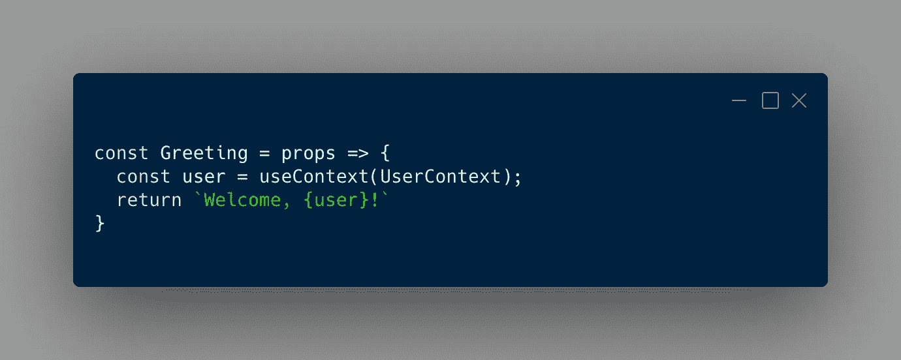

# 反应挂钩—使用上下文

> 原文：<https://medium.com/geekculture/react-hooks-usecontext-e8c468bce91a?source=collection_archive---------17----------------------->

# 这是什么？

当您需要通过多个嵌套的子组件向下发送道具时，useContext 钩子是一个很好的钩子。

您可以在父组件中定义它，而不是向下传递给每个组件。然后，将它放入需要它的嵌套组件中，同时绕过通常必须发送它的中间组件。

# 这里有一个例子

假设你有一个应用组件。在应用程序组件中，有一个配置文件组件。在配置文件组件中，有一个问候组件。

所以那就是:

现在，假设您的应用程序(父)组件中有一个用户，您希望将用户属性传递到问候(嵌套子)组件中。

通常，您必须通过配置文件组件发送该属性，然后发送到问候组件。像这样:

# 创建一个上下文

要开始使用 useContext，您必须首先创建一个上下文。因此，在我们的 App (parent)组件中，我们将从 React 导入 createContext。然后，创建一个用户上下文。

> *注意:我们正在导出 UserContext，这样我们可以在以后将它
> 导入到嵌套组件中。*

有了 UserContext，我们就可以在组件周围包装一个*提供者*，然后在任何子组件中使用属性。

因此，我们将在需要的地方设置该提供程序，并为其传递一个属性。

请注意，现在我们没有将用户属性发送到配置文件中。我们通过`value={user}`将它发送到 UserContext 提供者。然后，我们可以在任何嵌套组件中获取该值。

# 消耗上下文

为了使用任何嵌套组件中的值，我们必须导入 useEffect 钩子，以及我们想要使用的上下文。

所以在问候组件中:

然后，我们将把我们的`UserContext`传递给 useContext 钩子，让钩子知道我们想要使用哪个上下文。

useContext 将返回我们发送到`UserContext.Provider value={user}`的值。我们将它保存在 Greeting 组件的常量变量`user`中。

现在，我们可以在问候组件中自由使用该常量/值。
(而且我们从来没有接触过 Profile 组件！🎉)

# 结论

useContext 挂钩是 React 中非常有用的工具。它可以用来改变一个主题，并根据需要更新不同组件中的主题。它可以防止像我在这里展示的“道具钻探”。

如果你想要一个更直观的例子，请点击这里查看我的 YouTube 视频:

如果你喜欢了解类似的话题，可以随时查看我的 [YouTube](https://www.youtube.com/channel/UCD0JOhEl8HvPowpg8Ri3CvA) 和 [Instagram](https://www.instagram.com/techcheck__/) 。

希望这能帮助到一些人，感谢你的阅读！

*   安德鲁