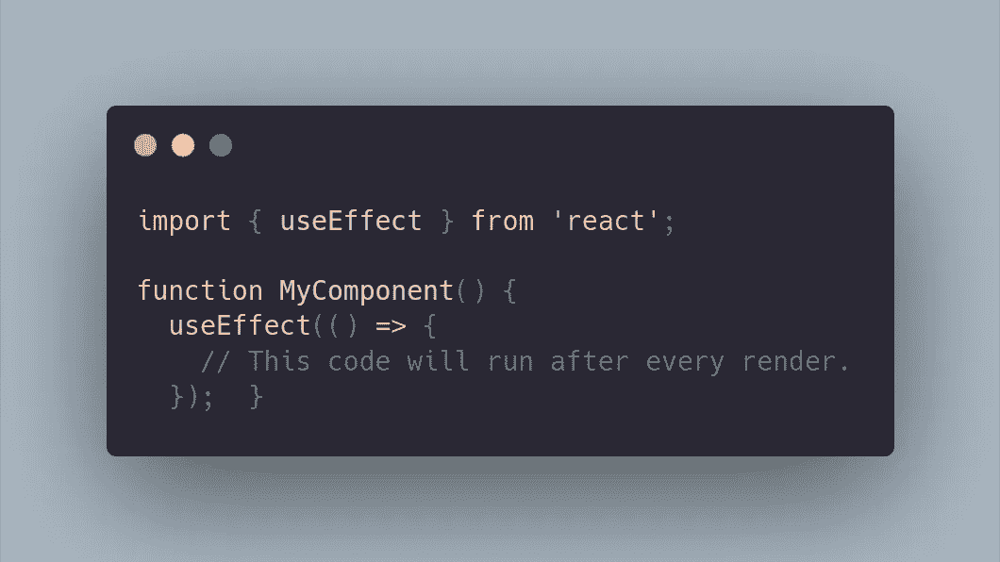
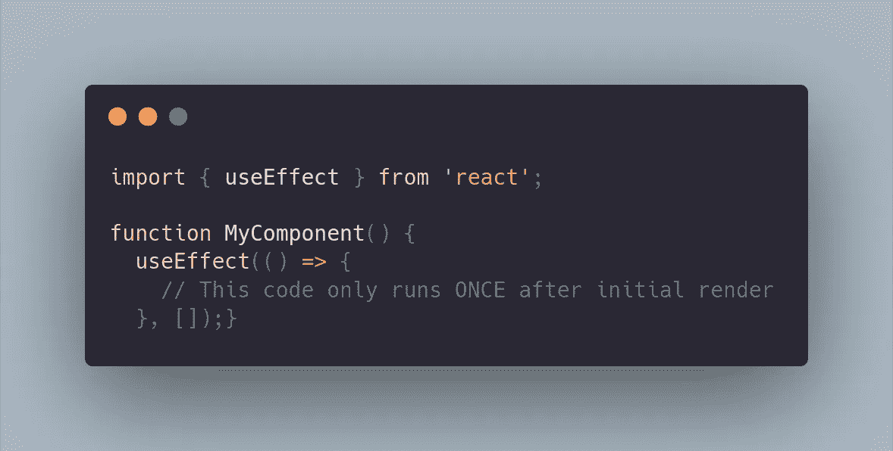
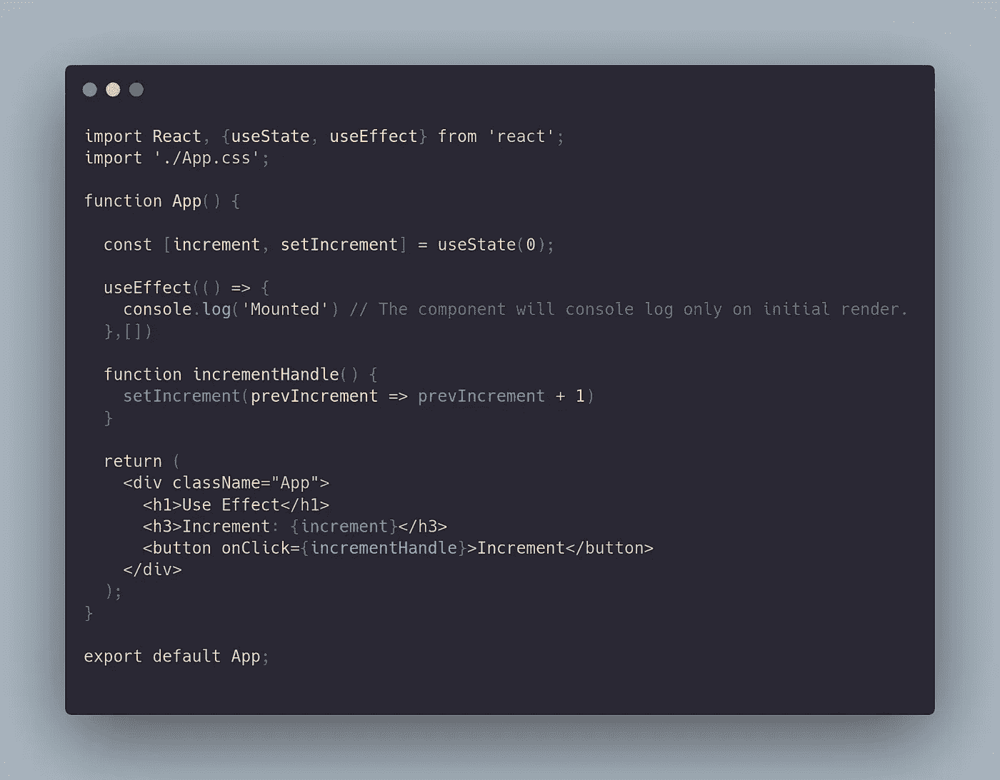
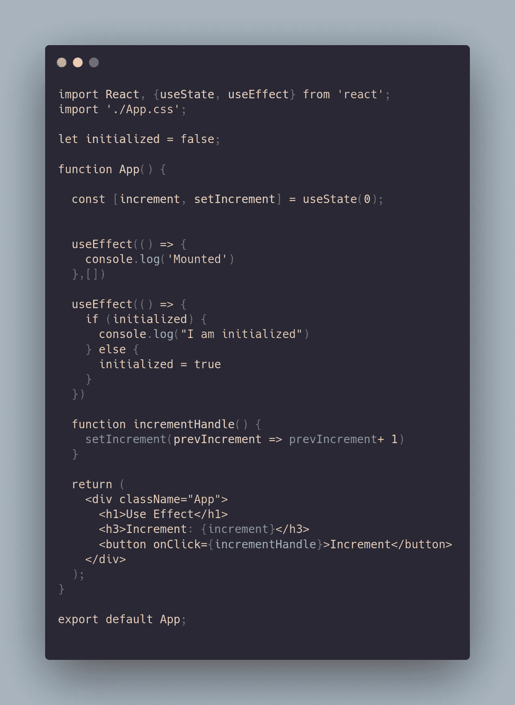
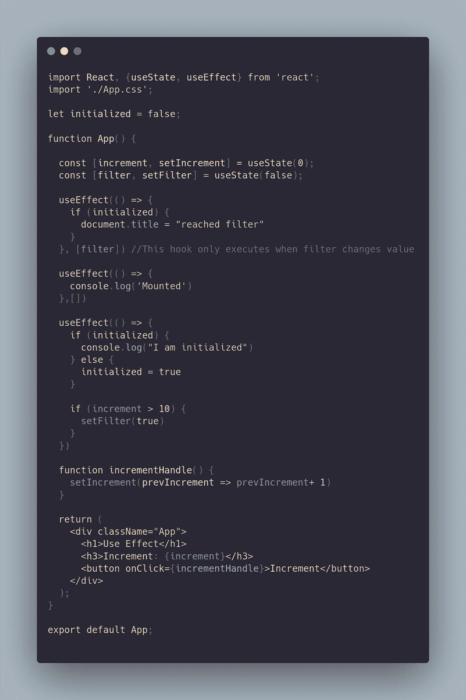
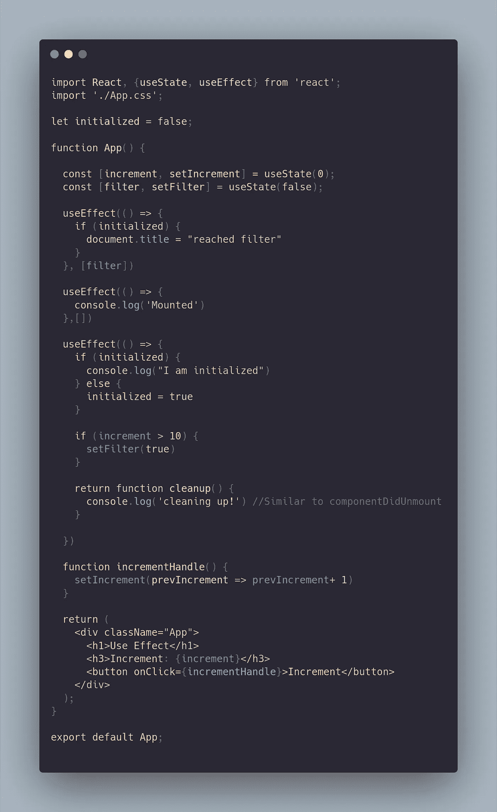

# 反应钩子:使用效果

> 原文：<https://medium.com/geekculture/react-hooks-useeffect-de709442cb8c?source=collection_archive---------10----------------------->

上次我写了关于 useState 钩子的文章，所以现在我将解释 useEffect 钩子在 React 中的作用。开发 useEffect 挂钩是为了解决 ES6 类组件的生命周期方法带来的一些挑战。如果你从类组件理解生命周期方法，这个钩子相当于生命周期方法 componentDidMount、componentDidUpdate 和 componentDidUnmount。我将用一个例子来展示钩子如何取代这些生命周期方法。

首先，让我们看看 useEffect 是什么样子的。这个钩子是一个接受两个参数的函数。第一个是带有副作用逻辑的回调。第二个是可选的依赖数组。仅当渲染之间的依赖关系发生变化时，useEffect 挂钩才会执行回调。这允许您控制副作用何时运行。让我们看看依赖项是什么样子的，它们是做什么的。

如果不提供依赖数组，副作用会在每次渲染后出现。

如果您提供一个空数组，副作用仅在初始渲染后运行，类似于 componentDidMount。

如果在数组中提供一个 state 或 prop 值，副作用会在依赖关系每次改变时运行，类似于 componentDidUpdate。

让我们用一个简单的程序来做一个例子。我的组件将有一个按钮，将增加一个计数器。当计数器达到某个数值后，文档的标题将会改变。首先，让我们设置组件的最小值。它将有一个计数器状态和一个处理函数。

如你所见，我在这个组件上已经有了一个 useEffect 函数。在组件上，控制台上记录了初始渲染“已装载”。单击该按钮时，数字会增加 1。完美现在让我们说，我们想控制台日志的东西，每次组件渲染，但不是在最初的渲染。关于钩子最好的事情是在同一个组件中可以有多个钩子。我将有一些条件语句来控制效果何时运行。它看起来会像这样。

我创建了一个设置为 false 的变量来防止效果在第一次渲染时触发。此后，每次计数器递增时，您将能够看到控制台正确打印。这是因为这个钩子没有依赖参数，所以它在每次状态改变时都会呈现。现在，让我们实现一个过滤器，当计数器达到某个数字后，它将改变文档的标题。为此，我将不得不使用另一个状态钩子，并设置另一个条件语句。

现在，当计数器达到 11 时，文档的标题被更新。这是因为一旦满足条件，过滤器状态值将变为 true，钩子将执行。我们还可以用 useEffect 做一件事。有些副作用需要清除，比如清除计时器。如果一个回调函数返回一个函数，那么钩子将认为这是一个效果清理。

你会看到清理将在每次渲染后运行。这类似于使用 componendDidUnmount 在类组件中可以做的事情。

我从学习这个钩子中获得了很多乐趣。这是最重要的一个钩子，也是最棘手的一个。经过一些实践之后，它变得很有意义。好了，这就是全部的使用效果。编码快乐！😎