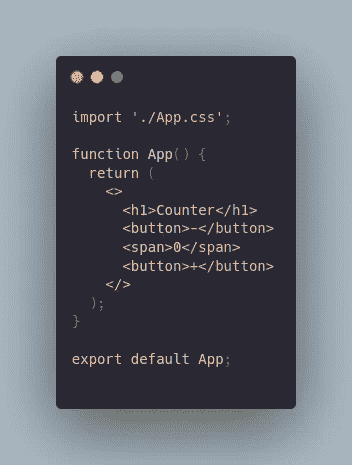
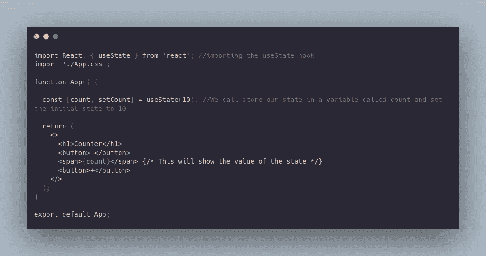
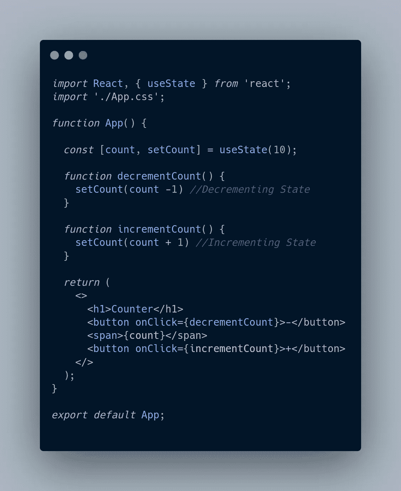
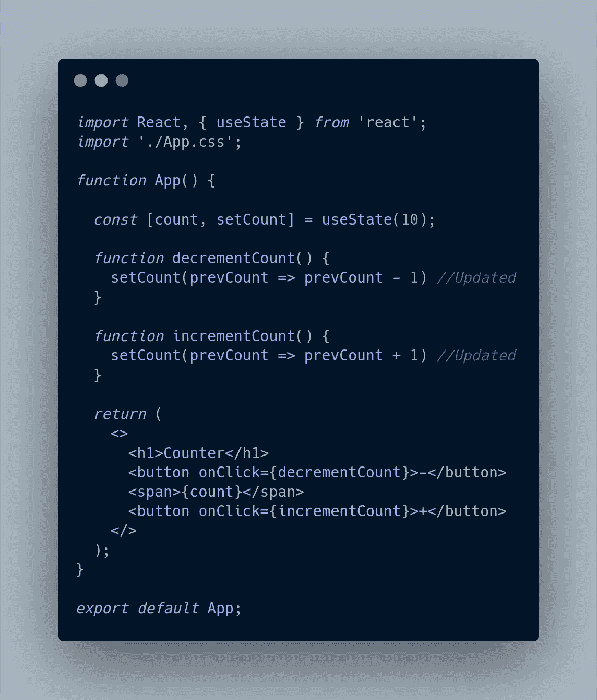

# 反应钩子:使用状态

> 原文：<https://medium.com/geekculture/react-hooks-usestate-6e548490cbb8?source=collection_archive---------15----------------------->

我喜欢 React 钩子，但我知道对于初学者来说，它们可能有点令人困惑。我记得当我第一次开始学习它们的时候，我很难理解它们。钩子让你不用写类就可以使用状态和其他 React 特性。之所以引入它们，是因为类可能会令人困惑，较大的组件可能会有点难以理解。我要研究的第一个钩子是 useState。这允许您在功能组件中使用状态。我们开始吧！

为了解释钩子，我将使用一个递增和递减计数器的示例代码。我的启动代码是这样的。

现在点击加号或减号按钮不会做任何事情。我们需要实现钩子来允许在我们的功能组件中使用状态。有一点要知道，我们不能在类组件中使用 React 钩子。另一个需要知道的重要事情是钩子应该总是以相同的顺序运行。这意味着它们不能写在条件语句中。如果你这样做，你会得到一个错误，告诉你一个 React 钩子会让你知道一个钩子正在被有条件地调用。要使用 useState 挂钩，我们需要调用 useState 函数，并传入状态的初始值。useState 函数总是返回一个有两个值的数组，所以 arr 将被去结构化是很常见的。第一个值是状态，你可以选择任何名称。第二个值是 setState 函数，它允许你更新你的状态。让我们在代码中实现它。

为了开始递增和递减计数器，我们必须编写几个函数来更新计数器的状态。然后，我们可以设置这些函数，以便它们在每次单击相应的按钮时运行。这是它的样子。

唯一的问题是，这实际上是错误的状态更新方式。我们需要传入一个接受 prevState 的函数，而不是更新 count。就像在类组件中一样，我们可以在函数中传递以前的状态，这样我们就可以正确地更新状态。这是因为我们试图更新以前的状态，以便为当前状态创建一个新值。检查一下，你会发现点击按钮仍然可以正确地改变计数器。这是代码的样子。

这就是我们的计数器功能。关于钩子要知道的其他一些事情是，设置初始函数可以接受一个函数，这样它将只在组件被渲染时运行一次。这将使您的应用程序运行得更快，这取决于您正在使用哪种状态。钩子最好的一点是，我们可以使用多个 useState 钩子来管理多个状态。这使得每个状态都更容易管理和更改。

这就是全部使用状态。我花了一段时间去理解它，但是通过练习，它变得更有意义，使用起来也更有趣。下一次我将谈论如何使用其他钩子以及它们的好处，所以请留意我的下一篇文章。现在出去和钩子玩得开心点。大家编码快乐！😎