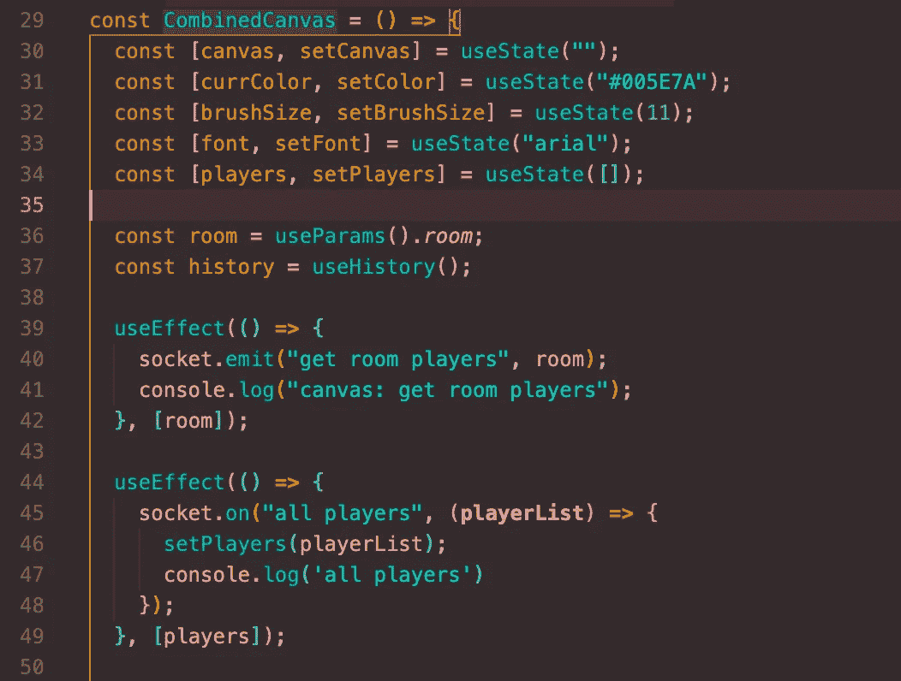

# React 挂钩——它们是什么以及如何创建自己的挂钩

> 原文：<https://medium.com/geekculture/react-hooks-what-are-they-and-how-to-create-your-own-ba1d0ccffce2?source=collection_archive---------15----------------------->

React 钩子是 React API 的一个新的补充——在 React v16.8.0 中引入。从表面上看，钩子明显偏离了 React 的经典类组件结构，看起来令人生畏。再加上类仍然存在，API 本身还没有调整到必须使用钩子的程度，有些人可能会很慢才采用它们。然而，一旦你熟悉了它们，钩子是组织代码和管理状态的一种更简洁和更直接的方式，使它们成为你的 React 工具箱的一个极好的补充！

A quick example of the useState hook in action

**那么，什么是钩子呢？**

钩子是存在于 React 的功能组件中的函数，它使您能够更容易地“获取”和处理状态，以及各种 React 生命周期事件。请注意，这些只能**存在于功能组件中，意在取代对类的需求(尽管它们可以彼此并行使用，并且钩子是向后兼容的，这意味着如果你愿意，你可以慢慢地将它们合并到已经存在的代码中，而不会引起破坏性的变化。)它们不能存在于标准的 Javascript 函数中——除非是在创建自己的定制钩子的情况下，这一点我稍后会谈到。**

除了只能存在于函数组件或自定义钩子中，钩子要记住的另一条基本规则是:它们的**必须在函数的顶层被调用——这意味着没有嵌套函数、没有循环、没有早期返回、没有条件。为什么？看看下面的代码片段:**

Example of Hooks being called multiple times in a single component.

这是怎么回事？在这个特定的功能组件中，我们多次调用挂钩 useState 和 useEffect。那么代码怎么知道哪个状态对应哪个钩子呢？钩子查看它们在组件中的顺序来确定它们对应的状态，**总是**。如果这个顺序在每次渲染时改变，React 不知道每次调用时返回什么，这会导致意想不到的副作用和错误！如果您确实发现自己需要一些东西来有条件地运行，只需将条件放入您的钩子中。如果这似乎是你容易忘记的事情，React 已经创建了一个特殊的 [ESlint 插件](https://www.npmjs.com/package/eslint-plugin-react-hooks)，它将为你执行这两条规则！

**常见挂钩及其使用方法**

您将使用的最“流行”也可能是最直接的钩子是 useState 钩子。useState 挂钩将本地状态添加到组件中，并在重新呈现时保留它。它接受一个初始状态作为参数，与 *this.state* 不同，它不需要成为一个对象，除非你希望它成为对象。该参数仅在第一次渲染时使用。钩子返回两件事:1。保存当前本地状态的值，以及 2。允许您更新本地状态的功能。构造这些 useState 挂钩的最佳实践是命名将通过数组析构返回的值。这方面的一个例子如下所示。

> const [font，setFont] = useState("arial ")

您可以随意命名这些变量，但是第一个变量将被分配给返回的本地状态，而第二个变量将对应于允许您更新本地状态的函数。然后，可以根据需要在组件内的任何地方调用更新状态的函数。

useEffect 钩子看起来也很熟悉。这个钩子可以被认为是*的 componentDidMount，componentWillUnmount* 和*的 componentiddupdate*都集成到一个简单的钩子中。任何会产生副作用的代码(比如更新 DOM 或获取数据)都可以放在这里。这个钩子接受你的引起副作用的函数，并在每次渲染组件后调用它。因为它存在于组件中，所以它可以利用 JS 闭包来访问状态和任何其他潜在的属性。这是调用更新状态函数的好地方！这个钩子也不会阻止你的浏览器更新屏幕(不像*componentDidMount*&*componentWillUpdate)。)*这真的很方便，因为它可以帮助用户体验感觉更流畅和响应更快，但是请注意，如果您确实需要效果同步发生，这可能不适合您！去看看 useLayoutEffect 挂钩吧。

最后，useRef 钩子非常有用，可以帮助您构建自己的定制钩子！UseRef 接受一个初始值作为参数，并返回一个普通的 JavaScript 对象。这个对象将是一个带有*的可变引用对象。当前的*属性将被设置为传入的值。只要组件存在，这个对象就存在，并且可以用来访问 DOM。(这可以通过将 ref 对象附加到一个节点来实现，其中。*当前*属性会在每次节点更新时改变。)它还可以作为容器来保存任何可变数据，类似于在类组件中使用实例字段。使用这个钩子时唯一需要警惕的是记住当对象发生变异时，它不会通知你，也不会触发组件的重新渲染。

**打造你的定制钩子**

太好了！现在我们准备好投入到制作自己的钩子的世界中去了。您可能会想，“React 为不同的专门操作提供了如此多的内置挂钩，我为什么需要自己制作挂钩呢？”简而言之，这些定制钩子将允许您从一个组件中移除有状态逻辑，并将其放入钩子中，这样，您只需调用钩子就可以在几个不同的组件中使用相同的逻辑——减少冗余并保持干燥。这也可以通过减少仅仅为了传递逻辑而创建更高阶组件的需求来避免混淆组件树。

自定义钩子将像任何其他标准 JavaScript 函数一样，除了最佳实践规定“use”应该放在您给它起的名字前面。因此一个钩子应该总是被叫做“useChat”或者“use palette”；这提醒了所有钩子都必须遵守的两条基本规则。除此之外，它可以接受任意数量的参数，并可以返回您想要的任何内容——这完全取决于您的需求。它还可以接受其他挂钩，如 useState 或 useEffect。然后，这个新创建的钩子可以在您喜欢的任何组件中被调用——记住要把它放在顶层。请注意，当*有状态的*逻辑通过这个钩子在组件间共享时，钩子访问的任何状态或效果都将被限制在调用钩子的特定组件中。因此，它不能用于跨组件共享或改变信息。尽管如此，保持你的代码整洁有序还是很方便的！

希望这已经给了你一个很好的 React 钩子世界的介绍，并激励你去尝试一下。一旦你掌握了它们，它们肯定会对你的应用程序大有裨益。