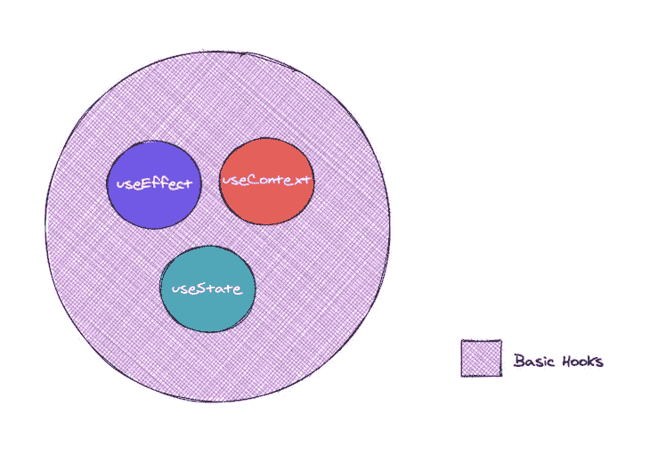
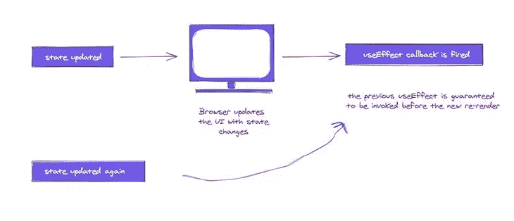
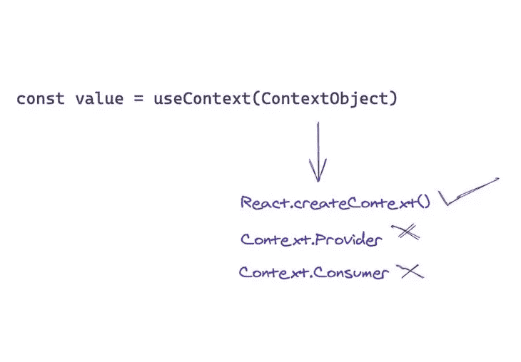
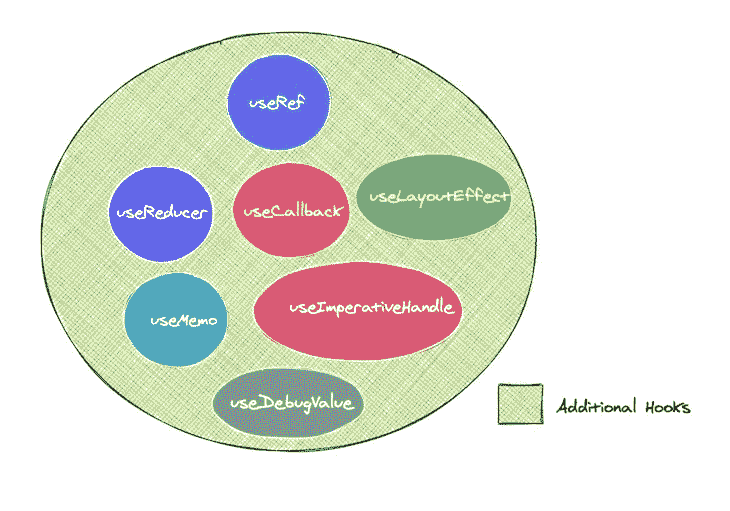

# 反应钩子:它们是什么？为什么它们是需要学习的重要和基本的挂钩。

> 原文：<https://medium.com/geekculture/react-hooks-what-are-they-why-are-they-important-and-basic-hooks-to-learn-f83ea3e54470?source=collection_archive---------25----------------------->


React Hooks is an API included in React 16.8

如果你目前正在学习 react，你可能已经意识到这个框架比它开始时看起来更复杂，因为它包含了超越类组件和函数的多个概念。随着框架越来越流行，应用程序变得越来越大越来越复杂，不同的问题出现了，特别是那些关于类与类之间的状态管理的问题。为了解决这个问题，开发了像 Redux 这样的其他技术，但是 react 开发团队创建了 Hooks 作为 React 中的一个嵌入式解决方案，作为一个更加整合的技术的一部分。

**那么这些*挂钩*到底是什么？**嗯，根据 O [官方文档](https://reactjs.org/docs/hooks-overview.html)，*钩子*是 React 16.8 中的新增加。它们允许您使用状态和其他 React 特性，而无需编写类。

换句话说，钩子是一个可以让你进入反应状态和生命周期特性的函数。该函数“挂钩”到一种状态，允许您更容易地在组件之间传输这种状态。

需要注意的是，钩子只能在函数内部工作，而不能在类内部工作，它们必须在函数的顶层被调用，并且不能在普通的 JavaScript 函数中使用，只能在 React 函数中使用。这总体上对代码的性能和可读性有积极的影响。

**为什么钩子这么重要，我为什么要学？React 是第一批将用户界面建模为组件组合的视图库之一。使用 React，我们通过从小组件开始构建 UI，然后构建越来越大的组件。这些组件要么是无状态的，即没有状态的函数，除了接受道具之外不与环境交互，并且专注于显示我们的 UI。组件也可以是“有状态的”,它持有与环境交互的业务逻辑，处理数据获取，提供用户交互性，等等。**

钩子进入这个环境，为共享业务逻辑提供了一个更好的选择。它们以函数的形式存在，可以在组件内部调用，在组件之间共享，允许 React 中的一切都封装为函数，包括 UI 组件和业务逻辑。



Basic and most Common React Hooks

**有哪些我可以学习的基础勾手？**在本文中，我们只打算解释最有用和最常见的钩子(useState、useEffect 和 useContext)。这 3 个挂钩涵盖了大多数需要挂钩的情况，并为其余的挂钩提供了基础。

**使用状态()**

它是最重要也是最常用的钩子。这个钩子的目的是处理 React 数据，任何在应用程序中发生变化的数据都称为状态，当任何数据发生变化时，React 重新呈现 UI。

下面是一个如何初始化和使用它的例子。

```
// function initialized inside parenthesis (100)
Const [count, setCount] = useState(100) 

const handleClick = () => setCount(count + 1)return (<div> 
State variable is {count}
<div> <button onClick={handleClick}>Add one! </button> </div>
</div>)
```

**UseEffect()**

它允许我们在单个函数 API 中实现所有的生命周期挂钩。使用 useEffect，您可以从功能组件内部调用副作用。下面是它的使用方法:

```
const EffectCleanup = () => {
  useEffect(() => {
    const clicked = () => console.log('window clicked')
    window.addEventListener('click', clicked)

    // return a clean-up function
    return () => {
      window.removeEventListener('click', clicked)
    }
  }, [])

  return <div>
    When you click the window you'll 
    find a message logged to the console
  </div>
}
```

重要的是要注意，在函数之后，您可以选择想要更新的元素，函数将在每次组件改变时自动重新呈现。但是，如果没有定义组件，并且函数后面有一个空数组([])，那么函数将只在挂载时呈现。



**UseContext()**

这个钩子允许我们在组件树中共享数据，而不需要通过 props。它基本上消除了钻孔。上下文是 React 处理多个组件之间共享数据的方式。



```
const ThemeContext = React.createContext('light');

const Display = () => {
 const theme = useContext(ThemeContext);
 return <div
        style={{
        background: theme === 'dark' ? 'black' : 'papayawhip',
        color: theme === 'dark' ? 'white' : 'palevioletred',
        width: '100%',
        minHeight: '200px'
        }}
    >
        {'The theme here is ' + theme}
    </div>
```

**其他挂钩**



Additional Hooks in React

上图显示了以上章节中讨论的基本挂钩的多种变体。如果你刚刚开始使用钩子，并且几乎没有使用它们的经验，我建议你坚持使用这篇文章中描述的三个主要钩子，但是，如果你想更深入地学习整个钩子系列，我将让你参考这篇文章中的[和大量的信息和视觉资源，它们将帮助你成为一个钩子大师！](https://blog.logrocket.com/react-hooks-cheat-sheet-unlock-solutions-to-common-problems-af4caf699e70/#usestate)

**结论**

这篇文章概述了 React 钩子以及为什么应该在功能组件中使用它们的原因。趋势表明钩子已经存在，并且在 React 框架的未来会变得更加重要。所以我强烈建议你学习并修改它们，查阅官方文件并学习如何使用和应用它们。

我希望这篇文章对你有帮助，祝你快乐！