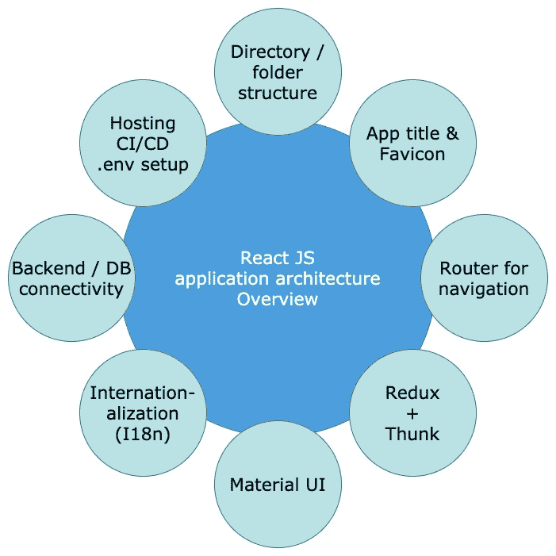

# React JS—架构+特性+文件夹结构+设计模式

> 原文：<https://medium.com/geekculture/react-js-architecture-features-folder-structure-design-pattern-70b7b9103f22?source=collection_archive---------0----------------------->

完整的公司标准 React JS 样板文件

> 最后更新于 2021 年 11 月 4 日。
> 尽力让故事跟上时代。(react-v17.0.2，MUI-v 5.0)
> Git repo:[SAURABH SHAH/react js myapp Git lab](https://gitlab.com/saurabhshah231/reactjs-myapp)(WIP)
> [Code-sandbox live](https://codesandbox.io/embed/bold-hooks-tkcz9?fontsize=14&hidenavigation=1&theme=dark)(playgroud embedded at bottom)
> 如果你喜欢这个故事，[给我买杯咖啡](https://www.buymeacoffee.com/saurabhshah23)！

fig-1\. ReactJS app architecture modules