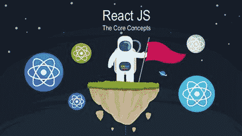
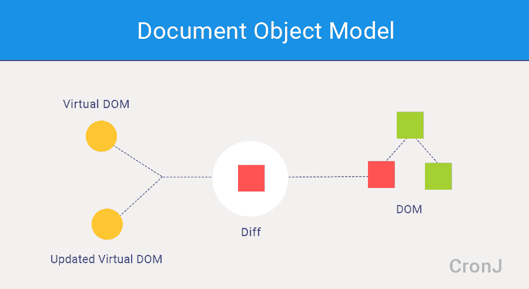

# 用高级主题重温 React JS 基础知识

> 原文：<https://medium.com/geekculture/react-js-fundamentals-revisited-with-advanced-topics-9f18d36b7ec?source=collection_archive---------2----------------------->



## 虚拟对象、组件、JSX、道具、状态、挂钩、副作用、道具类型、数据和事件流、条件渲染、React 应用优化

eact JS 是前端开发最流行的 JavaScript 库。它使得以较低的复杂度构建 Web UIs 变得容易，绕过了开发人员自己对 DOM 的直接操作。React 的快速 DOM 操作(由于虚拟 DOM 概念)和基于结果的 UI 语言(即当动作发生在组件的状态上时，React 负责基于此更新 DOM 中的 UI)使其在开发人员中如此受欢迎。React 还简化了为 Web、Android 和 iOS 开发跨平台应用的过程。让我们简单了解一些让 React 应用如此特别的核心概念。

# 虚拟 DOM

在用 React 制作 app 的同时，开发者不用担心操纵浏览器 DOM。他们所要做的只是更新应用程序的状态(我们将在本文后面学习)并告诉 React 该做什么，其余的就交给 React。React 完成了操作 DOM 的繁重工作，但是是以最简单的方式。它管理内存中整个应用程序的虚拟 DOM 树。



当任何事件要对真实 DOM 进行任何更改时，它会生成更新树的新虚拟表示。现在 React 在内存中有两个版本的树！React 不会丢弃已经在浏览器的 DOM 树中呈现的内容。相反，它将比较它在内存中的树的两个虚拟版本，计算它们之间的差异，找出主树中需要更新的子树，并且只更新浏览器中真实 DOM 中的这些子树。而且，这个概念使得 React 非常有效地处理浏览器的 DOM 树。

# 成分

C 组件是每个 React 应用的构建模块。我们定义小组件，然后将它们放在一起形成更大的组件。所有组件，无论大小，都是可重用的，甚至跨不同的项目。它们只不过是一些可重用的函数，一些输入参数提供一些输出，较小的函数被捆绑在一起构建较大的函数。在 react 组件中，输入是“道具”的集合，输出是 UI 的描述。组件的基本结构只是一个普通的 JS 函数。一个组件可以有一个或多个状态，这些状态存储的数据可能会随着组件的生命周期而改变，并且组件的输出依赖于这些状态。

```
// simple react component
function Button (props) {
  // Returns a DOM/React element here. For example:
  return <button type="submit">{props.label}</button>;
}// To render a Button element in the browser
ReactDOM.render(<Button label="Save" />, mountNode);
```

# JSX

在 React 应用中，我们不直接用 HTML 或 JavaScript 自己创建 HTML 元素，而是告诉 React 用 JSX (JavaScript 扩展)来创建。我们没有使用`React.createElement`语法编写 React 组件，而是使用类似 JSX 语法的 HTML，然后使用“transpiler”(例如 Babel 或 TypeScript)将其翻译成`React.createElement`调用。因此，React 组件是一个返回 React 元素的 JavaScript 函数(通常带有 JSX)。当使用 JSX 时，`<Tag></Tag>`语法变成了对`React.createElement("tag")`的调用。第一个字母必须是大写的，这是一个要求，因为我们将处理 HTML 元素和 React 元素的混合。浏览器根本不需要处理 JSX，React 也不需要处理它！只有编译器知道。我们将原始的 html 和 css 发送到浏览器。

```
// simple react component with JSX syntax <Button><Button/>
function Button (props) {
  // Returns a DOM/React element here. For example:
  return <button type="submit">{props.label}</button>;
}// To render a Button element in the browser
ReactDOM.render(<Button label="Save" />, mountNode);
```

# 小道具

HTML 元素可以像`id`或`title`一样被赋予属性，React 元素在呈现时也可以接收属性列表。上面的`Button`元素收到了一个`label`属性。在 React 中，React 元素接收的属性列表被称为`props`。React 函数组件接收这个列表作为它的第一个参数。该列表作为一个对象传递，其中键代表属性名称，值代表分配给它们的值。

# 州

**状态**包含可能随时间变化的特定于组件的数据。状态是用户定义的，它应该是一个普通的 JavaScript 对象。这些状态不应该被直接修改，而应该具有特殊的功能。状态可以异步更新，您不应该依赖它们的值来计算下一个状态。这就是为什么状态通常被称为局部的或封装的。除了拥有和设置它的组件之外，任何组件都不能访问它。定义一个新变量会引入一个新状态，而改变该变量的值会改变该状态。组件可以选择将其状态作为道具传递给其子组件。下面给出了带有状态挂钩的简单状态实现:

```
import React, { useState } from 'react'; 2:
function Example() {
   const [count, setCount] = useState(0); 5:

   return (
      <div>
          <p>You clicked {count} times</p>
          <button onClick={() => setCount(count + 1)}>10:         
              Click me
          </button>
      </div>
   );
}
```

# 钩住

H ooks 是 React 16.8 版本中的新特性。钩子是一个特殊的函数，可以让你“钩入”React 特性。例如，`useState`是一个钩子，可以让你给函数组件添加反应状态。所有钩子函数都以单词“use”开头，并且它们只能在函数组件中使用。尽管钩子是 JavaScript 函数，但是在使用它们的时候需要遵循两条规则。

1.  始终在 React 函数的顶层使用钩子。不要在循环、条件或嵌套函数中调用钩子。
2.  不要从常规的 JavaScript 函数中调用钩子。从 React 函数组件或自定义挂钩中调用挂钩。

关于钩子的实现，请参见上面的例子。

# 副作用

数据获取、设置订阅和手动更改 React 组件中的 DOM 都是副作用的例子。无论您是否习惯于将这些操作称为“副作用”(或者只是“效果”)，您可能以前在您的组件中执行过它们。我们会用 hook 来解释。

```
// Side Effect Example using useEffect Hook
import React, { useState, useEffect } from 'react';
function Example() {
  const [count, setCount] = useState(0);

  useEffect(() => {    
      document.title = `You clicked ${count}times`;  });
      return (
          <div>
            <p>You clicked {count} times</p>
            <button onClick={() => setCount(count + 1)}>
              Click me
            </button>
          </div>
      );
}
```

**`**useEffect**`**钩子是做什么的？通过使用这个钩子，你告诉 React 你的组件需要在渲染后做一些事情。React 将记住您传递的函数(我们称之为“效果”)，并在执行 DOM 更新后调用它。它需要一个函数和一组依赖项。将`useEffect`放在组件内部让我们可以直接从效果中访问状态变量(或任何道具)。我们不需要特殊的 API 来读取它——它已经在函数范围内了。钩子包含 JavaScript 闭包，避免了特定于 newReact 的 API。默认情况下，useEffect 在第一次渲染后运行*，在每次更新后运行*。React 保证 DOM 在运行效果时已经更新。****

# **属性类型**

**我们知道什么是道具，我们从组件外部传递道具，并在组件内部使用它们。这对于不太大的应用程序来说是可以的，但是对于大的应用程序，我们可能希望检查我们用 props 传递的值的类型，以避免将来出现错误。我们可以使用 JavaScript 扩展，如 [Flow](https://flow.org/) 或 [TypeScript](https://www.typescriptlang.org/) 来对整个应用程序进行类型检查。然而，React 在 **prop-types** 库中有一些内置的类型检查功能。为了对组件的属性进行类型检查，我们可以分配特殊的`propTypes`属性。让我们看一个功能组件的例子。**

```
import PropTypes from 'prop-types'

function HelloWorldComponent({ name }) {
  return (
    <div>Hello, {name}</div>
  )
}

HelloWorldComponent.propTypes = {
  name: PropTypes.string
}

export default HelloWorldComponent;
```

**要将 PropTypes 添加到功能组件中，我们需要在导出之前在单独的函数中声明组件，如上所示。**

# **数据和事件流**

**在 React 中，数据沿着组件树向下。如果我们想将数据从父组件传递到子组件，我们需要使用 [**props**](https://facebook.github.io/react-native/docs/props.html) 。从 JSX 的角度来看，道具就像 HTML 的属性。**

## **数据流**

****父组件:****

```
// Greetings is called with color, text props from parent component<div>
  <Greetings color={red} text='Hello' />
</div>
```

****子组件:****

```
// props are available in the child componentconst Greetings = React.createClass({
  render () {
    const {color, text} = this.props
    const divStyle = {padding: 10, backgroundColor: 'black'}
    const headingStyle = {color: color}
    return (
      <div style={divStyle}>
        <h1 style={headingStyle}>{text}</h1>
      </div>
    )
  }
})
```

## **事件流**

****母组件:****

```
// the state constant and the function are passed to the child component as props from parent componentconst Parent = () => {
   const [count, setCount] = useState(0); return (
       <div>
           <Count count={count} setCount={setCount} />
       </div>
   )
}
```

****子组件:****

```
// props are available in the child componentconst Count = ({count, setCount}) => {
    return (
        <div>
            <button onClick={() => setCount(count + 1)}> 
                Increase 
            </button>
        </div>
    )
}
```

**在上面的例子中，状态变量和状态函数作为 props 传递给子组件，其中 props 用于在事件上改变父状态中的数据。state 函数作为子组件中的事件处理程序被调用，并将一些数据向上传递给父组件。**

# **条件渲染**

**在 React 中，我们可以创建不同的组件来封装我们需要的行为，并根据应用程序的状态只呈现其中的一部分，我们可以称之为条件呈现。它的工作方式与 JavaScript 中条件的工作方式相同，使用像`[if](https://developer.mozilla.org/en-US/docs/Web/JavaScript/Reference/Statements/if...else)`或[条件操作符](https://developer.mozilla.org/en/docs/Web/JavaScript/Reference/Operators/Conditional_Operator)这样的操作符来创建表示当前状态的元素，并让 React 相应地更新 UI。**

## **使用“if”运算符的示例**

```
function Greeting(props) {
  const isLoggedIn = props.isLoggedIn;
  if (isLoggedIn) {    
     return <UserGreeting />;  
  }  
  return <GuestGreeting />;
}
```

## **使用内嵌 If 和逻辑&运算符的示例**

```
function Mailbox(props) {
  const unreadMessages = props.unreadMessages; return (
    <div>
      <h1>Hello!</h1>
      {
         unreadMessages.length > 0 &&        
         <h2>You have {unreadMessages.length} unread messages. </h2>
      }               
    </div>
  );
}
```

## **使用内嵌 If-Else 和条件三元运算符的示例**

```
function Mailbox(props) {
  const unreadMessages = props.unreadMessages; return (
    <div>
      <h1>Hello!</h1>
      {
         unreadMessages.length > 0 
         ?       
         <h2>You have {unreadMessages.length} unread messages. </h2>
         :      
         <h2>You have no unread messages. </h2>
      }               
    </div>
  );
}
```

# **优化性能**

**尽管 React 本身使用几种聪明的 DOM 操作技术要快得多，但我们仍然要对我们的应用程序多加小心，在几个方面可以进一步加快 React 应用程序的速度。**

## **使用生产版本**

**为了使生产服务器响应更快，我们必须使用应用程序的生产版本。该生产构建可以通过多种方式创建，例如**

**[**中的`npm run build`创建 React App**](https://github.com/facebookincubator/create-react-app) ，**

**`brunch build -p`在**早午餐****

```
browserify ./index.js \
  -g [ envify --NODE_ENV production ] \
  -g uglifyify \
  | terser --compress --mangle > ./bundle.js
```

**在**浏览器中确认**，**

```
plugins: [
  // ...
  require('rollup-plugin-replace')({
    'process.env.NODE_ENV': JSON.stringify('production')
  }),
  require('rollup-plugin-commonjs')(),
  require('rollup-plugin-terser')(),
  // ...
]
```

**在**汇总**中，**

```
const TerserPlugin = require('terser-webpack-plugin');

module.exports = {
  mode: 'production',
  optimization: {
    minimizer: [new TerserPlugin({ /* additional options here */ })],
  },
};
```

**在**网络包**中。**

## **使用 DevTools Profiler 分析组件**

## **虚拟化长列表**

**如果应用程序呈现很长的数据列表(数百或数千行)，建议使用“窗口”技术。这种技术在任何给定时间只呈现一小部分行，可以显著减少重新呈现组件所需的时间以及创建的 DOM 节点的数量。**

## **避免和解**

**协调是在任何事件上构建新的虚拟 DOM 并将其与现有的虚拟 DOM 进行比较以获得差异并改变浏览器 DOM 的过程。即使 React 只更新更改的 DOM 节点，重新渲染仍然需要一些时间。在许多情况下，这不是问题，但如果放缓是显而易见的，我们可以加快这一切。如果我们知道在某些情况下我们的组件不需要更新，我们可以跳过整个渲染过程。**

## **不改变数据的力量**

**避免这个问题的最简单的方法是避免改变我们用作道具或状态的值。ES6 支持数组和对象的[扩展语法](https://developer.mozilla.org/en-US/docs/Web/JavaScript/Reference/Operators/Spread_operator),这使得这变得更容易。如果我们使用 Create React App，默认情况下可以使用这个语法。当我们处理深度嵌套的对象时，以一种不可变的方式更新它们会让人感觉很复杂。像 [Immer](https://github.com/mweststrate/immer) 或[不变性助手](https://github.com/kolodny/immutability-helper)这样的库让我们编写高度可读的代码，而不会失去不变性的好处。**

# **参考文献**

**[](/edge-coders/all-the-fundamental-react-js-concepts-jammed-into-this-single-medium-article-c83f9b53eac2) [## 所有基本的 React.js 概念，都集中在这篇中型文章中(2019 年 8 月更新)

### 介绍学习 React 的原因、内容和方式

medium.com](/edge-coders/all-the-fundamental-react-js-concepts-jammed-into-this-single-medium-article-c83f9b53eac2) [](https://reactjs.org/docs/state-and-lifecycle.html) [## 状态和生命周期-反应

### 本页介绍了 React 组件中状态和生命周期的概念。你可以找到详细的组件 API…

reactjs.org](https://reactjs.org/docs/state-and-lifecycle.html) [](https://reactjs.org/docs/hooks-state.html) [## 使用状态钩子-反应

### 钩子是 React 16.8 中的新增功能。它们允许您使用状态和其他 React 特性，而无需编写类。的…

reactjs.org](https://reactjs.org/docs/hooks-state.html) [](https://reactjs.org/docs/hooks-rules.html) [## 钩子的规则-反应

### 钩子是 React 16.8 中的新增功能。它们允许您使用状态和其他 React 特性，而无需编写类。钩子…

reactjs.org](https://reactjs.org/docs/hooks-rules.html) [](https://reactjs.org/docs/hooks-effect.html) [## 使用效果钩-反应

### 钩子是 React 16.8 中的新增功能。它们允许您使用状态和其他 React 特性，而无需编写类。的…

reactjs.org](https://reactjs.org/docs/hooks-effect.html) [](https://reactjs.org/docs/typechecking-with-proptypes.html) [## 使用 PropTypes 进行类型检查- React

### 注意:反应。自 React v15.5 起，PropTypes 已移到不同的包中。请改用 prop-types 库…

reactjs.org](https://reactjs.org/docs/typechecking-with-proptypes.html) [](https://blog.logrocket.com/validating-react-component-props-with-prop-types-ef14b29963fc/) [## React 中的 PropTypes:一个完整的指南

### Props 和 PropTypes 是在 React 组件之间传递只读属性的重要机制。反应道具…

blog.logrocket.com](https://blog.logrocket.com/validating-react-component-props-with-prop-types-ef14b29963fc/) [](https://www.pluralsight.com/guides/defining-props-in-react-function-component-with-typescript) [## 用类型脚本在 React 函数组件中定义属性

### 基顿兰尼前端网站开发本指南将为您提供语法，您需要正确定义…

www.pluralsight.com](https://www.pluralsight.com/guides/defining-props-in-react-function-component-with-typescript) [](https://www.geeksforgeeks.org/reactjs-proptypes/) [## react js | prop types-GeeksforGeeks

### 在我们以前关于道具的文章中，我们已经看到了如何使用道具将信息传递给任何组件。我们已经过了…

www.geeksforgeeks.org](https://www.geeksforgeeks.org/reactjs-proptypes/) [](https://hackernoon.com/13-things-you-need-to-know-about-react-d2e6a6422552) [## 关于 React 你需要知道的 13 件事

### 我已经使用 React 一年多了。我也在进行培训，帮助人们从零开始学习。我注意到…

hackernoon.com](https://hackernoon.com/13-things-you-need-to-know-about-react-d2e6a6422552) [](https://reactjs.org/docs/conditional-rendering.html) [## 条件渲染-反应

### 在 React 中，您可以创建不同的组件来封装您需要的行为。然后，您可以只渲染一部分…

reactjs.org](https://reactjs.org/docs/conditional-rendering.html) [](https://reactjs.org/docs/optimizing-performance.html) [## 优化性能-反应

### 在内部，React 使用了几种巧妙的技术来最小化更新…

reactjs.org](https://reactjs.org/docs/optimizing-performance.html)**