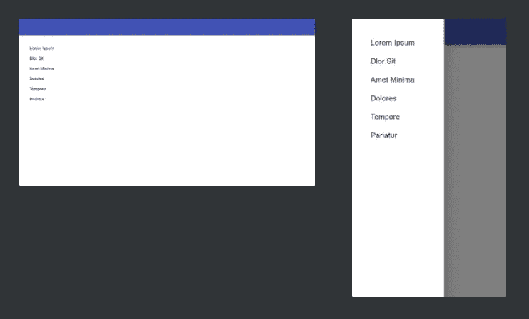
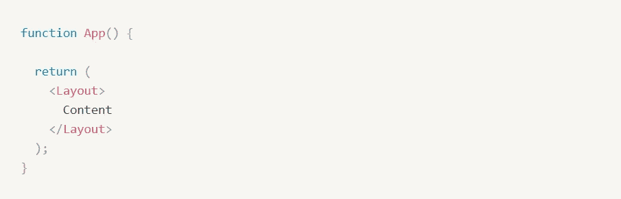
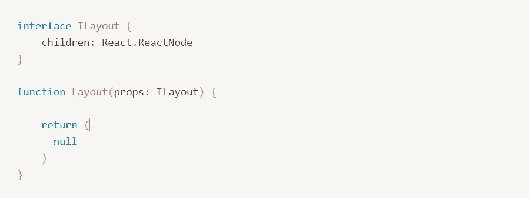
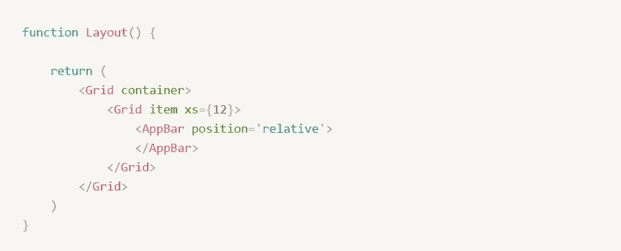
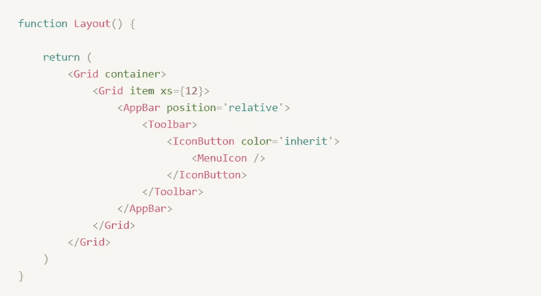
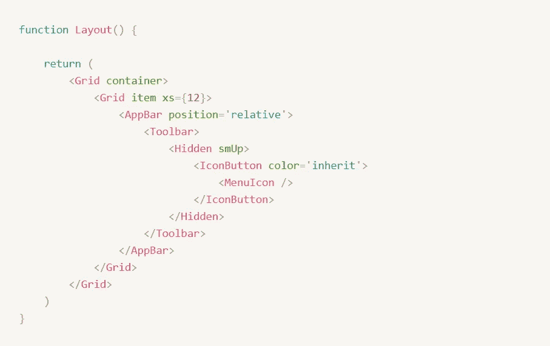
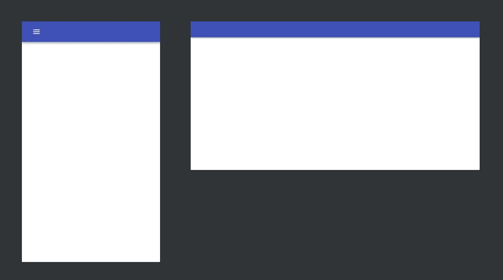
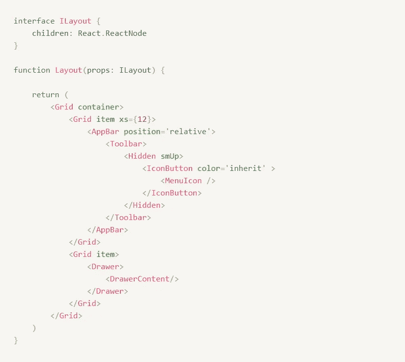
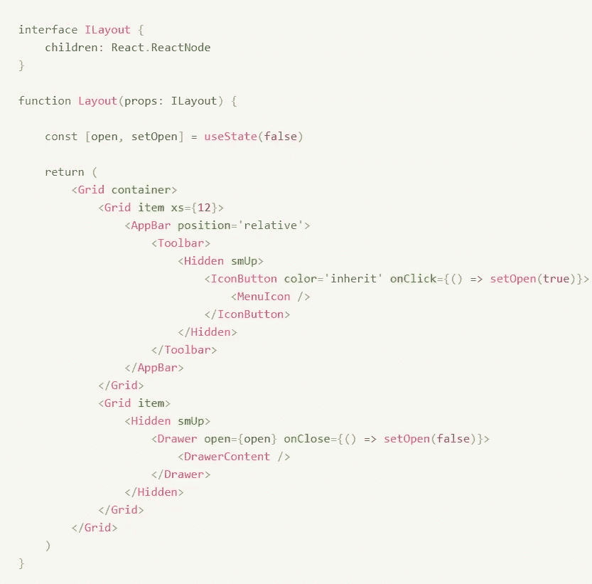
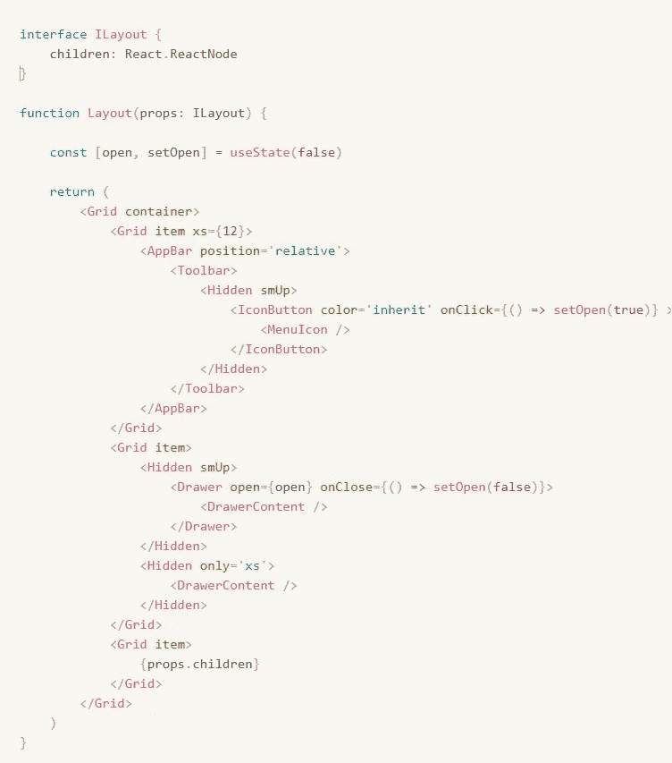

# 工作原理:MUI 导航抽屉

> 原文：<https://medium.com/geekculture/react-mui-navigation-drawer-59b604788b60?source=collection_archive---------5----------------------->

如何在 3 分钟内搞定这个 **↓** (使用 React 中的 Typescript)

当您在 MUI 中编写仪表板时，我们希望通过包装子组件的布局组件为其提供一致的布局。为了实现这个功能，在布局中传递一个接口并定义子属性。

然后，我们制作一个网格容器，并放入网格项。我们把应用程序栏放在这里，所以你想让它填满整个宽度(即 12 列)。默认情况下，应用程序栏固定在顶部，但您可以通过将其设置为相对来将其滚动到视图之外。

现在你想加入 3 样东西:工具栏、图标按钮和一个菜单图标，然后运行这个应用程序。这在顶部给你一个漂亮的应用程序栏，菜单图标在左边。

对于菜单图标，您只想在移动版本中显示它。因此，您用隐藏组件将 IconButton 括起来，并声明属性 smUp，这意味着它对于 sm 及以上的屏幕尺寸是隐藏的。你可以使用其他断点，但我个人建议坚持使用 smUp，因为它是我在应用程序和移动屏幕大小之间切换时最常用的断点。

现在，如果我们运行代码，您可以看到隐藏在桌面视图中的菜单图标，而在移动视图中是可见的。

下一步是做抽屉。首先制作另一个网格项，然后放入 drawer 组件，然后是定制的 Drawer 内容。

理想情况下，您希望抽屉在单击菜单按钮后打开，只在移动视图中。要实现这一点，你需要使用一个 React 钩子，这是创建一个状态的另一种说法。将 setOpen 设置为 true 函数添加到图标按钮的 onClick 函数中。按钮状态放入抽屉的 open prop 中，setOpen to false 函数放入抽屉的 onClose 函数中。此外，您希望使用隐藏组件为菜单图标实现相同的行为。

到目前为止，你已经完成了手机屏幕版本的工作，但你也希望它能在桌面屏幕上工作。理想情况下，您希望抽屉永久地放在那里，所以只需做您刚才做的事情，但是向`only='xs'`声明隐藏组件的行为，这将在 mobile xs 视图中隐藏它。此外，您还想去掉抽屉组件，以删除点击打开功能。

您现在可以看到，一切都正常工作

最后，您希望将布局的子元素放在正确的位置。只需在当前网格项目的下方再制作一个网格项目，将儿童道具包含在其中。

现在你完成了！

这很酷，但如果你想用 2 行代码制作一个后端，你可以查看我们的开源包 EzBackend，网址是 https://www.ezbackend.io ，并注册我们的 alpha！