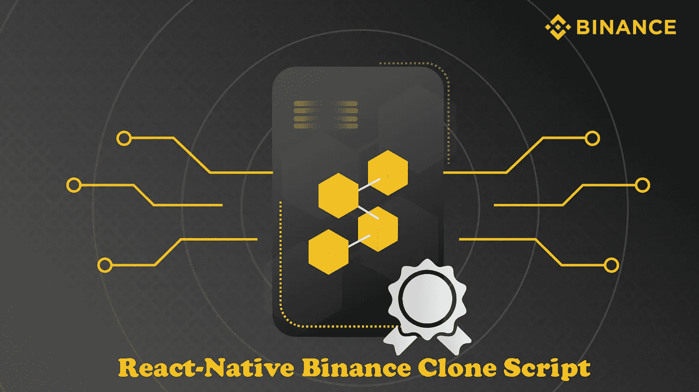
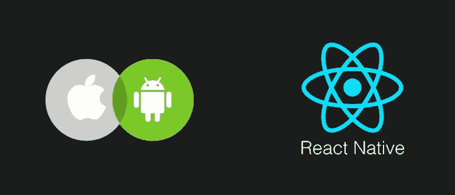

# React-本地币安克隆脚本-用 React-本地库启动你自己的币安克隆

> 原文：<https://medium.com/geekculture/react-native-binance-clone-script-launch-your-own-binance-clone-with-react-native-library-e53e7bb7710b?source=collection_archive---------11----------------------->

在这篇文章中，我将解释一下 **React-Native 币安克隆脚本**以及它的优缺点。

如果你是一个网页开发人员或企业家，想开始一个加密交换业务，你会很高兴知道反应原生是为你设计的！

# **什么是 React-Native 币安克隆脚本？**

币安克隆与反应本地语言是一个白色标签加密交换解决方案，可以定制和快速启动。对于希望在不久的将来加入密码交易市场的公司来说，这是一个极好的选择。与币安应用程序类似，我们的解决方案预装了所有功能和组件。

在 **Radin** ，我们试图帮助企业家和企业快速部署他们专业的加密交换应用。另一个值得注意的优势是，我们以合理的成本提供解决方案。联系我们，快速启动应用程序，并使用 [**React-Native 币安克隆脚本**](https://radindev.com/blog/react-native-binance-clone-script/) 帮助您的用户毫无困难地进行全球交易。

使用 React-Native 和 JavaScript，我们可以为任何类型的平台和任何类别或任何克隆应用程序(如币安或比特币基地)开发移动应用程序。

我们做的界面也翻译成原生视图。我们将能够在 iOS 和 Android 设备之间共享我们创建的大量代码，React Native 可以在需要时轻松构建特定于平台的代码。我们可以用一种语言(JavaScript)、一个框架(React)和一个风格引擎为两个平台构建应用。一旦你学会了，你可以在任何地方写它。

## **开始 React 的五个步骤——本地币安克隆应用程序开发**

需求研究

前端设计

后端开发

质量检查

应用部署

# **打造你自己的 React-原生币安克隆体**

要在几分钟内开发出你自己的币安应用，在 GitHub 上下载带有 React 本地语言的币安克隆版，它与 Firebase 后端完全链接。因为 React Native 是跨平台兼容的，所以您可以在 iOS 和 Android 上发布您的加密交换应用程序。

或者你可以从加密交换脚本开发公司获得币安克隆应用程序。这是一款白标移动应用，100%源代码**加密**，具有**高级安全特性**，并复制了币安的功能，因此任何崭露头角的企业家都可以像币安一样立即启动加密货币交易所。

币安交易所克隆应用程序经历了一个完整的测试过程，并完全基于网络安全准则进行设计，因此使用 [**Radindev 的币安克隆应用程序**](https://radindev.com/binance-clone-script/) 构建的移动设备确保了顶级的安全性，并保持不被黑客攻击。脚本的奇妙之处在于，定制业务人员可以根据自己的业务需求定制这个脚本，在众多竞争者中脱颖而出。

## **币安克隆脚本 React-Native 有什么优点？**

我们作为一个加密交换软件开发提供您的特权，贸易从任何地方，任何时候，易于使用和智能币安克隆脚本开发。我们根据您的需求为 android 和 iOS 开发了一款足智多谋的应用程序。我们的专业开发人员提供直观的应用程序，帮助无缝通用交易，并吸引许多新的交易者。

如果你正计划开办一家网站加密货币交易所，并希望通过向客户提供高满意度来获得高投资回报，你可以用一个白色标签的币安克隆产品来开办自己的加密交易所。您也可以选择市场上任何其他可靠的解决方案。

## **React 中的基本特性——原生币安克隆体将超越原版** [**币安**](https://www.binance.com/en)

推荐功能

加密钱包

存款/取款选项

即时推送通知

加密私钥

白名单功能

KYC 注册选项

查看功能

DEX 和 P2P 的独立用户界面

P2P 借贷模块

QR 扫描仪

交易历史

# **在 React-Native 中，币安克隆的组件有哪些**

**在 React 原生币安克隆应用中创建 UI 细节**

现在我们已经准备好开始制作 react 应用程序，接下来的步骤是设计我们需要的组件。

如果您是第一次接触 React-native，您可能会想知道组件是什么。不要再迷茫了。React 中的组件允许您将 UI 分解成更小的块。您不是在一个文件中创建整个界面，而是将它划分为单独的、可重用的组件，然后组合这些组件来创建您的最终程序。

## **什么是 React-Native 编程语言？**

Being React 是一个为管理浏览器中的 UI 状态而生的库，很明显，React-Native 的大部分结构都是基于它的，因此，它结合了许多我们在开发浏览器时已经应用的概念，简化了一些，使另一些变得复杂。

我的建议是从 React Native 的内部结构开始，并致力于在“桥”及其 API (java 或 obj-c，基于您的知识)方面训练自己。为此，我将为您留下一些资源，但不要忘记已经出现在 web 上的项目的有用性，如 GitHub，它们可以作为如何构建本机模块的复杂示例。

那么对于其他的一切，在 React Native 中开始开发之前，先成为一个前端开发者，肯定不是最明智的做法。

尽管如此，掌握一些 CSS 基础知识(比如用 flexbox 构建布局)、JavaScript ES6 基础知识和 React 基础知识还是不错的。

## **遗言**

现在，你一定已经理解了创建一个 **React 本地币安克隆脚本**的过程。通过彻底遵循这个过程，您可以高效地开发一个加密交换应用程序。Radindev 是一家专业的加密交换应用程序开发公司。我们为全球多家企业创建了多种类型的加密交换应用。因此，我们能够很好地理解您的想法，并为您提供最合适的解决方案。

我希望我是有用的，如果有任何问题，请写在评论里。