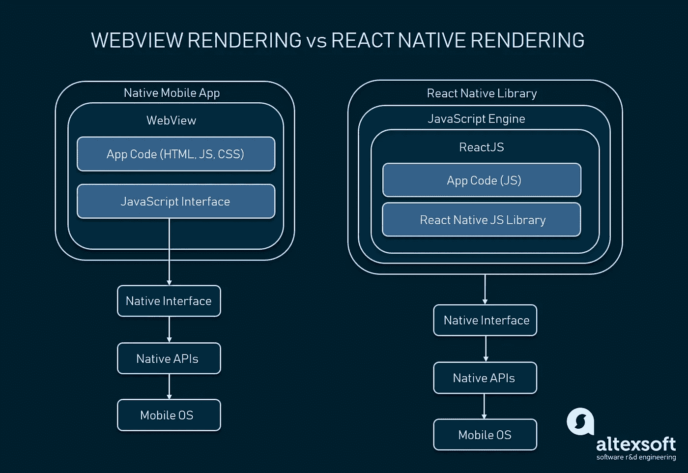

# 自然反应—

> 原文：<https://medium.com/geekculture/react-native-f7cf55affddc?source=collection_archive---------36----------------------->

它是什么，与 React.js 相比如何

> 作为一名新的开发者，我在熨斗学校学习了 React.js，但是当我在谷歌上偶然发现“React Native”这个词时，它激起了我的兴趣。什么是 React Native？一想到“本土”这个词，就会想到出生地。 ***那么，什么是 React Native 呢？***

***但首先… React —*** …一个专为开发移动和基于 web 的应用程序的视图层而设计的 JavaScript 库。像大多数框架一样，React JS 是一个可重用组件库，旨在帮助开发人员轻松创建他们的应用程序的基本框架。React 是由脸书开发的

***如果 React 这么流行，应用这么广泛，为什么还需要 React Native？*** React Native 也是脸书继 React 之后为了满足其日益增长的移动需求而开发的。React Native 基于 JavaScript，以开源方式部署，旨在通过可重用的组件轻松地专门针对 Windows 以及 iOS 和 Android 中的移动平台。它整合了许多 ReactJS，但有助于在所有设备上以类似本机的方式轻松实现这一点。简而言之，web 开发人员现在可以编写外观和感觉都“原生”的移动应用程序，所有这些都来自我们已经知道并喜爱的 JavaScript 库(React)。在它的核心，React Native 使用了 React for base idea，但是库的组件是不同的。因此，在本质上，它是 React 的第二个版本，是为另一个目的而创建的。

***React 语法*** 与 web 开发的 ReactJS 类似，React Native 混合使用 JavaScript 和 XML 风格的标记，称为 JSX。然后，在幕后，React 本机“桥”调用 Objective-C(对于 iOS)或 Java(对于 Android)中的本机呈现 API。因此，应用程序将使用移动 UI 组件呈现，而不是 web 视图，并且看起来像任何其他移动应用程序。React Native 还为平台 API 公开了 JavaScript 接口，因此 React Native 应用程序可以访问手机摄像头或用户位置等平台功能。使用 React Native，应用程序开发人员将不必为 iOS 和 Android 从头开始构建相同的应用程序。相反，他们可以跨每个操作系统重用相同的代码。React Native 的优点在于，在设备的本机代码(Objective-C 或 Java)中构建的应用程序和使用 React Native 构建的应用程序之间几乎没有区别。

***React Native 的优点*** React Native 有很多优点。比如，开发者不必从头开始为 iOS 和 Android 开发相同的应用。相反，他们可以跨每个操作系统重用相同的代码。React Native 的优点在于，在设备的本机代码(Objective-C 或 Java)中构建的应用程序和使用 React Native 构建的应用程序之间几乎没有区别。

*   *省时省钱* —因为大部分代码都是跨平台的，开发者只需要构建一个 app，最后就创建了两个 app
*   *出色的性能*
*   *增加的灵活性*—React Native 中使用的接口类型使得团队中的不同开发人员可以轻松地从其他人停止的地方继续构建。这也为测试人员提供了灵活性，让他们更容易地创建测试场景。
*   *即时查看更改* — React Native 提供了一种称为“实时重新加载”的东西，使开发人员能够立即在另一个实时预览窗口中同时查看他们对代码所做的更改。这为开发人员提供了实时反馈。

***React Native 的弊端*** 如同任何事物一样，总有弊端。最大的风险可能是 React Native 的成熟度，因为它仍然相当年轻。2015 年 3 月发布 iOS 支持，2015 年 9 月发布 Android 支持。不可否认，文档有进步的空间，并且在继续扩展。iOS 和 Android 上的一些功能仍然不受支持，社区仍在寻找最佳实践。

***TL；DR:React vs . React Native*** 如果你正在寻找创建动态的、令人难以置信的高性能 UI，并且主要关注 web 应用程序，React 是完美的选择。如果你正在寻找构建相同的，但作为一个移动应用程序，即使是 iOS 或 Android，使用 React Native(跨平台框架)。