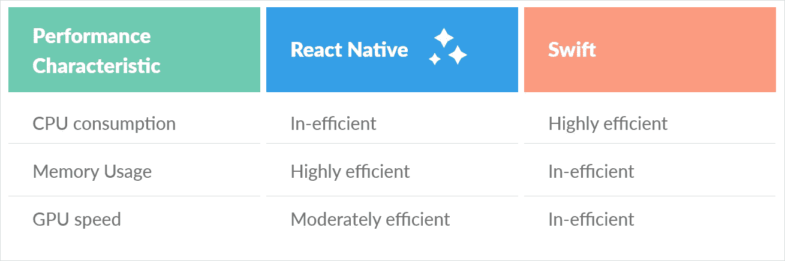
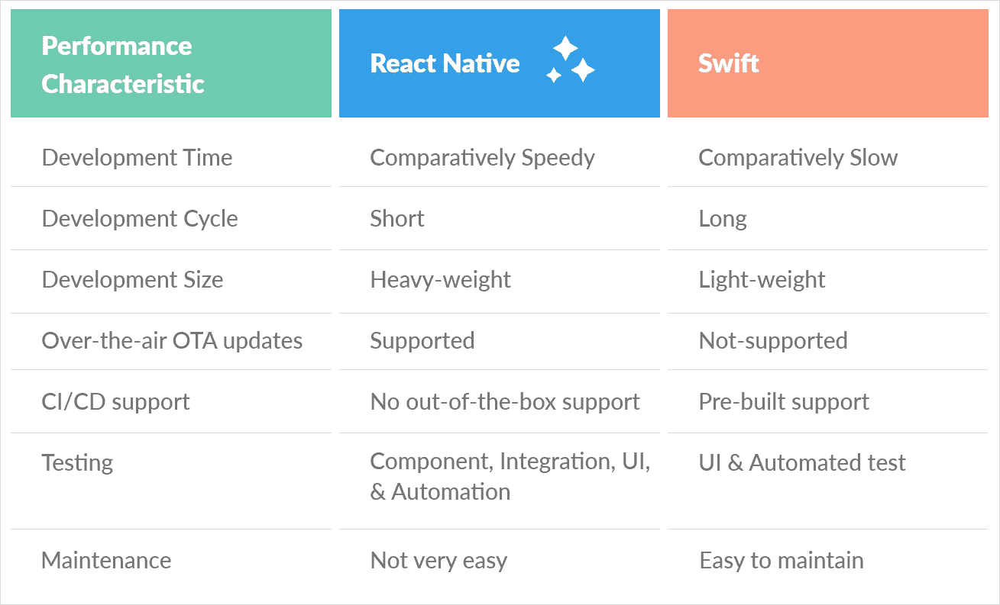

# 评估最佳 iOS 框架的完整故事:React Native Vs Swift。

> 原文：<https://medium.com/geekculture/react-native-vs-swift-ios-app-development-47cb575c6be9?source=collection_archive---------16----------------------->

## 为您的 iOS 应用程序开发选择最佳方案:React native 或 Swift。

## 谁是 iOS 应用开发的明显赢家？反应自然还是迅捷？

iOS 应用程序开发人员面临的两难困境是，是否使用 **React Native vs Swift 2021** 。你是否也想知道你应该选择本地应用程序开发还是跨平台应用程序开发？这篇博文将通过回答 iOS 应用开发前必须回答的各种基本问题，轻松地将你拉向目的地。React Native 和 iOS Swift 是两个最受欢迎的 iOS 开发者的选择，我们对这两者的性能、开发、成本和社区支持进行了比较。我希望我的方法对您有所帮助。请在下面的评论中分享你的反馈。

# iOS 应用程序开发

是时候以 iOS 原生应用程序的形式推出你的动力导弹来扰乱市场了。但是，你现在进退两难！是选择 iOS 原生应用还是跨平台 app 开发？你的选择是至关重要的，也是艰难的。如果你选择原生应用，那么在未来，你可能不得不单独投资 android 应用开发。

当我们在这里的时候不要烦恼！在这个比较解决方案中，我将向您展示竞争对手的本地与 Swift 反应点。我希望当你达到这篇文章的高潮时，你会做出决定。

# 为什么在 iOS 开发中使用 Native vs Swift

我只为你的 iOS 应用程序开发考虑最好的选择。在基本介绍完这两种技术之后，为了不浪费您的宝贵时间，我将直接带您进入核心部分。

当然，有些人可能想知道我如何将 React Native framework 与 iOS Swift 编程语言进行比较。然而，这里我们着眼于开发一个 iOS 原生应用程序来对抗一个跨平台应用程序的整体选择。

React Native 是一个主要使用 javascript 和 JSX 的跨平台应用开发框架。相比之下，Swift 是一种开发 iOS 原生应用的编程语言，它使用的是 Objective C 代码。

# 1.表演

我们根据使用 Swift 和 React Native 构建的 iOS 应用程序中的内存使用、CPU 消耗和图形处理单元 GPU，计算了 Swift 与 React Native 的性能参数。测量各种 CPU 密集型和重图形负载场景(如滚动等)下的性能。，我们发现了下面的观察结果:

因此，就性能而言，我可以总结出 React Native 是开发 iOS 原生应用程序的更好选择。

# 2.发展比较

在使用 React Native 开发 iOS 应用程序时，它比 Swift 具有相对更快的开发速度，开发周期也更短。而 Swift 的 iOS 应用程序开发时间相对较慢，开发周期较长。

但是，使用 React Native framework，您可以开发一个重量级的 iOS 应用程序，相反，使用 Swift iOS 编程语言，您可以构建一个轻量级的应用程序。

Apple 不利用 OTA 更新，因此使用 Swift，您不能为您的 iOS 应用程序提供新版本的更新，而只能为 app store 构建新的应用程序。使用 React Native，您可以使用 [CodePush](http://microsoft.github.io/code-push/) 或[电极](https://www.electrode.io/docs/electrode_react_native_over_the_air_electron.html)框架更新应用程序中的微小变化和增强。

Bitrise、Nevercode、浪子和 CircleCl 是使用 React Native 支持 CI/CD 的第三方解决方案。下面是几个可供 Swift 使用的 CI/CD 管道，如 BuddyBuild、Travis、Bitrise、CircleCl 等。

维护一个用 React Native 构建的 iOS 应用程序相对来说比较麻烦，因为你需要检查你所有的项目库是否都在使用最新版本的框架。在 Swift iOS 应用程序中，维护是最容易的，因为它是静态类型的。

# 3.成熟度和稳定性

React Native 和 Swift 都是较新的技术，React Native 于 2015 年推出，Swift 于 2014 年推出，因此我们可以说它们都很年轻。然而，随着每个版本的更新，我们欢迎每个版本的健壮性。

尽管是原生应用构建者，但 React Native 并不完全是原生的，就像 Swift iOS 应用开发语言一样。React Native 就像代码和 iOS 平台之间的中介。然而，Swift 在处理繁重的计算和图形任务时有出色的结果。

# 4.用户界面

与 React Native 相比，如果你想构建一个图形密集型的 iOS 应用，Swift 是更好的选择。

React Native 在构建 iOS 应用程序时提供来自 Javascript bridge 的本地组件，而 Swift iOS 应用程序与平台无缝集成。

# 5.开发者成本

就 iOS 应用程序的开发成本而言，React 本地开发人员的成本相对较低，并且比 Swift iOS 开发人员的成本更符合您的开发人员需求。

# 6.社区支持和文档

React Native 是一个开源框架，支持全球开发者的多项贡献，Swift 开发者可以从公共平台和论坛获得技术支持。React Native 提供了准确、简洁且有用的文档。Swift 编程语言有一致的文档更新，非常有用

# 结论

我们看到了 React Native 和 Swift iOS 应用程序开发如何根据不同的性能、开发成本、学习和社区、测试和用户体验等因素而变化。

我建议如下，

**选择**[**react native framework**](https://www.bacancytechnology.com/hire-react-native-developer?utm_source=Blog&utm_medium=keyword&utm_campaign=react-native-vs-swift)**用于 iOS 应用程序开发如果:**
⧪您还希望开发一个资源和时间较少的应用程序
⧪您的项目需要热重装、快速构建和实时重装等功能
⧪您希望一个一致的跨平台应用程序能够在两个平台上工作

**并选择 Swift** [**iOS 应用程序开发**](https://www.bacancytechnology.com/mobile-app-development?utm_source=Blog&utm_medium=keyword&utm_campaign=react-native-vs-swift) **如果:**
⧪您想要开发一个复杂的仅支持 iOS 的应用程序，该应用程序使用特定于平台的代码
⧪您需要长期的应用程序维护
⧪您需要构建一个图形交互游戏应用程序或一个需要内存占用的应用程序

这最终取决于您的项目需求，Swift 和 React Native 哪一个对您的 iOS 应用程序开发有益。

查看并评论您如何看待我们的 React Native Vs Swift for iOS 信息图表。

*原载于 2021 年 4 月 15 日*[*https://www.bacancytechnology.com*](https://www.bacancytechnology.com/blog/react-native-vs-swift)*。*