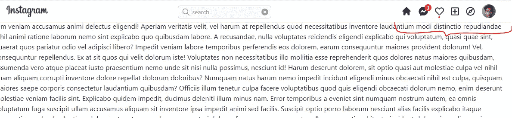

# React NextJS 创建 Instagram UI 克隆—标题和工具提示第 5 部分

> 原文：<https://medium.com/geekculture/react-nextjs-create-instagram-ui-clone-header-and-tooltip-part-5-6f098d22586b?source=collection_archive---------23----------------------->

## 第 5 部分用 Heroicon 和 FontAwesome 添加图标组

在这篇文章中，我们将添加图标组到标题。

