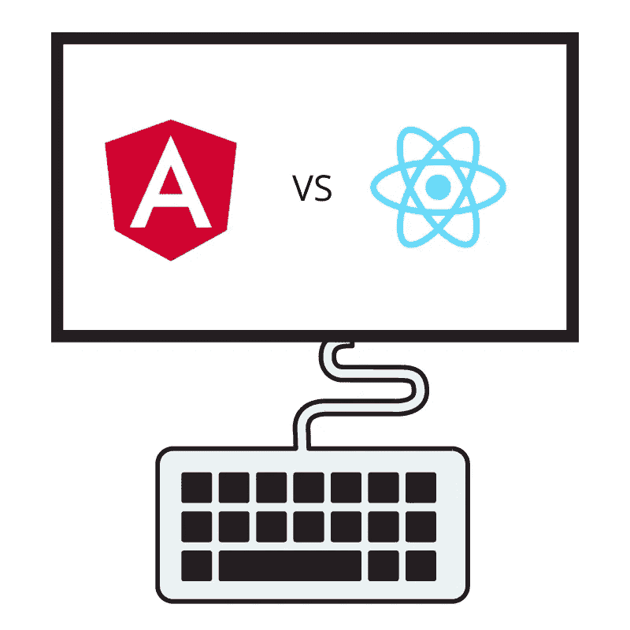
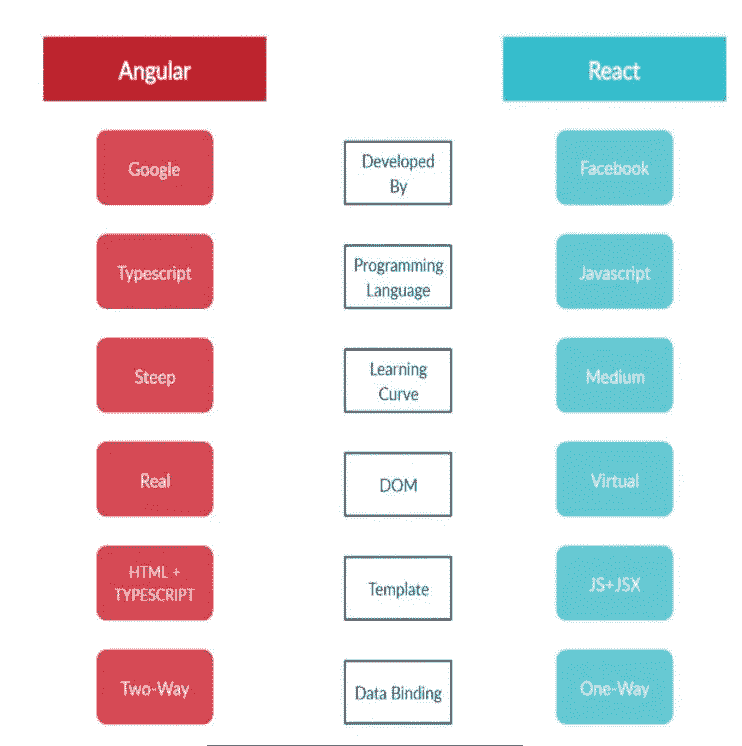

# 反应还是角度？未来的前沿

> 原文：<https://medium.com/geekculture/react-or-angular-the-frontend-for-the-future-ad233c580b4b?source=collection_archive---------12----------------------->

Angular VS React

有一个迫不及待想要设计、开发和部署的好主意？通过网络或移动应用程序给出你的想法当然是前进的方向，但是选择正确的框架的困境可能会让人非常恼火。毫无疑问，Angular 和 React 是市场上最热门的基于 JavaScript 的前端框架。那么，选哪个呢？

## 1.快速概述

由脸书开发和维护的， **React.js** 是一个基于 JavaScript 的流行库，它提供了构建和渲染网页组件的功能。创建React 应用程序通常需要使用额外的库来实现路由和状态管理等功能，从而为用户提供更大的灵活性。建议使用 JSX(JavaScript 的语法扩展)来实现更方便的 UI 设计过程。

**Angular** 是 Google 维护的一个框架。它建立在 Typescript 之上，而 Typescript 不过是 JavaScript 的一个子集。它集所有功能于一身，内置了路由、状态管理和表单验证工具。

A quick comparison

# 1.有角的

● **学习曲线:** Angular 的学习曲线最陡，因为它使用的是 TypeScript 而不是 JavaScript。模块、组件和语法与您熟悉的 JavaScript 完全不同。Angular 也没有像其他人一样充满活力的社区来支持。然而，它确实有许多内置特性，可以引导开发人员进入行业标准的编码模式。

● **单页申请(SPA):** 说到 SPA，球落在了 Angular 的球场上。单页面应用程序基于单个模板，由 JavaScript 控制视图。在与网页交互时，JavaScript 代码被相应地修改和呈现，而不是向服务器发送请求。
Angular 显然是为了建造水疗中心而建造的。凭借其内置的工具和服务，Angular 为水疗中心的快速发展提供了条件。

● **多页面应用程序(MPA):** 这些是向服务器发送请求并呈现所需页面的 HTML 的传统网站。这里，Angular 后退一步；
在像 MPA 这样的 HTML 驱动的应用程序中编译 TypeScript 会影响性能，并给开发人员带来复杂性，比如用 HTML 导入 Angular 包。

● **开发速度和灵活性:**如前所述，Angular 有内置的流程来快速生成工作应用程序。然而，这也影响了可定制性，因为您被限制于角度提供的组件。

● **DOM:** Angular 使用 real DOM，它采用了在每次修订时更新整个 HTML 树结构的技术。

● **数据绑定:**双向数据绑定；模型状态会随着用户界面的改变而自动改变，反之亦然。

**●使用单位:**谷歌、HBO、索尼、福布斯、通用汽车。

# 2.做出反应。射流研究…

● **学习曲线:** React 可以说拥有比 Angular 更温和的学习曲线。人们必须适应使用 JSX，一种 HTML 和 JavaScript 的混合语法。它有非常好的书面文档和大量的社区支持。

● **单页面应用程序(SPA):** 由于缺乏 Angular 标榜的内置工具，创建 SPA 并不像使用 Angular 那么容易，但也不会非常复杂。

**●多页面应用程序(MPA):** ReactJs 可以通过导入基于 JavaScript 的模块来创建复杂的网站，这些模块可以很容易地与页面的 HTML 集成。

● **开发速度和灵活性:**反应。Js 还提供了快速开发，Create-React-App CLI 提供了快速设置的工具。最重要的是，React 框架提供了选择开发工具、库和架构的自由，为高度可定制的应用铺平了道路。

● **DOM:** React 使用虚拟 DOM，这极大地提高了性能，因为可以跟踪和更新更改，而不会影响 HTML 树的其他部分。

● **数据绑定:**单向数据绑定；UI 更改只能在模型状态更改后实现。虽然这看起来很麻烦，但从长远来看，对于大型应用程序来说，保持一致性是有效的。

● **使用人:**脸书、Instagram、WhatsApp、优步、Airbnb、网飞、Dropbox

## 总之，

*   如果你有 Java，C#的经验，Angular 是一个不错的选择。应用程序的复杂性处于中低水平，如果您正在寻找现成的解决方案。
*   如果你精通 HTML、CSS 和 JavaScript，你正在寻找开发一个具有非通用功能或高度定制的应用程序。
*   如果您正在寻找可伸缩性，React 会支持您，在这种情况下，大量的组件以可变状态存在，如活动/非活动导航项目、动态输入、用户登录和访问权限，启用/禁用按钮将在多个应用程序之间共享。

感谢您的阅读！如果你喜欢这篇文章，请留下👏