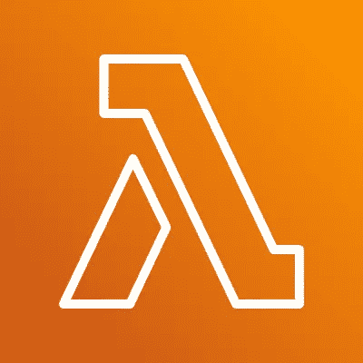
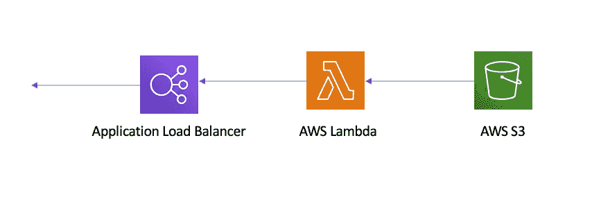
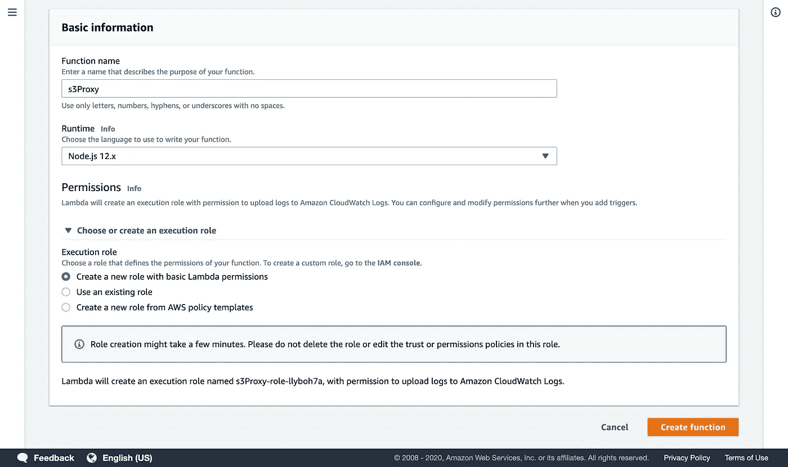
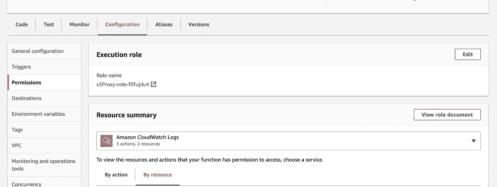
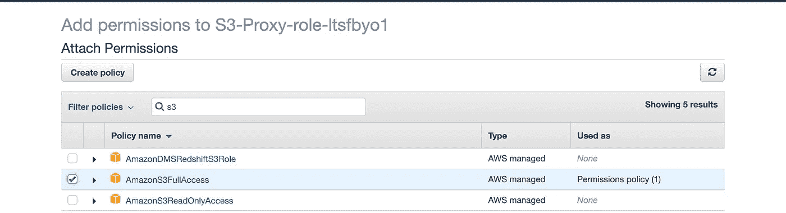
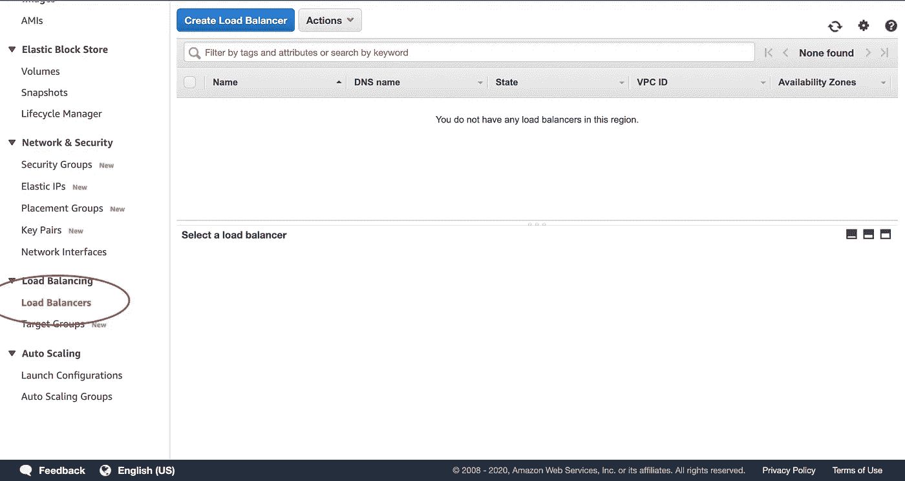
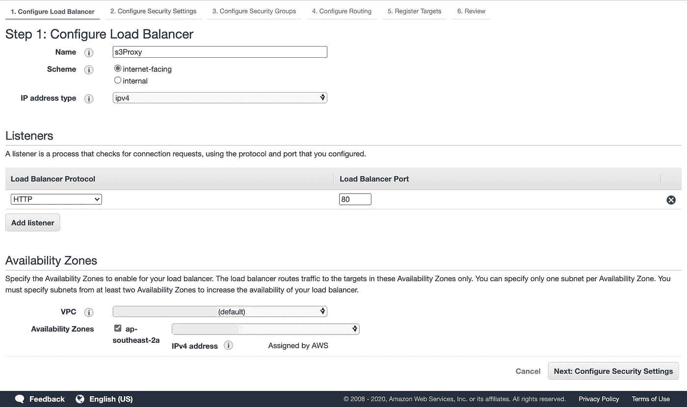
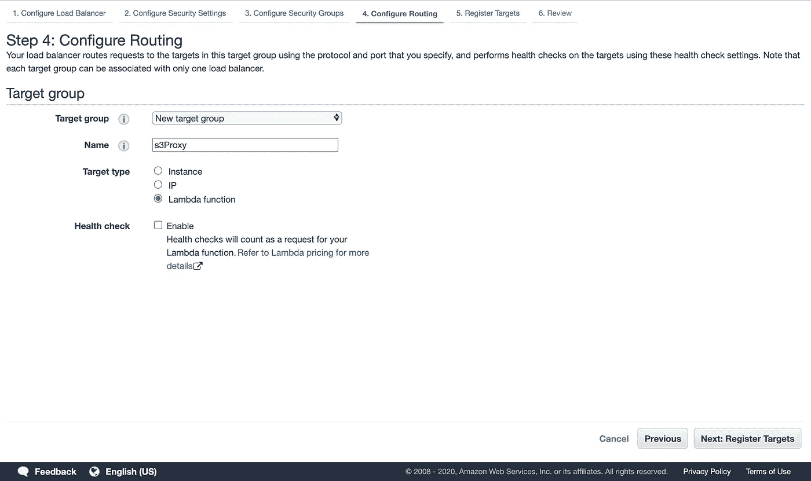
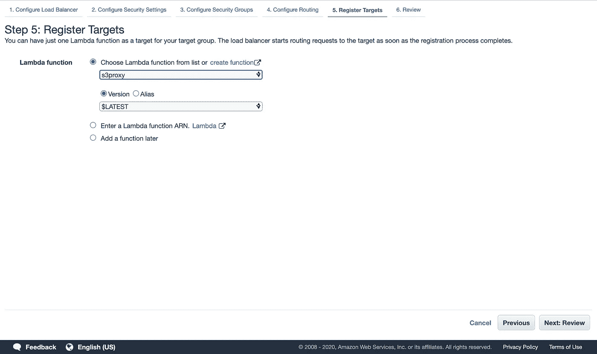

# 通过 Lambda 代理反应

> 原文：<https://medium.com/geekculture/react-proxied-via-lambda-785bf44a20b3?source=collection_archive---------15----------------------->



# 概观

React 与 Angular 和 Vue 等许多其他框架一样，似乎在为 web 开发的未来铺平道路。使用普通 CSS 的静态 HTML 的时代已经一去不复返了，取而代之的是在网站第一次加载时就加载整个网站。这增强了用户体验，实现了页面之间的快速转换，导入了覆盖大量前端难题的自定义库，并引入了复杂的逻辑。React 是令人兴奋的，它允许有框架经验的开发人员更容易地进行创新。

现在让我们假设你的好奇心达到了顶点，你已经制作了一个本地网站，并准备发布，那么下一步该怎么做呢？特别关注 React，该框架将创建应用程序的优化生产版本，通常调用 yarn build。然后你可以将它部署在各种网络托管服务上，比如 Github pages、Netlify 和 S3 等等。

所以你问的是什么问题。为什么要通过 Lambda 来代理它？嗯，你看，虽然 S3 是一个了不起的服务，它不是每个人的解决方案。可能有各种原因阻止它的使用，例如，拒绝在 S3 上托管内容，因为这要求 bucket 是公共的，而 CloudFront 可能不被允许，这需要一个替代的解决方案。

# 那么解决办法是什么呢？

在本文中，我将向您展示一种通过 AWS Lambda 服务托管 React 单页面应用程序的方法。我们将使用 S3、Lambda 和应用负载平衡器(ALB)这三种资源，通过 S3 为用户提供我们构建的 React 站点。



Basic Architectural Diagram

在研讨会结束时，我们的架构将是上面演示的架构。所以，事不宜迟，让我们开始吧！

# 第一步:创建-反应-应用

研讨会的第一步是创建一个 react 应用程序，并在本地测试它，以确保在部署它之前一切就绪。幸运的是，npx 提供了一个反应发生器。在执行以下命令之前，请确保进入工作目录:

```
npx create-react-app <REPLACE WITH PROJECT NAME>
```

随意给你的项目起任何名字，只要全是小写字母。

几分钟后，这个项目就可以用你提供的名字命名了。您可以使用在本地运行该应用程序。

```
cd <REPLACE WITH PROJECT NAME>
yarn start
```

这将在您的端口 3000 上启动一个本地服务器( [http://localhost:3000/](http://localhost:3000/) )。就这样，你有了一个运行的 React 应用程序。

# 步骤 2:配置 AWS 架构/环境

## S3

现在，您已经在本地测试了您的网站，现在让我们将它投入使用。我们将把它放在 S3 桶上。首先，我们需要创建一个存储桶，所以让我们从 cli 开始。

```
aws s3 mb s3://react-serverless-spa-site-<YOUR NAME HERE>
```

*   *注:把这里的<你的名字>换成你的名字。*
*   *您还需要将*[*aws CLI*](https://docs.aws.amazon.com/cli/latest/userguide/install-cliv2.html)*[](https://docs.aws.amazon.com/cli/latest/userguide/cli-chap-configure.html)**正确安装到您的 AWS 帐户。***

**既然我们已经建立了我们的桶，让我们建立和推动它。运行以下命令:**

```
**yarn build && aws s3 sync build/ s3://react-serverless-spa-site-<YOUR NAME HERE> --delete**
```

***注意:记住将<你的名字替换为你的名字。***

**一旦终端结束其操作，您现在应该能够找到您的 React 构建包，它被上传到您刚刚创建的 bucket 中。**

## **希腊字母的第 11 个**

**接下来，我们将在 Lambda 上设置我们的后端。我们的目标是创建一个函数，将代码推送到这个函数，它将指向并服务于我们的 S3 桶的内容。为此，让我们跳到 AWS 控制台。**

**在 AWS 吊顶上导航至**λ>创建功能。****

****

**Create Lambda**

**将项目配置为使用您选择的函数名运行 Node.js。**

**一旦创建了函数，我们就可以注入代码了。复制下面的代码并将其粘贴到新创建的函数 index.js 中。**

****确保在第 4 行添加您的存储桶名称。***

```
**const AWS = require('aws-sdk');const s3 = new AWS.S3();
const bucketName = "<REPLACE WITH YOUR BUCKET NAME>"exports.handler = async (event) => {
    try {
        let params;
        if (event.path === '/') {
            params = {
                Bucket: bucketName,
                Key: 'index.html'
            }
         } else {
            params = {
                Bucket: bucketName,
                Key: event.path.substring(1)
            }
         }
        let data = await s3.getObject(params).promise()
        return {
            statusCode: 200,
            headers: {'Content-Type': data.ContentType},
            body: data.Body.toString()
        };
    } catch (err) {
        if (err.code === 'NoSuchKey') {
            let param;
            param = {
                Bucket: bucketName,
                Key: 'index.html'
                }
            let data = await s3.getObject(param).promise()
            return {
                statusCode: 200,
                headers: {'Content-Type': data.ContentType},
                body: data.Body.toString()
            };        
        }
    }
};**
```

**一旦你粘贴了代码，确保**部署**你的函数。**

**太棒了，你现在有一个后端设置。使我们的 Lambda 完全起作用的最后一步是给我们的 Lambda 读权限给 S3 服务。为此，我们需要找到 Lambda 的执行角色。**

**你可以在 Lambda 函数的**权限**标签下找到这个。**

****

**单击角色名称，这会将您重定向到 **IAM 服务**。**

**您将看到唯一附加的策略应该是 Lambda 基本执行。单击蓝色的 **Attach policies** 按钮，您可以选择将许多 AWS 的托管策略添加到您的执行角色中。**

****

**在过滤器中搜索 S3，然后选择 AmazonS3FullAccess。附加策略。**

**现在你已经设置好了你的后端，是时候公开它了。**

## **应用负载平衡器**

**最后一步是通过 http 向客户端公开您的后端。为此，我们将使用应用程序负载平衡器，但是您也可以在此步骤中使用 API Gateway。**

**要创建负载平衡器，我们需要在 AWS 控制台中导航到 EC2 服务。在左侧菜单中，靠近底部是负载平衡器的位置。**

****

**选择**创建负载平衡器**后，您应该选择应用程序负载平衡器选项，并填写界面以匹配下图。您可以随意命名负载平衡器，但要确保它是面向互联网的，侦听器是 HTTP，并将其添加到您的默认 VPC 中，同时选择所有子网。**

****

**对于步骤 3，选择创建新的安全组，除非您已经有一个允许端口 80 入站的现有安全组，否则您可以使用该组。**

****

**为了配置路由，我们将创建一个新的目标组，并指定目标为 Lambda。**

****

**在目标注册页面上，会询问我们希望 ALB 指向哪个 Lambda。在这里，我们将从下拉菜单中选择我们之前创建的功能。**

**在审查页面上，确保一切都在检查中，如果是这样，然后**创建。****

# **完成的**

**这就是了。如果你现在转到你的负载均衡器，将 DNS 粘贴到你的浏览器中，你的站点应该会呈现出来。**

**您的负载平衡器可能需要一些时间来调配，所以请稍等片刻，然后再次尝试 DNS。**

## **承认**

**这要归功于[保罗·库基尔](https://medium.com/u/5a57ccca3a9?source=post_page-----785bf44a20b3--------------------------------)，他提出了这个方法的基本单元。他在这种方法上的工作证明了通过 Lambda 代理呈现内容是可能的，这为我在 React 应用程序上进行构建奠定了基础。**