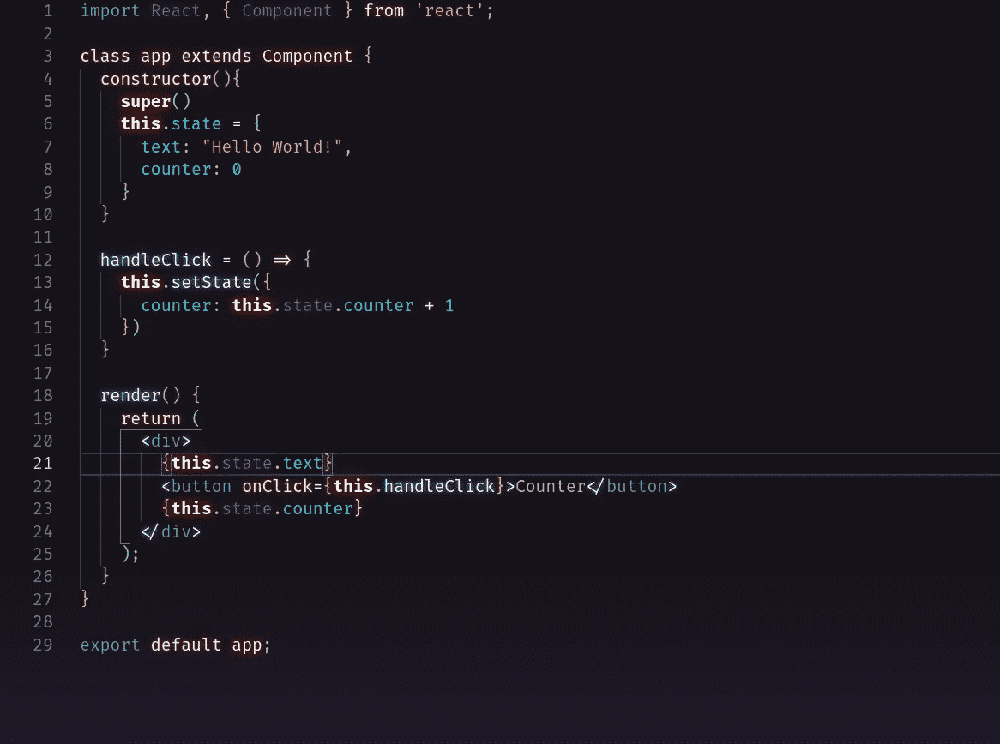
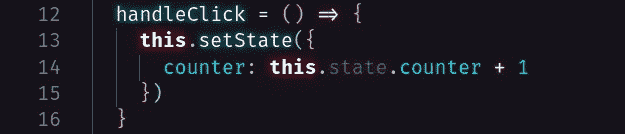
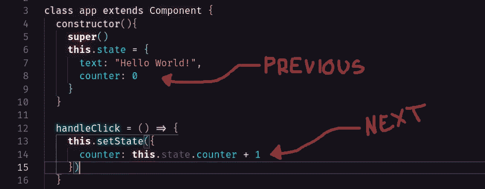

# React setState()以及为什么状态不应该直接变异

> 原文：<https://medium.com/geekculture/react-setstate-and-why-state-should-not-be-mutated-directly-8a4e15b0449e?source=collection_archive---------4----------------------->

如果您正在 React 中使用类组件，很可能您想要访问*状态*。使用钩子可以在功能组件中使用*状态*，但是这里我们将更仔细地看看类组件中的 setState 函数。

React 类组件提供 setState 函数，该函数在被调用时将更新*状态*，并告诉 react 重新渲染组件以及所有子组件。这在使用事件处理程序时非常方便。

那么，为什么我们使用 setState 而不是直接改变状态呢？好吧，React 保留了前一个状态的副本，并把它作为一个参考点。当我们使用 setState 时，它会在系统内存中创建一个新项目…一个与原始项目截然不同的项目…现在，React 能够根据之前的状态来区分哪些项目需要重新渲染。

如果我们直接改变状态，不仅会失去这个功能，而且因为没有参考点，添加或更改现有元素的值仍然会等于它以前的状态。

我们能从中得到什么？这很简单。不要直接改变状态。