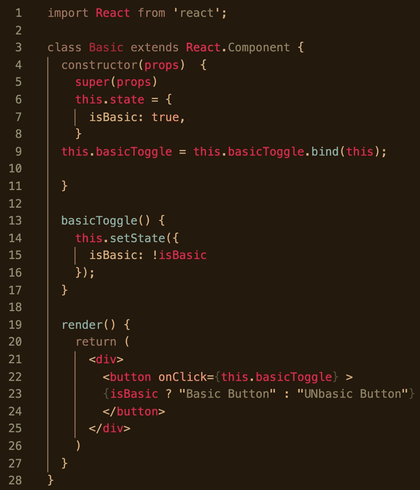
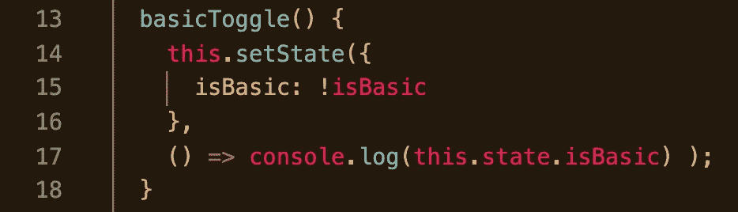

# React setState 及其异步特性

> 原文：<https://medium.com/geekculture/react-setstate-its-async-nature-bc6bcd78eebd?source=collection_archive---------45----------------------->

您还记得 React 中 setState 的第二个可选参数是什么吗？它的目的是什么？如果你和我一样，在我第一次学习的时候，第二个参数没有进入本地存储。在用 React 构建了更多之后，很明显第二个论点实际上值得关注一段时间。

对于任何新开发人员来说，将 React 组件理解为具有自上而下级联数据流的树就足够了。随着您继续构建，一些意想不到的结果可能会突然出现，这可能会让您抓耳挠腮，考虑更多正在发生的细微差别。

一个这样的“陷阱”与 setState 函数和意外地在您的逻辑中使用不同于您打算使用的状态版本有关。关于在 React *类组件*中设置和更新状态的最初要点可以被编译为以下两个主要概念:

1.  **我只能在构造函数**中直接设置状态*(通过将 this.state 声明为一个 POJO，我可以向其提供现在组成所述状态的键和值)。*
2.  **此后，每当我想要更新状态时，我都需要使用 setState** (以类似的方式向构造函数提供更改——指定我想要用一些相应的更新值来更新状态的哪一部分)。

在这个基本代码片段中，state 是在构造函数的第 6–8 行中直接*设置的*，并且将通过第 13–15 行中的函数进行更新，该函数在单击时执行，并使用预期的下一个状态调用 setState。虽然这两个主要思想是在组件中设置和更新本地状态的基础，但第三点 setState 是异步操作的——也是尽早理解的最重要的一点。UI 在给定时刻显示的状态版本实际上是异步确定的—*—*,开发人员应该考虑到这种“不会恰好在那个时刻发生”的性质。

如 React 文档中所述:

> *“当您使用 React 时，在一个时间点上，您可以将 render()函数视为创建 React 元素树。在下一次状态或 props 更新时，render()函数将返回一个不同的 React 元素树。React 然后需要找出如何有效地更新 UI 以匹配最新的树。”*

那么当你调用 setState 时会发生什么呢？一旦在 React 中调用 setState，您传递给 setState *的对象就会合并到组件的当前状态*中。这就开始了一个叫做 [**和解**](https://reactjs.org/docs/reconciliation.html) **的过程。**在不深入研究这种不同算法的情况下，重要的一点是，尽管 React 正在协调两棵树中的差异，但对于开发人员在下一行编码的“下一状态”相关结果来说，即使是这一操作的闪电般速度(O(n))也可能太慢，无法生效并实际产生他们预期的结果。

如果我们在前面代码片段的第 16 行 setState 调用之后插入一个**console . log(this . state . is basic)**，那么将要记录到控制台的很可能是前一个状态，而不是下一个状态。UI 将快速改变，并相应地切换按钮的文本以反映下一个状态。但是，console.log 语句的执行速度会更快，并且会在状态更新之前打印出来，记录与您将要看到的状态相反的状态。(见下文)。

Logic executed right after a setState call may lead to unpredictable results.

想象一下，一辆汽车在一条单车道高速公路的左侧车道上超车，距离他们仅几英尺。该事件期望以如下方式展开:经过的车辆越过足够的安全间隙(任务一完成)，然后车辆显著加速以通过(任务二)。在第一个安全任务完成之前，驾驶员不会真的想要踩油门。否则，任务二的加速将会带给你一个与预期截然不同的结果——也就是一场意外！我们希望在 React 的更新过程中避免这种类型的时间冲突，这样我们就不会以这些事故——也就是 bugs 而告终。

让我们正式修正一下关于 setState 的第三个要点:

3

继续我们的基本例子，如果你通过一个箭头函数作为 setState 的第二个参数来记录状态，你将*总是*在你的控制台中看到更新的状态。(见下文)。

This console.log will always reflect the state that was just updated by setState.

当将 AJAX 请求或 redux thunks 等异步操作合并到旨在更新状态的代码中，然后相应地使用它时，了解这个选项是很有用的。当只是想按顺序执行逻辑时，比如在 setState 调用之后立即调用行中的任何旧函数，并期望它使用该函数中已经更新的状态，这种缺陷甚至会发生。例如，已经更新的状态可能不存在。任何在状态更新后发生的动作，利用更新后的状态，最好作为 setState 的第二个参数。

这个 bug 可能以比本文所涵盖的更复杂的方式出现。了解 setState 的异步性，但不保证返回到您的口袋中，一旦您知道要寻找什么，就可以加快您的调试时间。在调用 setState 之后，我试图在一个函数调用中从 DOM 中抓取一个图像，期望 setState 之后的函数返回的保存的图像反映状态更新时，我遇到了丰富 setState 理解的需要。将该逻辑放在 setState 中是可选的第二个参数带来的轻松解决方案。

和往常一样，在 React 文档中有清晰的例子和简洁的解释。我希望 setState 的第二个参数能被看到，并且您永远不会忘记它是您的状态更新逻辑安全性的一个选项！