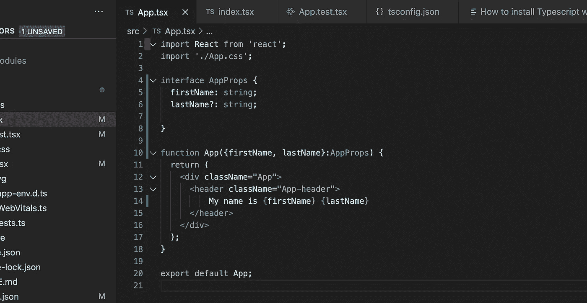

# React -TypeScript —如何用功能组件类型的 props 添加接口入门指南:)

> 原文：<https://medium.com/geekculture/react-typescript-how-to-add-interface-with-functional-component-typed-props-beginner-guide-4710d89f8881?source=collection_archive---------1----------------------->

# 在这篇文章中，我将讨论如何添加接口与功能组件类型的道具初学者指南:)

**在我们开始之前，请找出以下重要技术的定义**