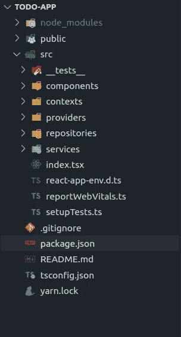
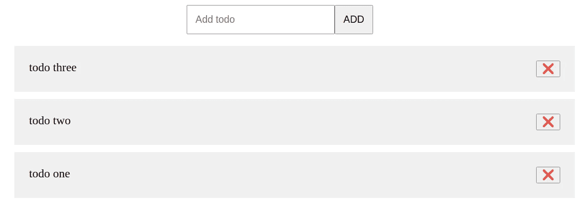

# 反应——分离、注入和逆转依赖关系

> 原文：<https://medium.com/geekculture/react-uncouples-injects-and-reverses-dependencies-2103cfd0341f?source=collection_archive---------23----------------------->


其思想是使用上下文、服务和存储库，对 react 中的依赖性进行解耦、注入和反转。

(西班牙语)这一概念是对反应、使用、服务和储存的依赖的发展和变化。

# 我们走吧！

创建项目

```
yarn create react-app todo-app --template typescript
yarn add styled-components  @types/styled-components
```

清理和创建文件夹:

src/服务，src/存储库，src/上下文，src/提供者，src/组件，src/__ 测试 _ _



## 创建存储库和服务

src/repositories/todo . repository . ts

```
abstract class TodoRepository {
  abstract add(todo: string): void;
  abstract getAll(): string[];
  abstract delete(todo: string): void;

  protected validateExistTodo(todos: string[], todo: string): boolean {
    const tempTodos = todos.map((todo) => todo.toLocaleLowerCase());
    return tempTodos.includes(todo.toLocaleLowerCase());
  }
}

export default TodoRepository; 
```

src/repositories/todoinmemory . repository . ts

```
import TodoRepository from "./todo.repository";

class TodoInMemoryRepository extends TodoRepository {
  private todos: string[] = [];

  public add(todo: string) {
    if (!this.validateExistTodo(this.todos, todo)) {
      this.todos.unshift(todo);
    }
  }

  public delete(todo: string) {
    if (this.validateExistTodo(this.todos, todo)) {
      this.todos = this.todos.filter(
        (_todo) => _todo.toLocaleLowerCase() !== todo.toLocaleLowerCase()
      );
    }
  }

  public getAll(): string[] {
    return this.todos;
  }
}

export default TodoInMemoryRepository; 
```

src/repositories/todoinlocalstorage . repository . ts

```
import TodoRepository from "./todo.repository";

class TodoInLocalStorageRepository extends TodoRepository {
  private todos: string[] = [];
  private key: string = "todos";

  public constructor() {
    super();
    this.getFromLocalStorage();
  }

  private getFromLocalStorage() {
    const tempTodos = window.localStorage.getItem(this.key);
    this.todos = tempTodos === null ? [] : JSON.parse(tempTodos);
  }

  private insertToLocalStorage() {
    window.localStorage.setItem(this.key, JSON.stringify(this.todos));
  }

  public add(todo: string) {
    if (!this.validateExistTodo(this.todos, todo)) {
      this.todos.unshift(todo);
      this.insertToLocalStorage();
    }
  }

  public delete(todo: string) {
    if (this.validateExistTodo(this.todos, todo)) {
      this.todos = this.todos.filter(
        (_todo) => _todo.toLocaleLowerCase() !== todo.toLocaleLowerCase()
      );
      this.insertToLocalStorage();
    }
  }

  public getAll(): string[] {
    return this.todos;
  }
}

export default TodoInLocalStorageRepository; 
```

src/services/todo.service.ts

```
import TodoRepository from "../repositories/todo.repository";

class TodoService {
  private repository: TodoRepository;
  public constructor(repository: TodoRepository) {
    this.repository = repository;
  }
  public getAll(): string[] {
    return this.repository.getAll();
  }
  public add(todo: string): void {
    this.repository.add(todo);
  }
  public delete(todo: string): void {
    this.repository.delete(todo);
  }
}

export default TodoService; 
```

请注意，在构造中，我们注入了抽象存储库，而不是实现。

## 创建上下文

src/contexts/todos.context.ts

```
import { createContext } from "react";

type TypeTodosContext = {
  todos: string[];
  add: (todo: string) => void;
  delete: (todo: string) => void;
};

const InitialTodosContext: TypeTodosContext = {
  todos: [],
  add: () => {},
  delete: () => {},
};

const TodosContext = createContext<TypeTodosContext>(InitialTodosContext);

export default TodosContext; 
```

## 编写组件

Todo.tsx

```
import React, { useContext } from "react";
import styled from "styled-components";
import TodosContext from "../contexts/todos.context";

const TodoContainer = styled.div`
  display: flex;
  justify-content: space-between;
  padding: 20px;
  background-color: #f0f0f0;
  margin: 10px 0;
`;
type TodoProps = {
  name: string;
};
const Todo: React.FC<TodoProps> = ({ name }): JSX.Element => {
  const ctx = useContext(TodosContext);
  const handlerClick = () => {
    ctx.delete(name);
  };
  return (
    <TodoContainer>
      <span>{name}</span>
      <button onClick={handlerClick}>❌</button>
    </TodoContainer>
  );
};

export default Todo; 
```

TodoList.tsx

```
import React, { useContext } from "react";
import styled from "styled-components";
import TodosContext from "../contexts/todos.context";
import Todo from "./Todo";

const Ul = styled.ul`
  list-style: none;
`;
const TodoList: React.FC = (): JSX.Element => {
  const { todos } = useContext(TodosContext);
  return (
    <Ul>
      {todos.map((todo: string, index: number) => (
        <li key={index}>
          <Todo name={todo} />
        </li>
      ))}
    </Ul>
  );
};

export default TodoList; 
```

TodoForm.tsx

```
import React, { SyntheticEvent, useContext, useRef } from "react";
import styled from "styled-components";
import TodosContext from "../contexts/todos.context";

const Form = styled.form`
  display: flex;
  justify-content: center;
`;
const Input = styled.input`
  padding: 10px;
  &[type="submit"] {
    cursor: pointer;
  }
`;
const TodoForm = (): JSX.Element => {
  const inputText = useRef<HTMLInputElement>(null);
  const { add } = useContext(TodosContext);
  const handleSubmit = (event: SyntheticEvent<HTMLFormElement>) => {
    event.preventDefault();
    if (inputText.current !== null) {
      add(inputText.current.value || "");
      inputText.current.value = "";
    }
  };
  return (
    <Form onSubmit={handleSubmit}>
      <Input
        ref={inputText}
        type="text"
        name="todo"
        placeholder="Add todo"
        required
      />
      <Input type="submit" value="ADD" />
    </Form>
  );
};

export default TodoForm; 
```

TodoApp.tsx

```
import React from "react";
import styled from "styled-components";
import TodoForm from "./TodoForm";
import TodoList from "./TodoList";

const Div = styled.div`
  max-width: 800px;
  margin: 0 auto;
`;
const TodoApp = (): JSX.Element => {
  return (
    <Div>
      <TodoForm />
      <TodoList />
    </Div>
  );
};

export default TodoApp; 
```

好了，我们有了所有的组件，现在我们编写注入服务的提供者、存储库，并为上下文定义处理程序。

## 写提供者

src/provides/todos . provider . tsx

```
import React, { ReactNode, useEffect, useState } from "react";
import TodosContext from "../contexts/todos.context";
import TodoService from "../services/todo.service";

type TypeTodoProvider = {
  service: TodoService;
  children?: ReactNode;
};
const TodosProvider: React.FC<TypeTodoProvider> = ({
  service,
  children,
}): JSX.Element => {
  const [todos, setTodos] = useState<string[]>([]);

  useEffect(() => {
    getAll();
    // eslint-disable-next-line react-hooks/exhaustive-deps
  }, []);

  const getAll = (): void => {
    setTodos([...service.getAll()]);
  };
  const add = (todo: string): void => {
    service.add(todo);
    getAll();
  };

  const _delete = (todo: string): void => {
    service.delete(todo);
    getAll();
  };

  const contextValue = {
    todos,
    add,
    delete: _delete,
  };
  return (
    <TodosContext.Provider value={contextValue}>
      {children}
    </TodosContext.Provider>
  );
};

export default TodosProvider; 
```

这就是全部，转到 index.tsx 并在提供者内部调用您的应用程序

```
import React from "react";
import ReactDOM from "react-dom";
import TodoApp from "./components/TodoApp";
import TodosProvider from "./providers/todos.provider";
import reportWebVitals from "./reportWebVitals";
import TodoInMemoryRepository from "./repositories/todoInMemory.repository";
import TodoService from "./services/todo.service";const repository = new TodoInMemoryRepository();
const todoService = new TodoService(repository);ReactDOM.render(
  <React.StrictMode>
    <TodosProvider service={todoService}>
      <TodoApp />
    </TodosProvider>
  </React.StrictMode>,
  document.getElementById("root")
);

// If you want to start measuring performance in your app, pass a function
// to log results (for example: reportWebVitals(console.log))
// or send to an analytics endpoint. Learn more: https://bit.ly/CRA-vitals
reportWebVitals();
```

看看我们是如何定义服务并通过 props 传递给提供者的，服务需要一个存储库，但这可能有多个与服务无关的实现。

如果我们改变了存储库，我们不会遭受代码的改变。

测试它:

```
*const repository = new TodoInLocalStorageRepository()*;*const todoService = new TodoService(repository)*;
```

是啊，所有作品！。



现在可以运行本地存储和内存数据测试的应用程序，没有额外的代码或问题。

编写一个测试:

```
import React from "react";
import { render, screen, fireEvent } from "@testing-library/react";
import TodoService from "../services/todo.service";
import TodoApp from "../components/TodoApp";
import TodosProvider from "../providers/todos.provider";
import TodoInMemoryRepository from "../repositories/todoInMemory.repository";

const renderApp = (service: TodoService) => {
  return render(
    <TodosProvider service={service}>
      <TodoApp />
    </TodosProvider>
  );
};

test("should add todo in todo app", () => {
  const repository = new TodoInMemoryRepository();
  const service = new TodoService(repository);
  const { container } = renderApp(service);
  const textInput = screen.getByPlaceholderText(/add todo/i);
  const button = container.querySelectorAll("input[type=submit]")[0];
  const todo = "test me";
  fireEvent.change(textInput, { target: { value: todo } });
  fireEvent.click(button);
  expect(screen.getByText(todo)).toBeInTheDocument();
}); 
```

[- > Github 代码](https://github.com/hcastillaq/react-injection-reverses-dependencies)