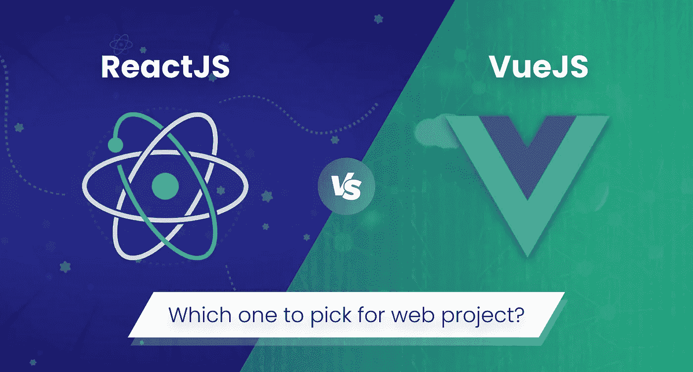
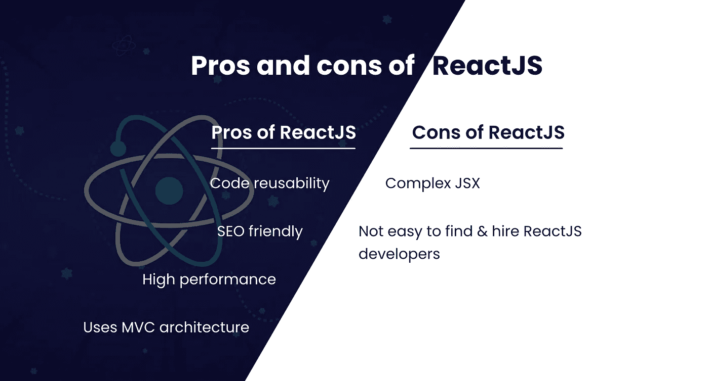
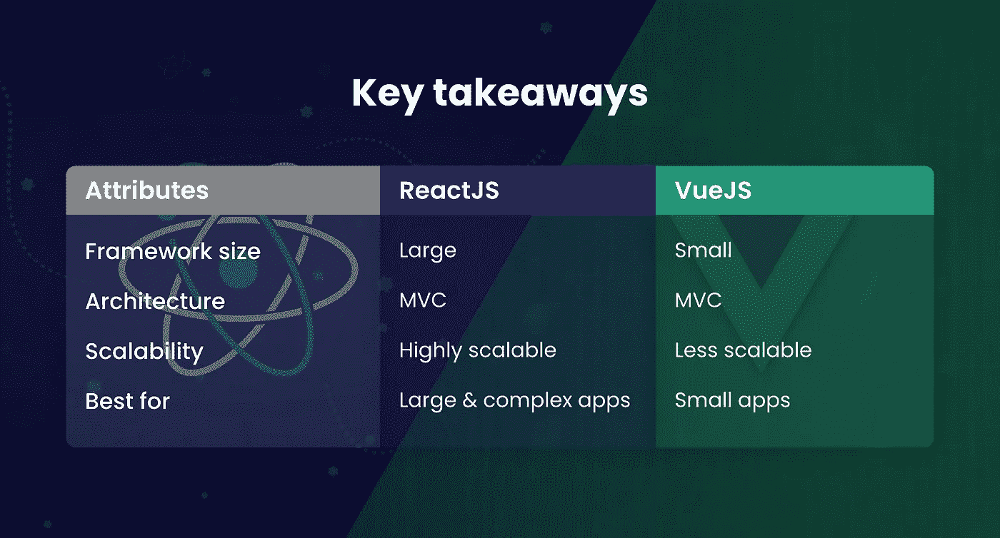

# react vs vue . js:Web 项目选哪个？

> 原文：<https://medium.com/geekculture/react-vs-vue-js-which-one-to-pick-for-a-web-project-436eb4ada9ed?source=collection_archive---------3----------------------->

## 探索 React 和 Vue.js 的优缺点，了解它们的主要区别，以帮助您为您的 web 项目选择一个。

React 和 Vue.js 是目前 web 应用程序开发中最受欢迎和最常用的两个 JavaScript 框架。借助这些框架，开发人员可以构建几种不同的 JavaScript web 应用程序。

如果你想开发一个网络应用，很难在两者之间做出选择。每一个都满足不同的业务需求，并有其独特的用例。

众所周知的 web 框架 Vue.js 和 React 各有优缺点。为了帮助您选择使用哪种技术进行 web 应用程序开发，我们将从简要描述这两种技术的背景开始。接下来，我们将并排比较这两种技术。

所以，事不宜迟，让我们开始吧！

# 什么是反应？

名为 React 的 JavaScript 库使您能够构建健壮的用户界面。React 允许您用“基于组件的架构”构建复杂的用户界面这表明应用程序的构建块是可重用的小代码片段，称为组件。

声明式编程和基于组件的方法都是 React 中使用的方法。它为开发复杂的 web 应用程序提供了最大的灵活性和速度。

在 **2021** 年最流行的 web 框架是 React，它被全球所有软件开发者的 [**40.14%**](https://www.statista.com/statistics/1124699/worldwide-developer-survey-most-used-frameworks-web/#:~:text=React.,34.43%20percent%20were%20using%20jQuery.) 使用。

接下来，我们来谈谈 React 的利与弊。

# 反应的利与弊

首先，我们来讨论一下:

## React 的优点

*   代码可重用性
*   搜索引擎友好
*   高性能
*   使用 MVC 架构

## 反应的缺点

*   复杂的 JSX
*   不容易找到和雇用反应开发者

这就是 React 的优点和缺点。现在，让我们来看看哪些顶级公司使用 React。

# 使用 React 的顶级公司

*   爱彼迎（美国短租平台）
*   网飞
*   脸谱网
*   照片墙
*   微软

如果你想开发一个流畅的应用程序，并给你的想法一些指导，那么你可以马上在印度雇佣 React 开发者。

继续，我们来谈谈 Vue.js 是什么。

# Vue.js 是什么？

一个用于开发 SPA 的开源 JavaScript 框架被命名为 Vue.js。它被用作 web 应用程序的框架，旨在简化 web 应用程序开发项目。为了创建令人难以置信的 web 应用程序，Vue.js 应用程序开发吸引了全世界开发人员的极大兴趣。Vue.js 使用虚拟 DOM，它也提供双向数据绑定。由于这种趋势科技的各种功能，你可以从印度雇佣开发人员来快速构建你的想法。

接下来，我们来谈谈 Vue.js 的优缺点

# VueJS 的利与弊

首先，让我们讨论一下，

## VueJS 的优点

*   跨平台开发
*   灵活性
*   轻量级选手
*   适应性
*   直观且易于使用

## VueJS 的缺点

*   较少的通信支持
*   糟糕的文档
*   更少的开发者

这些就是 VueJS 的优点和缺点。现在，让我们检查一些，

# 使用 VueJS 的顶级公司

*   行为
*   运球
*   砖坯黏土
*   阿里巴巴
*   Gitlab

到目前为止，我们已经讨论了很多这两种技术！现在，我们来讨论这个博客的核心部分。也就是说，

# ReactJS vs VueJS:哪个最适合 web app 项目？

Vue 和 React 之间的性能和其他因素差别很大。在确定哪个 JavaScript 框架是最好的之前，我们将分别研究这些变量。

## #1.ReactJS 与 VueJS:性能

不可否认，因为它们都使用虚拟 DOM，Vue 和 React 技术提供了可比较的性能结果。然而，这并不意味着它们没有争议。例如，Vue 需要更少的开销，移动更快，并且更加注意缺陷。与其他两个框架类似，这个框架可以处理高帧速率——每秒 10 帧，而 React.js 每秒只有一帧。

## #2.ReactJS 与 VueJS:灵活性

由于将有更多的组件相互通信和交换数据，当应用程序扩展时，状态管理和数据流需要更多的考虑。

Reactjs 不提供状态管理；因此，React Redux 必须用作状态管理解决方案。另一个独立产品是 React 路由器。可以使用 Vuejs 的基础工具创建应用程序。此外，还提供了用于管理状态的 Vuex 和用于管理应用程序 URL 的 Vue 路由器。因此，Vue 是多功能的，是小型项目的理想选择。

## #3.ReactJS 与 VueJS:大小

在讨论 web 开发框架时，规模是至关重要的。它越重，移动得越慢。React 比 Vue.js 慢一点，因为它重一点。为了实现一些功能，React 需要一些其他的库。相比之下，Vue.js 包含大量内置功能，对于有经验和刚入门的 web 开发人员来说都很简单。

## #4.ReactJS vs VueJS:学习曲线

与 React 技术相比，Vue 提供了更难以置信的可定制性，并使事情更容易掌握和适应。另一方面，React 是一个 JavaScript 框架，它是开源的，需要很长时间来开发 web 应用程序。通过利用组件等特性，Vue.js 开发人员可以毫不费力地相互协作。然而，Vue 的简单性和适应性有一个缺点，因为它允许劣质代码，这对于调试和测试来说是一个挑战。

## #5.ReactJS 与 VueJS:开发速度

根据专家评论，ReactJS 和 Vue 的开发速度相同。它们都带有大量的框架、库和额外的包，使得快速构建 web 应用程序变得容易。但是，开发的速度是基于开发者的经验。Vue 和 ReactJs 的开发速度是一样的。

## #6.ReactJS vs VueJS:状态管理

当使用 React 和 Vue 等基于组件的框架时，随着应用程序的扩展，您应该更加关注数据流和状态管理。这是因为几个组件在交互和交换数据。作为这种情况下的独特解决方案，React 提供了 Flux/Redux 架构，它代表单向数据流，是众所周知的 MVC 架构的对手。当谈到 Vue.js 框架时，一个更复杂的设计称为 Vuex，它与 Vue 相连接，提供了无与伦比的体验。

## #7.ReactJS vs VueJS:数据绑定

Vue 使用双向数据绑定。这意味着，如果您更改了任何界面元素，您的模型状态也会立即调整。阅读它可以使它看起来简单明了。然而，对于一个大项目来说，情况并非如此。如果您想要数据的清晰图片和快速调试，React 的单向数据绑定可能是首选。React 然后在模型状态更新后呈现修改后的界面元素。

## #8.ReactJS 与 VueJS:模板

Vue 和 React 都采用非常不同的策略。虽然 React 更具功能性，但 Vue 采用了更具声明性的方法。因为标记和逻辑被视为一体，所以它们被组合在一起。JSX，React 的一个抽象，被用来实现它。使用 createElement 方法创建虚拟 DOM 实体。使用 Vue，模板和样式是分开处理的，这是一种更传统的方法。在这种情况下，模板被视为过时的 HTML 组件。

## 关键要点

# 结论

ReactJs 和 VueJs 都是同样有能力的框架，选择哪一个完全取决于项目的需求。如果你想用简单的开发创建一个大规模的应用程序，你可以雇佣印度的 react js 开发人员。另一方面，Vue。如果你想用最好的文档和简单的集成创建一个简单的应用程序，JS 是理想的选择。