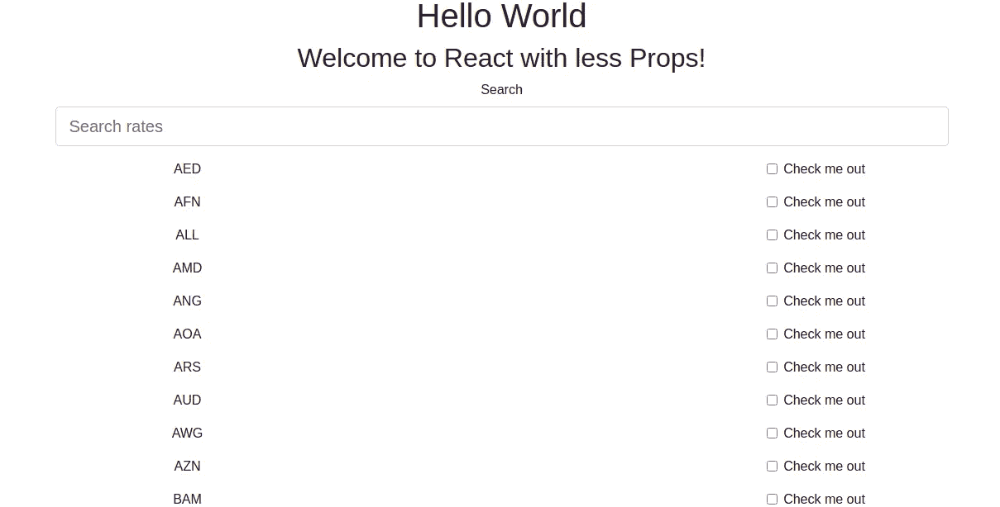
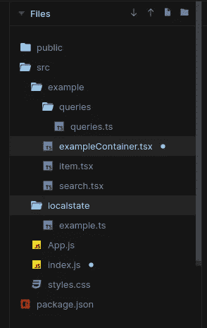

# 使用 Apollo 客户端 React 进行反应式状态管理

> 原文：<https://medium.com/geekculture/reactive-state-management-with-apollo-client-react-51c6467a8a49?source=collection_archive---------5----------------------->

**谁是观众？**

任何与 React 应用程序组件地狱和 prop drilling 作斗争的人都会发现这篇文章很有帮助。

**你应该事先知道什么？**

应该熟悉 **React** 和 **Redux** 或者 **Ngrx** 如果你来自一个棱角分明的背景。

**什么问题？**

Apollo 的状态管理有很多问题，angular 和 React 都有，感觉只是缓存 API 并不意味着你已经完成了状态管理。您应该能够使用任何状态管理库轻松地使用数据。Apollo 非常不擅长客户端状态管理。

**什么是客户端状态？**

数据并不存在于服务器上，只是在前端对视图进行操作时需要。

当你试图设置一个全局模式，并希望在某种情况下显示或隐藏它时，你不需要在服务器上保留这个标志，而是在客户端进行管理。

**阿波罗客户端无功 Var 来救援？**

如果你和阿波罗一起工作过，它说一切都是神奇的，相信我，它不是。如果你来自 Redux 背景，你已经可以理解我的意思了。

# 说教讲够了，让我们把手弄脏吧

让我们试着做一个货币搜索组件，我们可以通过名字的首字母来过滤货币。



文件夹结构



让我们看看示例容器

```
// inteligent container to do all the data interaction like a controllerimport React, { Fragment, useEffect } from "react";
import { Col, Container, Row } from "react-bootstrap";
import { exampleState } from "../localstate/example";
import { SearchExample } from "./search";
import { useApolloClient, useQuery, useReactiveVar } from "[@apollo/client](http://twitter.com/apollo/client)";
import { GET_RATES, GET_RATES_PLUS_CLIENT } from "./queries/queries";
import { Item } from "./item";export function ExampleContainer(props) {
  const state = useReactiveVar(exampleState);const client = useApolloClient();const { loading, error, data } = useQuery(GET_RATES);useEffect(() => {
    console.log(state, " state changed");client.query({ query: GET_RATES_PLUS_CLIENT }).then((data) => {
      console.log(data, " got this data using query");
    });
  }, [state.searchString]);if (loading) return <p> loading</p>;
  if (error) return <p> error</p>;return (
    <Fragment>
      <Container>
        <Row>
          <Col xs={12}>
            {state.searchString}
            <SearchExample />
          </Col>
        </Row>
        <Row>
          {data.rates
            .filter((f) =>
              f.currency.includes(state.searchString.toUpperCase())
            )
            .map((item) => {
              return <Item currency={item.currency} />;
            })}
        </Row>
      </Container>
    </Fragment>
  );
}
```

如果你仔细看看上面的组件，你会发现传递的道具更少了，我们使用的是一个来自 Apollo 客户端的反应式 Var 来在组件之间共享客户端状态。

所以不再打电话回地狱了。

**让我们看看客户端反应文件**

```
import { makeVar } from "[@apollo/client](http://twitter.com/apollo/client)";// shape of your local state
export interface ExampleState {
  searchString: string;
  items: Number[];
  orgid: Number;
  SelectAll: Boolean;
}const initialState = {
  searchString: "",
  items: [],
  orgid: null,
  SelectAll: false
};export const exampleState = makeVar<ExampleState>(initialState);
```

我知道你在想什么，它看起来像一个行为主题，它非常相似，它是基于禅宗观察，Rxjs 的小兄弟。

如何消耗无功 Var，阿波罗给你 **useReactiveVar 钩子**

```
const state = useReactiveVar(exampleState);
```

现在，任何具有这种状态的组件都可以很容易地监听状态的变化，并产生效果。

我们的容器组件可以监听搜索字符串的变化，并过滤货币列表

```
useEffect(() => {
    console.log(state, " state changed");client.query({ query: GET_RATES_PLUS_CLIENT }).then((data) => {
      console.log(data, " got this data suing query");
    });
  }, [state.searchString]);
```

对 **state.searchString** 的任何改变都将触发新的搜索。

就这样没有回调，快乐编码。可以在查看工作示例

[**此处**](https://codesandbox.io/s/cranky-pascal-d98jq)

如果你喜欢这个例子，请鼓掌:)