# ReactJS:为什么索引作为键是一种反模式

> 原文：<https://medium.com/geekculture/reactjs-why-index-as-a-key-is-an-anti-pattern-4b9dc6ef0067?source=collection_archive---------6----------------------->

让我们试着理解为什么它很重要，每个人都需要花一些时间来深入理解 React 如何利用幕后的组件密钥以及围绕这一概念的主要思想。

**钥匙的作用是什么？**

让我们回想一下，在任何状态变化期间，React 都会构建虚拟 DOM 树的新状态，并将其与之前的状态进行比较，并定义一组最佳操作，这些操作应该应用于真实浏览器 DOM(图 1)以进行新的转换。React 将虚拟 DOM 与一种特殊的[协调算法](https://reactjs.org/docs/reconciliation.html)进行比较。

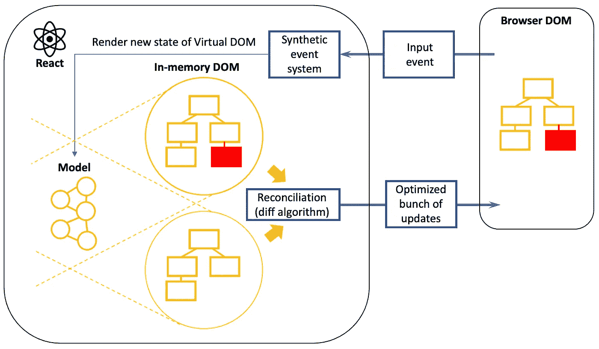

Figure 1 — React workflow

模型(图 1)是一个由 [React 元素](https://reactjs.org/blog/2015/12/18/react-components-elements-and-instances.html#elements-describe-the-tree)组成的树，每个 React 元素都有一个类型。它可以是字符串、反应组件或反应函数。图 2 中提供了 React 模型的示例。

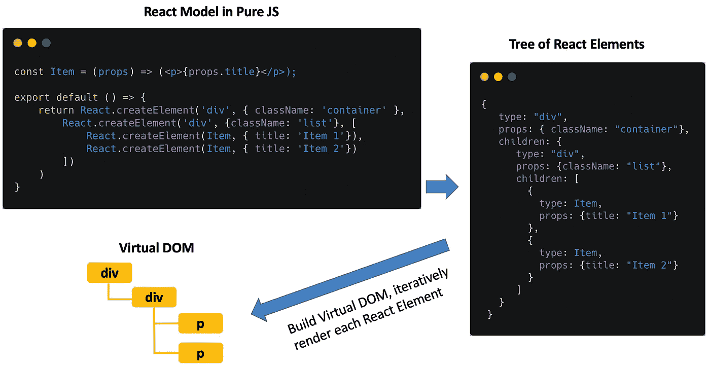

Figure 2 — React Elements

我有意使用纯 JS 来代替 JSX 语法，但是使用 JSX 语法的同一个模型看起来是这样的(图 3):

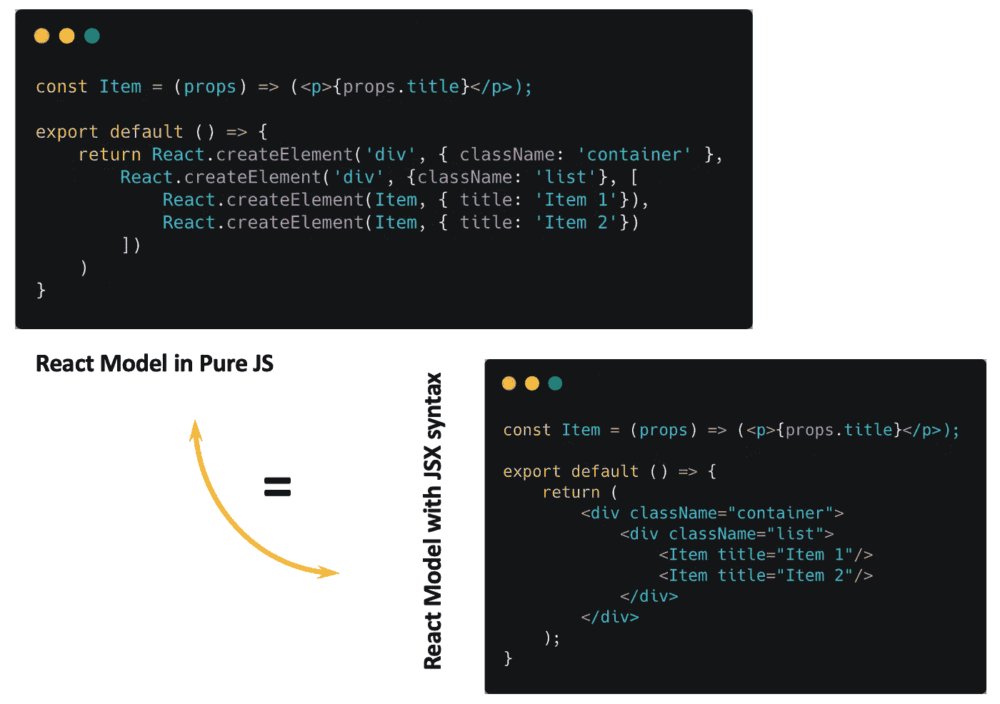

Figure 3 — React model with Pure JS and JSX syntax

*协调算法*根据类型比较每个 React 元素。当我们需要呈现一个由 *N* 个同质 React 元素组成的列表时，困难就出现了，在我们的例子中，我们呈现了两个类型为 *Item* 的 React 元素。

让我们想象一下，在应用程序初始化期间，我们需要显示三个项目。用户正在删除索引为 0 的第一个项目(图 4)。

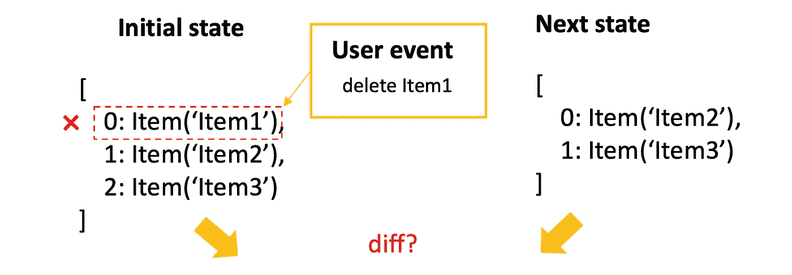

Figure 4 — Transition between states after deleting the first item in the list

由于所有 React 元素都具有相同的类型，React 无法理解我们的意图。在这种情况下，它会逐个比较每个项目(图 5)。

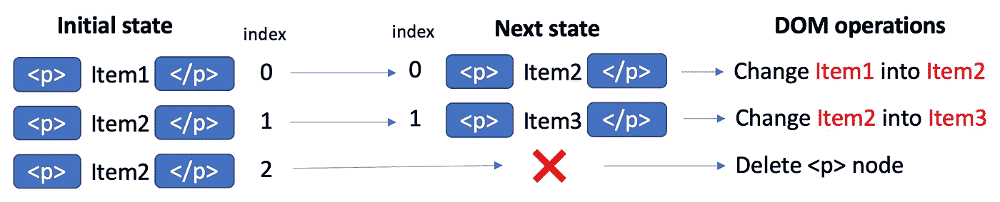

Figure 5 — Defining DOM operations for transition

这里我们看到，React 定义了 3 种针对真实 DOM 的操作。我们可以认为这是一个优化的吗？肯定不是。在这种情况下，只有一个操作就足够了——我们只需要从 DOM 中删除第一个节点。钥匙在这里就位。

让我们将每一项与一个唯一且稳定的键相关联。通常，它是来自 DB 的一个项目的 ID。在这种情况下，键有助于 React 识别哪些项目已经更改、添加或删除(图 6)。

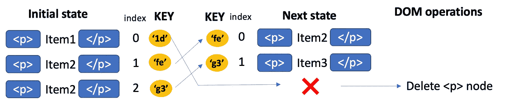

Figure 6 — An optimized bunch of DOM manipulation for transition

当我们帮助 React 根据惟一的键将数组中每个组件的确切位置从先前状态匹配到当前状态时，它可能会计算出一组更优化的 DOM 操作。在图 6 中，您可以看到 react 代替了 3 个操作(图 5 ),只需要完成 DOM 操作。此外，让我们看看图 5，问问自己，如果一个列表包含数百万个条目，并且用户正在删除列表中的第一个条目，React 将完成多少个操作？

**功能中断**

在上一节中，我们解释了 key 可以帮助 React 使 DOM 更新更有效。但是错误的键定义可能会导致应用程序错误。

让我们开发一个应用程序，其中我们需要呈现一个用户列表。默认情况下，每个用户条目都是折叠的，如果您想获得更多的细节，您只需要点击它(图 7)。此外，该应用程序还允许删除用户条目。

FIgure 7 — Application functionality

这里没什么难的:

请注意，这里我们将 item key 定义为一个数组索引(第 20 行)。

每个用户组件都有一个内部状态，允许将状态从*变为*。**

**为了玩一会儿，我为你准备了代码沙箱:[https://codesandbox.io/s/react-key-as-array-index-kn58z](https://codesandbox.io/s/react-key-as-array-index-kn58z?file=/src/components/User.js)**

**但是这里我们引入了一个 bug。图 8 提供了再现它的过程。假设我们有 3 个折叠的用户。我们希望看到第二个用户(Marry)的具体细节，我们单击折叠按钮。然后，让我们删除第二个打开的项目。正如你可能看到的，我们不再看到结婚项目，但彼得是打开的，尽管如此，我们以前没有打开这个项目。**

**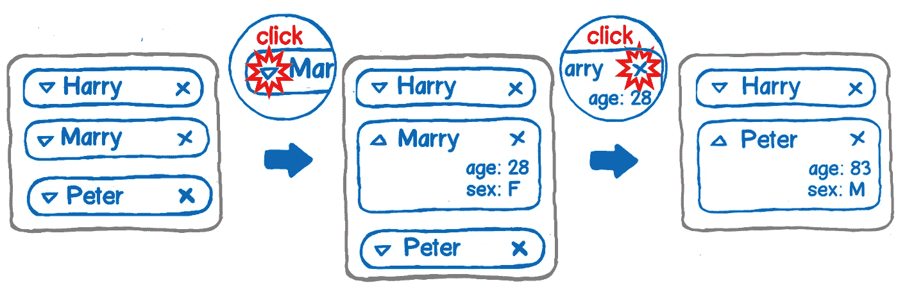**

**Figure 8 — Steps to reproduce the bug**

**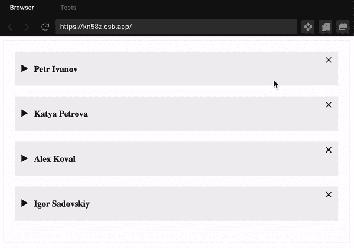**

**Figure 9 — Steps to reproduce the bug**

**为什么会发生这种情况？您已经看到了这个案例(图 5)。因为我们将每个组件与一个数组索引相关联，所以 react 只是基于它的索引逐个比较每个节点。在前一个状态中，第二个位置(索引 1)使用 props Marry 获取用户组件，我们将内部状态从*假*切换到*真*。当我们删除 Marry item 时，第二个位置接受用户组件，但是带有新的道具 Peter(图 9)。由于新状态只有两个元素，React 完全删除了第三个用户元素。**

**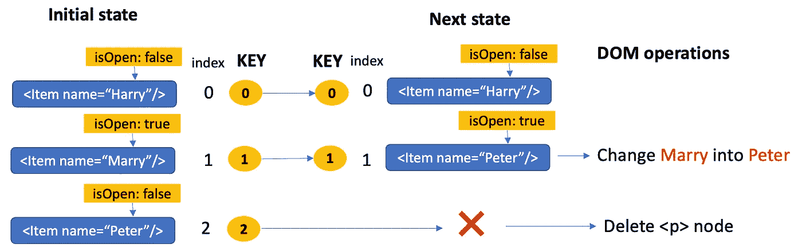**

**Figure 10 — Transition between state, when keys assign as an array index**

**为了解决这个问题，我们需要使用 user-id，而不是使用键作为数组索引(第 6 行):**

**React 然后构建以下更新列表:**

**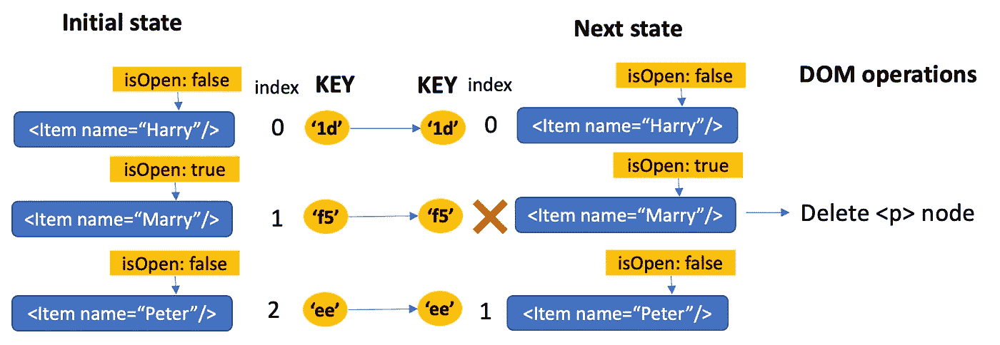**

**Figure 10 — Transition between states, when keys assign as unique and stable values**

**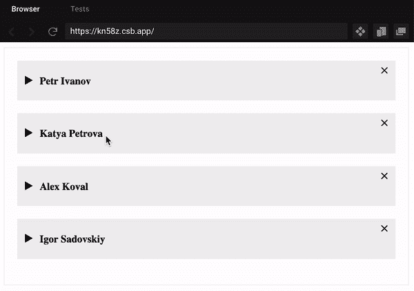**

**Figure 11 — Get rid of bug when used for ket unique and stable value**

****不要忽略开发模式下的警告信息****

**每当您忘记输入同构组件列表的键时，React 会警告您:**

****

**P.S .嗯，实际上使用 id 作为键，并不是在所有地方都有必要。如果您正在开发一个不应该从一种状态改变到另一种状态的项目列表，那么使用索引数组是可以的。例如，用于过滤器的选择器，其中定义了所有项目，并且在用户交互期间从不更改。但是，如果条目列表应该具有删除、重新排序、添加新条目的功能，在这种情况下，您必须以适当的方式处理这个键，以避免任何性能问题和意外的错误。**