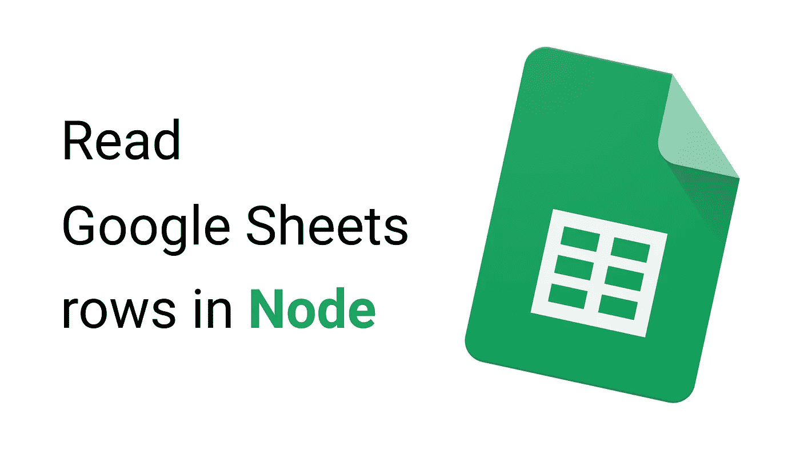

# 读取 Node.js 中的 Google Sheets 行

> 原文：<https://medium.com/geekculture/read-google-sheets-rows-in-node-js-6bb13956ee32?source=collection_archive---------6----------------------->

## 阅读公开的 google sheet 文档很容易，并且可以帮助您引导原型数据获取



[https://github.com/riccardogiorato/node-sheets-demo](https://github.com/riccardogiorato/node-sheets-demo)

# 安装依赖项

```
yarn add node-sheets dotenv
```

# 创建 Google API 密钥