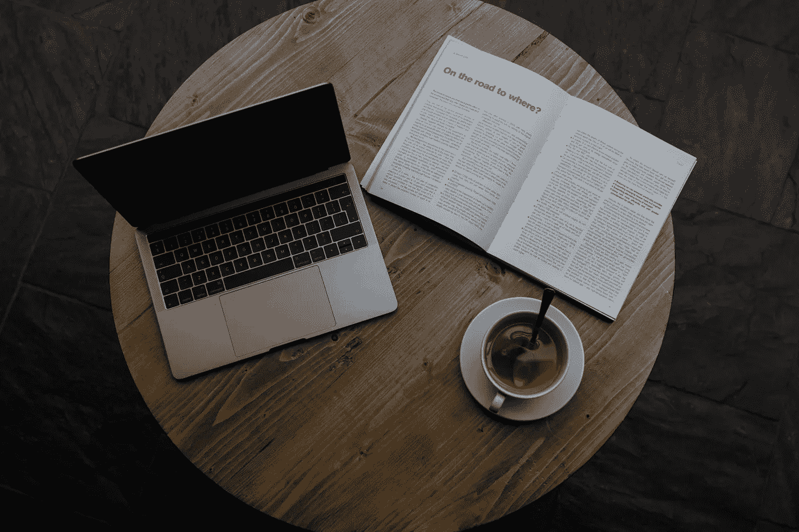

# 阅读这些书，你会写出更好的代码

> 原文：<https://medium.com/geekculture/read-these-books-and-youll-write-better-code-e5bff4b0ee8f?source=collection_archive---------12----------------------->

Photo by [Callum Shaw](https://unsplash.com/@callumshaw?utm_source=unsplash&utm_medium=referral&utm_content=creditCopyText) on [Unsplash](https://unsplash.com/s/photos/book-laptop?utm_source=unsplash&utm_medium=referral&utm_content=creditCopyText)

在大学里你不必把阅读课本落下。实际上，你可以在职业生涯的剩余时间里继续阅读它们，学习新的东西；你应该这么做。阅读一本好的老式的关于编码的书不仅会支持你的阅读习惯，还会让你成为一名更好的工程师，让你写出质量更高的代码。