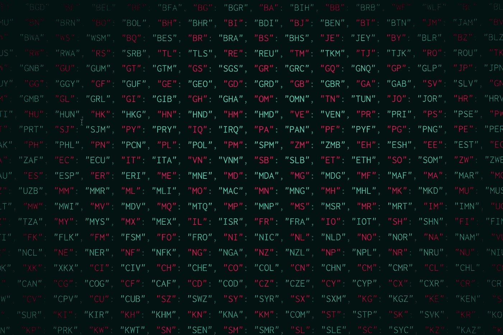

# 用 JavaScript 读写 JSON

> 原文：<https://medium.com/geekculture/reading-and-writing-json-in-javascript-56ce6c3ab1e3?source=collection_archive---------23----------------------->

## 2021 年 4 月 5 日

作者托马斯



Photo by [Pankaj Patel](https://unsplash.com/@pankajpatel?utm_source=unsplash&utm_medium=referral&utm_content=creditCopyText) on [Unsplash](https://unsplash.com/s/photos/json?utm_source=unsplash&utm_medium=referral&utm_content=creditCopyText)

文件 IO 似乎是一个主题，我通常最终会搜索以找到正确的答案。这是我最后一次遇到一个方便的方法，我告诉自己，我会为这个话题做出贡献，而不是仅仅消耗它。我最近需要读写 JSON 文件，这是我最终喜欢的编码。因为这是处理这个操作的一种更干净的方式，所以我想跟踪它。下面是一个用 Javascript 将对象写成 JSON 文件的示例脚本。

```
const fs = require('fs');
const path = require('path');

const testObject = {
  hello: 'world',
  myArray: [
    'entry1',
    'entry2',
    'entry3',
  ],
  myNestedObject: {
    nestedHello: 'nestedWorld',
  },
};

const testJsonString = JSON.stringify(testObject, null, 2);

const filePath = path.join(process.cwd(), 'test.json');

fs.writeFile(filePath, testJsonString, (err) => {
  if (err) {
    console.error(err);
  } else {
    console.log('File written successfully');
  }
});
```

如果您不在乎输出是否美观，可以将`JSON.stringify(testObject, null, 2)`部分简化为`JSON.stringify(testObject)`。下面是一个将 JSON 读入对象的示例脚本。

```
const fs = require('fs');
const path = require('path');

const filePath = path.join(process.cwd(), 'test.json');

fs.readFile(filePath, 'utf8', (err, contents) => {
  if (err) {
    console.error(err);
    return;
  }

  try {
    const jsonString = JSON.parse(contents);
    console.log(jsonString);
  } catch (jsonError) {
    console.error('Error parsing JSON');
  }
});
```

JSON 在这个脚本中被解析和打印，如果您在读文件的脚本之前运行写文件的脚本，那么您将看到一个对象，其内容与读脚本中打印的写脚本的内容相同。注意传递到`readFile`调用中的`'utf8'`参数。这个参数不是必需的，但是我想在这里包含它，只是为了指出文件可以用不同的方式编码。这就是我们如何告诉 Node 预期的编码类型。如果需要，可以将类似的参数传入`writeFile`。

# 同步文件 IO

在 Node 中同步读写文件，需要使用`writeFileSync`和`readFileSync`。这些函数的`*Sync`版本不是提供回调，而是仅在完成时返回。这会影响性能，因为文件 IO 不一定便宜。以下是同步写入版本中的示例脚本。

```
const fs = require('fs');
const path = require('path');

const testObject = {
  hello: 'world',
  myArray: [
    'entry1',
    'entry2',
    'entry3',
  ],
  myNestedObject: {
    nestedHello: 'nestedWorld',
  },
};

const testJsonString = JSON.stringify(testObject, null, 2);

const filePath = path.join(process.cwd(), 'test.json');

try {
  fs.writeFileSync(filePath, testJsonString);
} catch (err) {
  console.error(err);
}
```

以下是同步读取版本中的示例脚本。

```
const fs = require('fs');
const path = require('path');

const filePath = path.join(process.cwd(), 'test.json');

try {
  const contents = fs.readFileSync(filePath, 'utf8');
  const jsonString = JSON.parse(contents);
  console.log(jsonString);
} catch (err) {
  console.error(err);
}
```

*原载于 2021 年 4 月 5 日*[*https://thomasstep . dev*](https://thomasstep.dev/blog/reading-and-writing-json-in-javascript)*。*