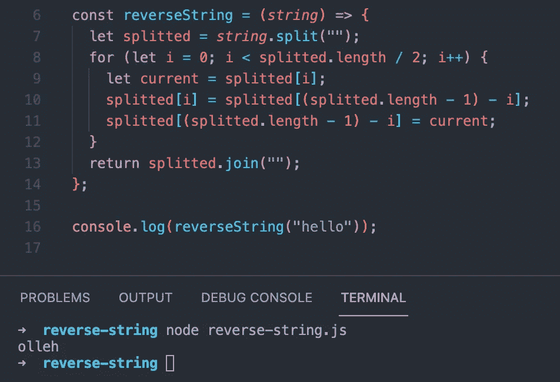
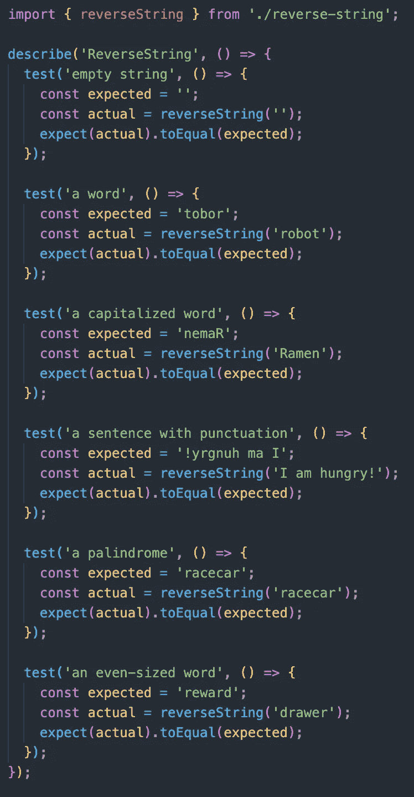
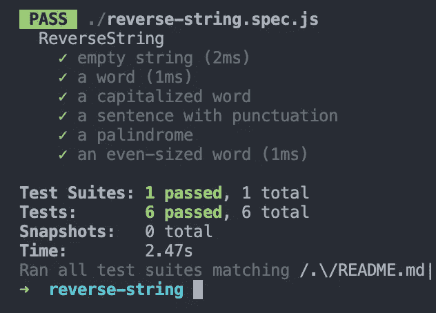

# 阅读干净的代码第 5 周:单元测试

> 原文：<https://medium.com/geekculture/reading-clean-code-week-5-unit-tests-ccbfe31b6460?source=collection_archive---------26----------------------->

如果你问任何专业开发人员，软件开发人员工作中最重要的部分是什么，我敢打赌超过一半的人会说测试你的代码。可以肯定的是，测试驱动开发(TDD)是软件开发的世界之道，而 *Clean Code* 用了整整一章来讨论这个主题。尽管这是一个相对较短的章节，但是单元测试的主题对于开发人员社区来说是如此重要，以至于有理由将本周的整个博客都献给它。在这篇文章中，我将讨论关于测试的*干净代码*哲学，并给出一些关于工程师如何写好单元测试的通用指南。

Martin 在这一章的开头说，当他编写测试时，他会慢慢地、小心翼翼地单步执行他的代码，隔离他的程序的每个角落，以确保它每次都能按预期运行。然而，Martin 说，尽管工程师们已经掌握了测试的一些[最流行的方面——比如在编写生产代码之前编写测试代码，以及自动化测试——他们有时还是不能理解测试背后微妙的、潜在的思维过程。为了更深入地研究这些原则，Martin 列出了他的三个首要测试规则:](https://www.softwaretestinghelp.com/software-testing-trends/)

1.  在编写失败的单元测试之前，您不能编写产品代码
2.  您可能不会编写比足以失败的单元测试更多的单元测试(顺便说一下，您没有编译的代码是失败的)
3.  您不能编写超过足以通过当前失败测试的生产代码

马丁写道，这三条规则的生命周期大约是 30 秒。如果你正在阅读这些规则，并且认为“看起来我将不得不写很多测试”，那么你是对的。虽然写这么多测试看起来令人生畏，但是写干净的测试最终会解放你，让你可以写任何你想要的产品代码。

总的来说，Martin 说我们的测试应该遵循这五条规则，并将其缩写为 **F.I.R.S.T.** :

*   快速**:测试应该是快速的。但是测试不一定要快如闪电。马丁称之为双重标准。最终，您希望您的测试足够快，以便您实际运行它们，但是它们不需要和您的生产代码一样快。毕竟，您的用户永远不会看到您的测试，所以他们不需要像将您的 React 代码呈现给客户端那样快。**
*   **独立**:正如这篇[精彩的博客文章](https://testguild.com/atomic-tests/)所说，测试应该是原子的。也就是说，他们应该在你的代码中测试单个的、自包含的逻辑。这与鲍勃大叔的想法有关，即每次测试应该只针对一个**单一概念**。
*   可重复的:不管你的测试运行在什么机器上，它们都必须工作。如果你的测试在不同的环境中表现不同，你不能依赖它们来测试。
*   自我验证:正如 Martin 所说，单元测试应该有一个清晰的布尔输出。您应该能够很容易地搜索到您的测试结果，而不必搜索日志文件来试图凭直觉理解您的测试意味着什么。
*   **及时**:也许最重要的是，测试应该及时编写。记住，测试的全部目的是测试你的产品代码。通过在编写产品代码之前编写测试*,您可以确保您编写的测试和设计的产品代码是可测试的。*

为了真正理解测试中的一些要点，让我们看一个简单的程序以及如何测试它。对于这个例子，我将使用[exercisem](https://exercism.io/my/tracks)的一个编码挑战。Exercism 是一个在线免费编码平台，提供 50 种不同编程语言的代码练习和指导，他们使用一个非常受欢迎的测试框架，名为 [Jest](https://jestjs.io/) 。更具体地说，我们将看看 Exercism 在反转字符串方面的挑战。下面你可以看到我的代码以及程序的终端输出:

reverse-string.js

尽管我们可以直观地看到这段代码是有效的，但这并不是一种非常有效的测试方式。首先，我们通过在控制台中验证这段代码的输出，打破了 **F.I.R.S.T.** 的**自验证**规则。通过编写一个全面的测试套件，我们会更有效率(并覆盖更多的代码)，正如来自 Exercism 的团队所做的那样:

reverse-string.spec.js

我将避免进入这些测试的语法，原因很简单:这些单元测试是直观的！任何称职的开发人员都可以进入这个文件，看到这个套件正在测试的六种情况，我们如何解释回文以及大写单词，等等。如你所见，这些测试也遵循了**单一概念**原则，每个单元清楚地隔离了一个潜在的输入，以便我们的代码通过。虽然我们可以测试一些边缘情况——仅在极端(最大或最小)频率下出现的输入——但在这里，这些单元测试将捕捉到大量误差。让我们实际运行我们的测试，看看我们得到了什么:

output for reverse-string.spec.js

正如我们可以清楚地看到的，我们的测试套件非常快，我们的代码通过了我们的测试(顺便说一句，我认为没有什么比测试旁边的绿色复选标记更让开发人员满意的了)。Jest 的测试非常出色，因为它们清楚地描述了输出中测试了什么，以及测试我们的代码需要多长时间。通过这些测试，我们已经清楚而迅速地证明了我们的代码是正常工作的，让我们充满信心地进入下一个任务。

虽然测试可能看起来很麻烦且有限制性，但 Martin 一次又一次地指出，好的测试可以让你自由地编写任何你想写的代码。TDD 使我们的代码保持灵活性、可维护性和可重用性，而不是在黑暗中埋头苦干，想知道你的逻辑在做什么。有了干净、可读的测试，我们可以随心所欲地修改代码，因为我们知道我们的逻辑仍然是合理的，因为我们仍然通过了测试。

正如你可能想象的那样，在这篇博客中，我们仅仅触及了测试的表面。就像软件开发中的几乎任何事情一样，有大量的资源可以更深入地学习测试，从 [Udemy](https://www.udemy.com/courses/development/software-testing/) 课程到[书籍](https://www.oreilly.com/search/?query=testing&extended_publisher_data=true&highlight=true&include_assessments=false&include_case_studies=true&include_courses=true&include_playlists=true&include_collections=true&include_notebooks=true&include_sandboxes=true&include_scenarios=true&is_academic_institution_account=false&source=user&sort=relevance&facet_json=true&json_facets=true&page=0&include_facets=true&include_practice_exams=true)到有用的[博客](https://blog.feedspot.com/software_testing_blogs/)。遵循 Bob 叔叔关于编写干净测试的规则，你将解放自己去写任何你想要的代码…只要它通过你的测试。