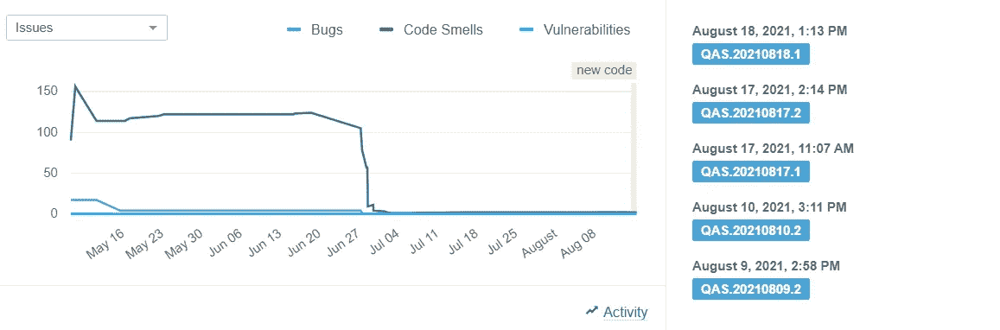
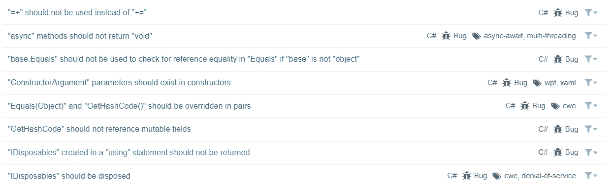
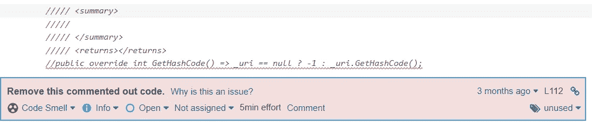
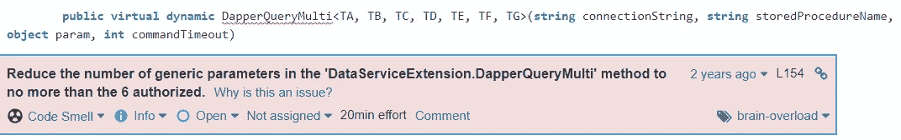
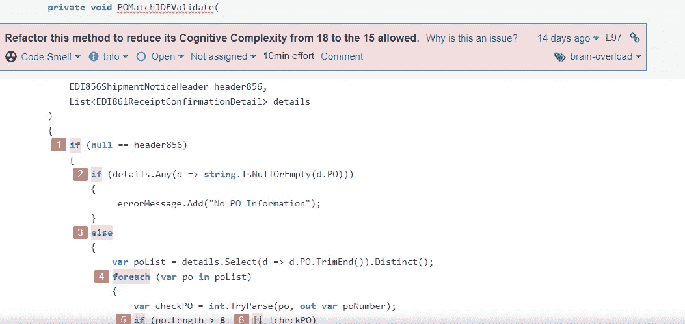
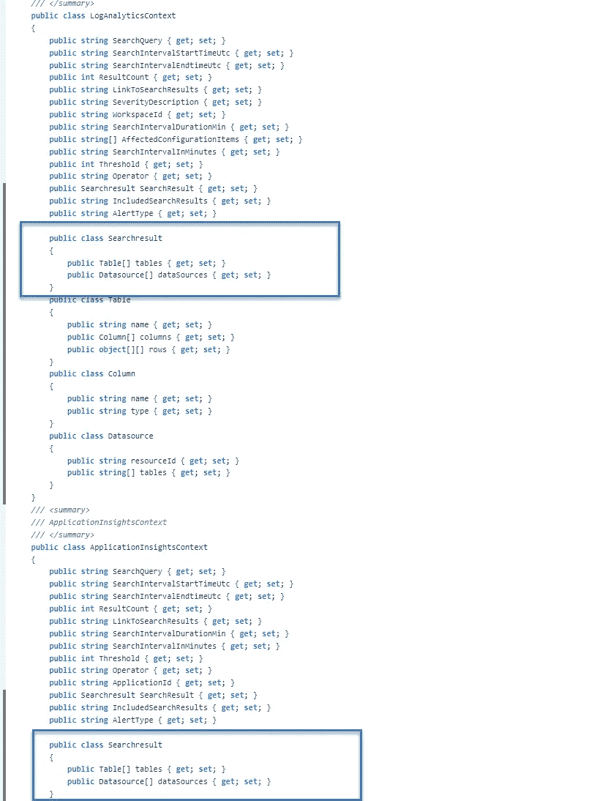
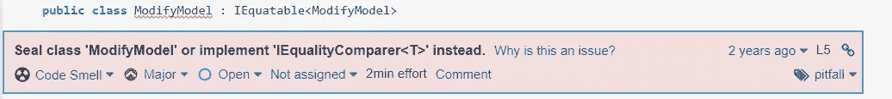

# 阅读 SonarQube 的备忘录

> 原文：<https://medium.com/geekculture/reading-memo-for-sonarqube-in-action-19b0e09a115a?source=collection_archive---------33----------------------->



# 介绍

什么是[sonar cube](https://docs.sonarqube.org/latest/)，为什么要用 sonar cube？作为一名软件工程师，我们都追求更高的生产率和更好的代码质量。越来越多应用代码评审过程或结对编程的公司实际上是确保每一行代码在提交到生产环境之前都应该保证高于平均质量。

据我们所知，高级工程师有时间瓶颈和资源限制来为初级工程师复习一切。所以 SonarQube 产品可以让我们发烧。SonarQube 将逐行扫描我们的项目代码，并为团队提供分析结果和建议。

事实上，有人可能会质疑 SonarQube 不能识别业务逻辑，我们仍然需要其他同事来支持代码审查和验证过程。这是真的，但是在 SonarQube 的帮助下，我们在第一步就提高了代码质量😃

SonarQube 根据所谓的**质量七轴**标准来衡量代码:

```
🌡 Potential bugs
🌡 Coding rules
🌡 Tests
🌡 Duplications
🌡 Comments
🌡 Architecture and design
🌡 Complexity
```

我们举一些简单的例子来描述这些轴，看看 SonarQube 是如何指导我们的。

## 编码规则



> 我们可以定制自己团队的规则，或者选择/过滤代码扫描的定义内规则。

## 评论



> 因为我们通常有 git 或 svn 这样的版本控制，所以出于维护的考虑，我们可以保持新代码的整洁。

## 建筑和设计



> 该提示表明，为了更好地阅读和维护，我们可能会减少参数。

## 复杂性



> 这个功能显然同时包含了太多的逻辑。考虑创建另一个函数和简单嵌套 if/else 块。

## 重复



> SonarQube 按行、块和文件报告复制。对于示例，考虑将普通部分移到超类。对于平台库级别之外的重复函数，可能是一致性的选择。

## 潜在的错误



> 当一个类实现了`*IEquatable<T>*`接口时，它就进入了一个契约，实际上是声明“我知道如何比较 T 类型或任何从 T 派生的类型的两个实例是否相等。”。然而，如果该类是派生的，那么基类就不太可能知道如何进行有意义的比较。因此，这种隐性契约现在被打破了。

## 试验


> 确保你的代码做正确的事情。SonarQube 将显示项目的单元测试覆盖率。此外，SonarQube enable 开源插件提供了与第三方工具的集成。因为样本表明我们有方法(GetFormDetail)测试用例[绿线]，但是留下了未覆盖的异常部分[暗红线]。

# 参考

*   [sonar cube 正在运行](https://livebook.manning.com/book/sonarqube-in-action/about-this-book/)
*   [https://sqlenlight.com/support/help/what-is-sql-enlight/](https://sqlenlight.com/support/help/what-is-sql-enlight/)