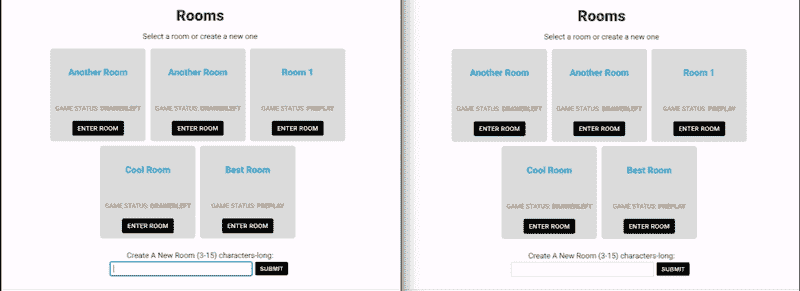
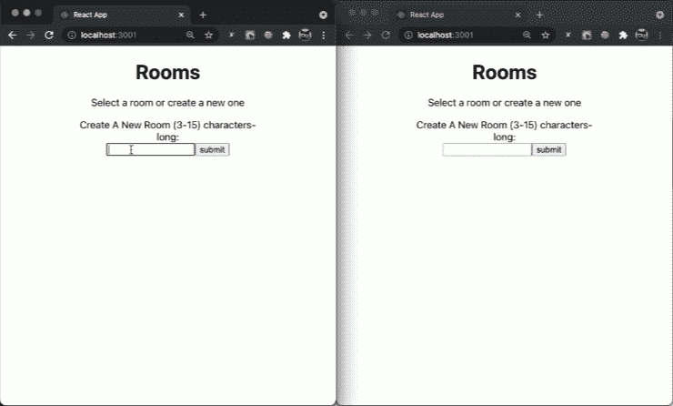

# 准备，设置，行动(电缆)

> 原文：<https://medium.com/geekculture/ready-set-action-cable-2411a30d2409?source=collection_archive---------11----------------------->

## 一个帖子详细介绍了我如何用最简单的方式解释我的反应前端使用铁路的行动电缆。


Photo by [Steve Harvey](https://unsplash.com/@trommelkopf?utm_source=medium&utm_medium=referral) on [Unsplash](https://unsplash.com?utm_source=medium&utm_medium=referral)

对于我在 Flat Iron 的最终项目，我需要实时渲染，而不是典型的 Post/Get HTTP 协议。实时渲染的一个例子是为有线电视公司提供技术支持的聊天窗口。您和技术支持都可以实时看到消息。聊天窗口实际上使用了一种叫做 web sockets 的替代协议。我需要我的数据对于同一 URL 上的最终用户是相同的，即使是在不同的计算机上。

> [**WebSocket** 是一种计算机通信协议，在单一 TCP 连接上提供全双工通信通道](https://en.wikipedia.org/wiki/WebSocket#:~:text=WebSocket%20is%20a%20computer%20communications,being%20standardized%20by%20the%20W3C.)。

如下例所示。左侧的窗口提交了一个新房间，它会自动出现在另一个浏览器中(右侧)。



这就是 Action Cable 的神奇之处。它工作起来很美，但我经历了相当多的麻烦和挣扎才走到这一步。因此，本文将介绍如何在前端和后端设置 action cable 以发挥作用。我将尽可能用最简单的方式来做这件事，这样你就可以创建你自己的功能动作电缆，而不需要我在阅读了无数文章后花费所有的时间来调试和尝试让它工作。我确实读过一些文章，并发现这些文章很有帮助:[https://dev.to/christiankastner/react-and-actioncable-1gbh](https://dev.to/christiankastner/react-and-actioncable-1gbh)&[https://medium . com/@ Dakota . lillie/using-action-cable-with-react-c37df 065 f 296](/@dakota.lillie/using-action-cable-with-react-c37df065f296)

**此外，应该提到的是，这项技术可能有更好的替代集成，但这是对我有用的。**

# 让我们开始派对吧。

首先，您需要做的是在终端中建立一个项目文件夹，键入:

```
mkDir projectName
cd projectName
```

然后设置您的 Rails API:

```
Rails new your_api_name --api -T
```

这将创建 Rails API。`--api`标志将创建一个 API，而不是一个成熟的 Rails 应用程序。`-T`是跳过 rails 测试框架的标志。

之后，在终端`cd`进入 Rails 文件夹。为了让我们的后端接受来自前端的请求，我们需要在 Gemfile 中取消对`gem 'rack-cors'`和`gem ‘redis'`的注释。Action Cable 利用 Redis。用命令`bundle`运行 bundle install，然后在文本编辑器中打开 config/initializer/cors.rb，取消对 Rails.application.config…的注释。块，并将`orgins`和`resource`设置为`'*'`这将设置 Cors(跨来源资源共享)接受任何来源。

> **请注意，此配置仅用于开发目的，请研究如何为生产设置 Cors。**

接下来，我们需要开发我们的资源:

```
rails g resources Room name
```

在本文中，我将通过一个简单的房间列表来展示 ActionCable 的强大功能。你可以随意地让你的模型复杂到你需要的程度。

这将产生:

```
**invoke**  active_record**create**    db/migrate/20210610053516_create_rooms.rb**create**    app/models/room.rb**invoke**  controller**create**    app/controllers/rooms_controller.rb**invoke**  resource_route**route**    resources :rooms
```

现在打开 config/routes.rb 文件，将其修改为如下所示:

我已经为我的房间模型限制了我的路线，但是如果需要的话，可以随意添加或删除。对于我们的目的来说，唯一需要的是`:index`、`:show`和`:create`另外，请注意实例化 WebSockets 连接所需的所有 routes 文件都是上面第 5 行中的那一行。如前所述，ActionCable 是全双工连接，因此不需要设置 post 或 get 路由。

如果你以前使用过 Rails 作为后端，所有这些应该都很熟悉。然而，这正是我们开始踏上新旅程的地方。

## 介绍渠道

当您自动生成 rails 应用程序时，它实际上会创建一个名为`app/channels`的文件夹😵我没有意识到这一点。通道可以被认为是 WebSockets 的控制器文件夹。虽然我已经看到了在通道中构建所有 WebSocket 功能的设计模式，但我们将依赖我所知道的控制器。

确保您仍然在 Rails API 的根文件夹中:

```
rails g channel rooms
```

这将在**app/channels/rooms _ channel . Rb**中创建一个新文件

这个文件是做什么的？通过安装`ActionCable.server`打开网络插座的通信电缆。实际的连接需要通过订阅频道来启动。订阅将在前端处理。但是我们确实需要修改这个文件。

我们需要做的就是把`stream_from "rooms_channel"`加到`Rooms_Controller.rb`上

这里值得一提的是，您实际上可以设置通道来处理参数，例如房间 id。类似于在控制器中使用参数来表示`:show`

```
# app/channels/some_channel.rb
...channel file
stream_from "room_channel_#{params[:room_id]}"
```

## 接下来修改控制器文件

当我们运行`rails g resources Room name`时，它生成了一堆相关文件，所以我们的控制器已经存在`app/controllers/rooms_controller.rb`

我们需要为**索引、创建和显示添加控制器动作。**

这个控制器的大部分相对简单，除了`ActionCable.server.broadcast 'rooms_channel', room`最重要的是`'rooms_channel'`匹配你在通道文件中输入的内容。

*这一行说的是，“嘿，ActionCable 向* `*rooms_channel*` *的所有订户广播了我在* `*room*`的数据”

这就是后端所需的内容。除了创建我们的数据库。在终端类型中:

```
rails db:migrate
```

然后通过启动 API 服务器来验证一切

```
rails s
```

然后打开[http://localhost:3000/rooms](http://localhost:3000/rooms)确认其功能正常。此时它应该只显示一个空数组。

# 反应和行动电缆

现在是时候把前端放在一起连接并显示我们的 WebSocket 内容了。如果您的终端窗口仍在 Rails 文件夹中，请退出它，进入项目文件夹的根目录。

然后输入终端。

```
npx create-react-app my-app-name
```

这将创建一个新的 React 应用程序。接下来，我们需要为 React 安装 ActionCable 插件。如果你看看其他文章，他们会推荐各种插件，像`react-actioncable-provider /@rails/actioncable`或`actioncable`都可以从 npm 获得。对我有效的是`actioncable`。所以这将是我们将要安装的。

确保您仍然在 react 应用程序目录中，并在终端中键入内容

```
npm install -S actioncable
```

这将安装与后端通信所需的插件。`-S`标志将其保存为项目的依赖项。接下来，让我们通过在终端类型中创建一个文件夹和一个 index.js 来设置一些全局常量，在确认您仍然在 React 应用程序的根目录中之后。

```
cd /srcmkdir constants
touch constants/index.js
```

现在打开您刚刚创建的文件，并添加:

对于我们正在构建的简单示例来说，这可能有些矫枉过正，但这是我喜欢的工作方式。这是一个很好的模式，可以避免到处修改常量。

现在确保您仍在终端中的`/src`中，并键入

```
mkdir services
touch services/Cable.js
```

这是我们将 WebSockets 连接到后端的地方。现在在文本编辑器中打开 Cable.js 并添加:

这就创建了一个订阅频道所必需的消费者——稍后将详细介绍这个文件。

接下来，让我们设置我们的`App.js`文件，在一个文本编辑器中打开它，修改如下。

此外，您需要安装`react-router-dom`以使 URL 路由正常工作

```
npm install -S react-router-dom
```

我在这里所做的就是创建两个 URL 路径来加载房间的索引或单个房间。接下来，添加一点 CSS `App.css`，这样房间名称的显示会稍微漂亮一些。😃

好了，现在是时候构建那些在`App.js`中引用的组件了。希望你的终端还在`src/`文件夹中。如果是，请键入:

```
mkdir components
mkdir components/rooms
cd components/rooms
touch NewRoomForm.js
touch Room.js
touch RoomsList.js
touch ShowRoom.js
```

我发誓我们越来越接近了。我们需要构建一些组件，我们就要完成了。

首先是`NewRoomForm.js`，这将是您提交新房间的方式。因为这只是您的标准 React 表单，所以继续将它复制并粘贴到文件中。

`Room.js`是房间对象的显示组件。所以这很简单。直接把这段代码复制粘贴进去。

接下来是`ShowRoom.js`，虽然不是完全必要，但我希望能够点击显示各个房间。只需复制并粘贴这段代码。

最后是`RoomList.js`很长！以及所有神奇的事情发生的地方，所以浏览源代码，你会找到相关的注释。

好了，让我们深入了解一下这里发生了什么，这样你会有更好的理解。第 8 行`import cable from '../../services/Cable’`正在导入创建消费者的函数。

流程如下: **ActionCable →消费者→订阅**

然后由创建订阅的`roomsChannel()`调用`cable`

```
roomsChannel = () => {
    cable.subscriptions.create({
    channel: `RoomsChannel`,
    }...
```

该函数的其余部分包含与订阅相关的事件的回调函数。由于这只是一个开发阶段，我让`console.log()`来跟踪事件。唯一重要的回调是`received: data => {}`这是 WebSockets 的精髓，也是所有这些最终如何在所有用户的浏览器上更新 DOM。虽然我承认这可能不是最精简的代码结构，但是在接收到数据时进行额外的`Fetch()`调用是最有意义的。尤其是当您试图避免将重复的项目添加到 DOM 时，您不必担心这个特定的用户是否是提交新房间的人。

## 所以流程是这样的。

> 用户提交一个新房间→ `POST Fetch()` →然后服务器将该数据广播给所有用户→该事件触发`loadRooms()`，所有用户作为用户连接到该 URL。

# 现在让我们来看看它的作用

您需要首先启动 rails 服务器，因此它使用默认端口 3000。然后，在终端中，导航到 Rails API 并输入命令。

```
rails s 
```

接下来，在终端中打开一个新的选项卡或窗口，导航到 React 前端，然后输入命令。

```
npm start
```

它会因为你不能使用端口 3000 而对你大喊大叫，但是你可以说可以使用另一个端口。如果输入正确，您应该会看到我们的超级基本应用程序。继续添加一个房间。现在打开另一个选项卡，导航到同一个 URL。在“新建”选项卡上，添加另一个房间。导航或查看另一个打开的选项卡



这比我预期的时间要长得多。如果你坚持到底，你已经收获了看到行动电缆的魔力的回报。不客气！我感觉到了在我的项目中实现它的困难。我需要展示我是如何做到的，希望其他人不会像我一样落入同样的陷阱。快乐编码。