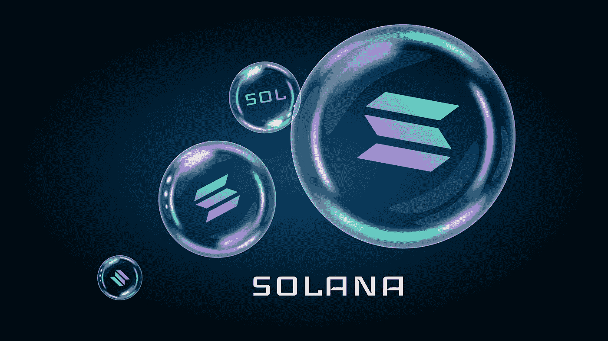

# 准备，就位，索拉娜！用 Solana 和 Rust 为你的 M1 Mac 做好 Web3 开发的准备

> 原文：<https://medium.com/geekculture/ready-set-solana-getting-your-m1-mac-ready-for-web3-dev-with-solana-and-rust-37695c47573a?source=collection_archive---------8----------------------->

## 区块链冒险

你已经准备好去区块链了。你已经完成了你的研究(或者只是做了一些看起来有趣的事情),并且选择了 Solana 来做你的研究。

超级爽！索拉纳是一个了不起的区块链，有很多值得推荐的地方。它快得惊人…