# 通过应用 CRISP-DM 和文本挖掘获得真正的业务洞察力

> 原文：<https://medium.com/geekculture/real-business-insights-by-applying-crisp-dm-and-text-mining-1254048c78b4?source=collection_archive---------33----------------------->

## 一种基于数据的方法，使用来自 SGS 智利分公司石油、天然气和化工(OGC)业务线的真实数据


如今，大、中、甚至小的商业公司每秒钟都会产生大量的商业数据，而这些数据大部分时间都被忽视了，因为没有人知道如何处理这些数据。这是一座金矿！！！！！

> "我们的目标是将数据转化为信息，将信息转化为洞察力."— [卡莉·菲奥莉娜](http://en.wikipedia.org/wiki/Carly_Fiorina)，惠普公司前高管、总裁兼董事长

在本帖中，我们将应用 [CRISP-DM](https://www.datascience-pm.com/crisp-dm-2/) 方法，从 [SGS 智利](https://www.sgs.cl/)的*维护和维修(M & R)* 部门所做的工作中提取相关信息，SGS 是全球领先的检验、验证、测试和认证公司之一。

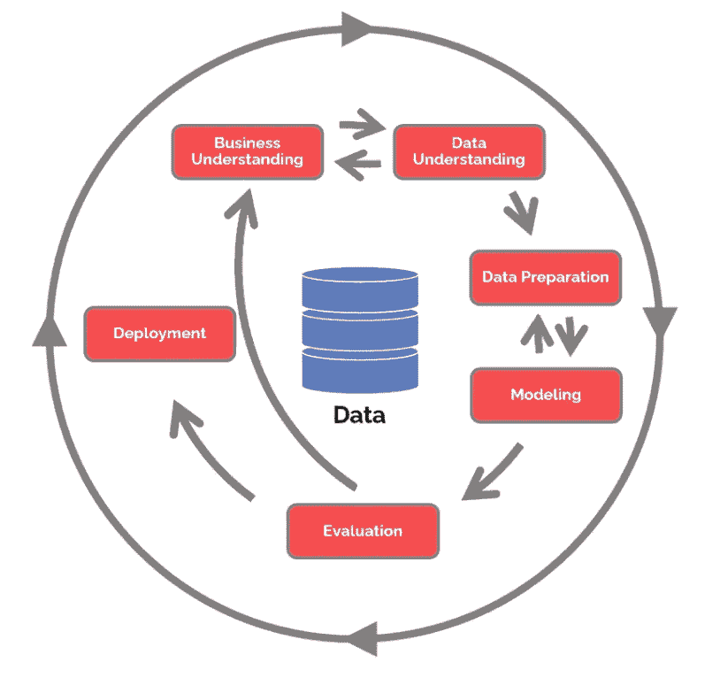

Cross Industry Standard Process for Data Mining (*CRISP-DM*)

如需分步指南，请查看本项目的 GitHub 资源库，此处有。

# 1.商业理解

SGS 智利分公司的*维护&维修(M & R)* 部门负责对与 *OGC(石油、天然气和化学品)*业务线相关的许多服务站(主要是加油站)的不同部件和设备进行维修、调整、安装和测试。

为了确保对活动的适当控制，M&R 使用了一个数据库，该数据库收集了由指定技术人员执行的每项工作的详细信息。每个记录对应一个工单(西班牙语为 OT—*“órden de Trabajo”*)。

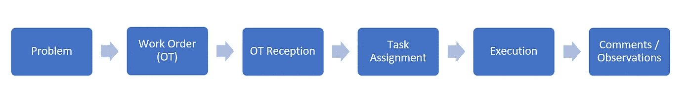

The general process of a work order (OT) in M&R

为了从操作中获得洞察力，我们提出三个问题:

> Q1。M&R 收到最多工作订单(OT)的时间段是什么？有峰值吗？有什么模式或趋势吗？
> 
> Q2。M&R 地区处理这些请求需要多长时间？工人花了多少时间来解决问题？
> 
> Q3。最常见的故障类型或需要注意的问题是什么？根据业务，它们是否具有代表性？

# **2。数据理解**

让我们来看看数据

```
import pandas as pd
df = pd.read_excel("../data/List_Report_Gestion_30082019061320.xls")
schema = pd.read_excel("../data/Data_Schema.xls")
```

**df** 包含 23258 行和 29 列，并且具有发布到 M & R 区域的每个工单(OT)的细节。另一方面，**模式**数据帧包含每个 df 列的解释和正确翻译。

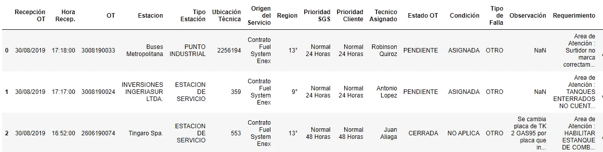

df

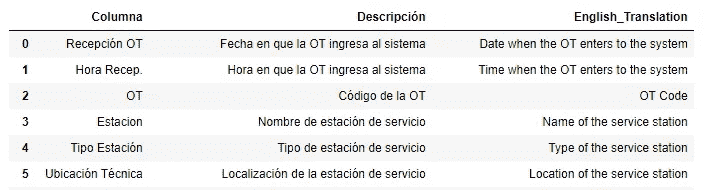

schema

由于 **df** 中的列名是西班牙语，我们将把它们转换成标准格式以便于使用，例如 *"Ubicación Técnica"* 将是 *"ubicacion_tecnica"* 。

## 检查空值和唯一值

```
# Nulls values - Proportion
df.isnull().mean()
# Unique values
for col in df.columns:
    print(f"{col:20} {len(df[col].unique()):7}")
```

我们看到`cod_repuesto, repuesto, cnt, monto, total`列完全为空，也只有一个惟一的值。我们认为最好的选择是放弃它们。

## 分类变量和数值变量

识别分类变量`df.select_dtypes(include=['object´])`

> recepcion_ot '，' hora_recep '，' ot '，' estacion '，' tipo_estacion '，
> ，' ubicacion_tecnica '，' origen_del_servicio '，' region '，' prioridad_sgs '，
> ，' prioridad_cliente '，' tecnico_asignado '，' estado_ot '，' condicion '，T10，' tipo_de_falla '，' observacion '，' requerimiento '，' tecnico_cierre '，
> ' fecha _ arri

数值变量的相关性

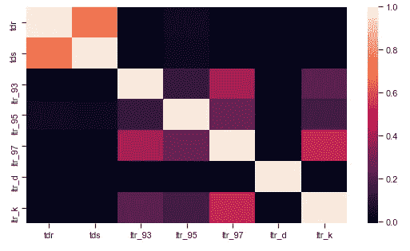

sns.heatmap

有轻微的相关性(0.2 < x <0.5) between the variables *ltr_93，ltr_95，ltr_97，*和 *ltr_k* 指的是加油站损失的汽油升数(93 号气，95 号气，97 号气，煤油)。我们还看到，变量 ltr_d (diesel)与上述任何一项都不相关。另一方面，我们可以看到变量 *tds* 和 *tdr* 确实相关，相关度大约为 0.8。

## 根据业务操作的主要栏目


Amount of work orders (OT) per region

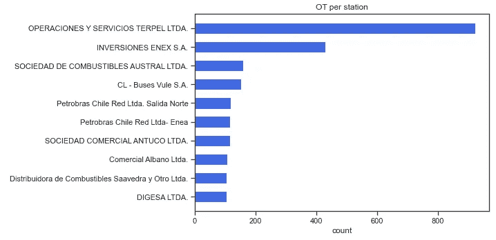

Amount of work orders (OT) per station — Top 10

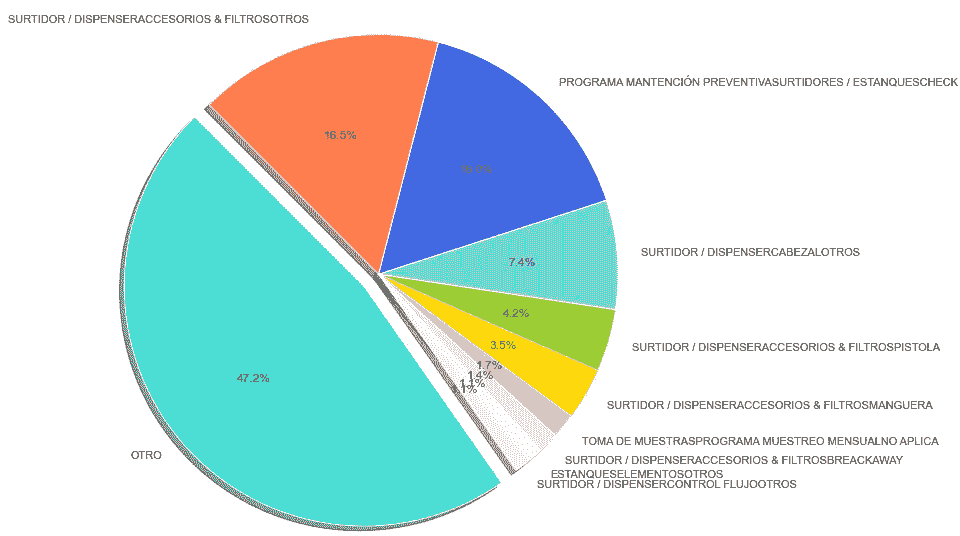

Type of failure distribution — Top 10

我们可以看到地区*【RM】*(智利首都)累积的加班次数最多(+9000)，而服务站*【特佩尔 LTDA】*最频繁(+900)。

我们还注意到，几乎 50%的工作订单被归类为“其他”失败类型，如果我们想使用该列提取信息，这是不好的。

# 3.数据准备

在上一节中，我们通过重命名列和删除空列做了一些清理和准备工作。然而，如果我们想回答商业问题 *Q1，Q2* 和 *Q3* 我们需要更进一步。

## Q1。M & R 收到最多工单(OT)的时间段有哪些？有峰值吗？有什么模式或趋势吗？

我们注意到包含与时间段相关的信息的列是:**'***【recepcion _ ot】、【hora_recep】、【fecha_arribo】、【hora_arribo】、【fecha_cierre】、【hora _ cierre】'*。

在应用笔记本[这里](https://github.com/alexrop/crispdm_businesscase_sgs)中描述和解释的多个函数，如`df_date_time`、`days_interval`和`hours_interval`处理这些字段后；我们得到的信息将有助于我们回答 Q1。

`OT_timeline`功能使用从上面生成的输入，并显示下图:

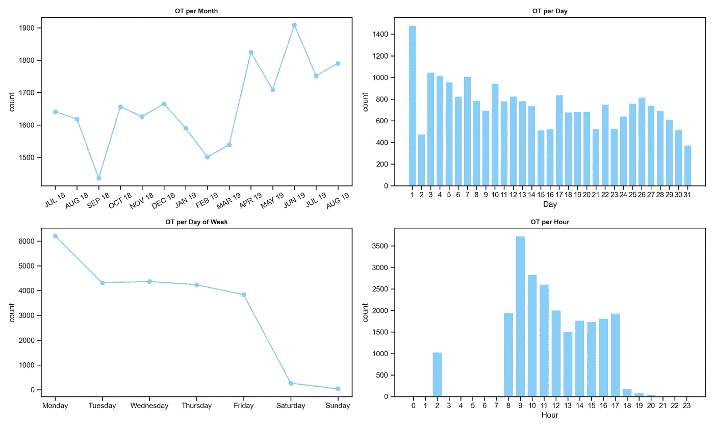

> **Q1。答案**
> 
> a)从 2019 年 4 月开始，工单(OT)开始变得更加频繁。2019 年 6 月是高峰，最低点是 2018 年 9 月，部分原因是智利在这个月有国定假日。
> 
> b)月初加班人数略有增加的趋势，因为前 10 天累计占总数的 40%。
> 
> c)周一是 M&R 收到订单最多的一天(占全周的 27%)。d)通常工作订单在早上(中午 12 点前)收到

## Q2。M&R 地区处理这些请求需要多长时间？工人花了多少时间来解决问题？

因为我们再次需要时间信息，所以应用了类似的方法。在这种情况下，我们已经从 Q1 创建了时间间隔变量，如`time_reception_arrival`(收到加班和技术人员到达服务站之间的时间)和`time_arrival_departure`(技术人员到达和完成工作之间的时间)。

在此基础上，我们生成了`work_time`函数，该函数显示了员工的时间接收/到达和时间到达/离开

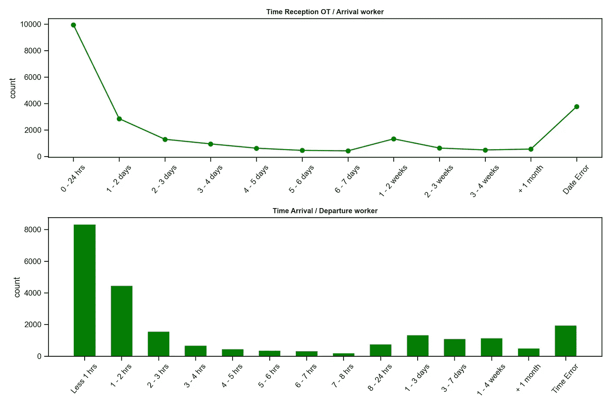

> **Q2。答**
> 
> a) 43%的加班时间不到 24 小时，55%的加班时间不到 2 天。另一方面，被取消或从未参加的加班比例为 16%
> 
> b) 36%的情况下问题在几分钟内(不到一个小时)得到解决，55%的情况下问题在两个小时内得到解决。当工人登记活动或活动不是由他解决时，时间误差可能指示手动误差，这等于 8%

## Q3。最常见的故障类型或需要注意的问题是什么？根据业务，它们是否具有代表性？

由于几乎 50%的故障被标记为“其他”，因此`tipo_de_falla`(故障类型)栏不是很有用。

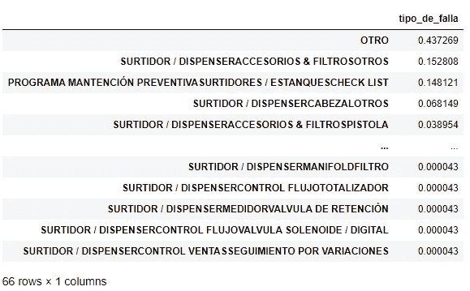

检查 df，有两个非结构化的文本列包含每个 OT 的细节。它们是**“观察”**和**“查询”**。

为了找到最常见的故障类型，将主要分析**" observicion "**列，因为其平均行长度大于 **"requerimiento"** 列，并且因为它是由技术人员在工作结束时编写的，所以它包含已完成工作的更多技术细节。

由于在“observacion”列中有一些空值，我们不丢失行的策略是**通过使用“requerimiento”字段中的值输入**这些空值。这个新列将被称为`text_detail`


text_detail column

## 首先清理文本

在[笔记本](https://github.com/alexrop/crispdm_businesscase_sgs)里可以找到`word_cleaner`函数，基本上返回一个干净的准备处理的句子。该函数将应用于我们新的`text_detail`列，以便准备数据。

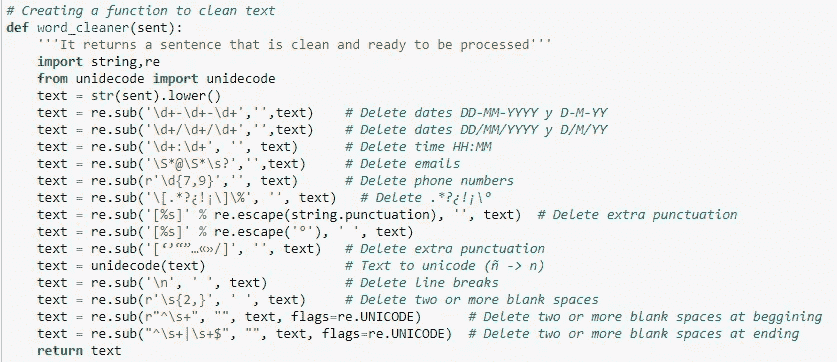

word_cleaner function

## 面向非结构化文本的主题建模方法

因为很难通过手动检查所有行来获得`text_detail`列中所有非结构化文本的全部知识，所以将使用无监督学习算法。从这个意义上说，主题建模方法看起来非常适合发现隐藏模式(自然语言处理)。

[LDA](https://towardsdatascience.com/latent-dirichlet-allocation-lda-9d1cd064ffa2) (潜在狄利克雷分配)是最流行的主题建模方法之一。每个文档由各种单词组成，每个主题也有属于它的各种单词。LDA 的目的是根据文档中的单词找到文档所属的主题。

# 4.建模

一旦文本被清理和预处理，我们通过使用 [Gensim](https://radimrehurek.com/gensim/) 库应用 LDA 算法。关于如何使用这个库和所需参数的更多技术信息，你可以去查看这个[帖子](/analytics-vidhya/topic-modeling-using-gensim-lda-in-python-48eaa2344920)。

为了获得 Gensim LDA 模型的输入，我们创建了`text_id2word_corpus`函数，其中的停用词是西班牙语中最常见的停用词和一些不需要考虑的业务词。对于标记化和词条化部分，我们使用了 [SpaCy](https://spacy.io/) 库。

之后，我们创建一个在多个 LDA 模型之间执行和迭代的函数。我们需要多个模型，因为我们会比较它们，以找到最好的。

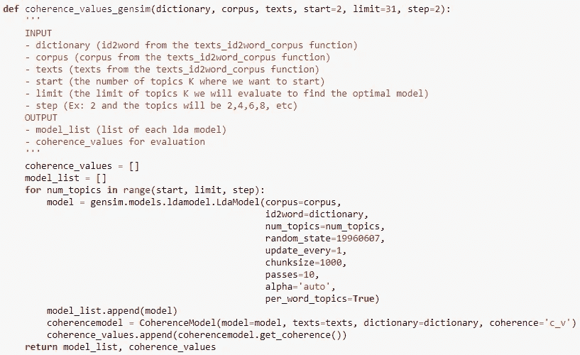

Function that generates multiple LDA models and their coherence values

给函数输入适当的输入并执行它，我们看到生成 20 个 LDA 模型大约需要 18 分钟。

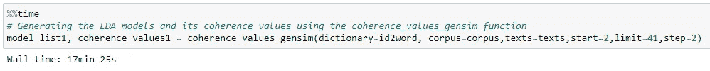

Execution time for generating the LDA models

# 5.估价

在 LDA 中选择正确数量的 K 个主题是一项极其重要的任务，因为它基本上定义了最优模型。选择一个很低的 K 会产生非常宽泛的话题，而选择一个很高的 K 会产生无法解释的话题。在这种情况下,**主题连贯性**是一种有助于找到最佳 k 的度量。

关于这个主题连贯性测量的更多信息，查看下面的[论文](https://ieeexplore.ieee.org/document/8259775)

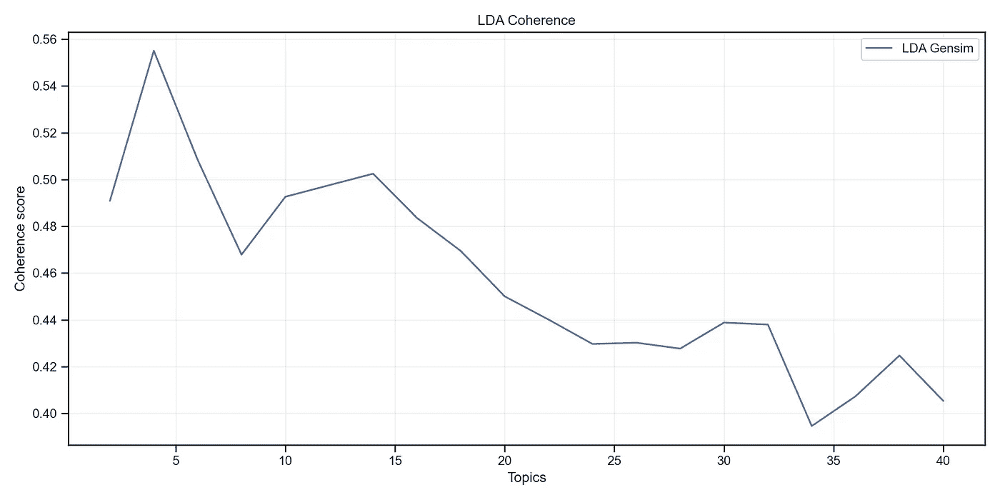

根据 LDA 一致性结果，当主题数量 K 为 4 且具有等于 **0.555** 的**一致性分数**时，最高点被定位。然而，这些主题仍然很宽泛，没有包含足够的关于行动的实际问题的信息。

基于此，新的方法是在曲线开始下降之前寻找 K 的最后一个数字。在这种情况下，我们的最佳模型是当 **K=14** 时，得到的**一致性分数**等于 **0.502** ，如果我们考虑到我们正在处理的是关于业务运营的简短技术文本，而且它们是西班牙语的，这仍然是很好的。

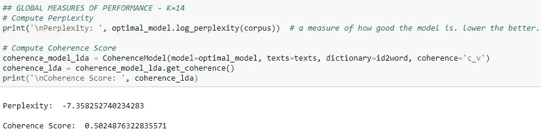

得益于 pyLDAvis 图，我们还可以看到，当 K=14 时，主题分布良好，不会重叠

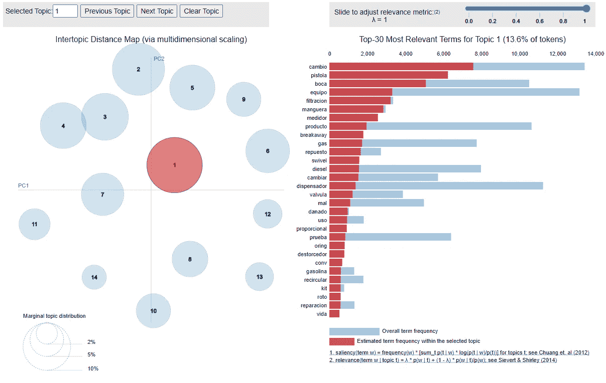

pyLDAvis

## 主题分配

通过使用每个主题的 15 个最常用的词，并借助词云图，我们可以确定每个主题的内容。这一描述也得到了 M&R 分部经理的支持，他们将技术词汇与业务运作联系起来。

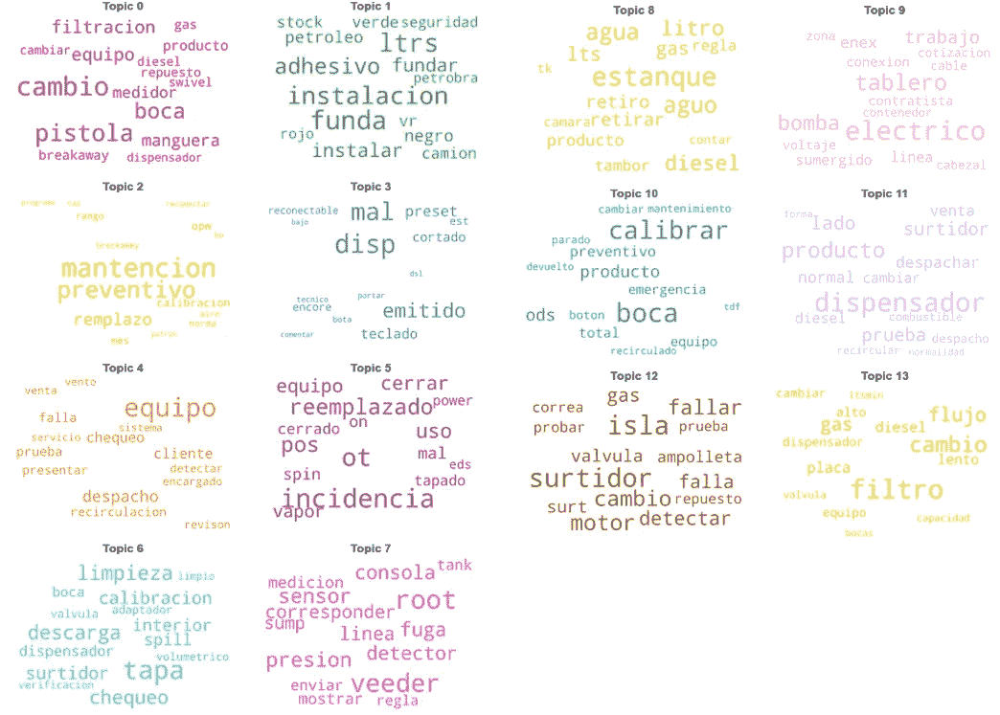

> **主题描述(翻译成英语)——有些单词是商务词汇的一部分，因此可能没有合适的翻译**
> 
> -主题 0:更换加油站的功能部件(气泵、软管、仪表、分离装置、旋转装置等)。)
> -议题 1:在设备上安装盖子和安全元件
> -议题 2:预防性维护
> -议题 3:错误发布的工单和设备小问题
> -议题 4:调度和客户销售设备
> -议题 5:紧急事件
> -议题 6:排放盖和阀门
> -议题 7:三角座控制台和传感器
> -议题 8:水、气和柴油箱
> -议题 9:电气问题(电路板、连接等)。)
> -话题 10:校准
> -话题 11:分配器
> -话题 12 : Isla、电机、供应商
> -话题 13:过滤器和过滤问题

通过查看`text_detail`列来寻找每条记录的主要主题，我们可以说 M & R 中故障和活动类型的新分布如下

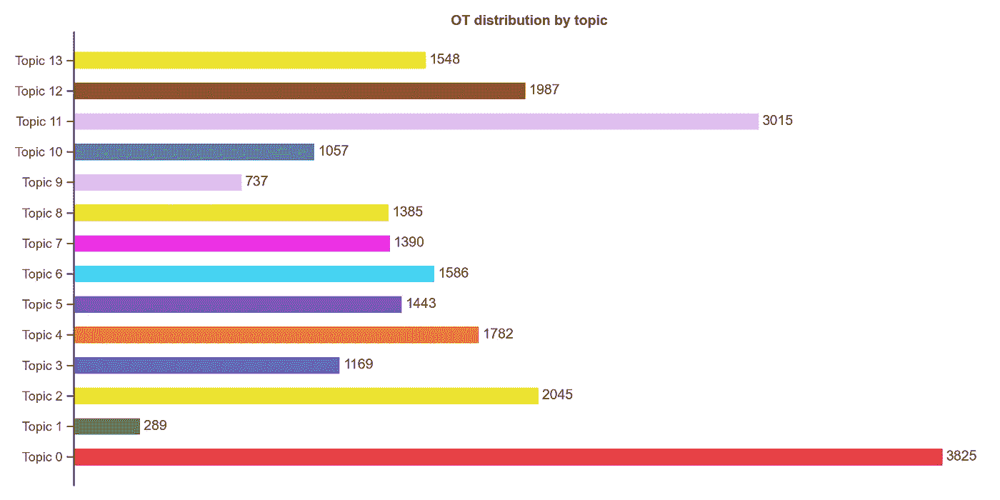

Work order (OT) distribution per Topic

> **Q3。答**
> 
> a)最初我们处理了“tipo_de_falla”(故障类型)列，它有 66 种不同类型的故障和活动。但是，这对公司没有用，因为几乎 50%的登记簿都被标为“其他”。因此，第一种分类不具有代表性。基于非结构化文本列，决定使用使用 LDA 算法的主题模型方法。
> 
> b)主题 0(替换加油站中的功能组件)集中了 M&R 分部活动的 16.5% (3825 个文档)，是主要的推理
> 
> c)接下来是主题 11(分配器)、主题 2(预防性维护)和主题 12 (Isla、电机、供应商)，分别占 12.9%、8.79%和 8.54%。
> 
> d)另一方面，最不经常出现的主题是 1(在设备上安装盖子和安全元件)和 9(电气问题)，分别占文件总数的 1.24%和 3.16%
> 
> e)与开始时“其他”登记簿代表 45%的“故障类型”不同，我们现在有了更适合业务运营的活动分类

# 6.部署

CRISP-DM 方法的最后一步是与利益相关者分享见解，或者在这种情况下，与任何想要以简单的方式了解结果的人分享见解。

在这种情况下，这篇中型文章有助于以更好的方式解释这个项目的笔记本中描述的概念，你可以在 GitHub [这里](https://github.com/alexrop/crispdm_businesscase_sgs)找到这些概念。自述文件提供了有关安装和运行的更多信息。

# 摘要

通过应用 CRISP-DM 方法，我们能够从 M&R 业务中提取未知的有用信息。

通过我们的数据分析、可视化和建模，我们回答了关于 M&R 数据集的三个问题。

1.  从 2019 年 4 月起，工作订单(OT)开始变得更加频繁。2019 年 6 月为高峰，2018 年 9 月为最低点。月初加班人数稍有增加的趋势。周一是 M&R 收到订单最多的一天，通常是在上午。
2.  43%的加班时间不到 24 小时，55%的加班时间不到 2 天。另一方面，被取消或从未参加的加班比例为 16%。此外，36%的情况下，问题在几分钟内(不到一个小时)得到解决，55%的情况下不到两个小时。
3.  第一个*“故障类型”*分类不具有代表性。因此，主题建模方法被实施，其中发现了 14 个主题。**主题 0** (加油站功能部件的更换)集中了总活动的 16.5% (3825 个文档)，是主要的诡辩。接下来依次是**主题 11** (分配器)、**主题 2** (预防性维护)和**主题 12** (Isla、电机、供应商)，分别占 12.9%、8.79%和 8.54%。另一方面，出现频率最低的主题是**主题 1** (在设备上安装盖子和安全元件)和**主题 9** (电气问题)，分别占文件总数的 1.24%和 3.16%。

感谢您的关注！