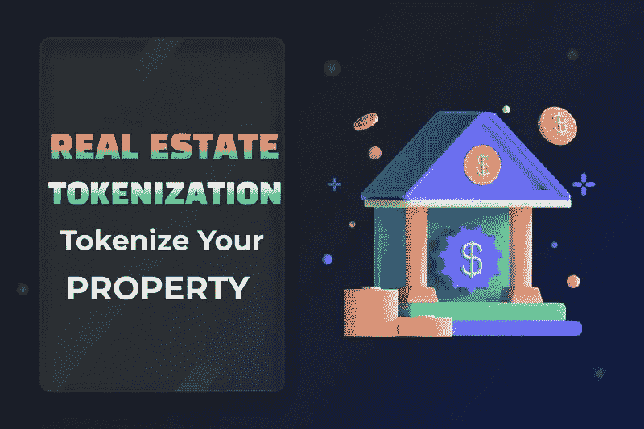

# 房地产令牌化:任何人都不应该错过的全面概述！

> 原文：<https://medium.com/geekculture/real-estate-tokenization-a-comprehensive-overview-anyone-shouldnt-miss-bbf6a5ee8442?source=collection_archive---------5----------------------->

区块链技术的发展引人注目；二十年前，这是一个学术界广泛争论的话题，十年前，第一个网络诞生了。快进到今天，它已经成为下一个版本的互联网的主机，这要求最大限度的去中心化。

[**如何令牌化一个属性？**](https://www.blockchainappfactory.com/real-estate-tokenization?utm_source=Medium+GC&utm_medium=27%2F11%2F22&utm_campaign=senpagapandian)

许多现实世界的应用已经通过这些网络进入了未来的互联网——房地产就是其中之一。 [**不动产标记化允许将物理土地属性标记为区块链**](https://www.blockchainappfactory.com/real-estate-tokenization?utm_source=Medium+GC&utm_medium=27%2F11%2F22&utm_campaign=senpagapandian) 条目，并分配给更广泛的社区。让我们看看使用区块链技术标记房地产资产的基础。

# 首先是房地产令牌化

首先，房地产令牌化是为可以出售给投资者的房地产资产创建令牌的过程。这样的过程对卖方和买方都有很多好处，可以在有经验的服务提供商的帮助下实现。

对于房地产行业来说，它已经成为一份有价值的礼物，传统上，房地产行业充斥着众多的中介机构、大量的文件、高昂的成本和欺诈的可能性。此外，它还通过一种称为安全令牌发行(STO)或令牌化资产发行(TAO)的模式，使用加密令牌作为筹资工具。

> [***“现在，令牌化的房地产已经超越了元宇宙地块，价格高达数百万美元！”***](https://www.blockchainappfactory.com/real-estate-tokenization?utm_source=Medium+GC&utm_medium=27%2F11%2F22&utm_campaign=senpagapandian)

# 房地产代币能代表什么？

在讨论房地产代币可以代表什么之前，必须注意这些代币可以是可替代代币(筹款代币)或不可替代代币(房地产 NFT)。让我们从以下几点来看看他们是如何表现自己的:

*   部分地产资产的所有权
*   整个房地产资产的所有权
*   控制房地产的实体的股权
*   由不动产担保的债务权益
*   分享不动产资产产生的利润的权利

这些要点描绘了这些令牌在用户端如何工作的日常用例，尽管各种创业爱好者正在探索更新的用例。

# 在标记房地产资产之前要核实的清单

*   分散平台
*   使用智能合同
*   提供的兴趣类型
*   涉及的法律实体
*   证券委员会的规定
*   要遵循的公司准则
*   资产的类型
*   资产的位置
*   标记化比率
*   资产的现有抵押
*   投资者的可追溯性
*   自动 KYC/反洗钱协议
*   合格投资者验证流程
*   国际融资
*   法律和监管框架
*   控制管辖权

通过确保以上清单中的项目得到真正的验证，房地产可以通过商业提供商平台或 B2B 服务提供商无缝地进行令牌化，后者是资产持有人最喜欢的选择。

# 创建不动产令牌的好处

*   房地产标记化为标记化的物业提供**高容量流动性**，否则这些物业可能会由于多种原因而无法出售。
*   **部分所有权**使用代表资产文件的 NFT，许多人可以成为房地产资产所有权的一部分，这在最近变得很流行。
*   随着更高的流动性和更少的限制,**全球化**到来，允许世界任何地方的任何人购买实物土地 NFT，而没有传统房地产的麻烦。
*   也许，推动区块链房地产数字化的要点将是**没有中介**完全消除第三方行为者，这增加了时间，并多次为灾难打开了通道。
*   **由区块链提供的不变性**禁止非法行为者将财产契约转移给他们自己或他们的同谋。这是因为如果他们试图对现有交易进行更改，他们的操作将在网络上公开可见。
*   **即时交易**利用分散式分类账在同行之间以更低的成本加速房地产资产转让。
*   **降低准入门槛**允许散户投资者通过花一点钱收购非金融资产，并根据自己的喜好进行交易或押注，从而进入房地产市场。
*   **简化的资产管理**使卖方能够通过无缝仪表板轻松管理其资产，以防其被用作股权支持加密发行令牌。

# 目前对房地产进行令牌化是正确的吗？

在认真考虑房地产的令牌化时，政府法规往往会成为障碍，因为它直接处理不同国家管辖范围内的物理土地。虽然简明的框架尚待建立，但可以说未来是光明的，因为各种经验丰富的法律从业者和政治家已经将这一进程提升到主要阶段。

假设你正在寻求将你的房地产资产转换成区块链驱动的代币，或者寻找一个执行这些过程的商业平台。在这种情况下，这可能是开始的最佳时机，因为许多专业的房地产标记化 公司已经在世界各地涌现。选择其中一个，传达你的想法和关注，让它们得到理想的解决，以满足你的需求。