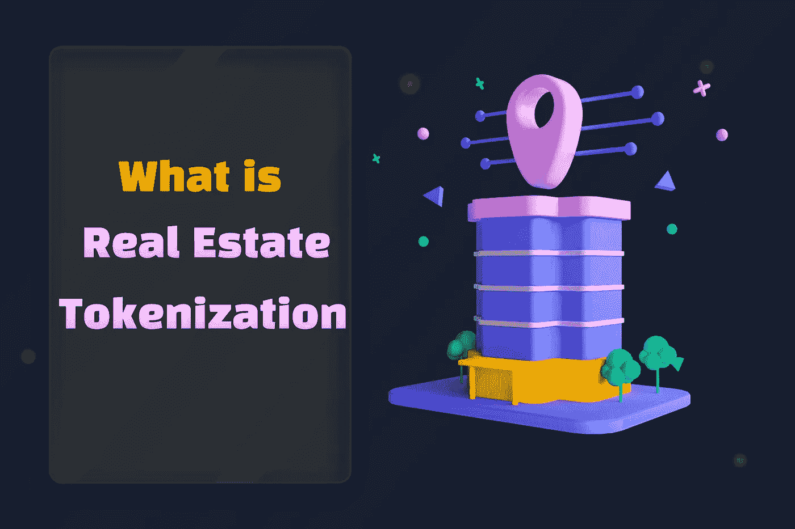

# 房地产令牌化—2022 年和 2023 年完整指南

> 原文：<https://medium.com/geekculture/real-estate-tokenization-complete-guide-for-2022-2023-29741331a1ab?source=collection_archive---------9----------------------->

Real Estate Tokenization

由于采用了区块链技术，房地产行业正在经历一场重大变革。 [**基于区块链的房地产令牌化，让原本需要更多资金的有房地产业务天赋的人**](https://www.blockchainappfactory.com/real-estate-tokenization?utm_source=Medium+GC&utm_medium=16%2F11%2F22&utm_campaign=senpagapandian) 也可以这样做。该部门的固有问题，如缺乏透明度、信任和速度，也已得到解决。

👉👉 [**开始令牌化你的属性**](https://www.blockchainappfactory.com/real-estate-tokenization?utm_source=Medium+GC&utm_medium=16%2F11%2F22&utm_campaign=senpagapandian) 👈👈**点击这里**

# **房地产记号化有哪些种类？**

以下类别可用于对房地产资产令牌化市场进行分类:

*   区块链证券化资产:2022 年区块链证券化资产引领市场。最新报告指出，到 2022 年，房地产代币将占所有交易证券代币的近 89%。
*   区块链的完全令牌化资产:它们在二级市场上交易不活跃
*   已经完全令牌化的资产:二级市场正在积极交易这些产品。

## **房地产资产虚拟化服务如何运作？**

传统上，房地产是流动性最差的资产类别之一。这是因为房地产交易需要大量的财产管理，法律技能和广泛的规划。

通过遵循这五个阶段，区块链上的数字资产令牌化有助于克服所有这些困难:

## **构建智能合同交易的第 1 阶段**

基于管辖权和股东类型的法规是房地产令牌化资产的重要因素。令牌化的条款是为当前和潜在投资者预先制定的。

## **第二阶段-资产数字化**

安全令牌与存储区块链房地产交易传统信息的智能合同一起发行。

采用四种结构将资产证券化，并将其转化为区块链的投资工具:

## **2.1 SPV 结构**

术语“SPV”代表单一资产特殊目的载体，它使合格的机构买家或合格的投资者能够参与交易。代币在这种结构中代表房地产的份额。

## **2.2 房地产基金结构**

代币代表该基金的股份，其功能类似于私募股权基金。只有合格的机构投资者才被允许从该股票基金购买房产，该基金投资于他们的投资组合。

## **2.3 财务结构**

房地产被标记为数字资产，以促进这种结构中的筹资。代币由经认可的机构买家或散户投资者在二级市场上购买。

## **2.4 房地产投资信托(REIT)结构**

尽管这种结构对散户投资者来说是可行的，但操作起来比其他结构更昂贵。投资者可以通过房地产投资信托基金创建数字增强型股票。此外，房地产投资信托基金的房地产权人有权像传统投资者一样经营收入。

智能合约的基本准则是基于这些结构建立的。

## **第三阶段-技术选择**

技术的选择对于房地产令牌化至关重要。选择资产虚拟化服务提供商后，您必须决定三个关键问题:

## **3.1 区块链&令牌选择**

必须为您的不动产令牌选择正确的区块链。交易速度、每笔交易的汽油成本和区块链的安全性是选择区块链为您的房地产令牌添加转让限制的主要标准。

## **3.2 KYC/反洗钱验证**

投资者或代币购买者必须在购买房地产代币的平台上完成 KYC/反洗钱流程。

## **3.3 一级或二级市场**

买家必须能够进入一个市场，通过该平台支持数字资产的一级或二级代币销售。

## **阶段 4-令牌分发**

令牌的创建和分发必须在智能合约的开发和实现之后完成。实物资产令牌化平台可以为买家提供一系列支付选择。令牌分发通常以三种方式进行:

## **4.1 一次配送:**

投资者获得这些新创造的代币，以换取他们对项目的初始金融投资。

## **4.2 二级交易:**

令牌化至关重要，因为它增加了流动性。代币在其他交易所上市进行二级交易，以便其他投资者可以与其他代币或用户进行交易。

## **阶段 5-后期标记化支持**

资产令牌化服务提供商提供令牌化后的帮助，帮助解决抵押贷款困难、法律问题和活动跟踪。

## **结论**

随着最近的技术进步，房地产一直在增长。在区块链加入之前，这个过程是不同的，这对那些做生意的人来说是很难的。但是，现在，随着房地产 的 [**令牌化，你可以轻松地交易房地产资产，这就是为什么该部门现在变得如此不可思议。是你抓住系统提供的好处的时候了；这样，你就能创造不可思议的事情。现在就开始房地产令牌化，为新的未来让路。**](https://www.blockchainappfactory.com/real-estate-tokenization?utm_source=Medium+GC&utm_medium=16%2F11%2F22&utm_campaign=senpagapandian)