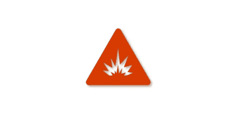

# 数据泄露的现实后果和示例、一些行业见解和一些降低风险的技巧

> 原文：<https://medium.com/geekculture/real-life-consequences-and-examples-of-data-breaches-some-industry-insights-and-some-tips-to-3dff9638fdf7?source=collection_archive---------13----------------------->

由于最近新闻上的一些重大违规事件，我向自己提出了这样一个问题:“对那些组织中的公司和个人会有什么后果？”。

除了财务和品牌损失之外，我开始研究违规后会发生什么，因为这些后果一直被大公司定期彻底跟踪。

接下来，让我们来看一些最近成为头条新闻的关于数据泄露的新闻。

## Optus 数据泄露(2022 年 9 月)

2022 年 9 月，澳大利亚电信公司 Optus 数据泄露成为该国有史以来最大的数据泄露事件之一，约有 1000 万(约占总人口的 40%)客户的私人数据泄露，包括家庭地址、驾照和护照。([来源](https://www.reuters.com/technology/australia-unveils-privacy-rule-changes-after-optus-data-breach-2022-10-06/))

## 技术上发生了什么？

报告显示，对提供敏感信息的公共 API 缺乏适当的控制。[根据门卫](https://www.theguardian.com/business/2022/sep/29/optus-data-breach-everything-we-know-so-far-about-what-happened):

> 报告显示，Optus 有一个在线应用编程接口(API ),无需授权或认证即可访问客户数据。
> 
> Moss Adams 的网络安全咨询高级经理 Corey J Ball 说:“在公共 API 端点不需要认证的情况下，互联网上任何知道该端点[URL]的人都可以使用它。
> 
> “如果该终端用于访问客户数据，那么互联网上的任何人都可以使用该终端收集客户数据。
> 
> “如果没有身份验证和授权的技术控制，任何用户都可以请求任何其他用户的信息。攻击者可能编写了重复终端请求的过程，直到他们收集了数百万个个人身份信息实例。
> 
> Optus 仍未确认数据是如何被访问的。它坚持认为攻击是复杂的，但内政部长克莱尔·奥尼尔说，这种漏洞类似于 Optus 让窗户开着。

## 影响？

本质上，对欺诈交易的高度关注。但是一些抑制这种情况的措施正在进行中。

澳大利亚政府采取措施改变政府发布文件的隐私规定。根据澳大利亚财政部长的说法:

> “它们经过精心设计，具有强大的隐私和安全保护措施，以确保只有有限的信息可以临时提供，以防止和应对网络安全事件、欺诈、诈骗和相关活动，”司库吉姆·查默斯在一次媒体会议上说。

## 对数据保留法律的影响？

[据 BBC](https://www.bbc.com/news/world-australia-63056838) 报道:

> 安全专家还建议改革数据保留法律，这样电信公司就不必将敏感信息保留这么长时间。专家说，以前的顾客也应该有权要求公司删除他们的数据。
> 
> Optus 表示，根据目前的规定，它需要保留身份数据六年。

## 优步 2016 数据泄露及其后果(2022 年 9 月)

优步安全首席执行官因未向拼车网络披露 2016 年的一次黑客攻击而被判有罪。[据福布斯](https://www.forbes.com/sites/marisadellatto/2022/10/05/former-uber-security-chief-convicted-of-covering-up-data-breach/?sh=6e60c8962b76)报道:

> 周三，一名前优步高管因未能向美国联邦贸易委员会报告 rideshare 公司 2016 年的一次黑客攻击而被判犯有联邦妨碍司法罪，据信这是一名高管首次因数据泄露而面临刑事审判。

显然，当时的高管采取了主动措施来隐瞒所发生的事情——据 techcrunch 报道[:](https://techcrunch.com/2022/10/06/ubers-former-security-chief-found-guilty-of-covering-up-2016-data-breach/)

> 现在担任 Cloudflare 首席安全官的沙利文告诉一名下属，有关违规的信息需要“严格控制”，安全小组以外的故事是“这项调查不存在。”他还以漏洞奖励计划的名义，安排付给黑客 10 万美元，以换取他们签署保密协议，承诺不泄露黑客攻击。

## 技术上发生了什么？

影响数千万客户和司机记录的数据泄露。

关于发生了什么的细节很少，因为它没有被适当地披露，现在正在接受美国联邦贸易委员会的调查。

## 影响

techcruch 提到了一些财务和个人影响:

> 优步已经支付了 1 . 48 亿美元来解决美国 50 个州和哥伦比亚特区试图掩盖漏洞的诉讼。英国和荷兰数据保护机构也对[处以总计近 120 万美元的罚款](https://techcrunch.com/2018/11/28/ubers-bill-for-2016-breach-and-cover-up-rises-by-1m-on-eu-fines/);此次事件影响了 82，000 名英国司机和 174，000 名荷兰公民。
> 
> 宣判日期尚未确定，但根据 DOJ(司法部)的说法，沙利文因妨碍司法公正的指控而面临最高五年的监禁，因未能报告犯罪而面临最高三年的监禁。

# 更多数据—来自 IBM 报告

2021 年，IBM 发布了一份由 Ponemon Institute 进行的关于“数据泄露成本”的[更新报告](https://newsroom.ibm.com/2021-07-28-IBM-Report-Cost-of-a-Data-Breach-Hits-Record-High-During-Pandemic)。

该报告包括:

> IBM Security 和 Ponemon Institute 的《2021 年数据泄露成本》报告基于对 2020 年 5 月至 2021 年 3 月期间全球 500 多家组织经历的 100，000 条或更少记录的真实数据泄露的深入分析。该报告考虑了数据泄露事件中涉及的数百个成本因素，从法律、法规和技术活动到品牌资产、客户和员工工作效率的损失。

## 发生了什么事？

根据该报告，一些突出的发现包括:

*   作为一个因素，远程工作比没有 it 作为一个因素的平均违规成本增加了 100 万英镑。
*   医疗违规成本最高:

> 每起事故 923 万美元，比上一年增加了 200 万美元。

*   泄露凭据的风险不断增加，并导致数据泄露。

## 影响

虽然报告提出了许多负面影响:

*   *数据泄露平均每起事件给接受调查的公司造成 424 万美元的损失；17 年报告历史最高*

它还强调了这并不完全是灾难，现代技术有助于降低违规的风险和成本:

*-采用人工智能、混合云和零信任方法降低了数据泄露成本*

> 采用人工智能、信息安全智能分析和加密是降低违规成本的三大缓解因素，与那些没有大量使用这些工具的公司相比，这些因素为公司节省了 125 万至 149 万美元。对于所研究的基于云的数据泄露，实施混合云方法的组织的数据泄露成本(361 万美元)低于主要采用公共云(480 万美元)或主要采用私有云方法(455 万美元)的组织。

了解有关我的云和安全项目的更多信息:[https://linktr.ee/acamillo](https://linktr.ee/acamillo)

[考虑订阅 Medium (here)](https://andrecamillo.medium.com/membership) 获取更多内容，让你更有力量！

感谢您的阅读，并留下您的想法/评论！

## 参考

[澳大利亚在 Optus 数据泄露后公布隐私规则变化|路透社](https://www.reuters.com/technology/australia-unveils-privacy-rule-changes-after-optus-data-breach-2022-10-06/)

[前优步安全主管因掩盖数据泄露被判有罪|金融时报(ft.com)](https://www.ft.com/content/051af6a1-41d1-4a6c-9e5a-d23d46b2a9c9)

[IBM 报告:疫情期间数据泄露成本创历史新高](https://newsroom.ibm.com/2021-07-28-IBM-Report-Cost-of-a-Data-Breach-Hits-Record-High-During-Pandemic)