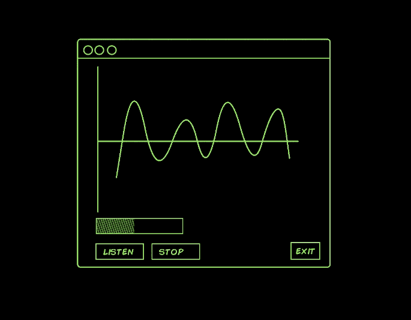

# Python 中的实时音频可视化。

> 原文：<https://medium.com/geekculture/real-time-audio-wave-visualization-in-python-b1c5b96e2d39?source=collection_archive---------4----------------------->



All images by author.

## 或者如何克服集成地狱。

```
**Why read this?** You want to visualize audio in realtime with Python and find the whole thing intimidating (*like I did !*) or you might be having problems integrating complex libraries and want to hear a tall tale of how I solve mine along with some tips.
```

## 我们在建造什么？