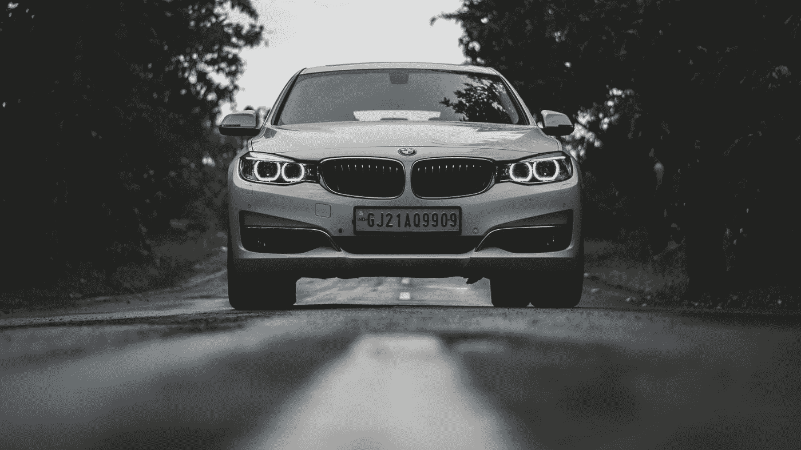
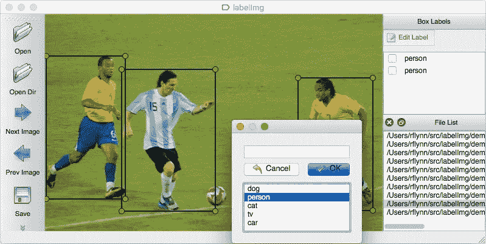
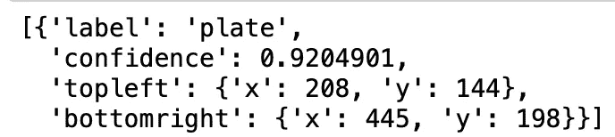
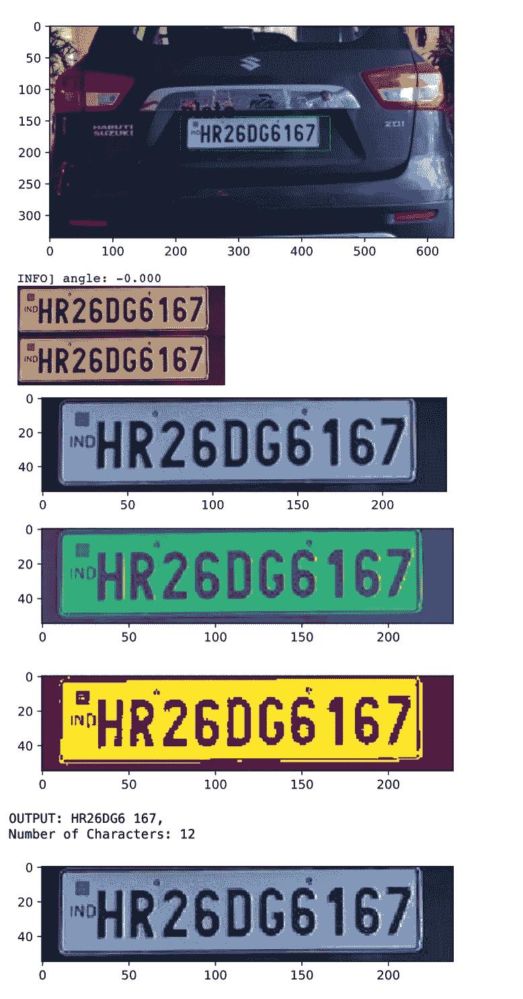

# 实时自动车牌识别系统

> 原文：<https://medium.com/geekculture/real-time-automated-number-plate-recognition-system-1820b5e42bae?source=collection_archive---------9----------------------->



Photo by [Sahil Patel](https://unsplash.com/@sam0076?utm_source=medium&utm_medium=referral) on [Unsplash](https://unsplash.com?utm_source=medium&utm_medium=referral)

# 介绍

在当今时代，安全性已经成为任何组织最关心的问题之一，这种安全性的自动化是必不可少的。可以提高系统安全性的一个领域是通过实时自动车牌识别，这可以帮助组织更好地了解和收集简单的细节，如通过大门、车道或路口的交通性质，否则这将变得乏味。虽然视频安全在世界范围内被采用，但是仍然缺乏将这种非结构化数据转换成可用且易于存储的数据的系统。通过深度学习和神经网络，这样一个系统的开发是可能的。这些系统使用各种可用的算法来预测最准确的结果，这些系统的能力在于所使用的各种各样的训练集、所使用的各种对象检测和识别库以及所使用的大量训练。

# 内容:

1.  关于 YOLO 和暗网的介绍。
2.  训练集的图像注释。
3.  下载所有需要的资源。
4.  实施准则。
5.  结论和参考文献。

# 1.什么是暗网，什么是 YOLO？

**Darknet** 是一个用 C 和 CUDA 编写的开源神经网络框架。它速度快，易于安装，支持 CPU 和 GPU 计算。你可以在开发者 Joseph Redmon 的 [GitHub](https://github.com/pjreddie/darknet) 上找到源代码。

**你只看一次(YOLO)** 是建立在 Darknet 之上的最先进的实时物体检测系统。你可以在官网[这里](https://pjreddie.com/darknet/yolo/)下载所有资源。YOLO 是最有趣的实时检测算法之一，因为它只有一个前向传播步骤来进行预测。非最大值后抑制然后输出带有边界框的已识别对象。

**架构:**

*   **输入**是一批图像，每个都被整形为(608，608，3)。
*   图像然后被分成 19 乘 19 的部分，然后这些部分的每一个被输入到一个深度 CNN，我们在这里使用 5 个锚盒。
*   我们需要 5 个参数来检测框中的对象并检测边界框(p，bx，by，bw，bh)，我们需要 80 个不同的类来决定它是哪个对象。
*   所需的**输出**是形状为(19，19，5，85)的 Numpy 数组


Figure 1: Working of YOLO

一旦我们得到(19，19，5，85)形式的输出。最后两个维度被展平，因此最终输出将具有(19，19，425)的形状。

# 2.训练图像的注释

在注释训练集之前，您需要先收集它。在这里，我从一些 Kaggle 数据集，一些自己的图片和谷歌收集到了它。这种标注数据集的相同技术可以用于检测任何类型的定制对象(尽管大多数已经在 Yolo 中预先分类，这里车牌检测是一个非常特殊的情况)。

一旦收集到数据，我们就使用由 GitHub 用户 tzutalin 开发的名为 [LabelImg](https://github.com/tzutalin/labelImg) 的定制 python 程序。GitHub 页面上面的链接给出了如何使用它的清晰说明。这个软件可以帮助你注释，绘制边界框，将注释保存在 XML 文件中，这可以通过我们的 YOLO 模型来处理，它甚至有一个名为 YOLO 的配置来使事情变得更容易。该软件自动创建一个名为 classes.txt 的配置文件来表示类的数量。请确保删除除了您为号码牌创建的类别之外的所有内容。

这个过程很繁琐，而且必须对每张图像进行 T2。让大多数人退出这个项目已经够无聊的了，但是我向你保证，当最终代码成功时，这一切都是值得的。



Figure 2: labeling program(Source:[https://github.com/tzutalin/labelImg](https://github.com/tzutalin/labelImg))

# 3.下载所有需要的资源

有很多关于在自定义对象上训练 Yolo 模型的资源，一些最好的资源是[这个](https://towardsdatascience.com/how-to-detect-license-plates-with-python-and-yolo-8842aa6d25f7)和[这个](https://towardsdatascience.com/how-to-train-a-custom-object-detection-model-with-yolo-v5-917e9ce13208)，这里的基本要点是从 pjreddie 的 GitHub 安装 darknet 和 YOLO，构建它，然后在配置和路径上进行更改，以将模型指向自定义数据集并训练它。我发现这个研究过程非常乏味，但是感谢 GitHub 用户 thtrieu 创建的 [dark flow](https://github.com/thtrieu/darkflow) ，它变成了实现 darknet 和 Yolo 的一个命令。尽管之后还需要做一些配置来运行车牌检测。

为了简化实现这个项目的一切，最简单的方法是下载或克隆我的 GitHub [库](https://github.com/saky9596/ALPR)。

```
git clone [https://github.com/saky9596/ALPR.git](https://github.com/saky9596/ALPR.git)
```

# 4.实施准则

## 入门指南

训练数据集的最好方法是在 Google colab 上。为此，您需要首先将下载的存储库上传到您的 google drive，并在 google colab 中打开文件名[License _ plate _ recognition-colab . ipynb](https://github.com/saky9596/ALPR/blob/master/License_plate_recognition-colab.ipynb)。通过在运行时>管理会话中更改 GPU 内核来使用它。我们需要使用 TensorFlow 1.x，因为它最适合暗流。然后我们需要用下面的方法安装你的谷歌硬盘，如果你觉得有困难，请参考这个[参考](https://colab.research.google.com/notebooks/io.ipynb)。然后转到项目文件夹，使用下面的代码构建 cython_utils。

```
%tensorflow_version 1.x //this will force colab to use TF 1.x
from google.colab import drive
drive.mount('/content/drive')
import os
os.getcwd()
os.chdir('/content/drive/MyDrive/ALPR')// changes working directory
!python3 setup.py build_ext --inplace // build cython extensions
```

导入所需的库

```
import cv2from darkflow.net.build import TFNetimport matplotlib.pyplot as plt%config InlineBackend.figure_format = ‘svg’
```

## 培养

以下是配置选项，我拍了一批 4 个图像，每批 300 个图像，确保将 GPU 参数添加为 1.0:

```
%%timeoptions = {"model": "cfg/yolo-voc-1c.cfg","load": "weights/tiny-yolo-voc.weights","batch": 4,"gpu": 1.0,"epoch": 300,"train": True,"annotation": "new_data/labels","dataset": "new_data/images"}
```

使用以下代码构建模型:

```
%%timefrom darkflow.net.build import TFNettfnet = TFNet(options)
```

训练数据:

```
%%timetfnet.train()
```

这将花费很多时间(在我的情况下至少 2 到 3 个小时)，权重将每 2000 步保存到您的项目文件夹中一次。我们应该确保进行足够的训练，大约 22000 次。一旦训练了权重，在 google drive 的项目文件夹中应该有一个名为 ckpt 的文件夹，其中应该有训练过的数据。您可以使用下面的代码使用这些权重来构建您的模型。负载参数应该是训练到最后一个检查点的步数。

[这里的](https://drive.google.com/drive/folders/1k52gpFxyz2RY-UiZ9koheHmHU_pCEKPP?usp=sharing)是我的 google drive 项目文件夹的链接，这样你就可以使用我之前训练的权重(权重在 ckpt 文件夹中，将其复制到你 pc 上的项目文件夹中)，最好使用笔记本[License _ plate _ recognition-pc . ipynb](https://github.com/saky9596/ALPR/blob/master/License_plate_recognition-pc.ipynb)在你的 PC 上运行以下内容，因为 google colab 无法创建单独的窗口来显示视频结果。(像以前一样使用项目文件夹下 cmd 中的“python 3 setup . py Build _ ext—in place”构建 cython_utils，一定要使用 TensorFlow 1.x.x 和 python 3.7)。在您的电脑上再次导入所有需要的库，然后运行下面的代码来检索您之前训练的权重并建立一个模型。

```
%%timeoptions = {‘model’: ‘cfg/yolo-voc-1c.cfg’,‘load’: 24000,‘gpu’:1.0,‘train’:True,‘threshold’: 0.1,‘backup’:’ckpt/’,“annotation”: “new_data/labels”,“dataset”: “new_data/images”,“batch”:4,“epoch”:100}tfnet2 = TFNet(options)
tfnet2.load_from_ckpt()
```

使用 Yolo 模型的结果:

```
# read the color image and covert to RGB
import cv2img = cv2.imread(‘new_data/images/licensed_car168.jpeg’,cv2.IMREAD_COLOR)
img = cv2.cvtColor(img, cv2.COLOR_BGR2RGB)# use YOLO to predict the image
result = tfnet2.return_predict(img)result
```



Figure 3: Result of YOLO model

## 使用宇宙魔方的字符识别；

由于噪声、背景干扰、颜色变化、旋转和倾斜，字符识别对于模型来说总是困难的。因此，我们将使用一个辅助函数，将每个号码牌转换成相似的格式:

```
def my_function(image):

    # import the necessary packages
    import numpy as np
    #import argparse
    import cv2

    # convert the image to grayscale and flip the foreground
    # and background to ensure foreground is now "white" and
    # the background is "black"
    gray = cv2.cvtColor(image, cv2.COLOR_BGR2GRAY)
    gray = cv2.bitwise_not(gray)

    # threshold the image, setting all foreground pixels to
    # 255 and all background pixels to 0
    thresh = cv2.threshold(gray, 0, 255,
        cv2.THRESH_BINARY | cv2.THRESH_OTSU)[1]

    # grab the (x, y) coordinates of all pixel values that
    # are greater than zero, then use these coordinates to
    # compute a rotated bounding box that contains all
    # coordinates
    coords = np.column_stack(np.where(thresh > 0))
    angle = cv2.minAreaRect(coords)[-1]

    # the `cv2.minAreaRect` function returns values in the
    # range [-90, 0); as the rectangle rotates clockwise the
    # returned angle trends to 0 -- in this special case we
    # need to add 90 degrees to the angle
    if angle < -45:
        angle = -(90 + angle)

    # otherwise, just take the inverse of the angle to make
    # it positive
    else:
        angle = -angle

    # rotate the image to deskew it
    (h, w) = image.shape[:2]
    center = (w // 2, h // 2)
    M = cv2.getRotationMatrix2D(center, angle, 1.0)
    rotated = cv2.warpAffine(image, M, (w, h),
        flags=cv2.INTER_CUBIC, borderMode=cv2.BORDER_REPLICATE)

    # draw the correction angle on the image so we can validate it
    #cv2.putText(rotated, "Angle: {:.2f} degrees".format(angle),
    #    (10, 30), cv2.FONT_HERSHEY_SIMPLEX, 0.7, (0, 0, 255), 2)

    # show the output image
    print("[INFO] angle: {:.3f}".format(angle))
    cv2.imshow("Input", image)
    cv2.imshow("Rotated", rotated)
    return rotated
    cv2.waitKey(0)
```

现在让我们测试 OCR 并可视化结果。

```
img1=img.copy()
# pull out some info from the results
for i in range(0, len(result)):
tl = (result[i]['topleft']['x'], result[i]['topleft']['y'])
br = (result[i]['bottomright']['x'], result[i]['bottomright']['y'])
label = result[i]['label']
# add the box and label and display it
img = cv2.rectangle(img, tl, br, (0, 255, 0), 1)
img = cv2.putText(img, label, tl, cv2.FONT_HERSHEY_COMPLEX, 1, (0, 0, 0), 2)
plt.imshow(img)
#image[1:(y2 + 1), 1:(x2 + 1)]
plt.show()
for i in range(0,len(result)):
tl = (result[i]['topleft']['x'], result[i]['topleft']['y'])
br = (result[i]['bottomright']['x'], result[i]['bottomright']['y'])
label = result[i]['label']
cropped=img1[tl[1]:(br[1] + 1), tl[0]:(br[0] + 1)]
cropped=my_function(cropped)
image = cropped
plt.imshow(image)
plt.show()
gray = cv2.cvtColor(image, cv2.COLOR_BGR2GRAY)
plt.imshow(gray)
plt.show()
gray = cv2.threshold(gray, 0, 255, cv2.THRESH_BINARY | cv2.THRESH_OTSU)[1]
plt.imshow(gray)
plt.show()
out_below = pytesseract.image_to_string(gray)
print("OUTPUT:", out_below)
print("Number of Characters:", len(out_below))
plt.imshow(cropped)
plt.show()
```

这将输出:



Figure 4: Output of Character Recognition

## 视频实现模型

首先，我们需要将视频转换成较小的尺寸，以便我们的 GPU 进行处理，但是，如果您有足够的能力，就不需要执行这一步

```
import moviepy.editor as mp
import timeclip = mp.VideoFileClip(“1.mp4”)clip_resized = clip.resize(height=360) # make the height 360px ( According to moviePy documenation The width is then computed so that the width/height ratio is conserved.)clip_resized.write_videofile(“1_resized.mp4”)
```

我们将视频捕获到 OpenCV 中，并实现我们上面定义的模型。

```
capture = cv2.VideoCapture('1_resized.mp4')
colors = [tuple(255 * np.random.rand(3)) for i in range(10)]
while (capture.isOpened()):
    stime = time.time()
    ret, frame = capture.read()# ret is a boolean. True when the video is playing.
    frame1=frame.copy()
    if ret:
        results = tfnet2.return_predict(frame)

        for color, result in zip(colors, results):
            tl = (result['topleft']['x'], result['topleft']['y'])
            br = (result['bottomright']['x'], result['bottomright']['y'])
            label = result['label']
            cropped=frame1[tl[1]:(br[1] + 1), tl[0]:(br[0] + 1)]
            image = cropped
            plt.imshow(image)
            plt.show()
            gray = cv2.cvtColor(image, cv2.COLOR_BGR2GRAY)
            plt.imshow(gray)
            plt.show()
            gray = cv2.threshold(gray, 0, 255, cv2.THRESH_BINARY | cv2.THRESH_OTSU)[1]
            plt.imshow(gray)
            plt.show()
            plt.show()
            out_below = pytesseract.image_to_string(gray)
            print("OUTPUT:", out_below,len(out_below))
            plt.imshow(cropped)
            plt.show()
        for color, result in zip(colors, results):
            tl = (result['topleft']['x'], result['topleft']['y'])
            br = (result['bottomright']['x'], result['bottomright']['y'])
            label = result['label']
            frame = cv2.rectangle(frame, tl, br, color, 7)
            frame = cv2.putText(frame, label+out_below, tl, cv2.FONT_HERSHEY_COMPLEX, 1, (0, 0, 0), 2)
        cv2.imshow('frame', frame)
        #cv2.imshow('frame', frame)
        print('FPS {:.1f}'.format(1 / (time.time() - stime)))
        if cv2.waitKey(1) & 0xFF == ord('q'):
            break
    else:
        capture.release()
        cv2.destroyAllWindows()
        break
```

要关闭窗口，请中断内核或运行以下代码:

```
capture.release()
cv2.destroyAllWindows()
```

这将需要更多的训练和优化，特别是关于 IOU 阈值，以消除重复的对象检测。

# 5.结论和参考文献

恭喜你读到这篇长文的结尾。使用这种方法，基本的对象检测和识别将变得轻而易举，这种特定的应用程序可用于简化任务，如允许车辆进入受限区域。随时训练，并进一步优化它。

驱动器和 Github 链接中的我的项目文件夹:

[](https://drive.google.com/drive/folders/1k52gpFxyz2RY-UiZ9koheHmHU_pCEKPP?usp=sharing) [## ALPR -谷歌车道

### 编辑描述

drive.google.com](https://drive.google.com/drive/folders/1k52gpFxyz2RY-UiZ9koheHmHU_pCEKPP?usp=sharing) 

[https://github.com/saky9596/ALPR](https://github.com/saky9596/ALPR)

## 参考资料:

1.  雷德蒙，j .，迪夫瓦拉，s .，吉尔希克，r .和法尔哈迪，a .，2016 年。你只看一次:统一的，实时的物体检测。在*IEEE 计算机视觉和模式识别会议论文集*(第 779-788 页)。
2.  【https://pjreddie.com/darknet/yolo/ 
3.  [https://github.com/tzutalin/labelImg](https://github.com/tzutalin/labelImg)
4.  [https://towards data science . com/guide-to-car-detection-using-yolo-48 cac8 E4 ded](https://towardsdatascience.com/guide-to-car-detection-using-yolo-48caac8e4ded)