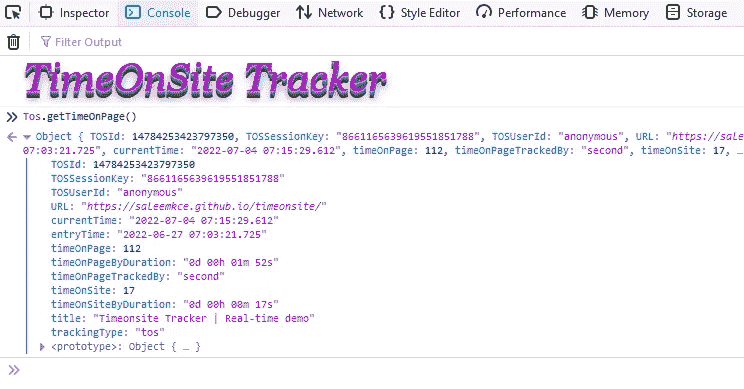
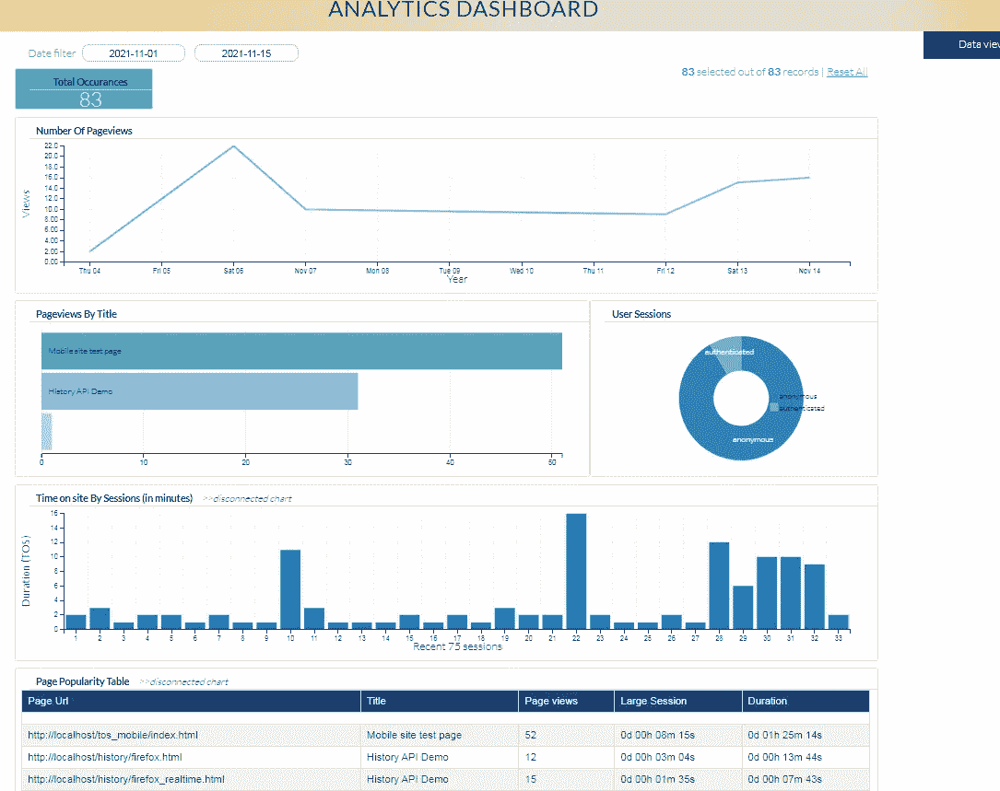

# 用户参与度跟踪中的实时选项而非延迟方法—time on site . js For Web Applications

> 原文：<https://medium.com/geekculture/real-time-option-over-delayed-approach-in-user-engagement-tracking-timeonsite-js-3ca2a2eb5e0d?source=collection_archive---------14----------------------->



Timeonsite Tracker for Web — as seen in Firefox terminal- June, 2022

众所周知，Timeonsite tracker 能够在网络和移动浏览器中有效地捕捉用户与网站的互动。有两个选项可以保存在 web UI 中收集的表格中的数据。我们将在这里详细讨论这两个选项。在 web 应用程序中初始化跟踪器时，有一个 ***配置*** 对象被传递给跟踪器。这个配置对象控制跟踪类型应该是实时还是延迟的方式。在实时情况下，数据在页面关闭、页面刷新或浏览器退出时立即发送到数据库。另一方面，延迟方法意味着在上一次页面访问中捕获的数据将只在下一页发送到数据库，但它更安全。因此，对于给定的会话，只有(n-1)个数据捕获；其中 n 表示在给定用户会话中来自浏览器的页面浏览量。

```
var config = {

    // track page by seconds. Default tracking is by milliseconds
    trackBy: 'seconds'
};
```

***配置*** 对象中的大多数可用选项都是可选的，除了，

1、*请求*

*(或)*

2、*回调*

当你至少没有给出其中之一，那么你的数据将被计算和捕获，但不会被发送到数据库。另一方面，如果两个选项都给，那么 ***回调*** 优先(除了不适用于 IOS 设备)。让我们来看看如何利用这些选项，以及在您的网站或 web 应用程序中使用每个选项的优势。

*   将跟踪器集成到页面的***<>***标签中。使用 ***最新的*** 追踪器版本。

```
<head>
     <script type="text/javascript" src="https://cdnjs.cloudflare.com/ajax/libs/timeonsite/1.2.0/timeonsitetracker.js"></script>
</head>
```

## *带有“请求”选项的示例-延迟方法(方法 1)

让我们为*对象中的 ***请求*** 选项形成如下跟踪器初始化代码:*

```
*var config = {
    // track page by seconds. Default tracking is by milliseconds
    trackBy: 'seconds', //save to local storage. If you give callback along with this       option, callback will take precedence
    request: {
        url: 'http://localhost:4500/tos', //your endpoint URL to  which data would be sent via POST method in API call
        headers: [
            {'App-userID': 234982348923}
        ]
}};var Tos;
if (TimeOnSiteTracker) {
    Tos = new TimeOnSiteTracker(config);
}*
```

## *优点(方法 1)*

*1，数据是无损的，但在连续的页面加载中被捕获，更加安全可靠*

*2、额外的数据可以在重的有效载荷中发送*

*3、在所有设备和浏览器中保持一致*

## **带有“回调”选项的示例-“实时”方法(方法 2)*

```
*var config = {
    trackBy: 'seconds', callback: function(data) {
        console.log(data);
        // give your endpoint URL/ server-side URL that is going to handle your TOS data which is of POST method. Eg. PHP, nodejs or python URL which saves this data to your DB
        var endPointUrl = 'http://localhost:4500/tos'; // replace with your endpoint URL
        if (data && data.trackingType) {
            if (data.trackingType == 'tos') {
                if (Tos.verifyData(data) != 'valid') {
                    console.log('Data abolished!');
                    return;
                }
            } // makes use of sendBeacon API in your browser.
        if (navigator && typeof navigator.sendBeacon 
          === 'function') {
            var blob = new Blob([JSON.stringify(data)], {type : 'application/json'});
            navigator.sendBeacon(endPointUrl, blob);
           }
        }
    }
};var Tos;
if (TimeOnSiteTracker) {
    Tos = new TimeOnSiteTracker(config);
}*
```

*正如您所看到的，将现场时间跟踪类型从延迟方法转换为实时方法非常简单，只需删除 config 对象中的 ***请求*** 选项，并将其替换为包含现代*send beacon()**JS API 的 ***回调*** 选项。**

****sendBeacon** API 在 MDN 中定义如下:**

> **使用 sendBeacon()方法，当用户代理有机会异步传输数据时，不会延迟卸载或下一次导航。这意味着:**
> 
> **1、数据发送可靠**
> 
> **2，异步发送**
> 
> **3、不影响下一页的加载**

## **优点(方法 2)**

**1、数据采集是实时的；它在页面关闭、页面刷新或导航发生时被捕获**

**2，它使用现代的 JavaScript API，并且是无阻塞的，保证跨多种浏览器和设备。**

**3，它先进，更快，代码最少，还有点实验性。**

****

**Analytics dashboard — data captured with “real-time approach” from Visual tool**

**发送前端数据时，确保连接到 [***可视后端代码***](https://github.com/saleemkce/visual) 。它可以下载，免费使用，并有基本的代码结构，以捕捉现场时间和活动数据。它适用于 PHP(MySql/MariaDB)和 NodeJS(MongoDB)。您可以根据自己的应用需求对其进行修改。它有助于您遵循:**

**1、不需要编写后端 API 代码来捕获***timeonsitetracker . js***发送的数据**

**2、它有报告页面，可以方便、详细地查看每个会话数据**

**3、它有分析页面，显示基于图表的可视化报告**

## **IOS 设备的权衡**

**由于大多数开发人员通常更喜欢现代的实时方法，***send beacon***API 非常棒。但是过去我们(感激)用户在 [Github 项目页面](https://github.com/saleemkce/timeonsite/issues)报告的 IOS 设备存在严重问题；无论是 Chrome、Edge、Safari 还是 Firefox，IOS 浏览器都不支持***unload/before unload***事件。由于这个跟踪器依赖于这个事件来收集最终的时刻数据，如果我们在 IOS 设备中给 ***回调或者实时选项*** ，我们在我们的表中不会得到任何记录。这将是一场灾难。要解决这个问题，在用 timeonsite 片段初始化跟踪器时，有一个好的、一致的方法可用。我们将使用`navigator.platform` API 检查设备类型，并使用仅适用于 IOS 设备的延迟方法捕获数据。这个 *stackoverflow 答案*是您需要使用的答案，以便在所有设备之间进行权衡并获取这个重要指标。**

**[](https://stackoverflow.com/a/72599233/1786360) [## 我可以使用 sendBeacon 在 iOS 设备中实时保存会话持续时间指标吗？

### 我集成了 timeonsite 库，将用户在网站上花费的时间存储在 MySQL 数据库中。我正在使用…

stackoverflow.com](https://stackoverflow.com/a/72599233/1786360) 

## 摘要

为了最大限度地利用这个跟踪器来评估用户参与度和单个页面的性能，尤其是对于刚启动的 web 应用程序，在页面中初始化它时使用正确的配置选项是非常重要的。有一个免费和付费版本可用于这个不同领域的追踪器。你在你的网络应用中使用过这个追踪器吗？你认为它的性能和有效性如何？在您的 web 应用程序中初始化它时，您更喜欢哪个选项(回调/请求)？**