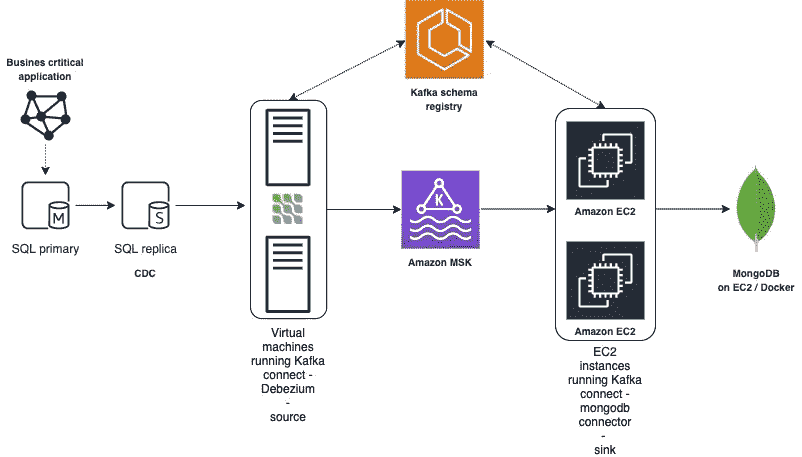

# 从内部到 AWS 数据湖的实时同步

> 原文：<https://medium.com/geekculture/real-time-sync-from-on-premise-to-aws-data-lake-2e8d834c45dd?source=collection_archive---------8----------------------->

*混合分析和运营使用，MS SQL server，debezium，MSK，kafka connect，mongodb，实时同步*

# 建筑选择的动机

*   亚马逊 MSK，全面管理方面，易于设置和配置，在 vpc 内部部署
*   卡夫卡，已被证明，广泛的生态系统包括连接器
*   Debezium，所有主要数据库技术的真正 CDC
*   mongoDB，部署在 EC2 上以提高性能，并拥有所有可用的数据类型

# 语境

业务关键型应用程序会生成大量数据，但是像许多这样的应用程序一样，它们对自己的数据库有点自私，尤其是在如何进行 CRUD 操作方面。通常情况下，绝对没有办法确定哪些记录被插入、更新或删除了。因此，如果您想要复制数据，您或多或少会被迫进行完全转储。

这种方法对于反映昨天数据的数据系统是有效的。但是当我们谈到大容量时也达到了极限。识别新插入、更新和删除的记录的一种**干净和结构化的**方法是使用变更数据捕获，CDC。

该解决方案部署在分析和**运营使用**的环境中。考虑到这一点，我们会立即认为对象存储和 AWS s3 是 Kafka 的成果——如果我们希望拥有单个记录经历的更新的完整历史，这将是有效的。

我们的目标是在云中有一个视图，反映本地应用程序的当前状态，有一秒钟的延迟，这没有特定记录的所有更新历史。比如说，卡夫卡的结局需要按表键**上插**。

为了用对象存储处理 upserts，我们还可以使用 Apache 胡迪或 Delta lake 并实现一个 lakehouse。湖屋的概念当然是有效的，我打赌未来将朝着这个方向发展。但是现在，这将使情况变得复杂，需要额外的技能，这符合我们当前的要求“实时复制数据的当前状态并做到万无一失”。

# 变更数据捕获

为了保证我们不会在主数据库上引入任何额外的负载，数据库技术提供了将其主数据库同步到辅助(读取)副本的能力，这是一种非常**非侵入性的**方式。
CDC 从副本启动。这样做，我们真的不会触及操作数据库。我们在副本数据库上为范围内的表激活 CDC，并为每个表创建一个新的组合字段，它是表的主键`pk_`的串联。mongoDB kafka connect sink config 和 mongoDB 将使用这个`pk_`来标识需要插入或更新哪个记录。

CDC 是由数据库技术提供的，每个数据库在如何实现 CDC 方面都有自己的特点和风格。Debezium 为主要数据库处理这个问题:MySQL、MongoDB、PostgreSQL、Oracle、SQL server、DB2、Cassandra 和 Vitess。

# 阿帕奇卡夫卡

Apache Kafka 是一个社区分布式事件流平台，能够处理大量数据。
Kafka 最初被设想为一个消息队列，它基于分布式提交日志的抽象。自 2011 年由 LinkedIn 创建并开源以来，Kafka 已经从消息队列迅速发展成为一个成熟的事件流媒体平台。

# 卡夫卡连接

Kafka connect 是 Kafka 提供的 4 个 API 之一，connect API 特别适合于保持源数据库与…

connect [组合](https://www.confluent.io/product/connectors/)由许多类型的连接器组成，使得用 Apache Kafka 推/拉数据变得非常容易。源连接器，从源获取数据并将其推送到 Kafka 接收器连接器从 Kafka 获取数据，并将其推送到接收器。

*   源连接器可以是:sftp、jdbc、debezium CDC、Splunk、Redis、 [SAP](https://github.com/SAP/kafka-connect-sap) (总是在做之前检查术语)、…
*   接收器连接器可以是:Salesforce、sftp、http、…

连接器分为:开源、社区、商业、高级和融合验证合作伙伴。

当连接器独立运行或成组运行时，我们通过 connect [REST 接口](https://docs.confluent.io/platform/current/connect/references/restapi.html)传递配置。
每个 connect config 都有一点偏离他的具体细节，这是我们要讨论的源或接收器的功能。

# MS SQL 源连接器的示例:

将此配置发布到 Kafka connect 将开始同步，快照过程中有 8 个步骤。`demo.dbo.ORDERS`的日志如下图所示。

# mongodb 接收器连接器的示例

mongodb 连接器支持多种[写模型策略](https://docs.mongodb.com/kafka-connector/current/kafka-sink-postprocessors/#custom-write-model-strategy)，它们将定义如何将记录写入 mongodb。我们选择使用**插入和修改的时间戳**

此外，我们还配置了一个转换动作:`ExtractNewRecordState`类型的`unwrap`，它只有 CDC 的后像。

在 mongodb 中有一个单一级别的数据结构，这与我们在 Microsoft SQL 数据库中有两个额外的时间戳:`_insertedTS: ISODate("2021-10-01T09:38:14.659Z")`和`_modifiedTS: ISODate("2021-10-01T10:38:14.659Z")`完全对应。

Kafka connect 无疑是 Kafka 生态系统中的一项资产，AWS 也通过[托管连接产品](https://aws.amazon.com/blogs/aws/introducing-amazon-msk-connect-stream-data-to-and-from-your-apache-kafka-clusters-using-managed-connectors/)扩展了其 MSK 产品。
这当然有利于运行 Kafka connect 的所有操作方面。

# MongoDB

当您选择 AWS 作为云提供商时，第一个教训可能是为什么不使用 doucmnetDB？mongoDB 的完全托管版本。
DocumentDB 是首选，但很快我们就遇到了这两个缺点:

*   缺少 mongodb decimal 数据类型，这种数据类型在我们的源数据库中随处可见。是的，你可以在 connect 中做一个 [SMT](https://docs.confluent.io/platform/current/connect/transforms/cast.html#cast) 并转换成另一种数据类型，知道之后所有的消费者都需要重新转换每个字段
*   性能方面，与 EC2 上的 mongoDB(每秒- 8000 次插入)相比，Kafka connect 对 documentdb 的接收速度要慢得多(每秒- 50 次插入)

目前，我们在 docker 下的 EC2 上运行 mongoDB，并将做操作所需的事情或转移到 mongodb atlas 的[产品。](https://www.mongodb.com/cloud/atlas/)

# 得到你的操场

可以在[这里](https://youtu.be/g5Kb53irYrI)找到该案例的完整演示记录。
GitHub[上的回购](https://github.com/thierryturpin/msk-connect)。

如果你想知道更多关于这个话题的信息，请联系我们！

玩得开心，蒂埃里

# 参考

*   拥有关于卡夫卡和卡夫卡连接的顶级素材的 rmoff 的随机漫谈
*   [湖边小屋建筑](https://databricks.com/blog/2020/01/30/what-is-a-data-lakehouse.html)
*   [debezium](https://debezium.io/)