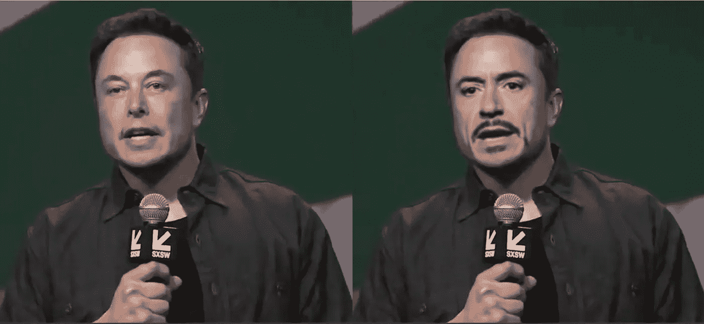
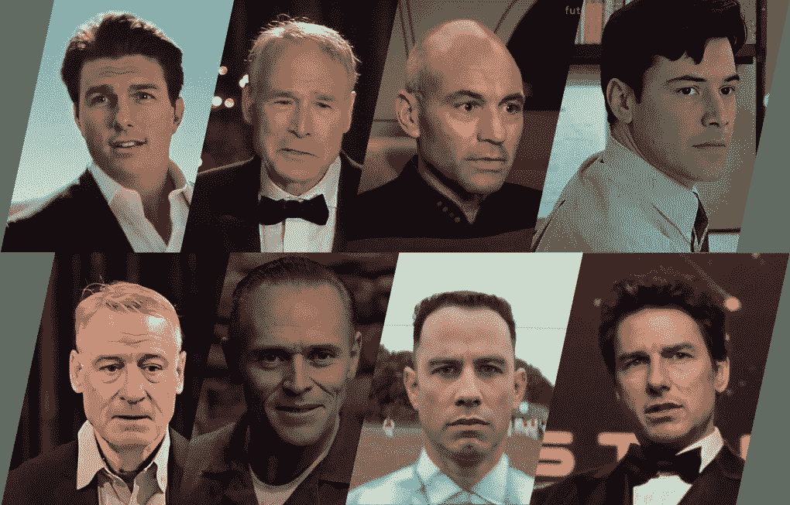
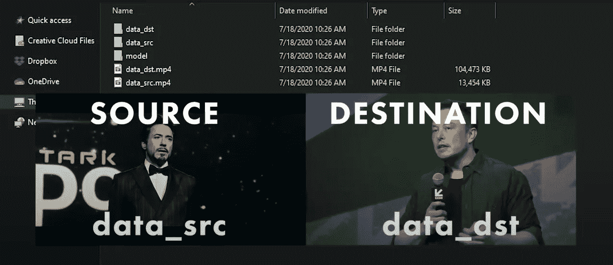
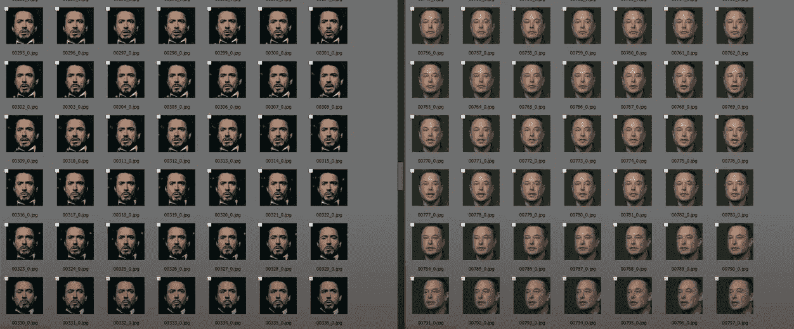
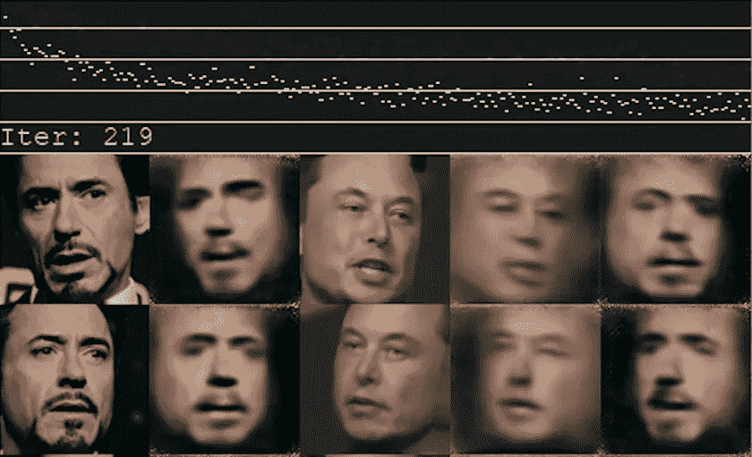
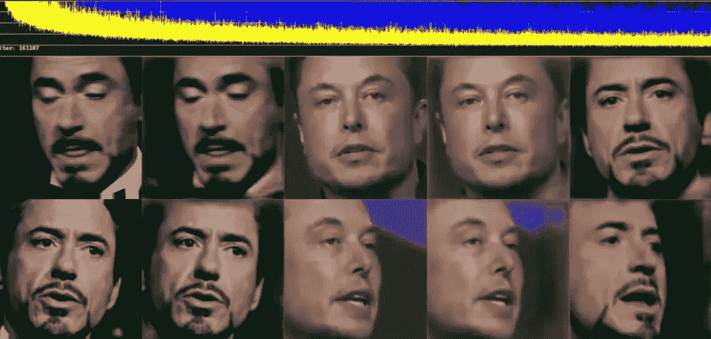
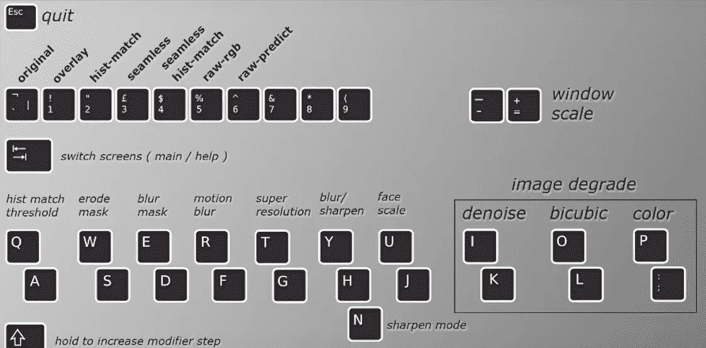
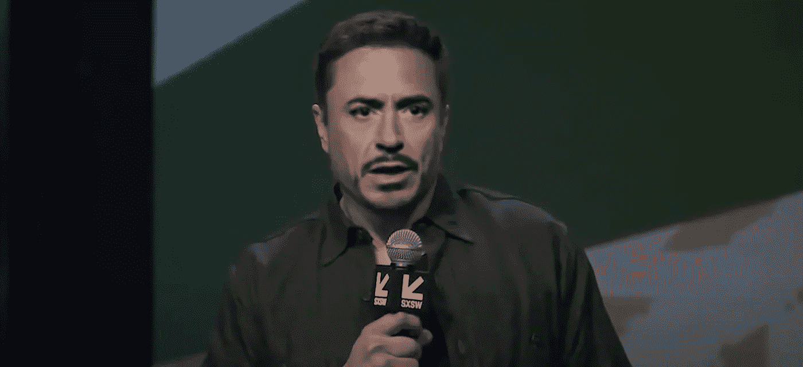

# 使用 DeepFaceLab 创建真实的深度赝品

> 原文：<https://medium.com/geekculture/realistic-deepfakes-with-deepfacelab-530e90bd29f2?source=collection_archive---------0----------------------->

## 开放源代码中最流行的深度伪造工具介绍



Source: Deepfakery

在过去的几年里，机器学习领域令人兴奋的进步已经给了我们使用一种称为**深度伪造**的技术来执行真实感视频操作的可怕能力。

负责这项技术的底层技术可以在**生成对抗网络(GAN)** 、中找到，这是由 Ian Goodfellow 和他的同事在 2014 年开创的一类新的机器学习框架。在这种方法中，两个神经网络(生成器和鉴别器)在极大极小游戏中相互竞争，以产生能够生成具有与训练集相同属性的新数据的模型。更多信息请见他们的白皮书[这里](https://arxiv.org/abs/1406.2661)。

出于好的和坏的原因，Deepfakes 受到了媒体的极大关注。这项技术的含义可能是可怕的。在一个充斥着假新闻和骗局的世界里，让自己熟悉“假”和“合成”媒体的样子变得更加重要。



DeepFaceLab samples. Can you recognize these celebs? Source: iperov

GitHub 上有超过 13，000 颗星， **DeepFaceLab** 已经成为消费者和专业 deepfake 创作的流行解决方案。即使您拥有有限的硬件和技术知识，我也会向您展示从有限的训练数据中生成高质量的 deepfakes 是多么容易。

具体来说，我们将分三个阶段把托尼·斯塔克的脸印在埃隆·马斯克的脸上:

*   **提取阶段** *—* 准备和清理数据集
*   **培训阶段** —我们培训我们的模型
*   **转换阶段**——我们使用我们的模型创建一个遮罩

要下载并熟悉该工具，您可以在此处找到回购[，在此处](https://github.com/iperov/DeepFaceLab)找到白皮书[。请注意，目前仅支持 Windows 和 Linux 操作系统。](https://arxiv.org/abs/2005.05535)

# 第一阶段:提取

下载 DeepFaceLab 后，您将生活在两个不同的目录中:

*   **项目**目录(名为 DeepFaceLab_NVIDIA)
*   **工作区**目录(主项目目录的子目录)

项目目录保存我们的脚本文件，我们将使用这些文件来执行操作(提取、训练)，而我们的工作区目录将保存以下内容:

*   **源数据** —面向我们要嵌入的主题
*   **目标数据** —我们想要覆盖的主体的面部
*   **型号**——我们将要训练的 GAN 动力发动机



Source and destination videos in the workspace directory. Source: [Deepfakery](https://www.youtube.com/c/Deepfakery/about)

1.  首先将您的`data_dst.mp4`和`data_src.mp4`视频文件添加到您的工作区。
2.  导航回 DeepFaceLab_NVIDIA 目录。
3.  运行`2) extract images from video data_src.bat`从你的源视频中提取训练人脸。
4.  运行`3) extract images from video data_dst FULL FPS.bat`从目标视频中提取训练人脸。
5.  导航到`data_dst`和`data_src`文件夹，通过移除错位和扭曲的面来清理提取的面。
6.  (可选)运行`4.2) data_dst sort.bat`和`5.2) data_dst sort.bat`以便在清理过程中更容易进行面部对比。



Aligned extracted faces from the source and destination videos. Source: [Deepfakery](https://www.youtube.com/c/Deepfakery/about)

💡**此阶段的有用提示**:

*   挑选正确的源和目的地培训视频是这一过程中最重要的一步。视频质量、面部对齐和照明都是影响成品质量的因素。
*   你可以在 YouTube 上从名人访谈和电影剪辑等来源找到高质量的剪辑。
*   不要过分使用你的源数据。我发现最佳点是大约 2000 张不同角度和表情的脸(或一个 2-3 分钟的剪辑)，最理想的是与你的目标剪辑相匹配。

# 第二阶段:培训

对于这个基本的 deepfake，我们将使用 **Quick96** 模型，因为它对低端 GPU 有更好的支持，并且通常对初学者更友好。

1.  从项目目录中，运行`6) train Quick96.bat`
2.  出现提示时选择您的 GPU(也支持仅使用 CPU)

训练开始后，您将在命令行窗口中看到这些数字。它们是什么意思？

```
Starting. Press "Enter" to stop training and save model.
[12:33:13][#000219][0764ms][0.9550][0.9910]
```

从左到右，各列代表以下内容。

1.  当前当地时间
2.  当前迭代
3.  迭代时间
4.  SRC 损失值
5.  DST 损失值

我们的目标是使 src 和 dst 损失值尽可能低。

排队点*洛基*训练蒙太奇音乐！让我们继续训练吧💪



Sample faces after 219 iterations

就像我小时候第一次尝试吹萨克斯管一样，第一批迭代看起来相当可怜。随着时间和训练，幽灵般的斑点将开始成形，看起来有点像我们的对象。从左到右，图像列代表我们的模型输出的以下数据:

1.  SRC 面部样本
2.  从该样本生成的 SRC 面
3.  DST 面部样本
4.  从该样本生成的钻杆测试面
5.  生成的 SRC 面模拟 DST 面样本

正如你所看到的，最后一个专栏是我们最感兴趣的，它会给我们一个很好的信号，告诉我们 deepfake 看起来有多真实。



Over 160,000 iterations

经过 160，000 次迭代后，你真的可以开始看到我们生成的人脸达到了一种可怕的逼真程度。有了这个，就该把所有的东西放在一起了！

💡**此阶段的有用提示:**

*   在这个阶段，耐心是关键。我建议您至少等到 80，000 次迭代才能获得最佳结果。根据您的硬件，您可能需要运行这个通宵或周末。或者，你可以通过观看你的模型火车本身来做现代版的*看着油漆变干*。
*   在更高级的模型上，要注意你使用的图像分辨率，因为这将增加训练的复杂性，甚至可能超出你的 GPU 的处理能力。通过使用 6 GB VRAM 的 GTX 1060，我能够推动我的 GPU 在我的模型中处理高达 192 的分辨率。超过这个数量的任何东西都会导致我的模型在安装时崩溃。
*   DeepFaceLab 还支持[迁移学习](https://en.wikipedia.org/wiki/Transfer_learning)，可以使用预先训练好的模型来大大提高训练的初始速度。您可以在 DeepFaceLab 社区论坛中找到其中的许多内容。

# 第三阶段:转换

随着我们的模型完全训练，我们现在可以将我们生成的人脸与目标视频合并。

从项目目录中，运行`7) merge Quick96.bat`调出交互式合并。



DeepFaceLab merger tool interface

好吧，这里发生了很多事。我们来分解一下。

我们需要一帧一帧地进行，并使用以下技术对生成的面具进行任何调整。

*   习惯按下**键**在界面和图像框之间来回移动。
*   使用**模糊蒙版** (E 和 D)和**腐蚀蒙版** (W 和 S)将生成的脸与主体的脸型相匹配。对于基本的 Quick96 型号，我们对下颌线识别的支持有限，因此这一步非常重要。
*   一旦您准备好继续前进，您可以使用句点键移动到下一帧或使用 **Shift +。**处理所有剩余帧。

这是一个相当初级的工具，但是当一个训练有素的模型处理大部分繁重的工作时，你会惊讶它能带你走多远。

之后，运行`8) merged to mp4 lossless.bat`来运行一个小的 FFmpeg 脚本，它将构建你的合并视频，并将其渲染为**result.mp4**。



Tada! You’ve just played God with video manipulation. 🎉

# 接下来去哪里？

在你的第一次深度造假得到满足后，你会很快获得创作更多荒谬作品的欲望。托尼·斯塔克/埃隆·马斯克的例子有点像 DeepFaceLab 工具的“Hello World ”,你很快就会发现 Quick96 模型和你四年前的 Nvidia GPU 不适合更高级的情况。

在我的下一篇文章中，我将向您展示我们如何使用 **SAEHD 模型**来创建更高级的生成面具，以及我们如何使用 **GoogleCollab** 笔记本将培训开销卸载到云。敬请期待！🤖