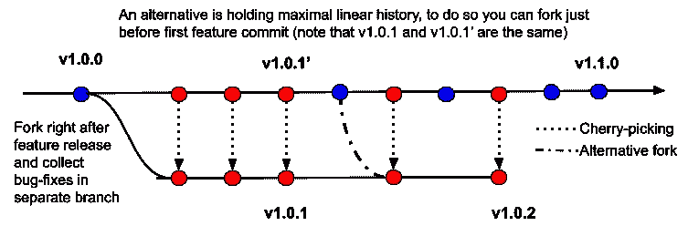
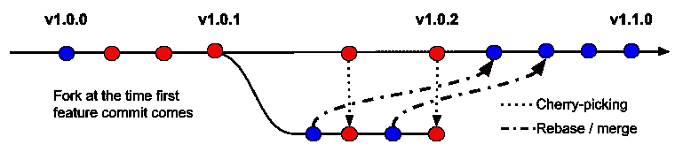
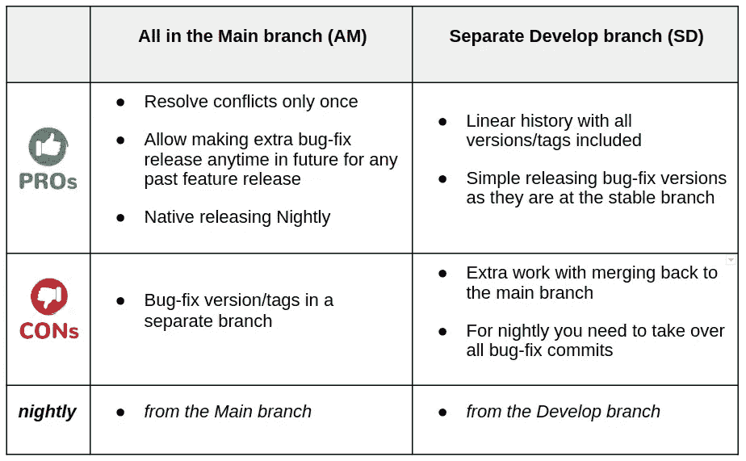
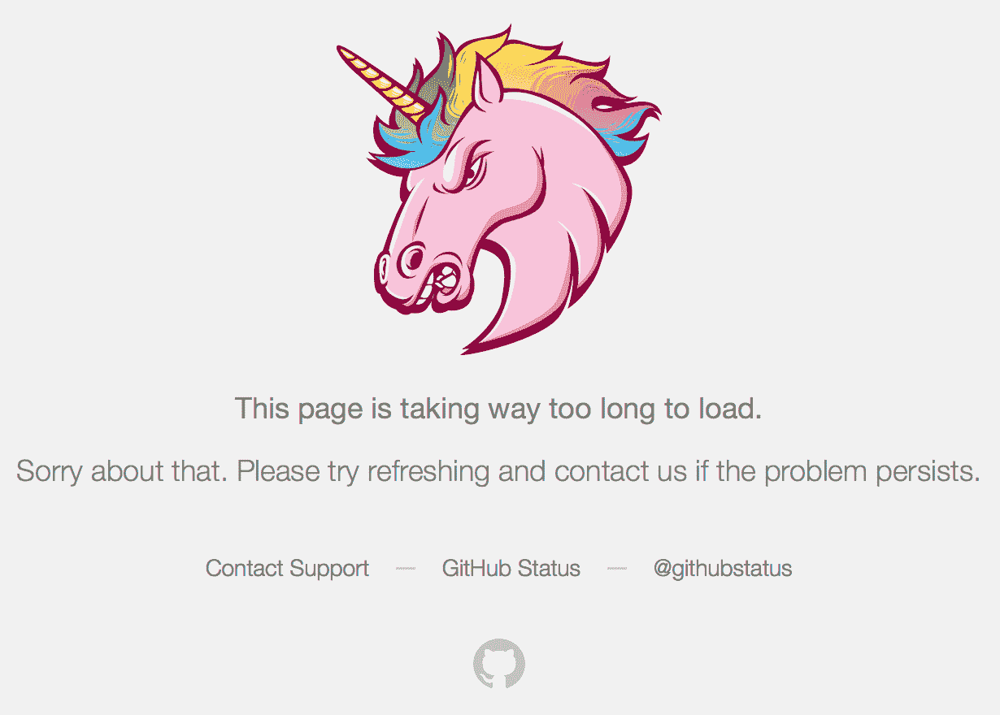

# 发布策略的实践视角——隐藏的角落

> 原文：<https://medium.com/geekculture/realistic-perspective-on-release-strategies-hidden-corners-5c45b8b7cd8d?source=collection_archive---------42----------------------->

Illustration photo by [Anete Lusina](https://www.pexels.com/@anete-lusina?utm_content=attributionCopyText&utm_medium=referral&utm_source=pexels) from [Pexels](https://www.pexels.com/photo/crop-unrecognizable-person-working-on-computer-and-using-mouse-4792731/?utm_content=attributionCopyText&utm_medium=referral&utm_source=pexels).

## 从开源软件包开发和发布中获得的实践经验和教训

发布是任何软件(SW)开发过程中的一个亮点，无论你是从事公司解决方案还是小型个人工具。通常，到达终点并分享自己的作品是充满期待和满足感的。最终，如果没有太多的采用或者产品有太多的 bug，期望可能会变成失望…无论如何，这个版本是任何软件生命周期中的一个重要里程碑，有各种各样的细节取决于目标领域/用户、发行版、编程语言等等。🐰

> **缩小范围—** 我将谈谈发布用 Python 编写的开源包。
> **版本标注** —我用[语义版本](https://semver.org)，完整版 M.F.B 分别由 Major、Feature、Bugfix 组成。我们还假设，与错误修复(B)相比，主要(M)和特性(F)版本/发布的流程/过程非常相似。
> **环境** —我指的是版本控制系统(例如 Git)的使用，它在一个压缩提交中打包/包装贡献；我也将使用分支术语学，参见[git 和 GitHub 介绍](/the-underdog-writing-project/introduction-to-git-and-github-a5fdf5633923)。

# 概观

有各种各样的 git 工作流和分支模型，例如[4 Git 分支工作流](/@patrickporto/4-branching-workflows-for-git-30d0aaee7bf)或[什么是分支策略？](https://www.cloudbees.com/blog/branching-strategy/)和[一个成功的 Git 分支模型](https://nvie.com/posts/a-successful-git-branching-model/)。反正原则上主要有两种发布策略(简单点说吧):

*   **All-in-Main** :将所有提交特性 bug 推至同一个(默认/主)分支，并为 bugfix 发布创建一个特殊分支，仅提交精选的 bug-fix
*   **特性——单独**:保留默认的分支，只修复错误，所有的特性都到单独的(未来的特性发布)分支。一个特殊的例子是将每个大的特性(可分离的/独立的)放在它自己独立的分支中。

理论上，这两种策略都很好，而且非常流畅，直到你开始实践它们。俗话说得好，*“没有一个作战计划能在与敌人的第一次接触中存活”，*有几个潜在的死角。一个例子是重构；它通常会在代码库中带来重大的结构变化，所以后来，在跨代码库版本传输时，任何琐碎的更正(仅仅几行)都会带来冲突(大多数自动化工具不会找到正确的匹配)。

作为一个有经验的开发人员，你可以在脑海中模拟一些其他的边缘情况。尽管如此，在你真正面对解决这些问题的额外工作之前，你可能无法完全估计每一个问题所花费的时间、精力、压力。让我们看看上面概述的两个主要策略，并给出一些我在一年前对它们进行实验时的个人观察。

> **技术**(简化)**注释**:
> ——目标分支(默认/特性/发布)中的所有提交都是来自单个工作分支的开放 PR 的挤压-合并的产物。
> -发布/版本通过特定分支上的 git 标签`v(M).(F).(B)`来表示，我们可以互换使用这些术语发布/版本/标签。

# 全部在主分支(AM)

AM(GitHub 流的一种变体)的优点是使未来版本的发布变得简单，因为它总是位于默认分支的头部(它包含所有提交)。因此，举例来说，您可以直接从这个默认分支的头部发布夜间开发版本，而无需任何调整或必要的完成。

另一方面，假设您想要发布一个 bugfix 版本(基于上一个功能发布的版本，只包含 bugfix，没有其他功能)。在这种情况下，您可能需要做额外的工作，挑选 bug-fix 提交到 bug-fix 分支，并最终解决冲突。这种冲突的一个示例——在默认分支中的修复提交中，已经有一个大的特性或重构提交，这使得一些后来的修复与上一个版本的状态相比，错位在代码库的非常不同的位置。

Timeline for All in the Default branch

从实践的角度来看，您已经在默认和 bug 修复分支中复制了修复提交。此外，美学上的缺点是缺少线性历史，因为特性发布存在于默认分支中，而所有 bug 修复发布存在于它们自己的发布分支中。

当第一个功能提交时，您可以通过从默认状态中删除 bug-fix 发布分支来降低传播效果(请参见上面的插图和点划线标记的分支)。例如，您有这样一个线性释放序列:`v1.0.0`–`v1.0.1`–`v1.0.2`–`v1.0.3`–`v1.0.4`–`v1.1.0`–`v1.1.1`–`v1.1.2`–`v1.1.3`–`v1.1.4`–`v1.1.5`–`v1.2.0`
，这些标签将位于以下分支中:
–*(默认)main:*`v1.0.0`–`v1.0.1`–`v1.1.0`–`v1.1.1`–`v1.1.2`–`v1.2.0` *—(bug*

此外，您可以随时回来，从任何过去的功能发布中制作额外的错误修复版本，因为它们存在于自己的分支中…

# 独立开发分支(SD)

SD(非常简化的 GitFlow)看起来非常漂亮。您继续从主分支(也称为稳定分支)发布所有版本。它包括一个优先的所有 bug 修复版本，所有的特性都是在一个单独的分支中开发的，后来(当没有更多的 bug 修复版本和/或一个新的特性版本即将发布时)，它被合并回主分支。

这个流程的一个主要动机是保存所有发布/版本/标签在同一个分支中的线性历史。因此，您可以很容易地遍历历史，并总是获得一个完整的(可执行的和所有测试通过的)软件状态。顺便说一句，在实践中，可能会发生这样的情况:你需要在先前的特性版本上做一个额外的补丁，这无论如何都会导致一个 bug 修复分支。

Timeline for Separate Feature branch

理论上，bug-fix 提交非常小，不会显著改变代码库，因此在“小”bug-fix 提交后将任何功能合并回主分支应该非常顺利…但在实践中，您希望从最新的稳定版本构建所有功能，以避免最终的 bug 干扰(基本分支中的 bug 可能会与功能中潜在的新 bug 发生冲突，但在修复基本分支中的 bug 后，您只剩下新的功能)。另一个视角来自于开发分支的夜间发布，因为您想要夜间发布的高质量，并且您不希望积累过去的错误或者将它们隐藏在新的特性中:]

这意味着你需要循环地:(a)在 stable 的头上重新确定每个特定特性分支的基础，或者(b)从默认分支中挑选所有 bugfix 提交到特性分支，或者(c)将 stable 合并到这个特性分支。让我们注意到，a)可以是无孔不入的工作；另一方面，b，c)没有从早期合并的特性中消除所有最终隐藏的错误…

有了这个额外的同步过程(合并或精选)，当您想要将开发分支合并回主分支并最终丢弃/跳过所有重复的(所有错误修复)提交时，您将面临额外的工作。如果您开发的分支在很大程度上偏离了目标分支，并且您没有执行任何重复的基础变更，您将面临三种选择:

1.  **Rebase 和 merge** ，它保留了线性历史(这个发布策略的主要动机)。或者，您可以通过向主分支提交 cherry-picking 特性来替换这个 rebase，与 rebase 相比，这可以防止累积冲突(根据我的个人经验，rebase 倾向于在每个步骤中反复解决相同的冲突，即使这些冲突在更早的时候就已经解决了)。
2.  **讨厌的合并**，在这里你可能只解决最终的状态差异(不是每个特定提交的冲突)。尽管如此，它部分地打破了线性历史，因为您将有两个并行的提交流。
3.  **硬切换**实际上意味着恢复到 AD 发布，因为你会将开发分支重命名为主分支，而过去的主分支变成 bug 修复发布分支(假设你已经将所有 bug 从主分支同步到开发分支)

简而言之，评估三个自上而下的选项将减少执行这些选项所需的额外工作(主要是解决冲突),并从期望的线性历史中获得更多信息…

# 汇总比较

让我们将之前的想法归结为一个简单的表格，突出一些积极和消极的方面:

Summary comparison of AM and SD strategies.

# 个人结论和有趣的事实

如果你不依赖于线性历史，或者你的特性版本之间的开发包括一些非平凡的重构，我推荐你使用主分支和侧面 bugfix 版本。

汇编过去一年的经验让我了解了为什么大多数软件通常没有很多 bug 修复版本，通常少于 5 个(当每个版本由几个 bug 修复提交组成时)。如果有更高的数字(大约 5–20)，每个版本包含很少的错误修复提交。因此，在任何情况下都会产生非常相似的提交数量——只是分组不同。

Timeline with releases at the x-axis, functionality in the y-axis, and color from red to green as properly working functionality. So the planned functionality is the upper (green) bound compared to the delivered (true) functionality as the lower bound (partially red).

汇编一些个人观点，以比较软件生命周期中计划的和交付的功能。您可以将特性发布看作是对期望功能的重大提升，带来了几个隐藏的错误，降低了交付的功能。这些潜在的错误将在以下错误修复版本中被捕获和修复；理想情况下，修复最初计划的所有功能。

Screen-shot from GitHub.

PS，我们发现，如果开发分支(200+提交)与您的主分支(100+提交)明显不同，GH 无法创建一个带有建议链接的 PR 来开发分支，因此您需要提出一个特定的 URL 链接请求— `[*https://github.com/USER/REPO/compare/release/{feature-branch}...{merging-branch}*](https://github.com/USER/REPO/compare/release/{feature-branch}...{merging-branch})`

***你喜欢这个故事吗？敬请关注，关注我了解更多！***

 [## 思考为什么代码格式化对开源更重要

### 格式化程序不会打扰任何人；它们旨在帮助和促进任何合作的顺利进行…

medium.com](/geekculture/thought-on-why-code-formatting-is-important-even-more-for-open-source-476829b54eaf)  [## 深度学习如何选择 CI 框架

### 使用 spot 实例运行廉价的多 GPU 测试

devblog.pytorchlightning.ai](https://devblog.pytorchlightning.ai/how-to-choose-a-ci-framework-for-deep-learning-d24ee9ef902c)