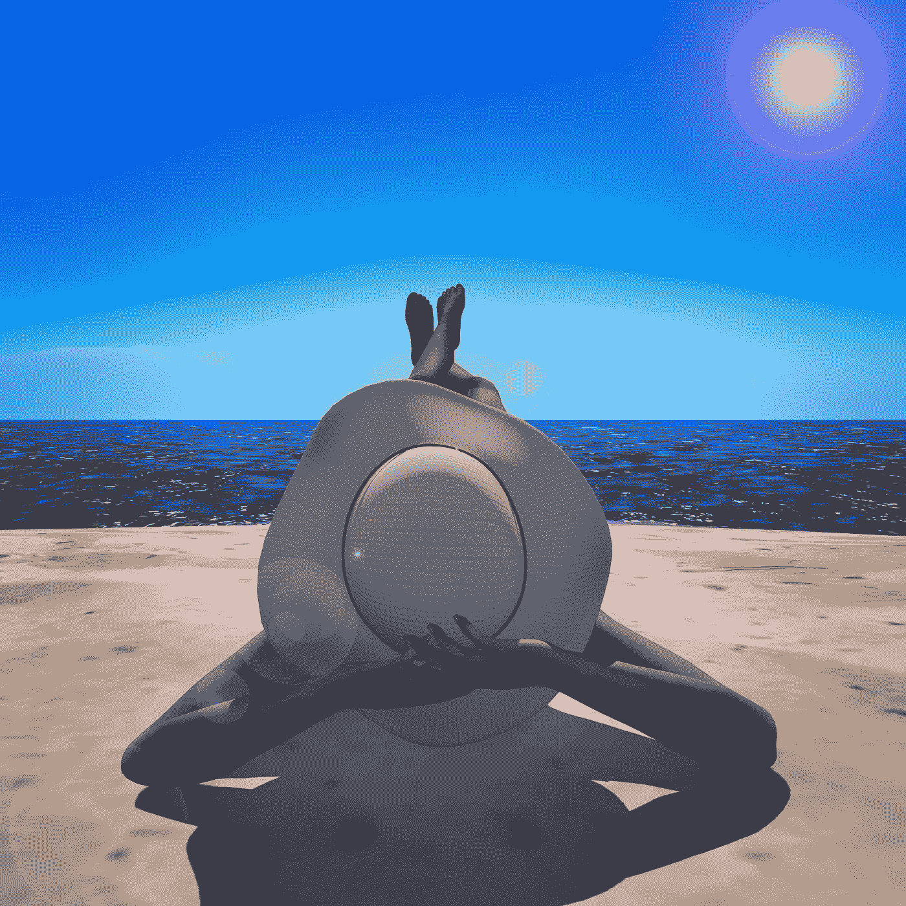

# 现实被重新定义

> 原文：<https://medium.com/geekculture/reality-redefined-80a628ff7fa8?source=collection_archive---------14----------------------->

## 元宇宙和你

“Green Eyes” — Image Copyright © 2022 [If-What-If](https://www.linkedin.com/company/if-what-if/). All Rights Reserved. Photographer: [Poko — Flickr](https://www.flickr.com/people/poko9/)

取数字 1，加十个零。$10,000,000,000.**一百亿美元。**这是 Meta 计划在新元宇宙投资的金额。而且这个数字还不包括其他公司和开发商的投资，这将使那些最初的估计相形见绌。

> *Meta 正在元宇宙投入大量资金。首席执行官马克·扎克伯格在第三季度财报电话会议上表示，Meta 将在 2021 年向其元宇宙项目投资 100 亿美元。他承认“这是对未来的巨大赌注”,同时警告说“这不是一项在不久的将来对我们有利可图的投资。*
> 
> Meta 建议企业“不要停止关注今天”，并称对现有社交媒体平台的投资是“帮助你未来在元宇宙发展业务的基础”。(**)**

*尽管这是一个天文数字，当马克·扎克伯格宣布在 2021 年 10 月 21 日创建元宇宙时，我并不感到惊讶。许多人过去和现在都持怀疑态度。游戏是技术中最赚钱的领域之一，但是整个虚拟现实呢？去过那里，做过那个。15 年来，创造了第二生命的林登实验室一直处于我们认为有价值的技术的边缘。人工智能，生物医疗，大数据都接手了。但是一个增强现实的虚拟世界？留给玩魔兽的孩子们吧。*

*扎克伯格是在寻找一根救命稻草来保持脸书的相关性吗？他是在抓住众所周知的救命稻草吗？绝对不行。扎克伯格是少数证明自己拥有成功特质的人之一。在他关于达芬奇、史蒂夫·乔布斯、关于杰夫·贝索斯的书的介绍以及其他许多书中，优秀作家沃尔特·伊萨克森一直指出，所有这些人都拥有一个“现实扭曲场”(RDF)。在他对“[发明和漫游](http://Invent%20and%20Wander%20%28p.%203%29.%20Harvard%20Business%20Review%20Press.%20Kindle%20Edition.)的介绍中，艾萨克森解释了 RDF:*

> *真正具有创新精神和创造力的人的另一个特征是他们有一个现实扭曲场，这个短语被用来形容史蒂夫·乔布斯，来自《星际迷航》中的一集，在该集中外星人通过纯粹的精神力量创造了一个全新的世界。当他的同事抗议乔布斯的某个想法或提议不可能实现时，他会使用从印度的一位大师那里学到的一招:他会盯着他们，眼睛都不眨一下，然后说:“别害怕。你可以做到的。”它通常是有效的。他把人们逼疯了，他把他们逼疯了，但他也把他们逼到做他们不相信自己能做的事情。*

*这个 RDF 驱使扎克伯格和其他公司创建了一个元宇宙。他看到了人们想要什么，以及技术能够做什么和创造什么。尽管如此，这并不是一个“新”想法。虚拟现实(VR)和增强现实(AR)已经存在了相当一段时间。扎克伯格只是打赌，这是未来 20 年年轻一代将蓬勃发展的地方。*

*15 年前，在一位从事高科技的朋友的推荐下，我通过林登实验室(Linden Lab)旗下的第二人生(Second Life)进入了虚拟现实(VR)世界。接下来的一年，在几个朋友和投资者的帮助下，我建立了一个名为“学习体验”的免费学习环境，简称 TLE。TLE 在“第二人生”内外获得了一些恶名，CNN 和其他新闻媒体上的文章都是基于我提出的免费大学模式。(正因为如此，我们不得不在 18 个月后更改名称，因为波士顿一家幼儿园发出了一封停止使用相同名称的信。)但是，TLE 的故事并不是为了这个系列的帖子。我要说明的是，当时还没有增强现实(AR)，VR 还处于起步阶段。然而，潜力是存在的。即使在混合教育成为常态的新冠肺炎时代，仍然有对混合教育的迫切需求。*

*在元宇宙公布的时候， [Philip Rosedale](https://en.wikipedia.org/wiki/Philip_Rosedale) ，SL 最初的幻想家(可能是另一个具有 RDF 特质的个人)，已经在 2010 年离开 LL 和 SL 的年份，[突然宣布在 2022 年 1 月回归](https://techcrunch.com/2022/01/13/second-life-philip-rosedale-returns-linden-lab-high-fidelity/)。这是至关重要的，因为罗斯戴尔是第一个有远见的人，他创造了一个持续多年的 RPG。他突然看到元宇宙的创作证明了他的梦想。

2022 年 1 月，同月，一家著名的学术出版社要求我为一份新的 VR/AR 学术期刊写一份“范围演示文稿”(这是一个很好的想法，因为时机已经成熟)。在这样做的时候，我必须涵盖许多主题，因为虚拟现实拥有我们日常生活中的所有组件，尽管有一些曲折。这是一门迷人的学科，有着迷人的技术和研究。在写“范围”时，我意识到人工智能(AI)、法律、心理、经济、技术、金融、颠覆、创新和商业主题都融入了这个系统。它本质上是用我们所有的“真实”世界元素构建一个世界。

**这里需要说明的是“现实”这个词**由于这个主题，人类努力的几乎任何方面和人类的状况都将适用于 VR/AR。这项技术本身就很迷人。然而，一个人从现实到虚拟现实的变形，通过工具来创建一个 3D 环境，也同样有趣和关键。*

*在这一系列文章中，我希望揭开这个主题的神秘面纱，这样那些试图将元宇宙和 VR/AR 视为另一个游戏的人就会三思而行。*

**

*“Scenery #3" — Image Copyright © 2022 [If-What-If](https://www.linkedin.com/company/if-what-if/). All Rights Reserved. Photographer: [Poko — Flickr](https://www.flickr.com/people/poko9/)*

# *什么是虚拟现实(VR) &增强现实(AR)？*

# *范围*

*他的系列文章提到了对研究、数据、理论和技术有效的主题。 ***不全面。VR/AR 的详细范围将需要一本完整长度的书，然后是一些。****

1.  *虚拟现实和增强现实是目前正在融合的两个不同领域。它们是相同的理论、应用和科学的一部分——然而，每一个都可以而且应该根据其自身的优点来处理。*
2.  *这门学科与人工智能的各个领域都有交叉。*
3.  *这门学科涵盖了理论、技术、数据、金融、心理学、伦理学、哲学以及几乎所有人类努力的领域。虚拟现实是“现实”，因此将反映我们所知道的现实，尽管有所变化。*
4.  *游戏，尤其是 RPG 和 MMO，是 VR/AR 世界的一部分。*

## *技术:*

*虚拟现实——这项技术大多存在于角色扮演游戏(RPG)和大型多人在线角色扮演游戏(MMORPG 或 MMO)中。然而，即使在这里，每个系统也使用不同的技术。MMO 专注于预先定义的世界中的用户体验，不管这个世界有多大。RPG 允许用户建立他们自己的需要与用户互动的体验，被称为“化身”例如，在几乎所有基于 Second Life、OpenSim 和其他游戏的 RPG 中，都有一种编程(脚本)语言，一种用于从建筑到服装到舞蹈到动画等一切事物的创作方法。这需要一个脚本语言系统和将适当的编程结果合并到技术栈元素中的能力。它还涉及后端技术，可以处理大量的图形、编程以及前端和后端系统。*

*AR——指的是我们用来处理 VR 环境(甚至是我们的现实)的工具，允许在 3D 环境中使用。这些工具可以是特殊的眼镜和声音设备，它们允许用户“沉浸”在环境中。这也被称为“**沉浸式技术**或“**沉浸式环境**”它将虚拟现实带入一个真实的 3D 世界。在处理心理学及其在这项技术中的分支时，理解这一点至关重要。(尽管如此，没有 AR 的 RPG 也有一些有趣的心理影响。)*

*这里有一个重要的区别:我们不仅仅在 VR 中使用 AR。它在我们正常的现实中被用来扩大我们的视野。AR 的应用数不胜数，在医疗和汽车行业，已经实现了。*

*RPG 中的 2D 或半 3D 环境中有 VR。你可以通过“第二人生”(Second Life)和元宇宙这样的工具来体验这一点。虽然 SL 尚未提供 3D 体验或 AR ( [和它的第一次尝试“Sansar”以惨淡的失败告终](https://techcrunch.com/2020/03/24/second-life-maker-calls-it-quits-on-their-vr-follow-up-sansar/))，但元宇宙将结合 RPG 和 MMO，包括创建、构建和销售内容的能力，同时添加 AR 实现。*

*总之，AR 需要创建一个 VR，以便它可以在该 VR 的参数内运行。(没有 VR 也可以用，但是我们讨论的是 VR/AR 的整合。)单独做 VR 只需要一台显卡和连接都很优秀的电脑。从用户硬件生成的统计数据被不断地测量。然而，允许良好用户体验的主要因素是“每秒帧数”(FPS)速率。AR 将 VR 变成了一种“沉浸式”体验，用户被一种截然不同的现实所包围。这些区别对于理解正在创造的虚拟现实新世界至关重要。*

## *人工智能*

*正如已经提到的，在 VR 中，有一种对开发者开放的编程语言。在严格的规则下，他们可以对虚拟对象进行编程，使它们以不同的方式工作。然而，由于数据可以离开和返回系统，这也为人工智能算法在服务器端收集的化身数据上运行打开了大门。虚拟角色将很快体验到他们真实身份已经存在于网络上的相同类型的个人标签和广告。目前，这在 SL 中不工作。然而，在元宇宙经营的公司将建立在这个基础上。但是工具就在那里，有了正确的投资，就可以实现。让我们不要犯任何错误。将人工智能与虚拟角色行为结合起来对系统的发展至关重要。然而，让事情变得复杂的是，一个真实的人可以有许多虚拟角色，每个角色扮演不同的角色。在 VR & AR 中，AI 的世界将面临不可思议的挑战。*

## *数据:*

*T 这里永远是数据。然而，在传统的社交网络系统中，大多数人都是他们自己。目前我们将忽略异常、不适应和网络钓鱼。然而，这个问题必须在一篇综合文章中论述。收集到的关于虚拟角色的行为、喜好和厌恶的数据将指向一个“真实的人”然而，RPG 和元宇宙的想法是，有一个完全与实际个体分离的另一个自我。*

*在大多数情况下，真正的用户会希望在这个替身背后保持匿名，尤其是在 RPG 游戏中。因此，收集的数据必须经过不同的算法和推理。预测分析在这里变成了一门完全不同的科学。*

*让我们明确一点，因为这将引导我们进入安全性的下一个方面。收集的数据将来自虚拟世界中的虚拟人。**最终，将会制定严格的法律来连接虚拟用户和实体用户。这将在数据世界造成“人格分裂”。(顺便说一句，这是一个有趣的话题，我认为在未来几年将会产生很多理论和争论。)数据湖、数据完整性和偏差在这里都会受到影响。***

## *安全性:*

1.  *这涉及到技术系统的传统安全性。这与当前对安全系统的需求没有太大区别。网络安全的所有现代方面都是必需的。*
2.  *第二种安全模式是为了保护“虚拟用户”免受“物理用户”的攻击这造成了更严重的安全问题，可能需要立法。将这一任务交给大型科技公司从各个层面来看都将是一个严重的错误。*

## *金融:*

1.  *各种虚拟现实/增强现实系统的融资具有规范性。它们是巨大的，因为系统需要巨大的基础设施。这在当前风投、天使投资人等传统氛围下行得通。然而，所需资金只能与生物技术开发或人工智能开发相比。*
2.  *元宇宙最大的不同在于对加密货币的接受程度。这可能有助于比特币和其他货币成为主流。它将影响资金、税收、政府对洗钱的控制，以及一千个其他领域。**它还将使加密货币所基于的分布式系统走向成熟。***
3.  *很多 RPG 系统如 Second Life 都是基于真实货币运行自己的货币。他们甚至有一个货币兑换市场，价格根据需求随时波动。对消费习惯和利润的研究是另一个不容忽视的领域。收集关于花费多少、在哪里花费、在一天中的什么时间花费以及花费了什么的数据。*

*举个个人的例子。当我将真实的美元兑换成 SL 货币林登时，我的收据上出现了我的 SL 头像名字，而我的真实姓名，信用卡上的名字**从未出现过**。将两者联系起来的唯一方法是通过信用卡对账单。为了税务目的，我花了 30 多分钟向我的会计师解释这件事。人们自然倾向于将它视为一种加密货币，**但它不是**，尽管元宇宙可能会改变这种范式。*

## *商业:*

*虚拟现实/增强现实世界中最重要的部分之一是理解以下内容:*

*当我从亚马逊订购一件夹克时，一个实体产品必须被创建、存储、运输并交付到我的实体地址。公司有一定的库存，如果用完了，那产品就无法提供了。*

*在虚拟世界中，这种范式是不存在的。一个人只需要创造一个虚拟产品一次，它就可以交付给一万个客户或者一百万个客户。没有传统意义上的“库存”，没有实体产品的复制，也不需要仓库。有必要了解这一点，因为这对在元宇宙生产产品的第三方企业来说至关重要。例如，耐克最近收购了一家元宇宙初创公司，该公司根据实际模型制作虚拟耐克运动鞋。收集的数据对持续的业务非常宝贵。*

> **Nikeland 是运动用品品牌在 Roblox 打造的微型元宇宙，自 11 月推出以来，已经吸引了来自 224 个国家的 670 万人。该空间允许用户除了发挥 Roblox 作为游戏平台的优势之外，还可以尝试虚拟产品，如躲避球……**
> 
> *与分析师预期相比，耐克公布的业绩。Nike Digital 仍然是其市场中增长最快的部分，现在占我们 Nike 品牌总收入的 26%。(**)***

## **创新:**

****

**“Angel To The Rescue” — Image Copyright © 2022 [If-What-If](https://www.linkedin.com/company/if-what-if/). All Rights Reserved. Photographer: [Poko — Flickr](https://www.flickr.com/people/poko9/)**

**从最纯粹的意义上来说，VR/AR 是明显的创新点。然而，RPG 代表“角色扮演游戏”，角色扮演可以以无限的形式出现，从而带来无尽的创造和创新。如果这个一定要深入解释的话，VR/AR 的整个意义就没了。这一领域的创新将继续增长，就像在人工智能领域一样。用户体验将变得更加丰富、更加便宜、更加身临其境。AR 将在这里真正受益，这个领域将充满理论、技术和用户体验。**

## **中断:**

**[克莱顿·M·克里斯坦森](https://en.wikipedia.org/wiki/Clayton_Christensen)是[颠覆性创新理论](https://www.christenseninstitute.org/key-concepts/disruptive-innovation-2/)之父。在引入这一理论 20 年后，他意识到大多数人并不理解真正的颠覆。他是正确的。即使在“C-结构”中，也很少有人能够充分定义，更不用说实现一个破坏性的系统。在 VR/AR 中，中断将变得更加频繁。随着技术的进步，由以下因素引起的中断:**

1.  **创造元宇宙的系统**
2.  **元宇宙出售商品的公司**

**随着虚拟世界的发展，破坏这些虚拟世界的方法也会随之发展。增长依赖于数据和预测分析。**

## **心理学:**

****

**“Me Again” — Image Copyright © 2022 [If-What-If](https://www.linkedin.com/company/if-what-if/). All Rights Reserved. Photographer: [Poko — Flickr](https://www.flickr.com/people/poko9/)**

**在心理学中，有太多的东西需要调查、理解和理论化——这本身就是一个巨大的调查领域。**

1.  **考虑沉浸式体验以及它将如何影响当前的生活方式。**
2.  **考虑维持真实和虚拟身份的要求以及发展为“[分离性身份障碍](https://en.wikipedia.org/wiki/Dissociative_identity_disorder)”的可能性**
3.  **考虑对学习和教育的影响。**
4.  **考虑虚拟环境对真实业务的影响。**

## **法律:**

**法律后果将影响“选择的自由”和我们自己的身份。**

1.  **公司将被允许把虚拟用户的数据，例如，虚拟角色，和他们的实体伙伴联系起来吗？(记住有用户的 ISP 和 IP，可以也将会被用来这么做。)**
2.  **加密货币——它们能够或者应该被监管吗？如果是这样，我们该如何着手去做。**
3.  **谁拥有什么？企业拥有你在虚拟现实中维护的对象还是用户？如果股票因服务器故障而丢失，谁来赔偿最终用户？**
4.  **在虚拟环境中开展的业务和虚拟用户签署的合同是否具有与实际合同相同的效力？**

## **道德:**

1.  **未经允许将虚拟用户连接到他们的物理对应方是否道德？**
2.  **如果一个虚拟用户说了一些违背道德或伦理规范的话，伦理允许一个人在 RPG 世界中“淘汰”一个人吗？**
3.  **伦理允许我们在这样的系统中追踪异常者吗？我们将如何做到这一点，将适用哪些限制？**
4.  **如果用户决定使用不同的性别和年龄，这是揭露他们欺骗的正当理由吗？**

## **所有权和著作权:**

****

**“I Like It Messy” — Image Copyright © 2022 [If-What-If](https://www.linkedin.com/company/if-what-if/). All Rights Reserved. Photographer: [Poko — Flickr](https://www.flickr.com/people/poko9/)**

**在所有规范条件下，当讨论所有权或著作权时，必须掌握所有相关人员的真实身份。然而，在处理 VR 时，许多实际数据，主要是环境中的业务数据，是基于虚拟角色累积的。这可能导致许多人只愿意透露他们“虚拟姓名”下的数据、财务和商业方法，而不把它与他们的真实姓名或生活联系起来。我认识不少人，他们在自己创办的企业中通过虚拟现实赚了很多钱。说服他们用真名传递研究或财务数据是一个不可实现的目标。**

**人们可能会简单地认为这是用假名代替真名。一篇文章、博客帖子或学术文章可能会将某个头像的名字列为作者。唯一需要说明的是，从一开始就很清楚，它是以头像的名字(化名)而不是个人的真实姓名写的。这同样适用于“拥有”任何物体或虚拟土地。**

**数据必须指向两个不能混淆的不同部分。必须在分裂的真实人格和虚拟人格之间找到平衡。一双正品耐克鞋可能要 100 美元，而虚拟耐克鞋可能要 3 美元。在 VR 里花 3 美元买耐克鞋的头像，可能永远不会考虑花 100 美元买现实版。**

# **现实被重新定义**

**只问自己一个问题，然后思考一下答案。**

> **如果我们都有一个隐藏在内心深处的“现实扭曲场”，等待在沉浸式虚拟世界中释放出来，会怎么样？**

**我将在这一系列关于 VR/AR 和元宇宙的文章中深入讨论以上所有内容。我们将试图理解这一代青少年如何以及为什么必须找到一种方法来正常化和平衡两种不同的现实。VR/AR 将会一直存在。而且像 AI 一样，会改变我们的生活。**

**同时，仔细看下面的图片。你能说出它是在虚拟世界还是在尼斯的原始海滩上拍摄的吗？现实本身即将呈现一个全新的维度。我们正在见证诞生。**

****

**“Sunning Myself” — Image Copyright © 2022 [If-What-If](https://www.linkedin.com/company/if-what-if/). All Rights Reserved. Photographer: [Poko — Flickr](https://www.flickr.com/people/poko9/)**

**关于作者:泰德·格罗斯是“假设-假设”的联合创始人兼首席执行官 Ted 担任 R&D 首席技术官兼副总裁多年，擅长数据库技术，专注于 NoSQL 系统、NodeJS、MongoDB、加密、人工智能、颠覆、混沌和复杂性理论以及奇点事件。他在虚拟世界技术领域有超过 15 年的专业经验，在增强现实领域有 6 年的经验。Ted 继续在专业学术期刊和在线媒体&[LinkedIn](https://www.linkedin.com/in/tedwgross)上撰写许多关于技术主题的文章。你也可以在这里注册[免费的每周时事通讯。](https://mailchi.mp/110a2d8c8e6a/ifwhatifnews)**

**关于摄影师:波科是第二人生摄影师的笔名。 [If-What-If](https://www.linkedin.com/company/if-what-if/) 以使用自己的作品为荣。她通常会将自己在虚拟世界拍摄的照片发布在 Flickr 上。本文包含的所有照片都是在《第二人生》中拍摄的。**