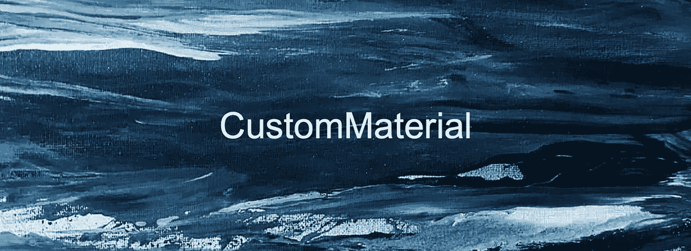
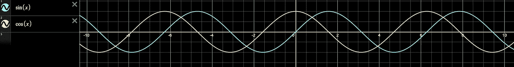
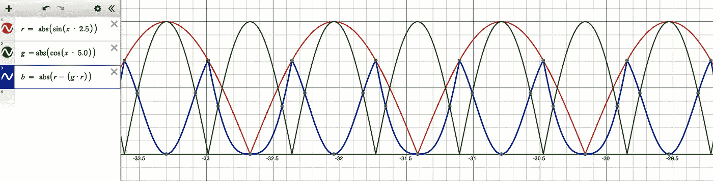
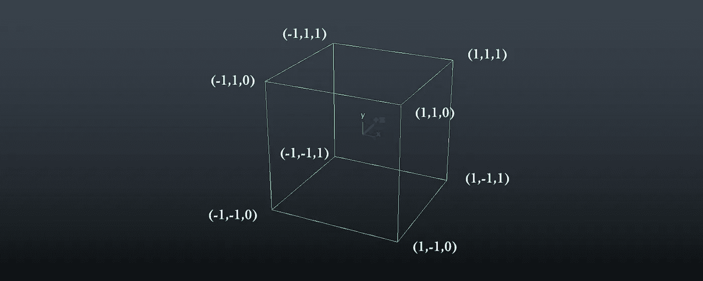
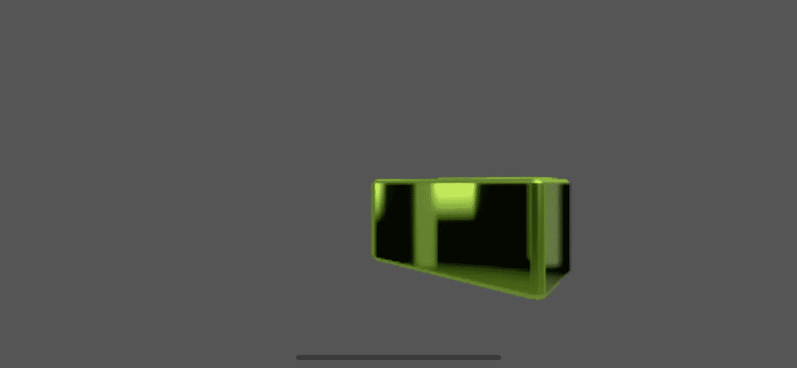

# RealityKit 911 —带有金属着色器的自定义材质

> 原文：<https://medium.com/geekculture/realitykit-911-custom-material-with-metal-shaders-e7e1f7077e69?source=collection_archive---------5----------------------->



RealityKit 的可编程素材，名为 [*CustomMaterials*](https://developer.apple.com/documentation/realitykit/custommaterial?changes=_5) ，在 iOS 15 及以后的版本中都有。这类材质使用两个特殊的金属函数来管理模型的 ***顶点 _ 位置*** 和 ***像素 _ 数据*** 。Apple Metal 是用于与 3D 图形硬件交互的原生低级 API。作为一名开发人员，你能够创建用金属着色器语言(MSL)编写的代码块，这实际上是 C++的精简版本，它极大地改变了任何 AR/VR 材料的外观和感觉。

> ***根据苹果定义*** :
> 
> 自定义材质允许您利用 RealityKit 的现有着色器管线来渲染支持自定义金属着色器功能的基于物理的或无光的材质。这些函数修改 RealityKit 呈现实体的方式。自定义材质支持两种不同类型的自定义金属着色器功能:几何体修改器和曲面着色器。
> 
> RealityKit 的第一种金属着色器是内置的片段着色器，它为每个屏幕像素触发一次。RealityKit 的片段着色器调用您的表面着色器，这意味着表面着色器也为实体的每个片段(像素)调用一次。
> 
> RealityKit 使用的另一种金属着色器是顶点着色器。顶点着色器为实体中的每个顶点触发一次。如果在创建自定义材质时提供几何体修改器，RealityKit 的顶点着色器会调用它。几何体修改器为实体中的每个顶点触发一次。

好了，有了理论一切都清楚了，让我们继续实践吧。我们有一个默认的现实作曲家的场景与臭名昭著的钢铁盒子。


Steel box in Reality Composer’s default scene

## 着色器.金属

从 Xcode 11 开始，模拟器应用程序中添加了金属开发支持，因此我们不必每次进行微小的更改时都在真实的 iOS 设备上运行我们的 RealityKit 应用程序。

首先，我们必须在金属中创建一个表面着色器。表面着色器与几何体修改器一样，必须在具有 *[[visible]]* 属性的函数内部。

“ *basicShader* ”函数的意思很简单:我希望纹理的颜色随着时间不断变化。为了做到这一点，我使用了三角函数 ***sin()*** 和 ***cos()*** ，这两个函数都形成了一个正弦波，但是有 90 度的偏移。



Sinusoidal waveforms with negative and positive half waves

检查代码。对于 ***红色*** 和 ***绿色*** 通道，我取了这些函数返回的绝对值(只是正值)。 ***蓝色*** 通道的值是简单数学运算的结果。

```
**#include** <metal_stdlib>
**#include** <RealityKit/RealityKit.h>**using namespace** metal;[[**visible**]]
**void** basicShader(realitykit::surface_parameters shader)
{
    realitykit::surface::surface_properties ssh = shader.surface();
    **float** time = shader.uniforms().time(); **half** r = abs(cos(time * 2.5));
    **half** g = abs(sin(time * 5.0));
    **half** b = abs(r - (g * r)); ssh.set_base_color(**half3**(r, g, b)); ssh.set_metallic(**half**(1.0));
    ssh.set_roughness(**half**(0.0));
    ssh.set_clearcoat(**half**(1.0));
    ssh.set_clearcoat_roughness(**half**(0.0));
}
```

查看图表，找出数学是如何影响正弦波的。



Resulted graphs for Red, Green and Blue channels

你可以在 www.desmos.com[实验任何三角函数。](https://www.desmos.com/calculator)

第二个金属功能是关于定位。这里数学背后的一般思想是让顶点改变它们的位置，所以我们可以移动模型的一部分或整个模型。酷吗？

下面的代码是 geometry modifier，所有的参数都是不言自明的，因为我们使用了与前面的函数相同的原理。

你唯一要记住的是，金属的 ***规格化设备坐标*** (NDC)从负 1.0 到正 1.0(对于 X 和 Y 轴)，其中原点 ***(0.0，0.0)*** 是模型的中心，对于 Z 轴，范围是 0.0 到+1.0(所以，正的 Z 值远离相机)。

*由此可见，NDC 的中心是(0.0，0.0，0.5)* 。



Left-handed NDC coordinate system of Apple Metal

我使用 ***偏移*** 属性为立方体模型应用椭圆轨道。

```
[[**visible**]]
**void** basicModifier(realitykit::geometry_parameters modifier)
{
    **float3** pose = modifier.geometry().model_position();
    **float** time = modifier.uniforms().time();
    **float** speed = 1.5f;
    **float** amplitude = 0.1f;
    **float** offset = 0.05f; **float** cosTime = (cos(time * speed)) * amplitude;
    **float** sinTime = (sin(time * speed)) * (amplitude + offset); modifier.geometry().set_model_position_offset(
        **float3**(cosTime, sinTime, pose.z + 0.1)
    );
}
```

## ViewController.swift

迅捷的部分并不复杂。首先，我们声明 MTLDevice 的一个实例。它可以被认为是我们与 GPU 的直接连接。然后我们声明两个着色器函数所在的金属库的实例。代码的另一部分你很熟悉，因为它是 RealityKit 材料的常规赋值。顺便说一句，我用物理方法实现了永久旋转，而不是动画。

```
**import** UIKit
**import** RealityKit
**import** Metal**class** ViewController: UIViewController { **@IBOutlet var** arView: ARView! **override func** viewDidLoad() {
        **super**.viewDidLoad() **self**.arView.environment.background = .color(.darkGray) **let** boxScene = **try**! Experience.loadBox()
        boxScene.children[0].scale *= 5.0 **let** box = boxScene.steelBox!.children[0] **as**! ModelEntity ***// Metal device and library***
        **let** device = MTLCreateSystemDefaultDevice() **guard let** defaultLibrary = device!.makeDefaultLibrary()
        **else** { **return** } **let** shader = CustomMaterial.SurfaceShader(
                                           named: "*basicShader*",
                                              in: defaultLibrary) **let** modifier = CustomMaterial.GeometryModifier(
                                           named: "*basicModifier*",
                                              in: defaultLibrary) **do** {
            box.model?.materials[0] = **try** CustomMaterial(
                                            surfaceShader: shader,
                                         geometryModifier: modifier,
                                            lightingModel: **.lit**)} **catch** {
            print("*Can't find Custom material*")
        } **self**.arView.scene.anchors.append(boxScene) ***//*** ***Rotation about Y axis*** 
        box.components[PhysicsBodyComponent.**self**] = .init()
        box.components[PhysicsMotionComponent.**self**] = .init()
        box.physicsBody?.massProperties.mass = 0.0
        box.physicsMotion?.angularVelocity.y = 1.0
        box.generateCollisionShapes(recursive: **true**)
    }
}
```

# 结果

我们有什么？我们有三种颜色的动画循环——现代绿、芥末金和高贵紫，金属表面有透明涂层。我们得到了一个平行六面体沿着椭圆轨道的运动。



# 捐赠给作者


Click on the picture to make the QR code bigger

```
addr1q9w70n62nu8p7f9ukfn66gzumm9d9uxwppkx7gk7vd7gy0ehfavj97gkncwm8t8l8l8x9e4adzmw2djh4y5gd9rmtewqr99zr3
```

目前就这些。

如果这篇帖子对你有用，请按下 ***拍*** 按钮，按住*即可。在 Medium 上，每个帖子最多可以拍 50 次*。**

**你可以在我在 [StackOverflow](https://stackoverflow.com/users/6599590/andy-fedoroff) 上的帖子中找到更多关于 ARKit、RealityKit 和 SceneKit 的信息。**

**后会有期！**