# RealityKit 911 静止模型的假阴影

> 原文：<https://medium.com/geekculture/realitykit-911-fake-shadows-for-stationary-models-78387aabf42c?source=collection_archive---------11----------------------->

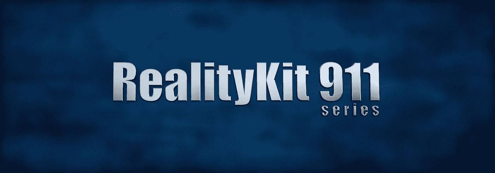

***光线追踪阴影*** 是计算机图形学中计算量最大的特征之一。另一方面，即使是 ***深度图阴影*** (也称为 ***投影阴影*** )无论如何都是 CPU / GPU 处理和内存消耗的沉重负担，尽管程度较轻。

如果我们放弃渲染静止物体的阴影会怎么样？如果我们对那些物体使用 ***假阴影*** 会怎么样？对于任何 AR 开发人员来说，这都是一个关键时刻，因为使用假阴影可以节省电池寿命并减少处理。我们所要做的就是关闭阴影渲染，然后将我们的 ***假阴影*** 烘焙成纹理。就这么办吧。

# 核武器能帮助我们制造阴影吗？

Foundry NUKE 是一个专业的合成工具包，允许我们用烘焙的阴影创建纹理(无论它们是静止的还是移动的)。NUKE 是基于节点的，比如 SceneKit。不同的是，NUKE 有一个非常有用的节点图的图形表示。每个节点都有自己的属性，可以单独调整。你必须下载一个非商业版本的铸造核弹来开始我们的旅程。

观看这些[视频教程](https://learn.foundry.com/nuke?_gl=1*978l3k*_ga*OTIzMTY4ODYzLjE2MzAwNzg5ODI.*_ga_QQ35L7EVY0*MTYzMDIyNDgyNi41LjEuMTYzMDIyNjE0Ny4w*_ga_THF8SPBJQF*MTYzMDIyNDgyNi41LjEuMTYzMDIyNjE0Ny4w)了解如何开始使用 NUKE。

我们的增强现实场景相当简单:两个鼓手模型，以及一个有纹理的地板和一面有纹理的墙(阴影捕捉器)。

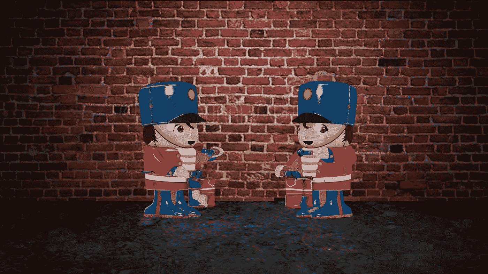

Scene has no shadows

在 Xcode 中为窗口大小为 1920x1080 的 macOS app 创建一个 ***RealityKit*** 项目。加载一个 ***现实作曲*** 项目包含 3 个 ***。usdz*** 文件在单独的场景中(鼓手、地板和墙壁)。隐藏墙壁和地板，然后为鼓手分配一个新的 ***无光着色器*** ，默认为白色，并截图。

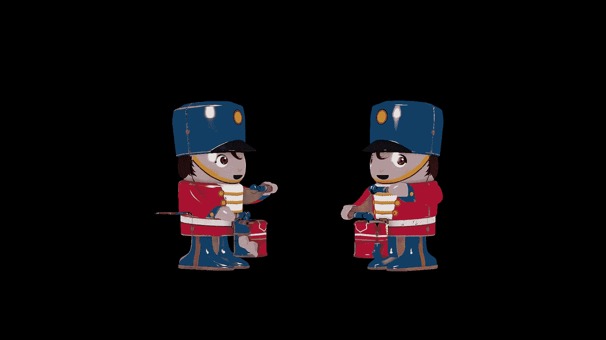

Wall and floor are hidden

在 Xcode 中运行这个 macOS 应用程序，允许您只渲染 drummers:

```
 **import** AppKit
**import** RealityKit**class** ViewController: NSViewController { **@IBOutlet var** arView: ARView! **override func** awakeFromNib() { // Black background
        arView.environment.background = .color(.black)

        // Scene 1 – Drummers
        **let** drummersScene = **try**! Experience.loadDrummers() // Scene 2 – Wall
        **let** wallScene = **try**! Experience.loadWall() // Scene 3 – Floor
        **let** floorScene = **try**! Experience.loadFloor() **let** whiteTexture = UnlitMaterial() // I merged 2 USDZs in Maya, so their hierarchy is specific 
        **let** modelEntity = drummersScene.twoDrummers?.children[0]
                .children[0].children[0].children[0]
                .children[0].children[0].children[0] **as**! ModelEntity modelEntity.model!.materials[0] = whiteTexture arView.scene.anchors.append(drummersScene) // arView.scene.anchors.append(wallScene)
        // arView.scene.anchors.append(floorScene)
    }
}
```

截图(***Cmd–Shift–4***)应该是这样的。

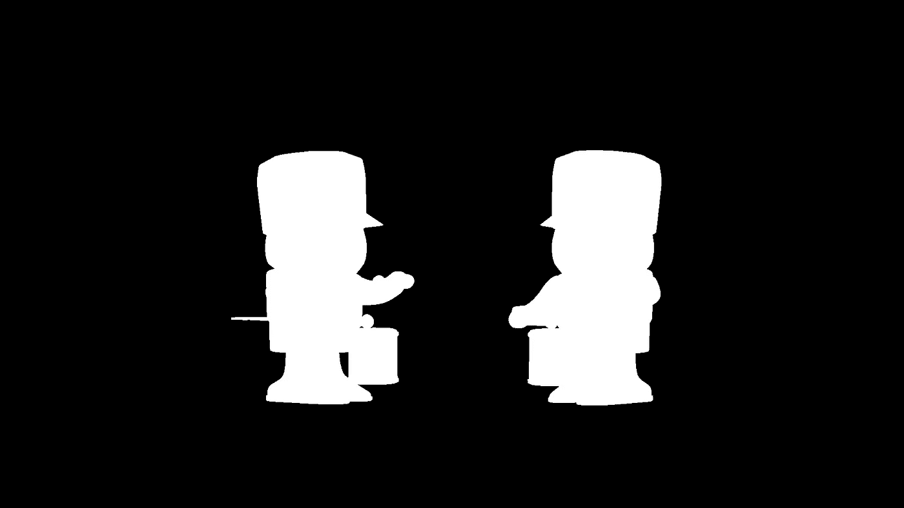

White UnlitMaterial

# NUKE 中的合成

使用 ***读取*** 节点将白色材料的截图加载到铸造核武器中，然后应用 ***反转*** 节点将其反转。要调用任何节点，请使用 ***标签*** 热键(在按下 ***标签*** 的同时将鼠标指针停留在节点图形上)。

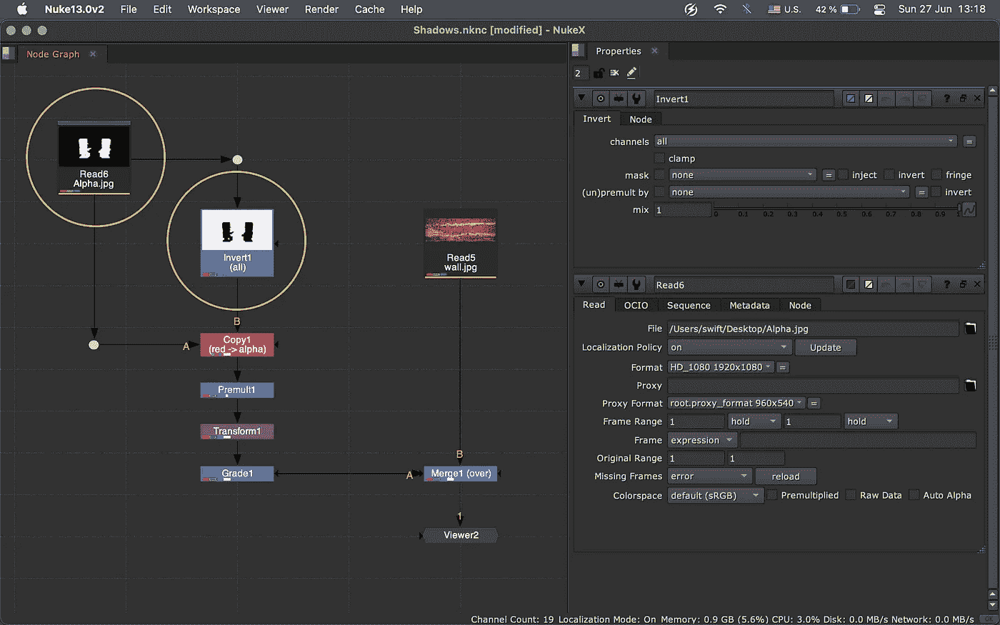

NUKE script processing our fake shadows

将原图像馈入 A 输入的 ***复制*** 节点，然后将反转图像馈入 B 输入的 ***复制*** 节点。考虑到 NUKE 中的 B 流是一般频道的流(A 流是可选的)。

在属性窗格中，将红色通道数据复制到 Alpha 通道数据中。在使用 ***预乘*** 节点将第二图像(B 流)的 RGB 预乘到第一图像(A 流)的 Alpha 通道之后。

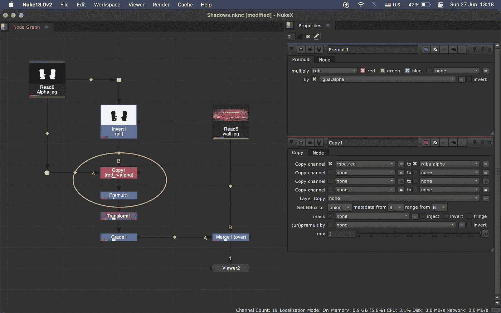

Channel reordering and premultiplication ops

***变换*** 节点帮助你沿着 X 和 Y 轴平移你的阴影。

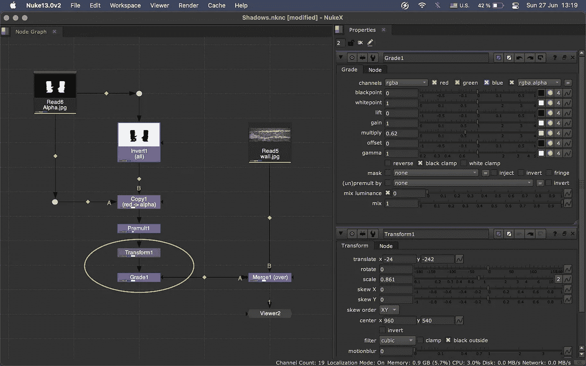

With Grade node we control a transparency of our fake shadows

现在我们可以看到墙壁纹理上的阴影。但是我们的影子是不透明的，不是吗？

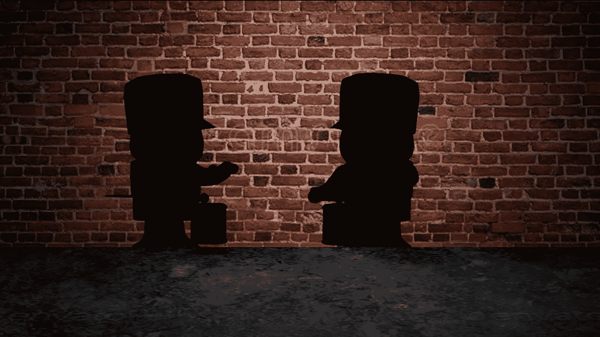

Opaque shadows

我们可以很容易地在一个*节点中固定一个 ***乘*** 参数。半透明的阴影看起来更令人愉快。特别注意等级节点中的参数 ***通道=rgba*** 。*

*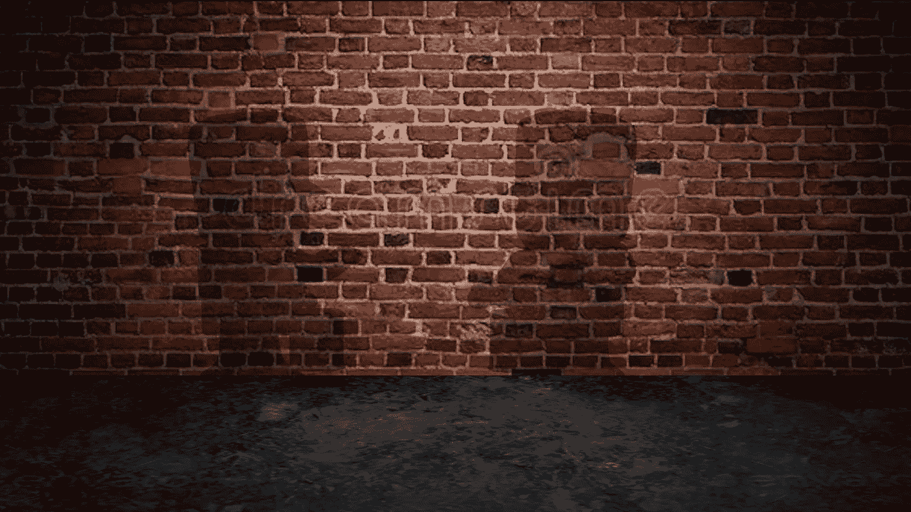*

*Transparent shadows*

*正如你从照片中看到的，我们使用 ***合并*** 节点和*操作合成了一个墙纹理的阴影。**

**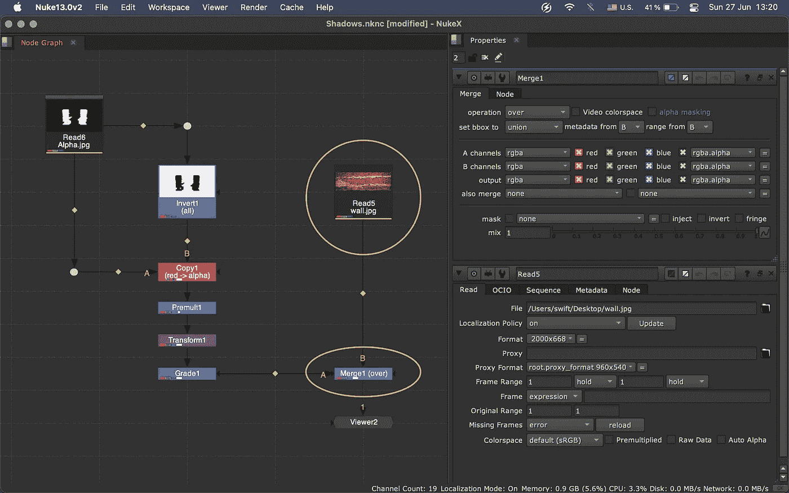**

**NUKE 有 30 个合成操作。 ***超过*** 是默认的一个。*将前景图像的 RGBA 通道与背景图像的 RGB 通道相加，再乘以前景的 Alpha 反转。***

******【RGB 1+RGB 2 *(1.0–A1)******

**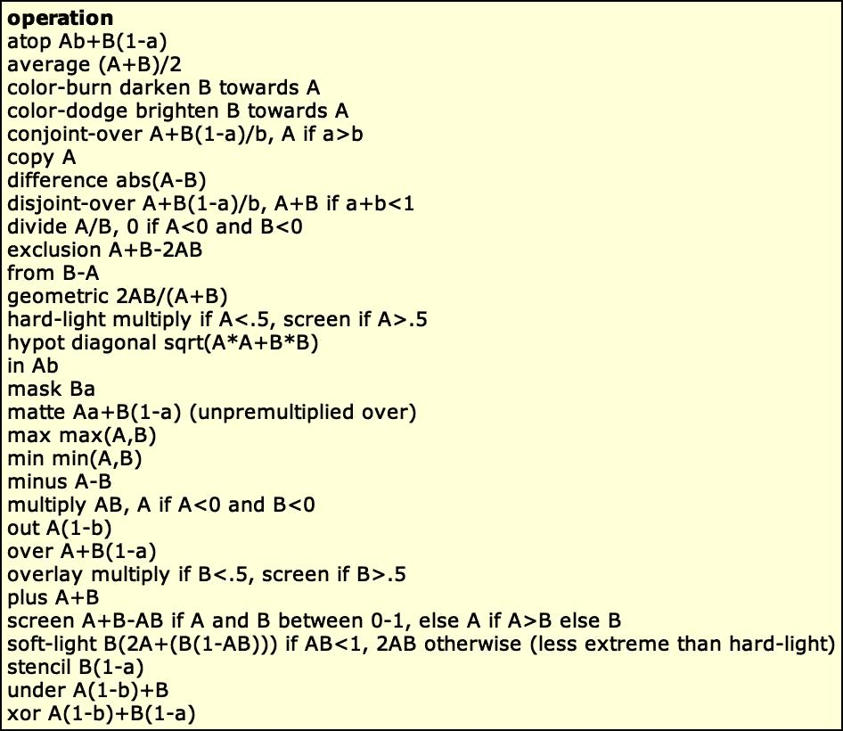**

**你有没有注意到我们的影子有锋利的边缘？**

****

**让我们使用一个带有相应参数 ***size=30*** 的 ***模糊*** 节点来模糊它们。**

**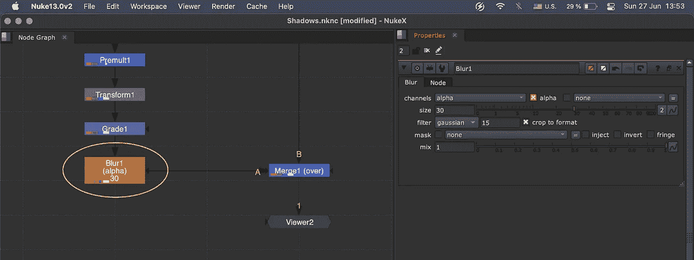**

**现在看起来更可信了。**

**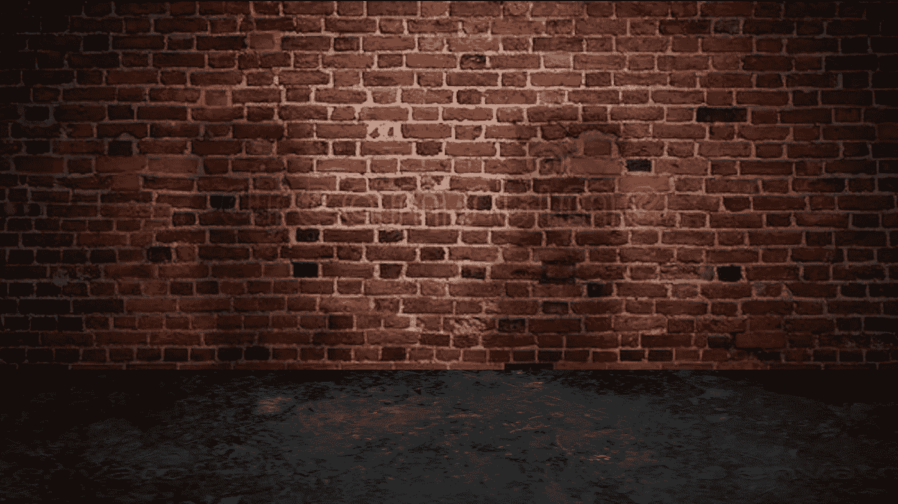**

**Blur is optional. Use blur only when a model is far from a wall.**

**对比时间！这里是不透明的黑色阴影。看起来不现实吧？**

**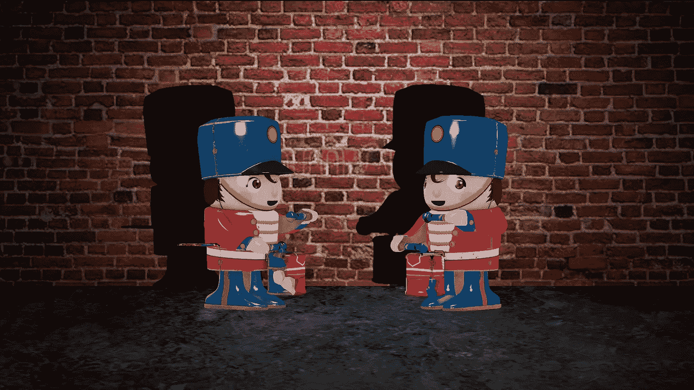**

**这些是漂亮的半透明阴影。**

**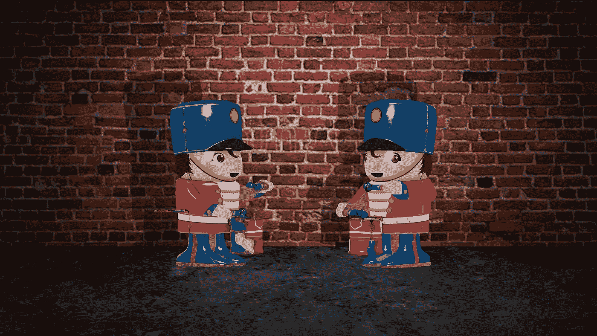**

**使用 ***编写*** 节点来渲染你的磁盘上新墙的纹理。请记住，NUKE 的非商业版本支持最大分辨率为 1920x1080 的图像渲染。用一个名字***【fake.jpg】***保存新的纹理。**

**让我们将新的纹理分配给一个墙对象(不要忘记将***【fake.jpg】***文件放入 Xcode 的 ***Assets.xcassets*** 目录)。以下是 iOS 应用的 Swift 代码:**

```
****import** SwiftUI
**import** RealityKit**struct** ContentView: View {
    **var** body: **some** View {
        **return** ARViewContainer()
            .edgesIgnoringSafeArea(.all)
    }
}**struct** ARViewContainer: UIViewRepresentable { **func** makeUIView(context: Context) -> ARView { **let** arView = ARView(frame: .zero) **let** wallScene = **try**! Experience.loadWall() **var** fakeShadowsTexture = SimpleMaterial() fakeShadowsTexture.baseColor = .texture(**try**! .load(
                                                     named: "fake")) **let** wallModel = wallScene.wall!.children[0] **as**! ModelEntity

        wallModel.model!.materials = [fakeShadowsTexture] arView.scene.anchors.append(wallScene) **return** arView
    } **func** updateUIView(_ uiView: ARView, context: Context) { }
}**
```

**同样，你也可以为家具、树木、建筑物和其他静止的增强现实物体创建假阴影。**

# **捐赠给作者**

****

**Click on the picture to make the QR code bigger**

```
**addr1q9w70n62nu8p7f9ukfn66gzumm9d9uxwppkx7gk7vd7gy0ehfavj97gkncwm8t8l8l8x9e4adzmw2djh4y5gd9rmtewqr99zr3**
```

**目前就这些。**

**如果这篇文章对你有用，请按下 ***拍下*** 按钮，按住*即可。在 Medium 上，每个帖子最多可以拍 50 次*。****

***你可以在我在 [StackOverflow](https://stackoverflow.com/users/6599590/andy-fedoroff) 上的帖子中找到更多关于 ARKit、RealityKit 和 SceneKit 的信息。***

***后会有期！***