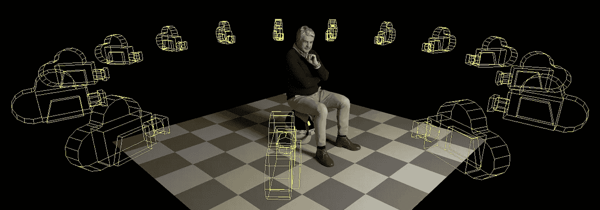
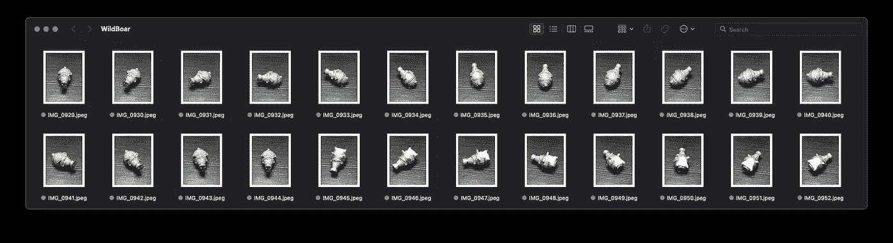
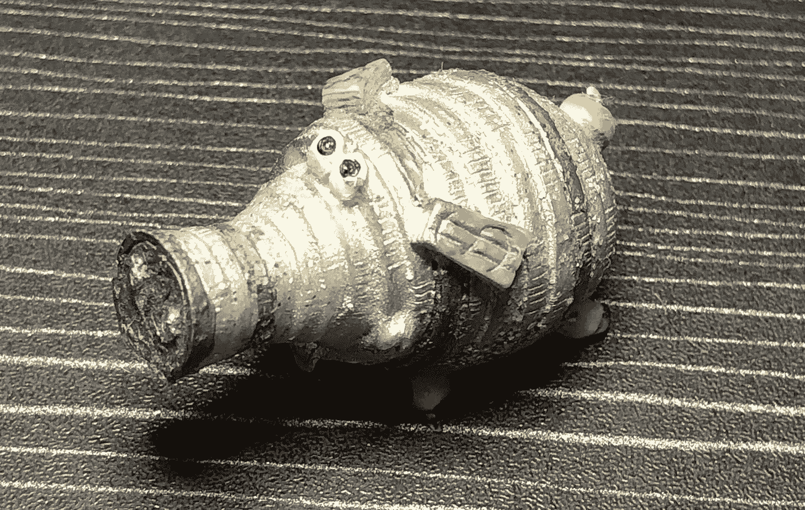
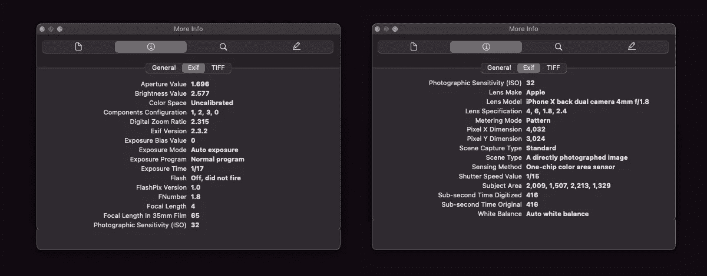
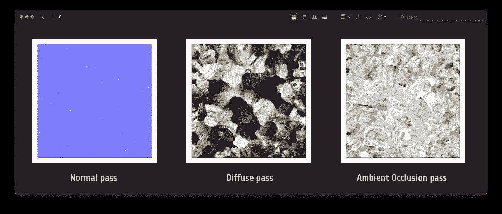

# RealityKit 911 —摄影测量

> 原文：<https://medium.com/geekculture/realitykit-911-photogrammetry-77659381af50?source=collection_archive---------4----------------------->



# 序

苹果的原生 ***摄影测量*** 不仅旨在使 USDZ 和 OBJ 模型的创建和自动 UV 纹理更容易，还将增强现实行业推向了一个全新的水平。过去花费几百美元的东西现在是免费的。

随着 macOS 12 和 Xcode 13 的发布，苹果开发者获得了一个创建纹理化 3D 模型的强大工具，这为参与 AR 和 VR 软件制作的公司节省了时间和预算。

# 捕捉照片

RealityKit 的摄影测量，或称 ***物体重建 API*** ，是一种将一堆 2D 图像变成 3D 模型的计算机视觉技术。图像可以在 iPhone 或任何 DSLR 相机上拍摄。你需要想到的只是如何在合适的光照条件下，以等距的角度拍摄一系列照片。作为摄影测量输入，您可以使用 ***jpeg*** 、 ***png*** 或 ***heic*** 格式的有序或无序的高分辨率照片。

今天我想用一个小小的公猪泥人做一些摄影测量测试。我目前有两个小工具——iPhone X 和用于摄影的无名 LED 灯板。我拍了 48 张肖像 ***jpeg*** 照片(3024×4032)放在一个名为 ***野猪*** 的文件夹里。



A folder with 48 images of boar clay figurine

看看泥人的细节，粗糙度和纹理。只有 5 厘米长。



Real-world model

查看 iPhone X 相机设置:



Camera settings

在继续之前，让我分享一些实用的技巧，帮助您拍摄更高质量的照片:

*   照明条件必须接近理想
*   使用产生柔和模糊阴影的灯具
*   使用带有间歇旋转模式的电动转盘
*   相邻照片必须有 70%的重叠
*   最好是带有 ***深度通道*** 的图像
*   带有 ***重力数据*** 的图像更佳
*   更高分辨率的图像是优选的
*   不要捕捉移动和变形的对象
*   避免反射、折射和半透明的物体
*   避免一维非常薄的物体
*   不要捕捉带有镜面高光的对象
*   不要捕捉玻璃物品和宝石
*   不要使用自动对焦和相机闪光灯

> 官方文件说:相邻镜头之间的重叠小于 50%，物体创建过程可能会失败或导致低质量的重建。

我找到了 Dimitris Katsafouros 的一个视频，它讲述了制作一堆适合摄影测量的照片所需的步骤。这是:

然而，如果你需要同时创作一系列高质量的生物照片——人类或动物——你将不得不使用任何配备有由 120 台相机组成的子弹时间相机装备的工作室的服务。

专业的摄影测量设备是许多 3D 应用程序开发人员的梦想。

# 重建模型

为了使用摄影测量功能，您需要一台装有 macOS 12.0 或更高版本以及 Xcode 13.0 或更高版本的电脑。尽管如此，要确定您的硬件是否满足最低要求(CPU 和 GPU 型号、RAM 数量，并提供 [***重心坐标***](https://stackoverflow.com/questions/25397586/accessing-barycentric-coordinates-inside-fragment-shader) 到 [***片段着色器***](https://developer.apple.com/documentation/realitykit/modifying_realitykit_rendering_using_custom_materials) )，请实现以下代码:

```
**import** Metal

**private func** supportsObjectReconstruction() -> Bool {
    **for** device **in** MTLCopyAllDevices() **where** 
        **!**device.isLowPower &&
        device.areBarycentricCoordsSupported &&
        device.recommendedMaxWorkingSetSize >= UInt64(**4e9**) {
        **return true**
    }
    **return false**
}

**private func** supportsRayTracing() -> Bool {
    **for** device **in** MTLCopyAllDevices() **where** device.supportsRaytracing {
        **return true**
    }
    **return false**
}

**func** supportsObjectCapture() -> Bool {
    **return** supportsObjectReconstruction() && supportsRayTracing()
}

**func** doObjectCapture() {
    **guard** supportsObjectCapture() **else** {
        print("Object capture is not available")
        **return**
    }
}
```

这个视频将阐明什么是重心坐标。

嗯，我有一台装有 M1 芯片和 16 MB 内存的电脑，所以我准备使用摄影测量学。下面的代码允许您在 ***命令行模式*** 中启动对象重建过程。你可能会对代码如此简单感到惊讶——苹果的工程师们做得非常好。非常尊重他们！😀

```
**import** Cocoa
**import** RealityKit**struct** Photogrammetry { **typealias** Request = PhotogrammetrySession.Request
    **var** inputFolder = "/Users/swift/Desktop/WildBoar"
    **var** outputFile = "/Users/swift/Desktop/wildBoar.usdz"
    **var** detail: Request.Detail = .medium **fileprivate func** running() { **var** config = PhotogrammetrySession.Configuration()
        config.featureSensitivity = .normal
        config.isObjectMaskingEnabled = **true**
        config.sampleOrdering = .unordered **let** inputFolderURL = URL(fileURLWithPath: inputFolder, 
                                     isDirectory: **true**) **var** optionalSession: PhotogrammetrySession? = **nil** **do** {
            optionalSession = **try** PhotogrammetrySession(
                                             input: inputFolderURL,
                                     configuration: config)        
        } **catch** {
            print("*ERROR*")
            Foundation.exit(1)
        } **guard let** session = optionalSession 
        **else** { Foundation.exit(1) } withExtendedLifetime(session) { **do** {
                **let** request = PhotogrammetrySession.Request
                   .modelFile(url: URL(fileURLWithPath: outputFile),
                           detail: detail)
                **try** session.process(requests: [request])
                RunLoop.main.run()
            } **catch** {
                print("*ERROR*")
                Foundation.exit(1)
            }
        }
    }
}
```

现在调用 ***running()*** 方法:

```
**if #available**(macOS 12.0, *) {
    Photogrammetry().running()
} **else** {
    fatalError("Requires macOS 12.0 or higher")
}
```

花费在对象重建上的时间取决于许多因素:CPU 和 GPU 的能力、RAM 的数量、设置、照片的数量和大小等。在我的电脑上，重建一个泥人模型(48 张图片)花了 2 分 30 秒。然而，如果我使用苹果公司的 ***PegasusTrail*** 示例(124 张图片)，生成一个 USDZ 模型几乎需要 10 分钟。毫无疑问，当使用 ***深度*** 数据时，重建过程会花费更长的时间。

> **提示** : RealityKit object creation 接受任何数码相机拍摄的图像，包括 iPhone 或 iPad 上的相机、DSLR 或无反光镜相机，甚至是配备相机的无人机。如果您的源图像包含深度数据，RealityKit 将使用它来计算扫描对象的真实大小。RealityKit 也可以从没有深度数据的图像中创建对象，但在将对象放入 AR 场景时，您可能需要缩放它。有关捕捉图像深度数据的更多信息，请参见[捕捉具有深度的照片](https://developer.apple.com/documentation/avfoundation/cameras_and_media_capture/capturing_photos_with_depth)。

# 生成的几何图形和纹理

自从 macOS Monterey 发布以来，我一直在使用原生的苹果摄影测量 API(*我以前使用 Agisoft 软件*)，但每次创建新的 USDZ 模型时，我都会由衷地惊讶于苹果摄影测量工具的易用性和模型的质量。


Reconstructed model in USDZ format

如果你 [***解压***](https://stackoverflow.com/questions/55544185/how-to-generate-usdz-file-again-from-zip-file/55631922#55631922)USDZ 文件的内容，那么除了二进制的 USDC 模型(而 **OBJ** *模型* *是* *ASCII 码*或**DAE** *模型是基于 XML 的*之外，你将可以访问该目录并对其纹理进行编辑。



Generated textures for USDZ’s Physically Based shader

***细节*** 案例为重建模型提供了五种不同的质量等级供您选择。这也会影响纹理的数量和分辨率。

```
**var** detail: Request.Detail = .medium
```

## ***。预览***

> 预览会尽可能快地生成低质量的几何体，以帮助在生成计算成本更高的模型之前验证几何体。

## ***。减少了*和**

> 减少细节优化内存和网络传输带宽。

## ***。中等***

> 中等细节提供了**之间的折中。减少了**和**。满*。***

## ***。完整的*和**

> “完整细节”优化了系统可以生成的最大网格和纹理细节，以供目标交互使用。

## ***。raw***

> 对于高端生产用例，**。原始的**细节将提供未经处理的资产，允许专业艺术家使用基于物理的渲染光线跟踪器来实现最高质量的结果。

通过检查此表中的数据，您可以更详细地了解 ***细节*** 情况的选择如何影响最终几何体，以及投影纹理的大小和数量(也称为 aov 或渲染过程)。

```
|---------------|--------------|------------|-----------------|
|     **Detail**    |   **Polygons **  |    **AOVs** |  **Ready for iOS** |
|---------------|--------------|------------|-----------------|
|   .preview    |    25,000    |   1 – 1K   |       Yes       |
|---------------|--------------|------------|-----------------|
|   .reduced    |    25,000    |   3 – 2K   |       Yes       |
|---------------|--------------|------------|-----------------|
|   .medium     |    50,000    |   3 – 4K   |       Yes       |
|---------------|--------------|------------|-----------------|
|   .full       |   100,000    |   5 – 4K   |        No       |
|---------------|--------------|------------|-----------------|
|   .raw        |   132,500    |   1 – 4K   |        No       |
|---------------|--------------|------------|-----------------|
```

正如你所看到的，当你赋值**T1 的时候。完整的** 案例，你会得到一个由 ***100K 个多边形*** 组成的 USDZ 模型，每个都有五个 4K 大小的 UV 贴图纹理——分别用于 ***【漫射】*** 、 ***遮挡*** 、 ***粗糙度*** 、 ***位移*** 和 ***正常*** 通道这样的模型适合 3D 制作，不适合 iOS 中的 AR。

摄影测量会话的好处是，您可以轻松地同时请求多个模型:

```
**try**! session.process(requests: [ .modelFile(“*/Users/you/Desktop/boarR.usdz*”, detail: **.reduced**),
    .modelFile(“*/Users/you/Desktop/boarM.usdz*”, detail: **.medium**),
    .modelFile(“*/Users/you/Desktop/boarF.usdz*”, detail: **.full**)
])
```

不要忘记，您不仅可以在 RealityKit 中使用结果模型，还可以在 SceneKit 中使用结果模型。并且让我们打开一个 ***默认照明*** 。

```
**import** SceneKit**class** ViewController: UIViewController { **override func** viewDidLoad() {
        **super**.viewDidLoad() **let** sceneView = **self**.view **as**! SCNView **let** scene = SCNScene(named: "art.scnassets/*boarM*.usdz")!
        sceneView.scene = scene sceneView.allowsCameraControl = **true** sceneView.autoenablesDefaultLighting = **true** }
}
```

# 捐赠给作者


Click on the picture to make the QR code bigger

```
addr1q9w70n62nu8p7f9ukfn66gzumm9d9uxwppkx7gk7vd7gy0ehfavj97gkncwm8t8l8l8x9e4adzmw2djh4y5gd9rmtewqr99zr3
```

目前就这些。

如果这篇帖子对你有用，请按下 ***拍下*** 按钮，按住*即可。在 Medium 上，你可以在每个帖子上最多拍 50 次*。**

**你可以在我在 [StackOverflow](https://stackoverflow.com/users/6599590/andy-fedoroff) 上的帖子中找到更多关于 ARKit、RealityKit 和 SceneKit 的信息。**

**后会有期！**