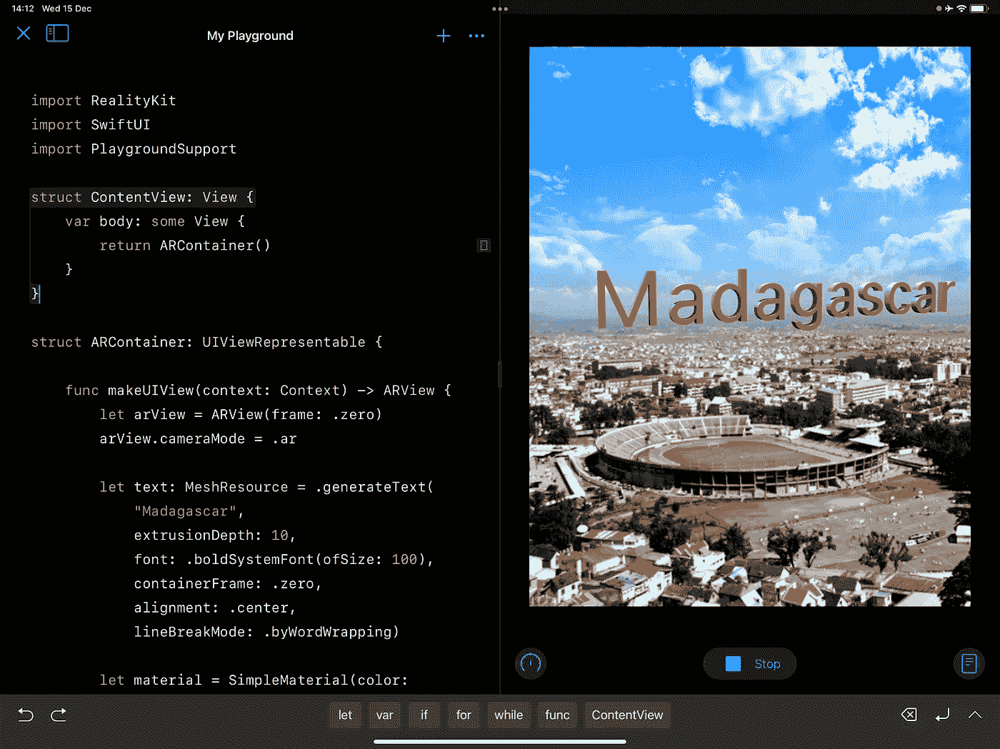

# RealityKit 911 — Swift Playgrounds，或如何在 iPad Pro 上创建和调试 AR 应用程序

> 原文：<https://medium.com/geekculture/realitykit-911-swift-playgrounds-or-how-to-create-and-debug-ar-apps-on-ipad-pro-190a6d2e03bb?source=collection_archive---------3----------------------->


# 关于在 iPad 上编码的几句话

[***Swift Playgrounds 4.0***](https://apps.apple.com/app/swift-playgrounds/id908519492)适用于 iPad，或者更年轻的 Xcode 兄弟，是开始尝试 AR 项目的理想 AR app。许多尝试过它的开发者表示，这是一个很好的选择，还有另一个现象——[***Reality Composer***](https://apps.apple.com/app/reality-composer/id1462358802)应用。是什么让斯威夫特游乐场如此吸引人？嗯，一些不明显但积极的原因。以下是其中至少七种:

*   Swift Playgrounds 是一款免费应用，具有完整的 AR 功能
*   你可以在 iPad 上模拟 SwiftUI 和 UIKit 项目
*   AR 应用程序的编译时间惊人，几乎是瞬间完成的
*   不需要 iOS 开发者账户
*   免费帐户没有限制，如在 7 天内编译 10 个应用程序
*   没有 *info.plist* 的键，像*NSCameraUsageDescription*
*   不需要互联网连接来验证应用的签名
*   Connect integration 允许您将完成的应用程序上传到 App Store

不过说实话，Swift Playgrounds 也有一个恼人的缺点——当我实现 ***手势*** 或 ***人物遮挡*** 功能时，经常会崩溃。我还不知道它在装有 M1 的 iPad 上如何工作(我用的是装有 A12Z 芯片组的 iPad Pro ),但我希望这个烦人的错误会在未来的版本中得到修复。

# 现实工具包实现

对于这个应用程序，我在离 iPad 摄像头 500 米的地方创建了一个锚点。请记住，RealityKit 2.0 中的 ***远裁剪平面*** 仍被限制在 1000 米内——因此请确保您的 3D 模型不会超出相机的 ***截锥*** 。



Antananarivo

类似的 ar 应用程序的代码可能如下所示:

```
**import** SwiftUI
**import** RealityKit
**import** PlaygroundSupport**struct** ContentView: View {
    **var** body: **some** View {
        **return** ARContainer()
    }
}**struct** ARContainer: UIViewRepresentable { **func** makeUIView(context: Context) -> ARView { **let** arView = ARView(frame: .zero) arView.cameraMode = .ar                  // **IMPORTANT** **let** text: MeshResource = .generateText(*"Madagascar"*,
                       extrusionDepth: 15,
                                 font: .boldSystemFont(ofSize: 100),
                       containerFrame: .zero,
                            alignment: .center,
                        lineBreakMode: .byWordWrapping) **let** material = SimpleMaterial(color: .red, 
                                 isMetallic: **true**) **let** entity = ModelEntity(mesh: text, materials: [material]) entity.orientation = simd_quatf(angle: .pi / 8, 
                                         axis: [0, 1, 0])

        // 500 meters North (-Z)
        **let** anchor = AnchorEntity(world: [0, 0,-500]) anchor.addChild(entity) arView.scene.anchors.append(anchor) **return** arView
    } **func** updateUIView(_ uiView: ARView, context: Context) { }
}PlaygroundPage.current.needsIndefiniteExecution = **true**
PlaygroundPage.current.**setLiveView**(ContentView())
```

注意，这里我用了一个***setLiveView(_:)***的泛型实例方法。它显示了一个视图，该视图显示了运行当前页面上的代码的结果。

```
**func** setLiveView<IncomingView>(_ newLiveView: IncomingView) **where** 
                               IncomingView : PlaygroundLiveViewable
```

您不能在 Swift Playgrounds 中使用 ***liveView*** 实例属性启动 SwiftUI 应用程序，就像您之前对 UIKit 应用程序所做的那样，因为 ***liveView*** 是一个符合***playgroundlivevisible***协议的对象:

```
**var** liveView: PlaygroundLiveViewable? { **get** **set** }
```

# ARKit + SceneKit 实现

很高兴知道我们仍然能够在 Swift Playgrounds 中为 UIKit 和 SwiftUI 项目使用 SceneKit 模块。这里给你一个如何基于 ***ARSCNView*** 创建 SceneKit 的场景的指导(甚至还有一个锚点)。

```
**import** ARKit
**import** PlaygroundSupport**class** ARController: UIViewController { **let** arView = ARSCNView(frame: .zero)
    **var** anchor: ARAnchor! **override** **func** viewDidLoad() {
        **super**.viewDidLoad() **self**.view = arView           // **IMPORTANT** arView.scene = SCNScene()
        arView.autoenablesDefaultLighting = **true** // anchor is 2 meters away
        **self**.anchor = ARAnchor(name: "special", 
                          transform: .**init**([1, 0, 0, 0], 
                                           [0, 1, 0, 0], 
                                           [0, 0, 1, 0], 
                                           [0, 0,-2, 1] ) ) **let** model = SCNNode(geometry: SCNBox(width: 0.1, 
                                            height: 0.25, 
                                            length: 0.1, 
                                     chamferRadius: 0.02)) model.geometry?.firstMaterial?.diffuse.contents = 
                                                        UIColor.red model.simdTransform = **self**.anchor.transform   
        arView.session.add(anchor: **self**.anchor) arView.scene.rootNode.addChildNode(model) // ARKit config
        **let** config = ARWorldTrackingConfiguration()  
        arView.session.run(config)
    }
}PlaygroundPage.current.needsIndefiniteExecution = **true** PlaygroundPage.current.**liveView** = ARController()
```

如你所见，我使用了***needsindefinitiexecution***实例属性，它是一个布尔值，指示是否启用无限执行。

```
**var** needsIndefiniteExecution: Bool { **get** **set** }
```

***开发者文档中的定义*** :

> 默认情况下，执行所有顶级代码，然后终止执行。当使用异步代码时，启用无限执行以允许在到达游戏场的顶级代码结尾后继续执行。这反过来又给了线程和回调执行的时间。
> 
> 使用传统的实时视图，编辑操场会自动停止执行，即使启用了无限执行。使用始终在线实时视图时，无论是否启用无限期执行，执行都会继续。
> 
> 设置***needsindefinitiexecution***为 ***true*** 在顶层代码结束后继续执行。**设为*假*** 停止执行，此时默认值为 ***假*** 。当 ***liveView*** 设置为非 ***nil*** 值时，设置为 ***true*** 。

# 捐赠给作者


Click on the picture to make the QR code bigger

```
addr1q9w70n62nu8p7f9ukfn66gzumm9d9uxwppkx7gk7vd7gy0ehfavj97gkncwm8t8l8l8x9e4adzmw2djh4y5gd9rmtewqr99zr3
```

目前就这些。

如果这篇帖子对你有用，请按下 ***拍下*** 按钮，按住*即可。在 Medium 上，每个帖子最多可以拍 50 次*。**

**你可以在我在 [StackOverflow](https://stackoverflow.com/users/6599590/andy-fedoroff) 上的帖子中找到更多关于 ARKit、RealityKit 和 SceneKit 的信息。**

**后会有期！**