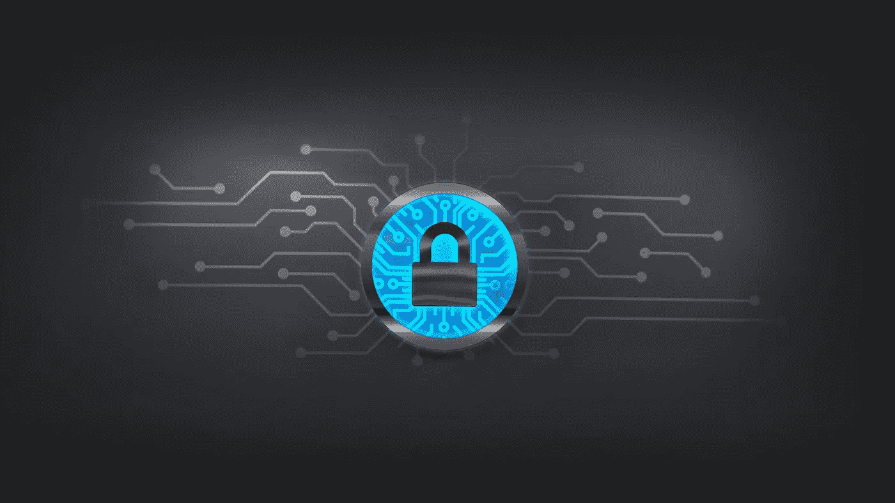
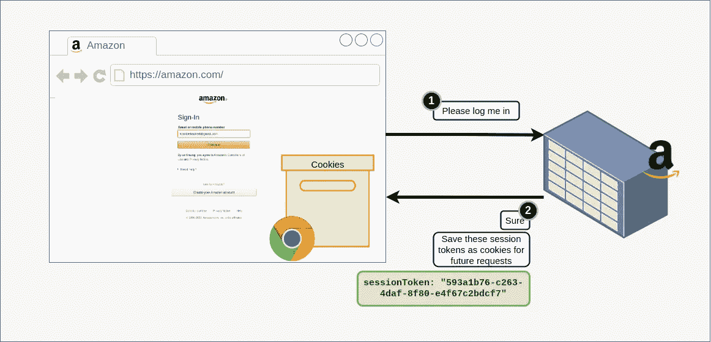
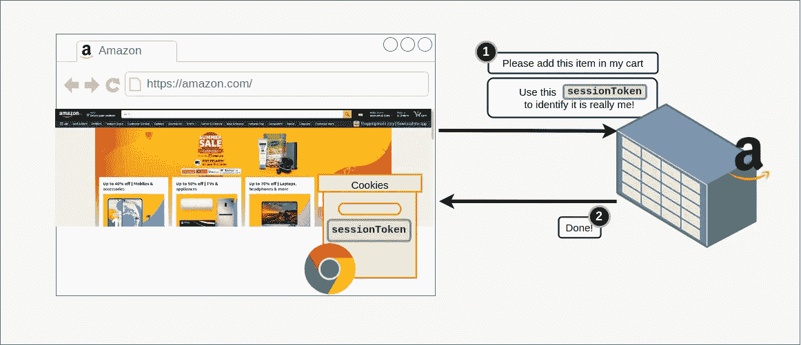
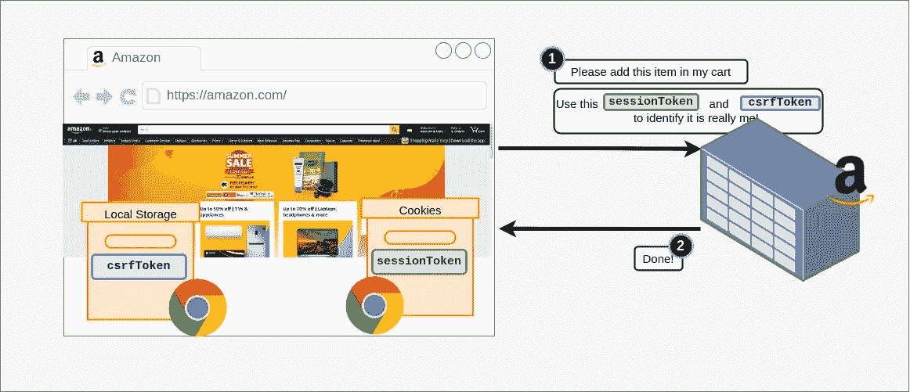
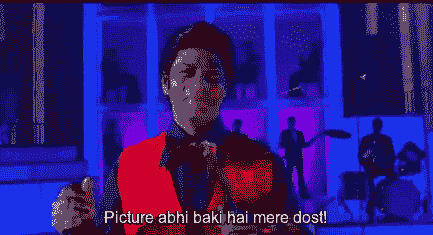

# 真正了解 CSRF

> 原文：<https://medium.com/geekculture/really-understanding-csrf-228398aeaed3?source=collection_archive---------4----------------------->



# 快速介绍

大多数软件工程师在某个时候听说过的最流行的攻击之一是 CSRF 或跨站点请求伪造(别担心，这个名字听起来比实际更复杂)。

读到这里，我发现人们如何找到巧妙的方法绕过安全措施真的很有趣。我认为讨论它是如何工作的，如何防止它，以及关于另一个类似的攻击会很有趣。

# 饼干

在我们了解什么是 CSRF 之前，我们需要了解什么是饼干。如果你已经知道什么是 cookies，可以跳过这一部分。

简而言之，cookies 是一种浏览器功能，通过它，web 浏览器可以记住有关用户的某些细节，并将它们附加到它向特定服务器发出的每个请求中。

让我再澄清一下。假设你想从亚马逊购买一些东西。你登录亚马逊，进入商品页面。选择数量、型号等后，点击黄色大按钮“立即购买”。后端收到购买商品的请求，但是它如何验证您的身份呢？它怎么知道真的是你发送的请求呢？如果每次发送 API 请求都要输入密码，那真的很不方便。

为了防止这种情况，当你登录亚马逊时，亚马逊会在你的浏览器中放置一些 cookies 来识别你的身份。这些 cookies 包含一些对您来说是唯一的随机字符串(或令牌)。



后端存储这些令牌，浏览器也存储它们。这些被称为会话令牌。浏览器会自动将存储会话令牌的 cookies 发送给它向 Amazon.com 发出的每个后端请求，例如，当您向购物车添加商品时。在后端，Amazon 可以读取这些会话令牌，并使用它来验证您的身份。



这很好，因为现在你作为用户，不需要写密码，浏览器会为你处理每个 API 请求的认证。

要理解这与 CSRF 的关系，你需要理解浏览器会把它从 Amazon.com 得到的任何 cookies 发送给任何发往 Amazon.com 的*。这意味着，如果你点击了任何其他网站上的链接 ***以及*** (例如，这个——[Amazon.com](http://amazon.com))，任何存储在你的浏览器中的 cookie，包括有你的凭证的 cookie，都会被发送到 Amazon.com。*

*尽管如此，这可能看起来还不错。Amazon.com 的任何凭证 cookies 都会被发送到 Amazon.com，所以一切看起来都很好。或者是？*

# *那么，CSRF 的攻击是如何进行的呢？*

*我们用一个例子来理解这个。让我们假设你正在研究网飞的一个系列。显然，您已经登录到网飞，在登录过程中，网飞存储了一些 cookiess，它将使用这些 cookie 对您进行身份验证，以满足将来的 API 请求。这些 cookies 保存在您的浏览器中。让我们假设它们看起来像这样，*

```
*{
  "sessionToken": "593a1b76-c263-4daf-8f80-e4f67c2bdcf7"
}*
```

*稍后会很重要的一点是你在网飞的“我的账户”页面上的按钮，这个按钮可以关闭你的账户。单击该按钮会向`netflix.com/deactivate`发送 POST 请求。*

*请记住，包含您的会话令牌的 cookies 也会随此请求一起发送，因为它是发往 netflix.com 的。*

*API 将通过你的`sessionToken`验证你的身份，如果它与数据库中的匹配，它将停用你的账户。*

*但是你不需要考虑按钮，因为你爱 Netflix♥💕停用你的账户意味着你将无法访问你想看的精彩节目列表。*

*在网飞狂欢之后，你收到一封可疑的电子邮件，说如果你点击一个链接，就有机会赢得一百万美元。天真地，你点击链接，它会把你带到一个空页面。干得好，你的网飞帐户已被停用！*

**

## *好吧，到底发生了什么？*

*当你点击链接时，它向一个网站发出一个简单的 HTTP 请求，返回一个简单的空白页面。虽然页面看起来是空的，但实际上并不是空的。事实上，它包含了一些有趣的 javascript。*

*那么，这段代码做了什么呢？它向 netflix.com/deactivate.发出请求，您的浏览器在请求中附加了它为 netflix.com 准备的会话令牌(请记住，浏览器会将来自网飞的 cookies 附加到向 netflix.com 发出的任何请求中，即使它来自不同的来源)。*

**

*当网飞收到请求时，它会检查收到的会话令牌，并在确认后停用您的帐户。*

# *如何保护我们的应用程序免受 CSRF 攻击？*

*保护我们的应用程序免受 CSRF 攻击的一个流行方法是在登录时在后端创建一个 CSRF 令牌，在前端存储这个 CSRF 令牌(不是在 cookies 中)，并在每次请求时手动发送这个令牌。*

**

*在验证请求时，后端可以验证 CSRF 令牌和会话令牌。*

*不同的前端将不能访问 CSRF 令牌，因为它没有被保存为 cookie，因此不能从不同的 web 应用程序发送。*

# *为什么 SOP 不起作用*

*您可能会想，既然我们从不同的来源发送请求，同源策略应该阻止这样的请求。但这不一定是真的。*

*如果你看看攻击者使用的代码，*

*这个请求其实是一个*简单的*请求。简单请求是浏览器不会发送预检请求的请求。什么是飞行前请求？当你发送一个请求到一个不同的源时，你的浏览器会发出一个预检请求，实质上就是浏览器询问服务器，你是否愿意接受这个请求。一个简单的请求需要满足一些条件，但是我们现在不要讨论这个问题。简而言之，我们的请求是一个简单的请求，所以浏览器不会发送奇怪的预检请求来阻止攻击。如果你感兴趣，这里有更多关于 SOP 的信息。*

# *SSRF？*

**

*For my friends who don’t speak Hindi, this means, “Story is not yet complete!”*

*我读了一些关于不同安全漏洞的文章，发现人们如何找到如此有创意和聪明的黑客，以及这些攻击仍在被发现的事实真的很有趣。*

*我会在下一篇文章中继续讨论另一个问题，SSRF 或服务器端请求伪造。这是一种有趣的方式，攻击者可以通过它让服务器向源发送请求！*

*如果你也觉得这很有趣，请给我掌声或评论，让我知道！还有，跟着我不要错过我的故事。*