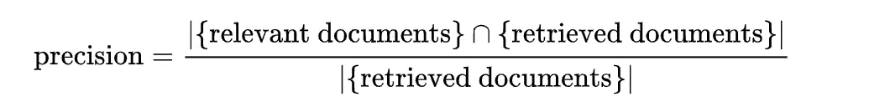
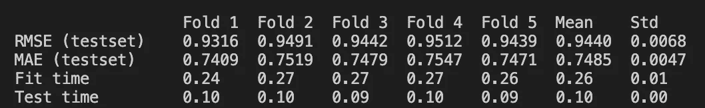
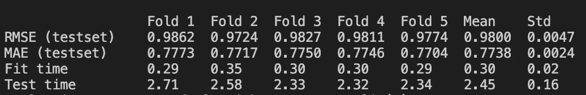
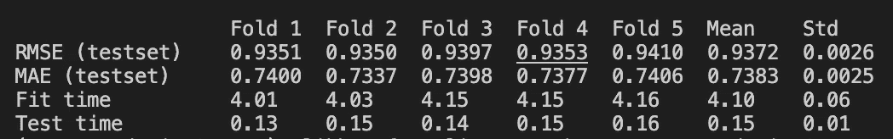
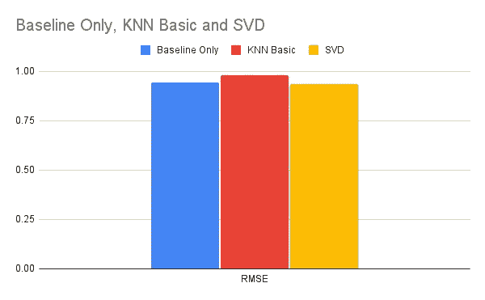
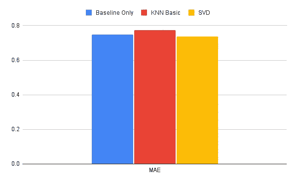
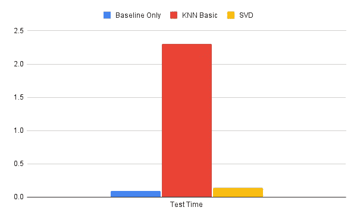
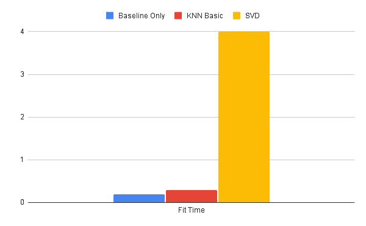

# 使用惊喜的推荐系统基础

> 原文：<https://medium.com/geekculture/recommendation-system-basics-using-surprise-a6e5d76ca69b?source=collection_archive---------31----------------------->


Photo by [Brett Jordan](https://unsplash.com/@brett_jordan?utm_source=medium&utm_medium=referral) on [Unsplash](https://unsplash.com?utm_source=medium&utm_medium=referral)

如果你出生在 2000 年之前的任何时候，那么在百视达浏览一排排电影，寻找你只*知道*会创造最佳夜晚的*一部*电影的经历，对你来说并不陌生。是吗？那莱姆威尔呢。章节？如果这些术语都不能让你感到温暖，那么，你好，z-er 一代。

从那以后，社会发生了巨大的变化，不管是好是坏。随着网飞、Spotify、亚马逊和其他大公司的崛起，我们现在生活在一个你的机器很可能比你自己更了解你的世界。不用再浪费时间去决定接下来读什么书，听什么音乐，买什么没用的科技产品。多亏了复杂的推荐系统，满足我们渴求内容的自我变得容易多了。

试图理解这些系统如何工作的想法可能会令人害怕。然而，有了对机器学习的基本理解，开始就相当简单了。在本文中，我们将了解推荐系统背后的一些基本概念。更具体地说，我们将看看:

1.  什么是推荐系统
2.  不同种类的推荐系统
3.  评估你的推荐系统的不同方法
4.  不同的算法以及它们在准确性和性能方面的比较，使用[惊喜](http://surpriselib.com/)来执行分析

让我们开始吧。

# 什么是推荐系统

在很高的层次上，大多数人可能已经知道这个问题的答案，不管是不是计算机科学家。然而，我认为，区别普通用户和计算机科学家的是能够描述推荐系统的目标。同样，在高层次上，目标是为用户提供符合其需求的内容。但是，作为一个机器学习模型，系统真正试图做的是**预测由**用户**给出的**项目**的**评分**，试图根据所述用户**先前定义的偏好**显示评分最高的产品。**

# 推荐系统的类型

存在三种类型的推荐系统:

1.  **基于内容的过滤:**在基于内容的过滤中，推荐是在每个用户的级别上进行的。基于用户的**显性反馈**(评价一个物品、喜欢一个视频、评论一家餐厅)和他们的**隐性反馈**(多次访问同一页面、长时间停留在一部电影的描述上)，推荐器会建议相似的物品。这种模式的优势在于它只关注用户，为所有人提供独特的个性化体验。然而，在基于内容的过滤中，超越用户当前的兴趣变得很困难。
2.  **协同过滤:**协同过滤不是将每个用户作为一个个体来关注，而是关注不同用户之间的相似之处以及他们曾经互动过的项目。在基于用户的协同过滤方法中，系统会根据用户给出的评分找到相似的用户。在基于**项目的**协作过滤方法中，系统根据用户给它们的评级找到相似的项目[2]。
3.  **混合过滤:**顾名思义，混合系统将使用基于内容的过滤和协作过滤，这取决于具体的场景。

在本文中，我们旨在介绍基础知识。由于协同过滤最近被大肆宣传，我们将主要关注它。也就是说，我们将看到的许多内容可以应用于其他两种类型的系统。

协作过滤有两种可能的方法:

1.  **基于记忆的方法:**使用统计方法来描述用户和项目之间的相似性。
2.  **基于模型的方法:**使用不同的数据挖掘和机器学习模型来确定用户和项目之间的相似性

我们将在本文中看到这两种方法的例子。

# 评估技术

我们的目标是简单地介绍一个人可以评估他的推荐系统的准确性和性能的不同方法。因此，我们不会在本文中详细讨论。相反，我们将介绍这些方法，然后让您做一些额外的研究。和往常一样，参考资料部分包含大量资源。

下面是我们将在下一节中用来评估模型的评估技术列表:

1.  [均方根误差(RMSE)](https://en.wikipedia.org/wiki/Root-mean-square_deviation)
2.  [均方误差](https://en.wikipedia.org/wiki/Mean_squared_error)
3.  [平均绝对误差](https://en.wikipedia.org/wiki/Mean_absolute_error)
4.  精度@k
5.  回忆@k

## 精度@k 和召回@k

这个主题值得额外关注，因为在讨论过滤系统时，精确度、召回率和准确度的概念不同于传统的机器学习问题。

正如在任何机器学习问题中一样，如果我们想全面了解我们的模型是如何执行的，重要的是我们不仅要看准确性，还要看精度和召回率。这对于推荐系统来说没有什么不同。然而，我们并不关心*所有的*建议。通常情况下，我们希望了解我们的系统是如何为 top- *k* 推荐服务工作的。*Precision @ k(k 处的精度)和 recall @ k(k 处的召回)正是用于此目的。*

*要了解这些是如何计算的，您必须首先了解**相关项目**和**推荐项目**之间的区别:*

1.  ***相关项**:已知为数据集一部分的项。例如，这可能是一部用户已经评价过的电影，所以我们知道他们对它的感觉*
2.  ***推荐项目**:由推荐系统生成的项目*

*这样一来，我们可以定义精度和在 k:*

1.  ***Precision@k:** Precision 是检索到的项目中与用户相关的部分[5]*
2.  ***Recall@k:** Recall 是与成功检索的查询相关的项目的分数[5]*

*以下是它们的计算方法:*

**

***Equation 1:** Precision@k [5]*

**

***Equation 2:** Recall@k [5]*

# *算法使用和分析*

*如果你刚刚开始使用推荐系统，我强烈建议你阅读一下[惊喜](http://surpriselib.com/) Scikit。Surprise 是一个 Python 库，用于实验推荐系统。仅凭他们的*入门指南，*你就能得出一些非常酷的结论。这就是我们在这一节要做的:使用一些基本的惊奇代码来比较和对比不同算法的准确性和性能。*

*下面是我用来获取一些内置算法的基本统计数据的代码:*

```
*from surprise import SVD
from surprise import BaselineOnly
from surprise import KNNBasic
from surprise import Dataset
from surprise.model_selection import cross_validate# Load the movielens-100k dataset (download it if needed),
data = Dataset.load_builtin('ml-100k')# **** BASELINE ONLY ****
baseline_only = BaselineOnly()
cross_validate(baseline_only, data, measures=['RMSE', 'MAE'], cv=5, verbose=True)# **** KNN Basic ****
knn_basic = KNNBasic()
cross_validate(knn_basic, data, measures=['RMSE', 'MAE'], cv=5, verbose=True)# **** SVD ****
svd = SVD()
cross_validate(svd, data, measures=['RMSE', 'MAE'], cv=5, verbose=True)*
```

*Surprise 使用每个算法一个类。所以为了运行一个算法，你首先需要创建一个该算法类的对象，然后执行任何你想要的计算。`cross_validate`函数运行算法`cv`的次数，然后输出统计数据。在我们的例子中，我们选择只测量均方根误差(RMSE)和平均绝对误差(MAE)。默认情况下，拟合时间和测试时间由惊喜提供。下面是这段代码的输出。请注意，您的结果会略有不同:*

**

***Figure 1:** Baseline Algorithm Statistics*

**

***Figure 2:** KNN Algorithm Statistics*

**

***Figure 3:** SVD Algorithm Statistics*

*让我们看一些简单的图表来得出一些结论:*

**

***Figure 4:** RMSE Comparison*

**

***Figure 5:** MAE Comparison*

**

***Figure 6:** Test Time Comparison*

**

***Figure 7:** Fit Time Comparison*

*所有算法的误差测量都非常相似。区别真的在于适合和测试时间。与其他两种算法相比，KNN 的测试时间要长得多。SVD 的拟合时间最大。*

*这意味着向你展示你可以用惊喜做多少事情。通过使用模块中已经实现的基本算法和测量技术，我们能够得出一些非常有用的结论。你可以分析很多其他的算法。您甚至可以创建自己的算法，并使用惊奇库对其进行分析。*

# *结论*

*本文的目的是让您熟悉推荐系统的基础知识。我们看了一些术语，以及一些基础理论。最后，我们介绍了 Surprise Scikit，并了解了如何使用它在我们的推荐系统上运行信息丰富的实验。*

*我计划将来在推荐系统上做更多的工作。如果你喜欢这里收到的内容，请确保你在 Medium 和 Twitter @ali_khanafer2 上关注我，以了解我所有作品的最新动态。在此之前，这里有几点供你思考:*

*   *如何用 surprise 来计算我们算法的 precision@k 和 recall@k？*
*   *试着玩出其不意。在本文中，我们研究了最基本的用法。试试看你能走多远。*
*   *开发自己的算法，使用 Surprise 分析其性能。*

# *参考*

1.  *[机器学习。协同过滤和基于内容的过滤的解释。](https://codeburst.io/explanation-of-recommender-systems-in-information-retrieval-13077e1d916c#:~:text=Content%2Dbased%20filtering%2C%20makes%20recommendations,user%2Dto%2Duser%20recommendations.&text=They%20can%20mix%20the%20features,the%20preferences%20of%20other%20users.)*
2.  *[用协同过滤构建推荐引擎](https://realpython.com/build-recommendation-engine-collaborative-filtering/)*
3.  *[谷歌推荐系统的历程:基于内容的过滤](https://developers.google.com/machine-learning/recommendation/content-based/basics)*
4.  *[推荐系统 k 处的召回率和精确度](/@m_n_malaeb/recall-and-precision-at-k-for-recommender-systems-618483226c54#:~:text=Precision%20at%20k%20is%20the,are%20relevant%20to%20the%20user.)*
5.  *[评价措施(信息检索)](https://en.wikipedia.org/wiki/Evaluation_measures_(information_retrieval)#Precision)*