# 推荐系统:端到端电影推荐系统 ML 项目

> 原文：<https://medium.com/geekculture/recommendation-systems-end-to-end-movie-recommendation-system-ml-project-4d880f42c90b?source=collection_archive---------8----------------------->

> 如今，推荐系统已经成为机器学习最重要的方面之一，因为每个公司都需要它来使他们的产品更加个性化，以获得更好的用户体验。

有三种主要类型的推荐系统:

1.  基于内容的过滤
2.  协同过滤
3.  混合工艺

今天，我们将通过观察一个端到端的 ml 项目-电影推荐系统来了解基于内容的过滤，但首先让我们看看所有类型的定义。

1.  ***基于内容的过滤***——在这里我们看到用户的历史，并找出用户喜欢什么类型的内容，然后我们尝试推荐相似类型的内容。因此推荐依赖于用户过去的数据。

在我们今天将要建立的电影推荐系统中，首先我们要求用户输入他最喜欢的电影的名字，然后我们将推荐相似的电影。

2. ***协同过滤***——在这种类型的推荐系统中，用户过去的数据不是我们关心的问题，而是我们找出相似的用户然后推荐产品。

在任何一个电子商务网站上，如果你买了某样东西，这个算法会显示一列产品，这些产品是之前和你有相似订单历史的其他人带来的。

3. ***混合方法***——把这个当做以上两种类型的混合。

在网飞，节目和电影是通过两种方式推荐的——你的历史和你的选择，让用户倾向于和你有相似的兴趣。

现在让我们开始这个项目:

> 本博客展示的所有代码也在我的 github-[https://github . com/harshmishra 2002/movie _ recommendation _ system](https://github.com/HarshMishra2002/movie_recommendation_system)
> 
> 所用数据集的链接-[https://www.kaggle.com/tmdb/tmdb-movie-metadata](https://www.kaggle.com/tmdb/tmdb-movie-metadata)

现在，首先让我们看看数据集。所以最初我们有两个数据集。第一个包含电影的演员和工作人员的信息，另一个包含该电影的其余信息。

步骤 1- **导入必要的库和数据集**

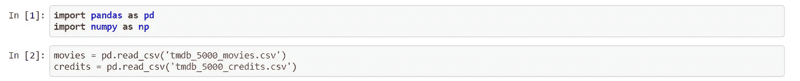

步骤 2- **将两个数据集合并成一个**

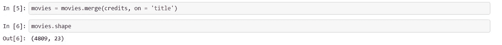

步骤 3- **提取重要的列并删除其他的**

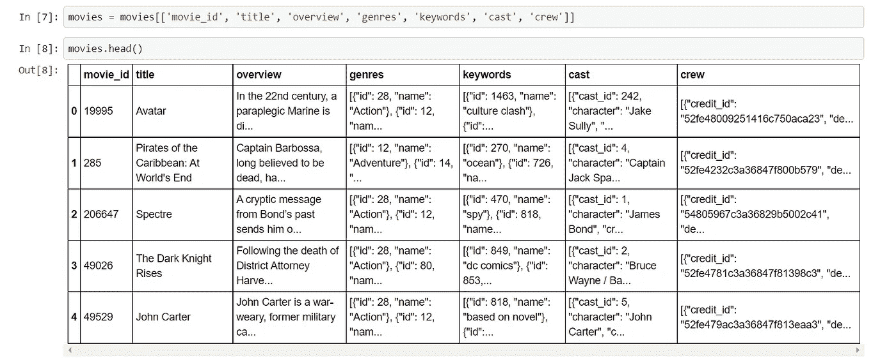

步骤 4- **检查数据集中的空值和重复值**

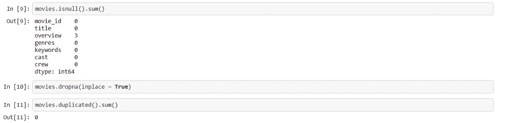

seems that not a much of effort is required here

步骤 5- **格式化“流派”和“关键词”栏**

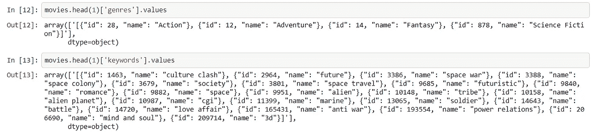

As we can see the columns have list of some values which is in string format so first we will convert the string in list using ast library of python and then using the only relevant information we need that is name attribute and for all this we will make a function

步骤 6- **功能根据我们的需要格式化上述栏目**

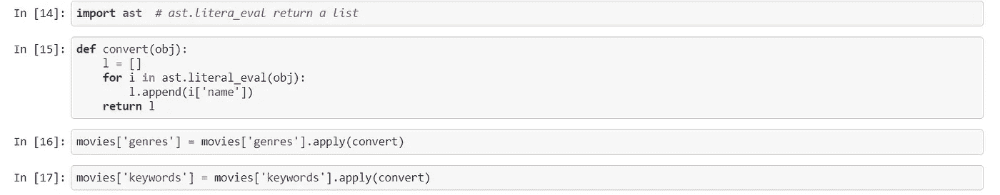

第 7 步- **相似类型的函数应用于其余的列**

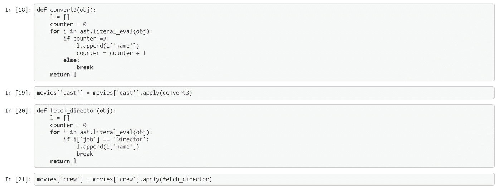

For the cast column the function remains same we just repeat the process for three times as we need first three cast names and for the crew column we are simply fetching the director’s name

现在让我们来看看数据集

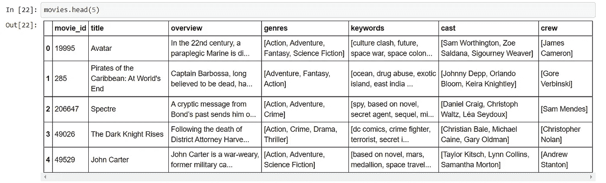

步骤 8- **我们将使用。分割功能**

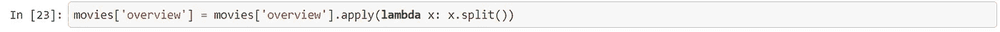

第 9 步- **让我们删除所有列中单词之间的空格，并将它们组合成一个新的列“标签”。**

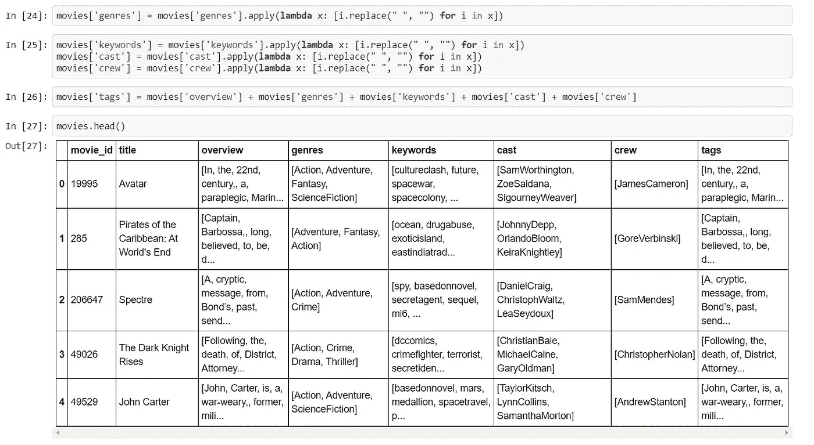

伙计们，我们之前已经看到，在基于内容的过滤中，我们试图推荐类似的产品(在这种情况下是电影)，所以标签列是最重要的一个，因为它包含了定义电影的所有内容，所以我们将保留它，并删除其余的列。

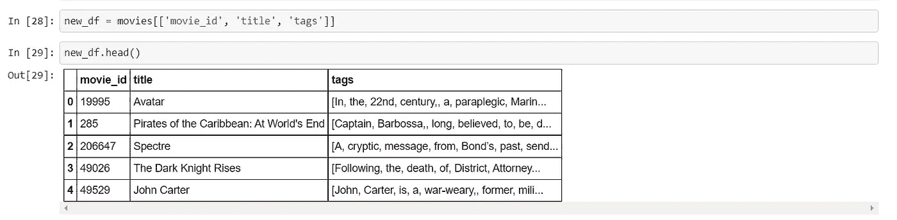

步骤 10- **加入标签，组成一个完整的句子**

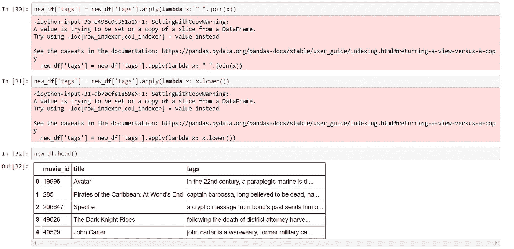

步骤 11- **我们现在将对标签列应用词干分析**

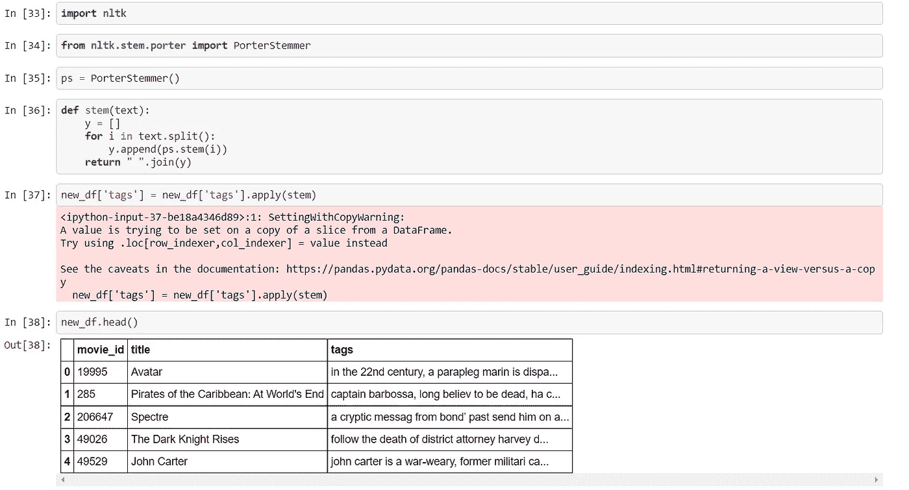

现在，我们结束数据的预处理部分，因为我们已经有了想要的数据集。下一阶段是模型构建阶段，我们将使用两个非常重要的概念

> CountVectorizer:这个 python 库用于根据每个单词在整个文本中出现的频率(计数)将给定文本转换为向量。
> 
> 余弦相似性:这是度量两个文档之间文本相似性的一个标准，与它们的大小无关。

步骤 12- **让我们首先在标签列上应用计数矢量器，并将文本转换成数字矢量**

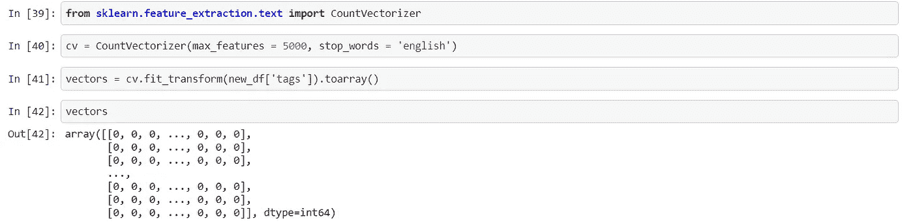

步骤 13- **现在是时候对向量应用余弦相似度来找出最相似的电影**

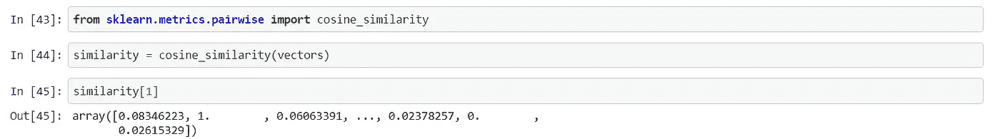

步骤 14- **这将是我们为获取五部最相似的电影而编写的最后一个函数**

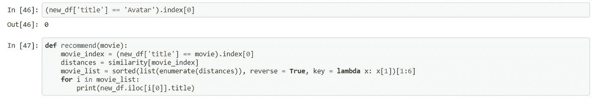

代码到此结束。现在让我们看看我们的推荐系统是如何工作的

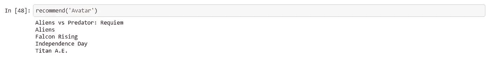

Here we try to find the five most similar movies to the movie ‘Avatar’

> 我希望你们能学到一些新东西，并喜欢这个博客。如果你确实喜欢它，那就和你的朋友分享吧。保重。不断学习。
> 
> 你也可以通过我的 Linkedin 账户找到我-[https://www.linkedin.com/in/harsh-mishra-4b79031b3/](https://www.linkedin.com/in/harsh-mishra-4b79031b3/)