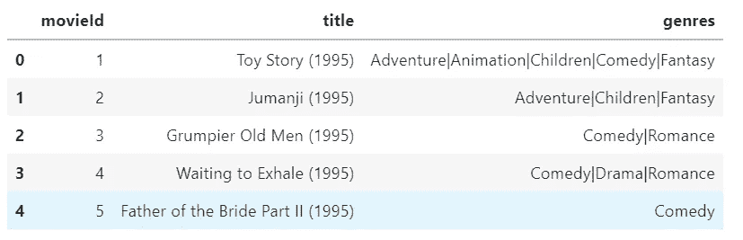
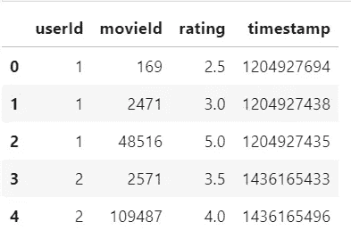
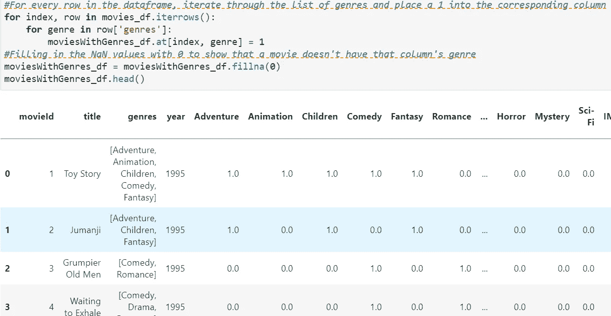
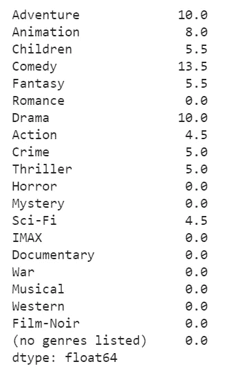
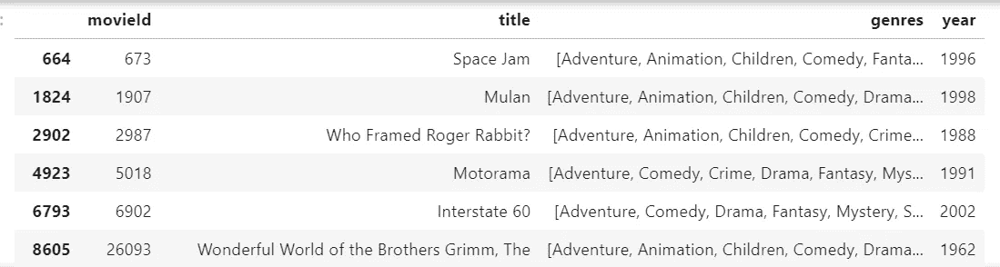

# 推荐系统

> 原文：<https://medium.com/geekculture/recommender-system-a83668653d95?source=collection_archive---------16----------------------->

推荐系统不需要作为不同主题的介绍。这在每个社交平台上都可以看到，比如亚马逊、Flipkart、网飞、脸书、Youtube、谷歌……..

在当今世界，每个人都熟悉这个话题，并且会在许多地方看到为您提供的建议，这些建议也在某种程度上使您的任务变得更容易。例如，当你去亚马逊时，它会向你推荐一些配件、电子产品、服装、书籍等等，这些都在某种程度上帮助了你做出选择，并且展示了一些你想尝试的新事物。

那这是怎么回事？这些平台是如何向你推荐你想要购买的商品的？这背后的直觉是什么？对，就是这个题目。那么，让我们开始吧。

随着推荐系统的发展，它正被用于每一个平台，只是因为它有很多好处。

Photo by [Javier Allegue Barros](https://unsplash.com/@soymeraki?utm_source=medium&utm_medium=referral) on [Unsplash](https://unsplash.com?utm_source=medium&utm_medium=referral)

有三种类型的推荐系统。它们是协同过滤、基于内容的过滤和混合过滤。

1.协同过滤:这种过滤是基于产品或项目与用户兴趣之间存在关系的事实，这意味着如果一个人喜欢三样东西，而另一个人喜欢第一个人喜欢的两件东西，那么第二个人喜欢第一个人喜欢的第三个项目的可能性最大。这种方法通过收集许多用户(协作)的偏好或品味来自动预测(过滤)用户的兴趣。

说到实现，这可以通过两种方式中的任何一种来完成。

a)基于记忆:在这种情况下，整个基于用户项目的交互被用于找到给用户 I 的推荐，..e 基于用户或基于项目的方法都被使用。它使用统计技术，如皮尔逊相关，余弦相似性和欧几里德距离，找出推荐给用户的项目。

b)基于模型:在这种方法中，开发模型来向用户推荐项目，如回归、分类和一些其他方法，如神经网络、贝叶斯网络、聚类技术、潜在因素模型，如 SVD、概率潜在语义分析(pLSA)等。

2.基于内容的过滤:这种过滤纯粹基于用户的个人资料，与其他用户的偏好无关。在这种类型的过滤中，推荐是基于用户过去喜欢什么以及用户现在正在检查什么项目，以便系统过滤出用户可能喜欢的具有相似流派、年份、作者、品牌等的新项目列表。具体地，将各种产品或项目与用户先前评定的、用户看到的、用户列出的期望的项目进行比较。以此推荐最匹配的项目。

3.混合方法:这种过滤是协作过滤和基于内容的过滤的结合，主要用于避免冷启动和稀疏性问题。它利用了两种模型的优点。

有时，当使用一个系统无法做出预测时，混合系统工作得很好。混合系统是该系统的高级水平，仅在其他两个系统不能正确预测并且不在令人满意的水平时使用。

推荐制的利弊:

优点:-

1.  用户可以根据自己的喜好或兴趣爱好的相似性获得免费的建议。
2.  更好的用户体验
3.  给所有者带来利润或增加收入，并为其客户提供更好的安全性

缺点:-

1.  稀疏性问题，用户没有评价许多项目，通过它很难推荐项目。
2.  当没有先前的用户数据可供推荐时的冷启动问题
3.  当用户或项目大量增加时，会出现可扩展性问题，这成为一个挑战，因为在应用上述方法后，由于相似的计算或相同种类的权重，会有巨大的数据和算法性能下降。

实施基于内容的过滤的实际示例:

基于内容的过滤也在许多地方使用，如在线商店、药店、工作场所等。所有这些都使用用户的档案向他们推荐物品或产品和服务。

现在，我有一个电影及其评级的示例数据集，它基于哪些新电影将被推荐

1.  让我们来看看这两个数据集

2.一些数据清理是在电影集上完成的，方法是将年份存储在单独的列中，并将类型存储在列表格式中，并删除不需要的标点符号。

3.在“类型”列中生成一个热编码值，这样每个热编码值的类型都是已知的，同时也是系统可以理解的方式。

The code and encoded values can be seen in the picture

4.此后，从电影列表中收集用户评级的电影或观看的电影，并且基于这些电影可以预测接下来可以观看的电影。

5.现在，这些电影的电影 id 可以从 movies_df(站点上给定的数据或电影信息)中得知

6.让我们找到这些获得的电影 id 的编码值，分级电影列数据帧。这由包含所有电影的编码值的电影类型 df 形成。

7.接下来，移除所有其他不需要的列，并且仅保留分级电影的编码类型用于进一步处理。现在使用使用评级的权重和形成的电影流派集合，将它们相乘以了解用户对流派的偏好。

User preference or profile

8.当用户的简档被发现时。现在，这被采用，并且通过将所有电影的电影流派编码值乘以用户偏好值来获得电影的加权平均值，以找到电影列表中存在的一些可推荐项目或电影。

9.在完成上述过程之后，对数据帧或获得的数据帧进行排序，以找到可以推荐给用户的一些顶级电影。

10.为了获得更多关于电影的详细信息，在电影 df(给定数据)中检查电影 id，以获得关于推荐电影的所有完整信息。耶！

Final Recommendation table

基于内容的推荐系统的主要关键是考虑用户偏好、用户兴趣、用户简档来进行推荐，并且是完全个性化的。

> 每一个目标都是从出发开始的。今天迈出的每一小步都会带来巨大的成就和新的财富之路。

如果你学到了什么，请告诉我，给我一些支持，并与有用的人分享。如果您有任何疑问或任何事情，请在评论框中告诉我。给世界带来一些光明。祝你有愉快的一天。🥰